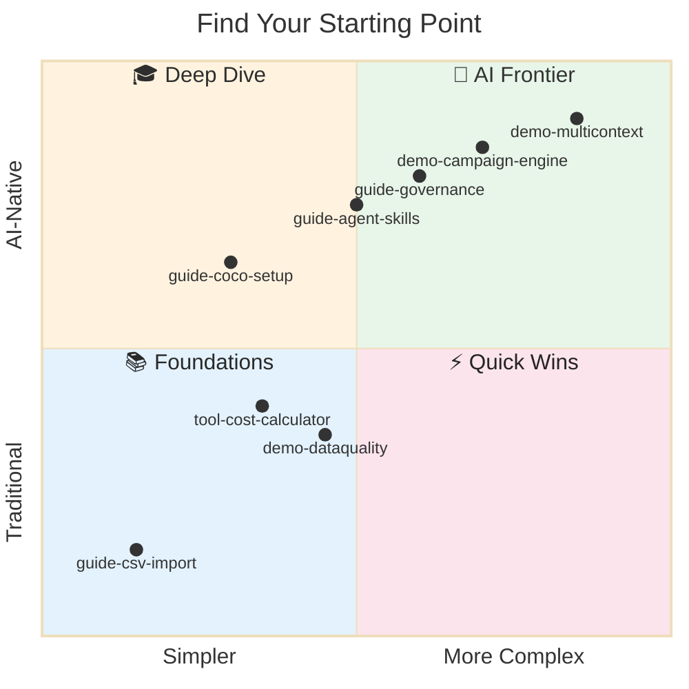
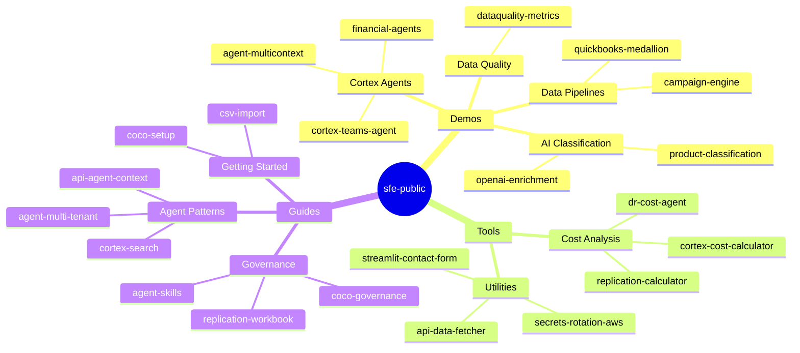

# Snowflake Solutions Engineering -- Public Examples

Snowflake demos, tools, and guides -- each self-contained with deployment scripts, teardown, and AI-assisted development via [Cortex Code](https://docs.snowflake.com/en/user-guide/cortex-code/cortex-code-cli). Clone a project, run `cortex`, and let the AI guide you through deployment and usage.

> **No support is provided.** All code is shared for reference and learning. Review, test, and modify thoroughly before any production use.



<details>
<summary><b>📊 Full Project Map</b></summary>



</details>

---

## Brand New to All of This?

Never used GitHub, Cortex Code, or any of these tools before? Start here:

1. **Get the code** -- [How to download from GitHub](guide-coco-setup/#part-0-getting-the-code) (no experience required)
2. **Get Cortex Code** -- [Install the AI assistant](guide-coco-setup/#part-1-the-learning-path) that will help you with everything else
3. **Open a project** -- Navigate to any demo folder below, then tell Cortex Code: *"Help me get started with this project"*

The AI will guide you through deployment and usage. You don't need to understand all the technical details upfront.

---

## Projects

### Demos

Full demonstration projects with `deploy_all.sql` and `teardown_all.sql`.

| Directory | Description | Features |
|---|---|---|
| [demo-agent-multicontext](demo-agent-multicontext/) | Per-request context injection via the Agent Run API (TV network multi-tenant) | Cortex Agents, Agent Run API, Semantic Views, Row Access Policies |
| [demo-cortex-teams-agent](demo-cortex-teams-agent/) | Snowflake Cortex Agents for Microsoft Teams & M365 Copilot | Cortex Agents, AI_COMPLETE, Cortex Guard |
| [demo-cortex-openai-enrichment](demo-cortex-openai-enrichment/) | AI-First Data Engineering: OpenAI + Snowflake Cortex | External Access, AI_COMPLETE, Dynamic Tables, VARIANT |
| [demo-cortex-product-classification](demo-cortex-product-classification/) | Multi-method product classification showdown (SQL, Cortex AI, SPCS Vision) | AI_COMPLETE, SPCS, Semantic Views, Intelligence Agents |
| [demo-dataquality-metrics](demo-dataquality-metrics/) | Data Quality Metrics & Reporting with DMFs and Streamlit | Data Metric Functions, Dynamic Tables, Streamlit |
| [demo-api-quickbooks-medallion](demo-api-quickbooks-medallion/) | QuickBooks API medallion architecture with Cortex AI enrichment and DQ monitoring | External Access, Medallion Architecture, AI_COMPLETE, DMFs |
| [demo-campaign-engine](demo-campaign-engine/) | Casino campaign recommendation engine with ML targeting and vector lookalike matching | Dynamic Tables, ML CLASSIFICATION, VECTOR, Cortex Agents |
| [demo-cortex-financial-agents](demo-cortex-financial-agents/) | Specialty finance portfolio risk agent combining structured analytics with document RAG | Cortex Agents, Cortex Search, Semantic Views, Cortex Analyst |

### Deployable Tools

Focused utilities with `deploy_all.sql` (or `deploy.sql`) and matching teardown.

| Directory | Description | Features |
|---|---|---|
| [tool-cortex-cost-calculator](tool-cortex-cost-calculator/) | Cortex spend attribution dashboard with 12-month forecasting | ACCOUNT_USAGE, Streamlit, Views |
| [tool-replication-cost-calculator](tool-replication-cost-calculator/) | Streamlit DR Replication Cost Calculator for Business Critical | Streamlit, Replication Metadata |
| [tool-cortex-semantic-enhancer](tool-cortex-semantic-enhancer/) | AI-enhanced semantic view descriptions using Cortex | AI_COMPLETE, Semantic Views |
| [tool-streamlit-contact-form](tool-streamlit-contact-form/) | Streamlit form that writes submissions to a Snowflake table | Streamlit in Snowflake, Snowpark |
| [tool-api-data-fetcher](tool-api-data-fetcher/) | Python stored procedure that fetches from a REST API via external access | External Access, Python Stored Procedures |
| [tool-secrets-rotation-aws](tool-secrets-rotation-aws/) | Snowflake Notebook: rotate key-pair and PAT credentials for service accounts with AWS Secrets Manager | Key-Pair Auth, PATs, AWS Secrets Manager, Notebooks |

### Guides and References

Documentation, patterns, and examples (no deploy/teardown).

| Directory | Description | Features |
|---|---|---|
| [guide-agent-multi-tenant](guide-agent-multi-tenant/) | Multi-tenant agent pattern with OAuth IdP + row-access policies | OAuth, Row Access Policies, Cortex Agents |
| [guide-cortex-search](guide-cortex-search/) | Cortex Search service creation, management, and querying | Cortex Search |
| [guide-csv-import](guide-csv-import/) | Load CSV files into Snowflake: one-time setup, repeatable imports, and automation | Stages, COPY INTO, File Formats |
| [guide-api-agent-context](guide-api-agent-context/) | Agent:Run REST API examples with execution context and three auth methods | Agent Run API, Key-Pair JWT Auth |
| [guide-coco-setup](guide-coco-setup/) | Cortex Code CLI on-ramp: install, guidance hierarchy, and first custom skill | Cortex Code, AGENTS.md |
| [guide-replication-workbook](guide-replication-workbook/) | Replication and failover SQL runbooks for Snowsight | Replication, Failover Groups |
| [tool-agent-config-diff](tool-agent-config-diff/) | Extract Cortex Agent specs for comparison and version control | DESC AGENT, RESULT_SCAN |
| [guide-agent-skills](guide-agent-skills/) | Agent skills as resource management: right tool, right budget, any client | Skills, Context Management, MCP |
| [guide-coco-governance-general](guide-coco-governance-general/) | AI coding tool governance workshop (general, tool-agnostic) | managed-settings.json, CLAUDE.md, MDM |

## Quick Start

### Develop with Cortex Code

```bash
bash <(curl -sL https://raw.githubusercontent.com/sfc-gh-miwhitaker/sfe-public/main/shared/get-project.sh) <project-name>
cd sfe-public/<project-name>
cortex
```

Then tell Cortex Code: *"Help me get started with this project"*

The AI reads the project's AGENTS.md, understands the deployment steps, and walks you through everything -- from creating Snowflake objects to running the demo.

> New to Cortex Code? Start with [guide-coco-setup](guide-coco-setup/) to install and configure.

### Deploy in Snowsight (no clone needed)

Most demos and tools deploy entirely inside Snowflake. The deploy script creates a Git Repository object, fetches from GitHub, and runs everything server-side.

1. Browse the project on [GitHub](https://github.com/sfc-gh-miwhitaker/sfe-public)
2. Open its `deploy_all.sql` (or `deploy.sql`) and copy into a Snowsight worksheet
3. Click **Run All**
4. See the project README for usage instructions

### Guides

Open the guide directory and follow the README.

## Shared Infrastructure

Every deploy script is fully self-contained. Each one creates the shared infrastructure it needs inline (using `IF NOT EXISTS`), so no separate setup step is ever required:

| Resource | Name | Purpose |
|---|---|---|
| Database | `SNOWFLAKE_EXAMPLE` | Shared demo database |
| API Integration | `SFE_GIT_API_INTEGRATION` | GitHub access for Git Repository stages |
| Git Repository | `SFE_DEMOS_REPO` | Shared monorepo Git stage (in `GIT_REPOS` schema) |

Each project creates its own schema and warehouse within `SNOWFLAKE_EXAMPLE`.

## License

Apache License 2.0. See [LICENSE](LICENSE) and each project directory.
