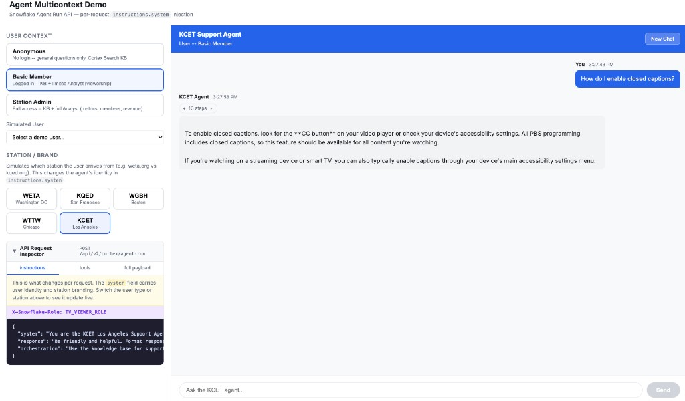
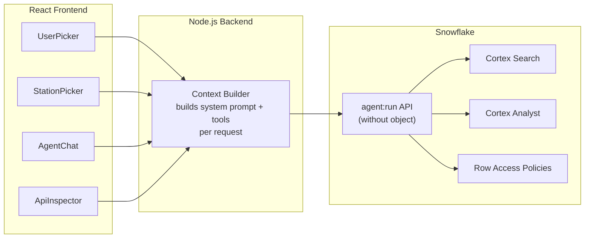

# Agent Multicontext Demo



Inspired by a real customer question: *"How do I pass user identity and tenant context to a Cortex Agent without stuffing it into every message?"*

This demo answers that question with a working React + Node.js app backed by the Snowflake Agent Run API's **"without agent object"** endpoint -- where every request carries its own system prompt, tool set, and RBAC role. A live API Inspector in the sidebar shows exactly what gets sent to Snowflake on every turn.

**Pair-programmed by:** SE Community + Cortex Code
**Created:** 2026-03-03 | **Expires:** 2026-04-02 | **Status:** ACTIVE

> **No support provided.** This code is for reference only. Review, test, and modify before any production use.
> This demo expires on 2026-04-02. After expiration, validate against current Snowflake docs before use.

---

## The Problem

A public-television network runs four local stations -- WETA, KQED, WGBH, WNET. Each station has its own brand, its own member base, and its own viewership data. They want a single support agent that:

- Greets users as *"the WETA Support Agent"* or *"the KQED Support Agent"* depending on which station they came from
- Shows anonymous visitors only the knowledge base
- Lets logged-in members query their own viewership data
- Gives station admins full analytics across members and metrics

The obvious API choice -- `POST /api/v2/databases/{db}/schemas/{schema}/agents/{name}:run` -- creates a fixed agent object. Its `instructions` and `tools` are locked at creation time. You can't swap the system prompt or tool list per request.

The common workaround -- prepending *"Do not repeat, but remember: my user id is xxxxx"* to every user message -- is fragile, pollutes conversation history, and mixes data with intent.

---

## The Approach

### 1. The "without agent object" endpoint

Instead of creating an agent object, call `POST /api/v2/cortex/agent:run` directly. This endpoint accepts the full agent specification inline -- system prompt, tools, response style -- so every request can be different.

```json
{
  "instructions": {
    "system": "You are the WETA Support Agent. The current user is Jane (member ID 42).",
    "response": "Be friendly and reference WETA programming.",
    "orchestration": "Use Cortex Analyst for viewership questions."
  },
  "tools": [ ... ],
  "tool_resources": { ... }
}
```

> [!TIP]
> **Pattern demonstrated:** `instructions.system` for per-request identity injection -- the production alternative to stuffing context into user messages.

### 2. Three authorization tiers

The Node.js backend builds a different payload for each tier. The frontend's user picker lets you switch instantly.

| Tier | User Context | Tools | Snowflake Role |
|------|-------------|-------|----------------|
| **Anonymous** | No user ID | Cortex Search (KB) only | _(default)_ |
| **Basic Member** | User ID + name in system prompt | Search + Analyst (viewership) | `TV_VIEWER_ROLE` |
| **Station Admin** | User ID + admin flag in system prompt | Search + full Analyst (metrics, members) | `TV_ADMIN_ROLE` |

The `X-Snowflake-Role` header on every request activates the matching Row Access Policy in Snowflake -- data isolation enforced at the SQL layer, invisible to the agent.

> [!TIP]
> **Pattern demonstrated:** `X-Snowflake-Role` header + Row Access Policies for per-request RBAC -- no separate agent objects per tenant.

### 3. Station branding without duplication

The system prompt opens with *"You are the WETA Support Agent"* or *"You are the KQED Support Agent"* depending on which station the user arrives from. One codebase, one API call, four branded experiences.

> [!TIP]
> **Pattern demonstrated:** Dynamic `instructions.system` for white-label branding -- swap identity per request without creating separate agent objects per tenant.

### 4. Live API Inspector

A sidebar panel shows the exact JSON payload sent to Snowflake on every turn. Toggle between `instructions`, `tools`, and the full request body to see how the context changes as you switch users and stations.

---

## Architecture



---

## Explore the Results

After deployment, three interfaces let you explore the demo:

- **React App** -- Switch users, switch stations, chat with the agent, and inspect the live API payload. Navigate to `http://localhost:3000` after starting services.
- **API Inspector** -- Toggle between `instructions`, `tools`, and `full payload` tabs to see exactly what changes per request.
- **Observability Queries** -- Paste queries from `sql/07_observability_queries.sql` into Snowsight to see agent credits, token usage, and Analyst request logs.

| What | Source | Scope |
|------|--------|-------|
| Agent credits and token usage | `SNOWFLAKE.ACCOUNT_USAGE.CORTEX_AGENT_USAGE_HISTORY` | All `agent:run` calls (with and without object) |
| Cortex Analyst request logs | `SNOWFLAKE.LOCAL.CORTEX_ANALYST_REQUESTS()` table function | Scoped to a semantic view |
| Conversation history | Thread REST API (`GET /api/v2/cortex/threads/{id}/messages`) | Per thread |

---

<details>
<summary><strong>Deploy (5 steps, ~10 minutes)</strong></summary>

> [!IMPORTANT]
> Requires **Enterprise** edition, `SYSADMIN` + `ACCOUNTADMIN` role access, and Cortex AI enabled in your region.

**Step 1 -- Deploy Snowflake objects:**

Copy [`deploy_all.sql`](deploy_all.sql) into a Snowsight worksheet and click **Run All**.

**Step 2 -- Set environment variables:**

```bash
export SNOWFLAKE_ACCOUNT="myorg-myaccount"
export SNOWFLAKE_PAT="your-personal-access-token"
```

Get a PAT: Snowsight > Settings > Authentication > Personal Access Tokens

**Step 3 -- Start services:**

```bash
./tools/02_start.sh
```

Installs deps, starts backend on `:3001` and frontend on `:3000`.

**Step 4 -- Open the app:**

Navigate to `http://localhost:3000`

**Step 5 -- Cleanup:**

Run `teardown_all.sql` in Snowsight, then `./tools/04_stop.sh`

### What Gets Created

| Object Type | Name | Purpose |
|---|---|---|
| Schema | `SNOWFLAKE_EXAMPLE.AGENT_MULTICONTEXT` | Demo schema |
| Warehouse | `SFE_AGENT_MULTICONTEXT_WH` | Demo compute |
| Cortex Search Service | `KB_SEARCH` | Knowledge base search |
| Semantic View | `SV_AGENT_MULTICONTEXT_VIEWERSHIP` | Viewership analytics for Cortex Analyst |
| Tables | `RAW_*`, `MEMBERS`, `STATIONS` | Source data |
| Row Access Policies | `RAP_STATION_*` | Station-scoped data isolation |
| Roles | `TV_VIEWER_ROLE`, `TV_ADMIN_ROLE` | Authorization tiers |

### Estimated Costs

| Component | Size | Est. Credits/Hour |
|---|---|---|
| Warehouse (SFE_AGENT_MULTICONTEXT_WH) | X-SMALL | 1 |
| Cortex Search Service | Serverless | ~0.1 |
| Cortex Agent calls | Per-query | ~0.01/query |
| Cortex Analyst calls | Per-query | ~0.01/query |
| **Total** | | **<2 credits** for full deployment + 1 hour of exploration |

### Operations

| Script | Purpose |
|--------|---------|
| `./tools/02_start.sh` | Install deps, start backend + frontend |
| `./tools/03_status.sh` | Check service health and port status |
| `./tools/04_stop.sh` | Stop all services |
| `sql/07_observability_queries.sql` | Ad-hoc observability queries (run individually in Snowsight) |

- **Backend:** http://localhost:3001 (Express proxy to Snowflake)
- **Frontend:** http://localhost:3000 (Vite dev server, proxies `/api` to backend)
- **Health check:** http://localhost:3001/health

</details>

<details>
<summary><strong>Troubleshooting</strong></summary>

| Symptom | Fix |
|---------|-----|
| Backend exits immediately | `SNOWFLAKE_ACCOUNT` or `SNOWFLAKE_PAT` not set. Run `./tools/03_status.sh` to check. |
| Port 3000/3001 already in use | Another process is using the port. Run `lsof -ti :3000` to find it, or `./tools/04_stop.sh` if it's a previous run. |
| "Failed to create thread" in chat | Verify PAT is valid and not expired. Check `http://localhost:3001/health` for account connectivity. |
| Agent returns empty responses | Cortex Search service needs time to index after deploy. Wait a few minutes and retry. |
| Analyst tool errors | Verify `SFE_AGENT_MULTICONTEXT_WH` is running and the semantic view exists in `SEMANTIC_MODELS`. |

</details>

## Cleanup

1. Run [`teardown_all.sql`](teardown_all.sql) in Snowsight
2. Stop local services: `./tools/04_stop.sh`

<details>
<summary><strong>Development Tools</strong></summary>

This project is designed for AI-pair development.

- **AGENTS.md** -- Project instructions for Cortex Code and compatible AI tools
- **.claude/skills/** -- Project-specific AI skills (Cursor + Claude Code)
- **Cortex Code in Snowsight** -- Open this project in a Workspace for AI-assisted development
- **Cursor** -- Open locally with Cursor for AI-pair coding

> New to AI-pair development? See [Cortex Code docs](https://docs.snowflake.com/en/user-guide/cortex-code/cortex-code)

</details>

## References

- [Cortex Agents Run API](https://docs.snowflake.com/en/user-guide/snowflake-cortex/cortex-agents-run) -- `agent:run` with and without agent object
- [Cortex Agents REST API](https://docs.snowflake.com/en/user-guide/snowflake-cortex/cortex-agents-rest-api) -- CRUD operations for agent objects
- [Monitor Cortex Agent Requests](https://docs.snowflake.com/en/user-guide/snowflake-cortex/cortex-agents-monitor) -- Observability and tracing (requires agent object)
- [CORTEX_AGENT_USAGE_HISTORY](https://docs.snowflake.com/en/sql-reference/account-usage/cortex_agent_usage_history) -- Usage view for all `agent:run` calls
- [Cortex Analyst Administrator Monitoring](https://docs.snowflake.com/en/user-guide/snowflake-cortex/cortex-analyst/admin-observability) -- Analyst request logs and SQL queries
- [Setting Execution Context](https://docs.snowflake.com/en/developer-guide/snowflake-rest-api/setting-context) -- X-Snowflake-Role and X-Snowflake-Warehouse headers

## Related Projects

Three projects in this repo cover Cortex Agent context and multi-tenancy. This demo is the runnable one.

| | This project | [guide-api-agent-context](../guide-api-agent-context/) | [guide-agent-multi-tenant](../guide-agent-multi-tenant/) |
|---|---|---|---|
| **Type** | Runnable demo | Code snippet guide | Architecture guide |
| **API Approach** | Without agent object | Both (with + without) | With agent object |
| **What Changes Per Request** | System prompt, tools, role, and instructions | Role + warehouse headers | Authenticated identity (RAP filtering) |
| **Auth Pattern** | Simulated user picker | PAT / OAuth / Key-Pair JWT snippets | Azure AD + External OAuth (production) |
| **Data Isolation** | Row Access Policies via X-Snowflake-Role | Not implemented | Row Access Policies via CURRENT_USER() |
| **Start here if...** | "I want to see and show context injection" | "I need the API syntax" | "I'm designing a production app" |

## License

Apache 2.0 -- See individual file headers for details.
