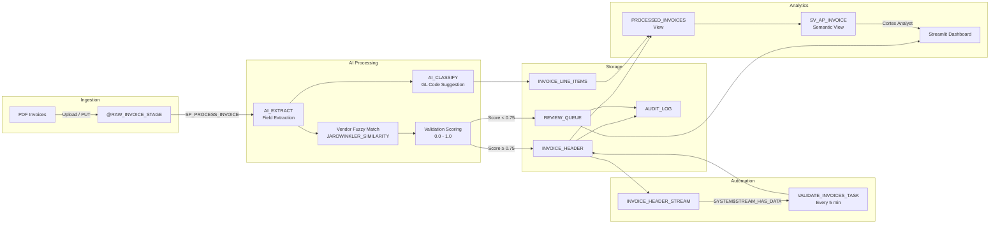

# Data Flow - AP Invoice Pipeline

Author: SE Community
Last Updated: 2026-04-08
Status: Reference Implementation

Reference Implementation: Review and customize for your requirements.

## Overview

PDF invoices land on an internal stage, get processed by AI_EXTRACT for field extraction and AI_CLASSIFY for GL coding. A validation score determines whether an invoice is auto-approved or routed to human review. All paths converge into the PROCESSED_INVOICES view, which feeds a Cortex Analyst semantic view for NL analytics.

## Diagram

## Component Descriptions

| Component | Role |
|-----------|------|
| **@RAW_INVOICE_STAGE** | Internal stage with directory table for PDF landing zone |
| **AI_EXTRACT** | Extracts vendor name, invoice number, date, PO reference, total amount from PDFs |
| **Vendor Fuzzy Match** | Resolves extracted vendor name against VENDOR_MASTER using alias array + JAROWINKLER_SIMILARITY |
| **Validation Scoring** | Composite score (0-1) from field completeness, format checks, vendor match success |
| **AI_CLASSIFY** | Classifies line item descriptions into GL codes from the GL_CODES taxonomy |
| **INVOICE_HEADER_STREAM** | Append-only stream tracking new extractions |
| **VALIDATE_INVOICES_TASK** | Scheduled task that routes new invoices based on validation threshold |
| **PROCESSED_INVOICES** | Joined view of headers + lines + vendors for analytics |
| **SV_AP_INVOICE** | Semantic view enabling natural language queries via Cortex Analyst |
| **Streamlit Dashboard** | 3-panel UI: pipeline status, review queue, analytics chat |

## Change History

See `.claude/DIAGRAM_CHANGELOG.md` or project-specific changelog.
