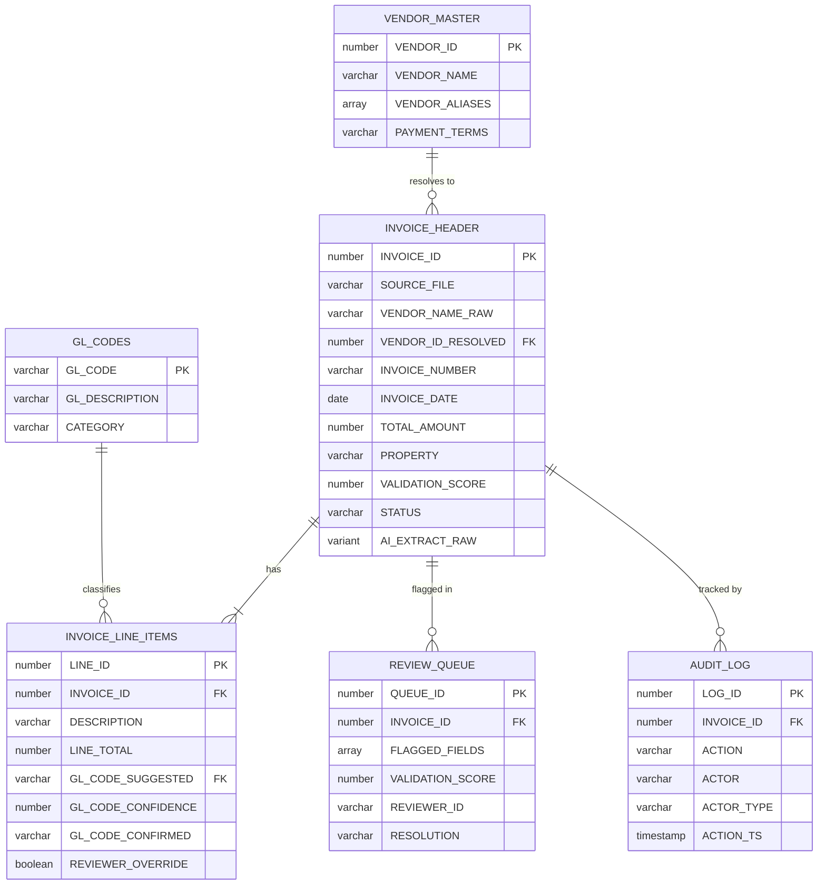

# Data Model - AP Invoice Pipeline

Author: SE Community
Last Updated: 2026-04-08
Status: Reference Implementation

Reference Implementation: Review and customize for your requirements.

## Overview

The AP Invoice Pipeline uses a star-like schema with INVOICE_HEADER as the central fact table. Reference tables (VENDOR_MASTER, GL_CODES) support fuzzy matching and AI classification. REVIEW_QUEUE and AUDIT_LOG capture the human-in-the-loop and auditability layers.

## Diagram

## Component Descriptions

| Table | Purpose |
|-------|---------|
| **VENDOR_MASTER** | Canonical vendor list with alias arrays for fuzzy matching |
| **GL_CODES** | GL account taxonomy passed to AI_CLASSIFY as category labels |
| **INVOICE_HEADER** | One row per PDF invoice with extracted fields and validation score |
| **INVOICE_LINE_ITEMS** | Many rows per invoice with AI-classified GL codes |
| **REVIEW_QUEUE** | Low-scoring invoices awaiting human review |
| **AUDIT_LOG** | Immutable record of every AI and human decision |

## Change History

See `.claude/DIAGRAM_CHANGELOG.md` or project-specific changelog.
