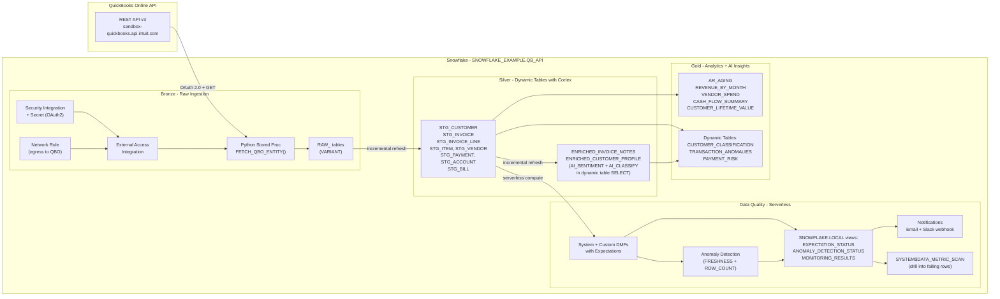
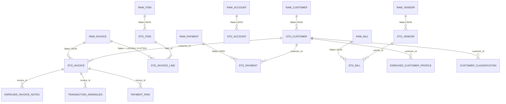
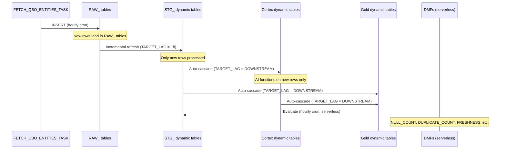

# Data Flow Diagram

```mermaid
flowchart LR
  subgraph QBO [QuickBooks Online API]
    RestAPI["REST API v3\nsandbox-quickbooks.api.intuit.com"]
  end

  subgraph SF [Snowflake - SNOWFLAKE_EXAMPLE.QB_API]
    subgraph bronze [Bronze - Raw Ingestion]
      SecInt["Security Integration\n+ Secret (OAuth2)"]
      NetRule["Network Rule\n(egress to QBO)"]
      EAI["External Access\nIntegration"]
      Proc["Python Stored Proc\nFETCH_QBO_ENTITY()"]
      RawTables["RAW_ tables\n(VARIANT)"]
    end

    subgraph silver [Silver - Dynamic Tables with Cortex]
      DynTables["STG_CUSTOMER\nSTG_INVOICE\nSTG_INVOICE_LINE\nSTG_ITEM, STG_VENDOR\nSTG_PAYMENT, STG_ACCOUNT\nSTG_BILL"]
      CortexDT["ENRICHED_INVOICE_NOTES\nENRICHED_CUSTOMER_PROFILE\n(AI_SENTIMENT + AI_CLASSIFY\nin dynamic table SELECT)"]
    end

    subgraph dq [Data Quality - Serverless]
      DMFs["System + Custom DMFs\nwith Expectations"]
      AnomalyDet["Anomaly Detection\n(FRESHNESS + ROW_COUNT)"]
      DQViews["SNOWFLAKE.LOCAL views:\nEXPECTATION_STATUS\nANOMALY_DETECTION_STATUS\nMONITORING_RESULTS"]
      Notify["Notifications\nEmail + Slack webhook"]
      Remediate["SYSTEM$DATA_METRIC_SCAN\n(drill into failing rows)"]
    end

    subgraph gold [Gold - Analytics + AI Insights]
      Views["AR_AGING\nREVENUE_BY_MONTH\nVENDOR_SPEND\nCASH_FLOW_SUMMARY\nCUSTOMER_LIFETIME_VALUE"]
      CortexInsights["Dynamic Tables:\nCUSTOMER_CLASSIFICATION\nTRANSACTION_ANOMALIES\nPAYMENT_RISK"]
    end
  end

  RestAPI -->|"OAuth 2.0 + GET"| Proc
  SecInt --> EAI
  NetRule --> EAI
  EAI --> Proc
  Proc --> RawTables
  RawTables -->|"incremental refresh"| DynTables
  DynTables -->|"incremental refresh"| CortexDT
  DynTables -->|"serverless compute"| DMFs
  DMFs --> AnomalyDet
  DMFs --> DQViews
  AnomalyDet --> DQViews
  DQViews --> Notify
  DQViews --> Remediate
  DynTables --> Views
  DynTables --> CortexInsights
  CortexDT --> CortexInsights
```

## Entity Relationship Diagram

```mermaid
erDiagram
    RAW_CUSTOMER ||--o{ STG_CUSTOMER : "flatten JSON"
    RAW_VENDOR ||--o{ STG_VENDOR : "flatten JSON"
    RAW_ITEM ||--o{ STG_ITEM : "flatten JSON"
    RAW_ACCOUNT ||--o{ STG_ACCOUNT : "flatten JSON"
    RAW_INVOICE ||--o{ STG_INVOICE : "flatten JSON"
    RAW_INVOICE ||--o{ STG_INVOICE_LINE : "flatten + LATERAL FLATTEN"
    RAW_PAYMENT ||--o{ STG_PAYMENT : "flatten JSON"
    RAW_BILL ||--o{ STG_BILL : "flatten JSON"

    STG_CUSTOMER ||--o{ STG_INVOICE : "customer_id"
    STG_CUSTOMER ||--o{ STG_PAYMENT : "customer_id"
    STG_VENDOR ||--o{ STG_BILL : "vendor_id"
    STG_ITEM ||--o{ STG_INVOICE_LINE : "item_id"

    STG_INVOICE ||--o{ ENRICHED_INVOICE_NOTES : "invoice_id"
    STG_CUSTOMER ||--o{ ENRICHED_CUSTOMER_PROFILE : "customer_id"
    STG_CUSTOMER ||--o{ CUSTOMER_CLASSIFICATION : "customer_id"
    STG_INVOICE ||--o{ TRANSACTION_ANOMALIES : "invoice_id"
    STG_INVOICE ||--o{ PAYMENT_RISK : "invoice_id"
```

## Refresh Cascade

```mermaid
sequenceDiagram
    participant Task as FETCH_QBO_ENTITIES_TASK
    participant Bronze as RAW_ tables
    participant Silver as STG_ dynamic tables
    participant Cortex as Cortex dynamic tables
    participant Gold as Gold dynamic tables
    participant DMF as DMFs (serverless)

    Task->>Bronze: INSERT (hourly cron)
    Note over Bronze: New rows land in RAW_ tables

    Bronze->>Silver: Incremental refresh (TARGET_LAG = 1h)
    Note over Silver: Only new rows processed

    Silver->>Cortex: Auto-cascade (TARGET_LAG = DOWNSTREAM)
    Note over Cortex: AI functions on new rows only

    Silver->>Gold: Auto-cascade (TARGET_LAG = DOWNSTREAM)
    Cortex->>Gold: Auto-cascade (TARGET_LAG = DOWNSTREAM)

    DMF->>Silver: Evaluate (hourly cron, serverless)
    Note over DMF: NULL_COUNT, DUPLICATE_COUNT, FRESHNESS, etc.
```
