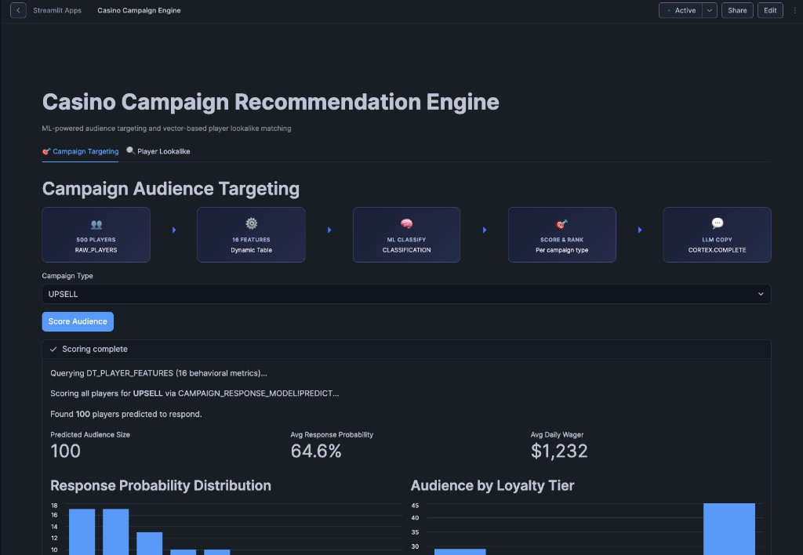
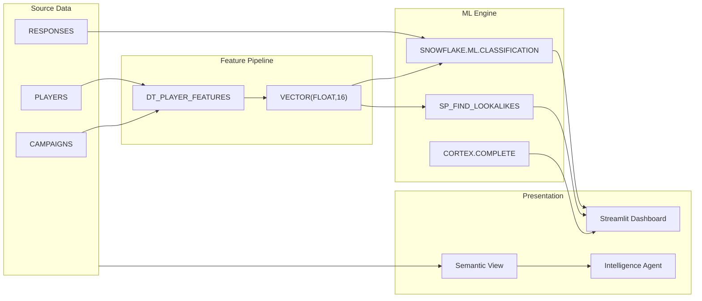

# Casino Campaign Recommendation Engine



Inspired by a real customer question: *"Can we use Snowflake to find players who look like our best customers and target them with the right campaign -- without exporting data to a separate ML platform?"*

This demo answers that question with a production-grade campaign recommendation engine: ML classification for audience targeting, vector similarity for player lookalike matching, and LLM-powered campaign copy generation -- built entirely in Snowflake through AI-pair programming in ~2 hours.

**Pair-programmed by:** SE Community + Cortex Code
**Last Updated:** 2026-03-02 | **Expires:** 2026-04-02 | **Status:** ACTIVE

> **No support provided.** This code is for reference only. Review, test, and modify before any production use.
> This demo expires on 2026-04-02. After expiration, validate against current Snowflake docs before use.

---

## The Problem

A casino operator runs campaigns across loyalty tiers -- slot tournaments, dining promotions, concert presales, VIP experiences. They need to:

1. **Score every player** -- Who is most likely to respond to a specific campaign type?
2. **Find lookalikes** -- Given 10 seed players, find 10 more with the most similar behavioral patterns
3. **Generate messaging** -- What copy and channel strategy should each campaign use?

Today this means exporting data to a separate ML platform, training models outside Snowflake, and importing predictions back. The round-trip takes days and creates data copies outside the security perimeter.

---

## The Progression

### 1. Data Model -- behavioral features as vectors

Player behavior (visit frequency, average bet, win rate, dining spend, show attendance, etc.) is encoded as a `VECTOR(FLOAT, 16)` column in a Dynamic Table that refreshes automatically.

```sql
CREATE DYNAMIC TABLE DT_PLAYER_FEATURES
    TARGET_LAG = '1 hour'
    WAREHOUSE = SFE_CAMPAIGN_ENGINE_WH
AS SELECT ..., VECTOR(FLOAT, 16) AS behavior_vector ...
```

> [!TIP]
> **Pattern demonstrated:** `VECTOR(FLOAT, 16)` in Dynamic Tables with `TARGET_LAG` -- behavioral embeddings that refresh automatically with your data pipeline.

### 2. ML Classification -- audience scoring

`SNOWFLAKE.ML.CLASSIFICATION` trains on historical campaign responses and scores every player's likelihood of responding to each campaign type, ranked by predicted probability.

> [!TIP]
> **Pattern demonstrated:** `SNOWFLAKE.ML.CLASSIFICATION` for audience scoring -- train and predict without leaving Snowflake.

### 3. Vector Similarity -- lookalike finder

Given 10 seed players, a Python stored procedure averages their behavior vectors and uses `VECTOR_COSINE_SIMILARITY` to find the 10 most similar players in the database.

```sql
CALL SP_FIND_LOOKALIKES(ARRAY_CONSTRUCT(101, 102, 103, ...));
```

> [!TIP]
> **Pattern demonstrated:** `VECTOR_COSINE_SIMILARITY` for lookalike matching -- find behaviorally similar entities using native vector operations.

### 4. Campaign Intelligence -- LLM-powered recommendations

`SNOWFLAKE.CORTEX.COMPLETE` generates campaign messaging and channel strategy recommendations based on player segments and campaign types.

> [!TIP]
> **Pattern demonstrated:** `SNOWFLAKE.CORTEX.COMPLETE` for generative content -- LLM-powered copy and strategy within the data platform.

---

## Architecture



---

## Explore the Results

After deployment, four interfaces let you explore the engine:

- **Streamlit Dashboard** -- Campaign Targeting and Player Lookalike tabs with ML scoring, audience metrics, and distribution charts. Navigate to **Projects > Streamlit** in Snowsight.
- **Intelligence Agent** -- Ask natural language questions about campaigns and players. Navigate to **AI & ML > Snowflake Intelligence** in Snowsight.
- **Guided Build** -- Want to learn AI-pair programming instead of just deploying? The [Guided Build](GUIDED_BUILD.md) walks you through constructing this entire project from scratch -- one prompt at a time. ~90 minutes, ~1,200 lines of working code.
- **Demo Script** -- See [DEMO_SCRIPT.md](DEMO_SCRIPT.md) for the full presenter playbook.


---

<details>
<summary><strong>Deploy (1 step, ~5 minutes)</strong></summary>

> [!IMPORTANT]
> Requires **Enterprise** edition (for ML CLASSIFICATION and Dynamic Tables), `SYSADMIN` + `ACCOUNTADMIN` role access.

Copy [`deploy_all.sql`](deploy_all.sql) into a Snowsight worksheet and click **Run All**.

### What Gets Created

| Object Type | Name | Purpose |
|---|---|---|
| Schema | `SNOWFLAKE_EXAMPLE.CAMPAIGN_ENGINE` | Demo schema |
| Warehouse | `SFE_CAMPAIGN_ENGINE_WH` | Demo compute |
| Tables | `PLAYERS`, `CAMPAIGNS`, `RESPONSES`, `CAMPAIGN_SEED_PLAYERS` | Source data |
| Dynamic Table | `DT_PLAYER_FEATURES` | Feature engineering pipeline |
| Stored Procedure | `SP_FIND_LOOKALIKES` | Vector similarity lookalike finder |
| ML Model | `CLASSIFICATION` on campaign responses | Audience targeting |
| Semantic View | Campaign analytics | Natural language queries |
| Streamlit App | Campaign dashboard | Interactive UI |

### Estimated Costs

| Component | Size | Est. Credits/Hour |
|---|---|---|
| Warehouse (SFE_CAMPAIGN_ENGINE_WH) | X-SMALL | 1 |
| Dynamic Table refresh | X-SMALL, hourly | <0.1 |
| ML CLASSIFICATION training | One-time | ~0.5 |
| Cortex COMPLETE calls | Per-query | ~0.01/query |
| **Total** | | **<2 credits** for full deployment + 1 hour of exploration |

</details>

<details>
<summary><strong>Troubleshooting</strong></summary>

| Symptom | Fix |
|---------|-----|
| ML CLASSIFICATION fails | Ensure Enterprise edition. Classification requires Enterprise or higher. |
| Dynamic table stuck | Check `SELECT * FROM TABLE(INFORMATION_SCHEMA.DYNAMIC_TABLE_REFRESH_HISTORY())` for errors. |
| Streamlit app not visible | Navigate to Snowsight > Streamlit. The app deploys as part of `deploy_all.sql`. |
| Vector similarity returns no results | Verify `DT_PLAYER_FEATURES` has refreshed. Check `SYSTEM$DYNAMIC_TABLE_GRAPH_REFRESH_STATUS()`. |

</details>

## Cleanup

Run [`teardown_all.sql`](teardown_all.sql) in Snowsight to remove all demo objects.

<details>
<summary><strong>Development Tools</strong></summary>

This project is designed for AI-pair development.

- **AGENTS.md** -- Project instructions for Cortex Code and compatible AI tools
- **.claude/skills/** -- Project-specific AI skills (Cursor + Claude Code)
- **Cortex Code in Snowsight** -- Open this project in a Workspace for AI-assisted development
- **Cursor** -- Open locally with Cursor for AI-pair coding

> New to AI-pair development? See [Cortex Code docs](https://docs.snowflake.com/en/user-guide/cortex-code/cortex-code)

</details>

## Documentation

- [Guided Build](GUIDED_BUILD.md) -- Build this project from scratch with AI-pair programming
- [Demo Script](DEMO_SCRIPT.md) -- Presenter playbook
- [Prompts Catalog](prompts/) -- Every prompt used to generate this project
