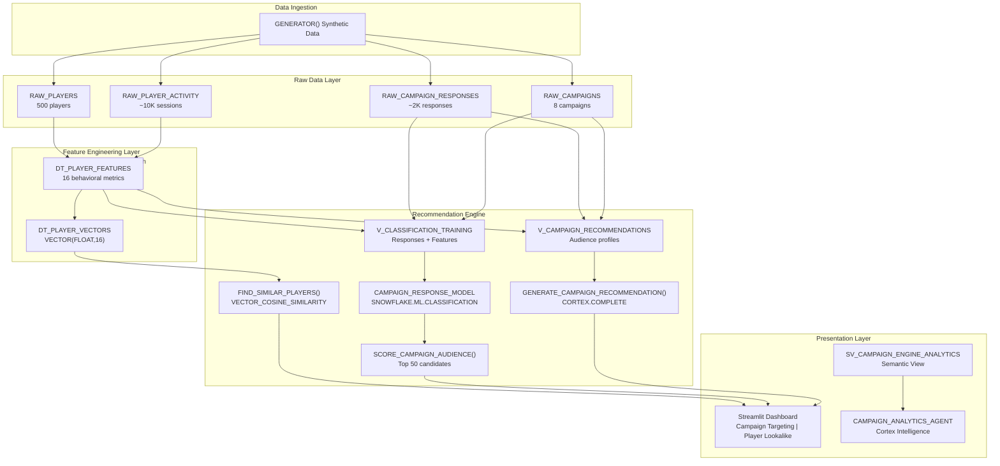

# Data Flow

```mermaid
flowchart TD
    subgraph ingestion [Data Ingestion]
        Gen["GENERATOR() Synthetic Data"]
    end

    subgraph rawLayer [Raw Data Layer]
        Players[RAW_PLAYERS<br/>500 players]
        Activity[RAW_PLAYER_ACTIVITY<br/>~10K sessions]
        Campaigns[RAW_CAMPAIGNS<br/>8 campaigns]
        Responses[RAW_CAMPAIGN_RESPONSES<br/>~2K responses]
    end

    subgraph featureLayer [Feature Engineering Layer<br/>Dynamic Tables - 1hr refresh]
        Features[DT_PLAYER_FEATURES<br/>16 behavioral metrics]
        Vectors["DT_PLAYER_VECTORS<br/>VECTOR(FLOAT,16)"]
    end

    subgraph engineLayer [Recommendation Engine]
        Lookalike["FIND_SIMILAR_PLAYERS()<br/>VECTOR_COSINE_SIMILARITY"]
        Training[V_CLASSIFICATION_TRAINING<br/>Responses + Features]
        MLModel["CAMPAIGN_RESPONSE_MODEL<br/>SNOWFLAKE.ML.CLASSIFICATION"]
        Scoring["SCORE_CAMPAIGN_AUDIENCE()<br/>Top 50 candidates"]
        RecView[V_CAMPAIGN_RECOMMENDATIONS<br/>Audience profiles]
        RecFunc["GENERATE_CAMPAIGN_RECOMMENDATION()<br/>CORTEX.COMPLETE"]
    end

    subgraph presentationLayer [Presentation Layer]
        Streamlit["Streamlit Dashboard<br/>Campaign Targeting | Player Lookalike"]
        SemView["SV_CAMPAIGN_ENGINE_ANALYTICS<br/>Semantic View"]
        Agent["CAMPAIGN_ANALYTICS_AGENT<br/>Cortex Intelligence"]
    end

    Gen --> Players
    Gen --> Activity
    Gen --> Campaigns
    Gen --> Responses

    Players --> Features
    Activity --> Features
    Features --> Vectors

    Vectors --> Lookalike
    Responses --> Training
    Features --> Training
    Campaigns --> Training
    Training --> MLModel
    MLModel --> Scoring
    Responses --> RecView
    Features --> RecView
    Campaigns --> RecView
    RecView --> RecFunc

    Lookalike --> Streamlit
    Scoring --> Streamlit
    RecFunc --> Streamlit
    SemView --> Agent
```
