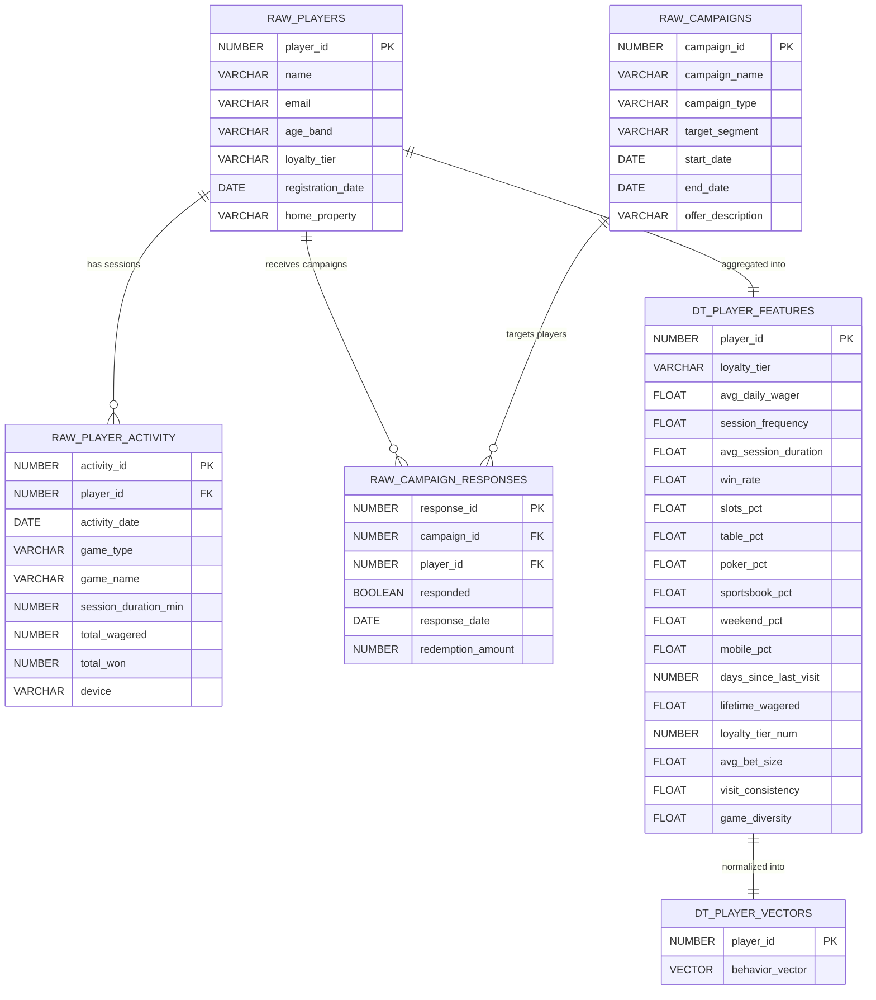

# Data Model

```mermaid
erDiagram
    RAW_PLAYERS {
        NUMBER player_id PK
        VARCHAR name
        VARCHAR email
        VARCHAR age_band
        VARCHAR loyalty_tier
        DATE registration_date
        VARCHAR home_property
    }

    RAW_PLAYER_ACTIVITY {
        NUMBER activity_id PK
        NUMBER player_id FK
        DATE activity_date
        VARCHAR game_type
        VARCHAR game_name
        NUMBER session_duration_min
        NUMBER total_wagered
        NUMBER total_won
        VARCHAR device
    }

    RAW_CAMPAIGNS {
        NUMBER campaign_id PK
        VARCHAR campaign_name
        VARCHAR campaign_type
        VARCHAR target_segment
        DATE start_date
        DATE end_date
        VARCHAR offer_description
    }

    RAW_CAMPAIGN_RESPONSES {
        NUMBER response_id PK
        NUMBER campaign_id FK
        NUMBER player_id FK
        BOOLEAN responded
        DATE response_date
        NUMBER redemption_amount
    }

    DT_PLAYER_FEATURES {
        NUMBER player_id PK
        VARCHAR loyalty_tier
        FLOAT avg_daily_wager
        FLOAT session_frequency
        FLOAT avg_session_duration
        FLOAT win_rate
        FLOAT slots_pct
        FLOAT table_pct
        FLOAT poker_pct
        FLOAT sportsbook_pct
        FLOAT weekend_pct
        FLOAT mobile_pct
        NUMBER days_since_last_visit
        FLOAT lifetime_wagered
        NUMBER loyalty_tier_num
        FLOAT avg_bet_size
        FLOAT visit_consistency
        FLOAT game_diversity
    }

    DT_PLAYER_VECTORS {
        NUMBER player_id PK
        VECTOR behavior_vector
    }

    RAW_PLAYERS ||--o{ RAW_PLAYER_ACTIVITY : "has sessions"
    RAW_PLAYERS ||--o{ RAW_CAMPAIGN_RESPONSES : "receives campaigns"
    RAW_CAMPAIGNS ||--o{ RAW_CAMPAIGN_RESPONSES : "targets players"
    RAW_PLAYERS ||--|| DT_PLAYER_FEATURES : "aggregated into"
    DT_PLAYER_FEATURES ||--|| DT_PLAYER_VECTORS : "normalized into"
```
