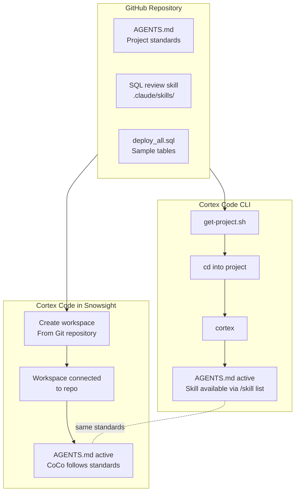

# Dual Surface: CLI and Snowsight from the Same Repo

```mermaid
flowchart TB
    subgraph source ["GitHub Repository"]
        AgentsMd["AGENTS.md
        Project standards"]
        Skill["SQL review skill
        .claude/skills/"]
        SQL["deploy_all.sql
        Sample tables"]
    end

    subgraph cli ["Cortex Code CLI"]
        Clone["get-project.sh"] --> CDDir["cd into project"]
        CDDir --> Cortex["cortex"]
        Cortex --> CLIActive["AGENTS.md active
        Skill available via /skill list"]
    end

    subgraph snowsight ["Cortex Code in Snowsight"]
        Workspace["Create workspace
        From Git repository"] --> Connected["Workspace connected
        to repo"]
        Connected --> SSActive["AGENTS.md active
        CoCo follows standards"]
    end

    source --> Clone
    source --> Workspace

    CLIActive -.-|"same standards"| SSActive
```
