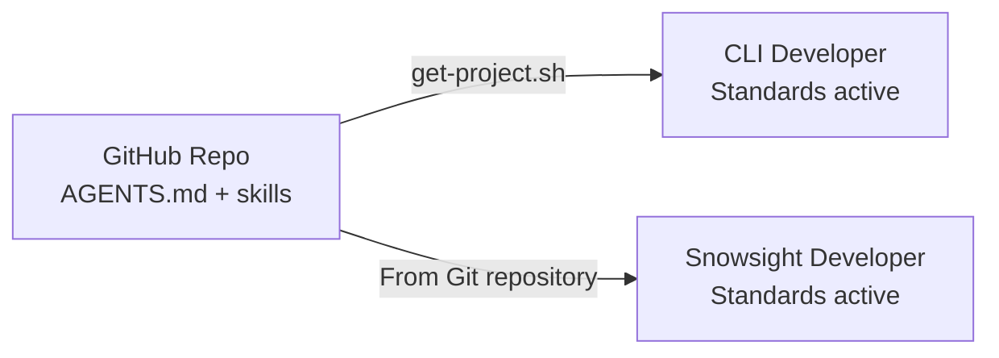
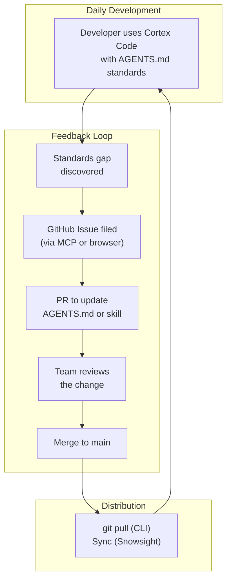

# GitHub Team Management Flow

## Team Onboarding

```mermaid
flowchart LR
    Repo["GitHub Repo
    AGENTS.md + skills"]

    Repo -->|"get-project.sh"| CLI["CLI Developer
    Standards active"]

    Repo -->|"From Git repository"| SS["Snowsight Developer
    Standards active"]
```

## Standards Evolution Cycle

```mermaid
flowchart TB
    subgraph daily ["Daily Development"]
        Use["Developer uses Cortex Code
        with AGENTS.md standards"]
    end

    subgraph feedback ["Feedback Loop"]
        Gap["Standards gap
        discovered"] --> Issue["GitHub Issue filed
        (via MCP or browser)"]
        Issue --> PR["PR to update
        AGENTS.md or skill"]
        PR --> Review["Team reviews
        the change"]
        Review --> Merge["Merge to main"]
    end

    subgraph distribute ["Distribution"]
        Merge --> Pull["git pull (CLI)
        Sync (Snowsight)"]
        Pull --> Use
    end

    Use --> Gap
```
