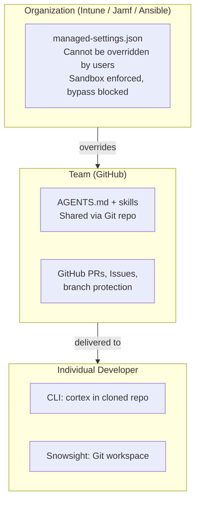
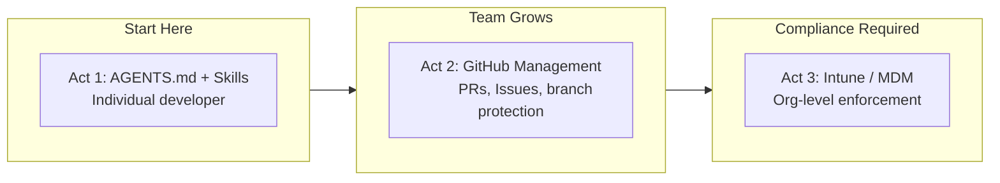

# Three-Layer Governance Stack

```mermaid
flowchart TB
    subgraph org ["Organization (Intune / Jamf / Ansible)"]
        MS["managed-settings.json
        Cannot be overridden by users
        Sandbox enforced, bypass blocked"]
    end

    subgraph team ["Team (GitHub)"]
        Agents["AGENTS.md + skills
        Shared via Git repo"]
        GH["GitHub PRs, Issues,
        branch protection"]
    end

    subgraph individual ["Individual Developer"]
        CLIDev["CLI: cortex in cloned repo"]
        SSDev["Snowsight: Git workspace"]
    end

    org -->|"overrides"| team
    team -->|"delivered to"| individual
```

## When to Use Each Layer

```mermaid
flowchart LR
    subgraph start ["Start Here"]
        Act1["Act 1: AGENTS.md + Skills
        Individual developer"]
    end

    subgraph grow ["Team Grows"]
        Act2["Act 2: GitHub Management
        PRs, Issues, branch protection"]
    end

    subgraph enforce ["Compliance Required"]
        Act3["Act 3: Intune / MDM
        Org-level enforcement"]
    end

    start --> grow
    grow --> enforce
```
