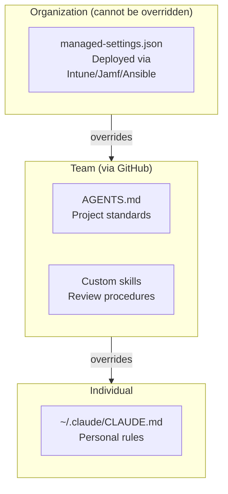

# Act 3: Intune Enterprise -- The Org-Level Umbrella

Everything in Acts 1 and 2 is opt-in. Developers clone the repo, follow the standards, manage them via GitHub. That works for teams with strong culture and voluntary adoption.

For enterprises that need enforcement -- regulated industries, compliance requirements, or teams where opt-in isn't sufficient -- there's a layer above GitHub: `managed-settings.json` deployed via MDM.

## What managed-settings.json Controls

A single JSON file, deployed to a system path that users cannot modify, that enforces org-level policy on Cortex Code CLI.

| Setting | What it does |
|---------|-------------|
| `dangerouslyAllowAll: false` | Prevents users from bypassing sandbox mode |
| `forceSandboxEnabled: true` | Enforces sandbox on every session |
| `showManagedBanner: true` | Shows a visible `[Managed]` banner so users know policy is active |
| `hideDangerousOptions: true` | Hides bypass flags from the UI/CLI |
| `minimumVersion: "1.0.0"` | Blocks outdated CLI versions from running |

```json
{
  "version": "1.0",
  "permissions": {
    "dangerouslyAllowAll": false,
    "defaultMode": "allow"
  },
  "settings": {
    "forceSandboxEnabled": true
  },
  "required": {
    "minimumVersion": "1.0.0"
  },
  "ui": {
    "showManagedBanner": true,
    "bannerText": "[Your Company] Managed",
    "hideDangerousOptions": true
  }
}
```

See [reference/managed-settings-mcp-enabled.json](../reference/managed-settings-mcp-enabled.json) for the full template.

## Where It Sits in the Hierarchy



Organization policy is the highest priority. A developer's personal `CLAUDE.md` or a project's `AGENTS.md` cannot override what `managed-settings.json` enforces. This is by design -- IT sets the floor, teams build on top.

## How Intune Deploys It

Intune doesn't natively deploy arbitrary files. Instead, it pushes a shell script that writes the config to the correct system path.

**macOS:** `/Library/Application Support/Cortex/managed-settings.json`

**Linux:** `/etc/cortex/managed-settings.json`

### Intune Configuration

Create a **Custom Configuration Profile** in Intune and deploy one of these scripts:

**macOS (via Intune Shell Script):**
```bash
#!/bin/bash
mkdir -p '/Library/Application Support/Cortex'
cat > '/Library/Application Support/Cortex/managed-settings.json' << 'EOF'
{
  "version": "1.0",
  "permissions": {
    "dangerouslyAllowAll": false,
    "defaultMode": "allow"
  },
  "settings": {
    "forceSandboxEnabled": true
  },
  "required": {
    "minimumVersion": "1.0.0"
  },
  "ui": {
    "showManagedBanner": true,
    "bannerText": "[Your Company] Managed",
    "hideDangerousOptions": true
  }
}
EOF
chmod 644 '/Library/Application Support/Cortex/managed-settings.json'
```

**Linux (via Intune Shell Script):**
```bash
#!/bin/bash
mkdir -p /etc/cortex
cat > /etc/cortex/managed-settings.json << 'EOF'
{
  "version": "1.0",
  "permissions": {
    "dangerouslyAllowAll": false,
    "defaultMode": "allow"
  },
  "settings": {
    "forceSandboxEnabled": true
  },
  "required": {
    "minimumVersion": "1.0.0"
  },
  "ui": {
    "showManagedBanner": true,
    "bannerText": "[Your Company] Managed",
    "hideDangerousOptions": true
  }
}
EOF
chmod 644 /etc/cortex/managed-settings.json
```

See [reference/intune-config.json](../reference/intune-config.json) for a complete Intune-formatted template with both scripts.

> **Not using Intune?** The same approach works with Jamf (as a `.mobileconfig` or custom script), Ansible (as a template task), Chef/Puppet, or any config management tool that can write a file to a system path.

## What Developers See

When `managed-settings.json` is deployed:

1. **Managed banner** -- every Cortex Code session shows `[Your Company] Managed` at the top
2. **Sandbox enforced** -- Cortex Code runs in sandbox mode regardless of user preference
3. **Bypass blocked** -- running `cortex --dangerously-allow-all-tool-calls` does nothing
4. **Dangerous options hidden** -- settings that could weaken policy aren't shown

The developer experience is otherwise unchanged. AGENTS.md still loads, skills still work, GitHub MCP still connects. The managed settings just ensure a baseline that can't be removed.

## When You Need This

| Scenario | GitHub alone sufficient? | Add Intune? |
|----------|------------------------|-------------|
| Small team, high trust | Yes | No |
| Regulated industry (HIPAA, SOX, PCI) | No | Yes |
| Large org, mixed compliance maturity | No | Yes |
| Contractor/vendor access | No | Yes |
| Internal development, voluntary adoption | Yes | Optional |

**The rule of thumb:** If "just follow the standards" is enough, GitHub handles it. If "prove to an auditor that policy is enforced," you need MDM.

## The Full Stack

Three layers, each adding enforcement:

| Layer | Mechanism | Enforced by | Can be overridden? |
|-------|-----------|-------------|-------------------|
| Project | `AGENTS.md` + skills in Git | Developer cloning/syncing the repo | Yes (developer can edit locally) |
| Team | GitHub PRs, branch protection, Issues | GitHub collaboration features | Yes (repo admin can change settings) |
| Organization | `managed-settings.json` via Intune | IT deploying to system paths | No (requires admin access to the machine) |

Each layer builds on the one below. You don't need all three -- start with the project layer (Act 1), add GitHub management when the team grows (Act 2), and add Intune when compliance requires it.
