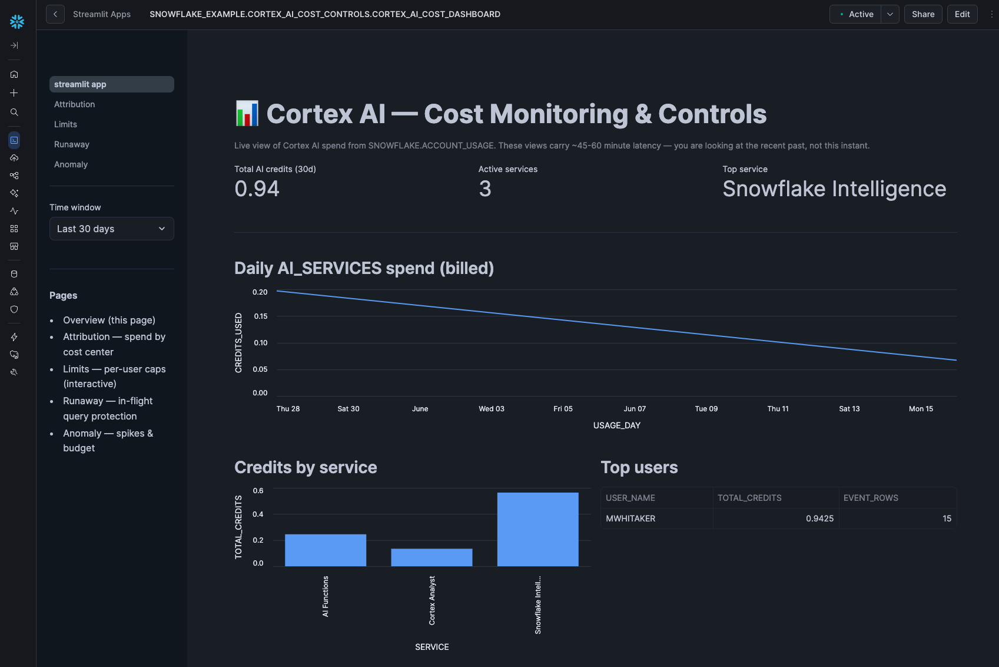

# Cortex AI Cost Controls — Dashboard

> DEMONSTRATION PROJECT - EXPIRES: 2026-07-24
> This demo uses Snowflake features current as of June 2026.

An operational Streamlit-in-Snowflake dashboard that makes good on the companion
[guide-cortex-ai-cost-controls](../guide-cortex-ai-cost-controls/): it reads **live**
`SNOWFLAKE.ACCOUNT_USAGE` data to show where Cortex AI credits go, attributes spend
by cost center, manages per-user limits, watches for runaway queries, and flags
anomalies — across five pages.

*The Overview page — live AI spend, daily trend, per-service and per-user breakdown.*

**Pair-programmed by:** SE Community + Cortex Code
**Created:** 2026-06-24 | **Expires:** 2026-07-24 | **Status:** ACTIVE

> **No support provided.** Reference only; validate before production use.

## Brand New to GitHub or Cortex Code?

Start with the [Getting Started Guide](../guide-connecting-claude-snowflake/) — it walks
you through downloading the code and installing Cortex Code (the AI assistant that helps
you with everything else).

## First Time Here?

1. **Deploy** — Copy `deploy_all.sql` into a Snowsight SQL worksheet, click **Run All**.
   It creates everything and publishes the dashboard. Reads live data; no sample data loaded.
2. **Open** — In Snowsight: **Projects → Streamlit → CORTEX_AI_COST_DASHBOARD**.
3. **(Optional) Seed real activity** — On a low-usage account, run
   `sql/99_optional/01_seed_real_usage.sql` to generate a little genuine AI Function usage
   (appears after ~1 hour of ACCOUNT_USAGE latency).
4. **Cleanup** — Run `teardown_all.sql` when done.

> **Requires `ACCOUNTADMIN`** (or a role with `IMPORTED PRIVILEGES ON DATABASE SNOWFLAKE`)
> to read the Cortex usage views. The deploy grants this to `SYSADMIN` so the dashboard's
> query warehouse can read them.

## The Five Pages

| Page | What it does | Live data source |
|------|--------------|------------------|
| **Overview** | Total AI spend, daily trend, per-service and per-user breakdown | `METERING_DAILY_HISTORY`, all Cortex usage views |
| **Attribution** | Spend grouped by `COST_CENTER` tag; by-agent fallback | `CORTEX_AGENT_USAGE_HISTORY` (`AGENT_TAGS`) |
| **Limits** *(interactive)* | Edit per-user AI Function credit caps; run enforcement (simulate); view audit | `CORTEX_AI_FUNCTIONS_USAGE_HISTORY` + limits table |
| **Runaway** *(interactive)* | List in-flight queries over a credit threshold; cancel (simulate) | `CORTEX_AI_FUNCTIONS_USAGE_HISTORY` (`IS_COMPLETED`) |
| **Anomaly** | Daily spend vs 2× trailing-7-day average; budget context | `METERING_DAILY_HISTORY`, `AI_BUDGET` |

## Safety: Simulate-Only by Default

Enforcement ships in **simulate-only** mode (`ENFORCEMENT_CONFIG.SIMULATE_ONLY = 'TRUE'`).
The Limits and Runaway pages **preview and log** what they *would* do — revoke
`AI_FUNCTIONS_USER`, cancel a query — without changing any grants or cancelling anything.
The scheduled enforcement task ships **SUSPENDED**. To enforce for real, an admin flips the
config flag, extends the documented revoke block, and resumes the task — accepting that the
task consumes compute and that ACCOUNT_USAGE latency (45–60 min) makes it a safety net, not
a real-time control.

## Development Tools

This project is designed for AI-pair development.

- **AGENTS.md** — Project instructions for Cortex Code and compatible AI tools
- **.claude/skills/** — Project-specific AI skill teaching this project's patterns
- **Cortex Code in Snowsight** — Open in a Workspace for AI-assisted development

> New to AI-pair development? See [Cortex Code docs](https://docs.snowflake.com/en/user-guide/cortex-code/cortex-code).

---

Pair-programmed by SE Community + Cortex Code
