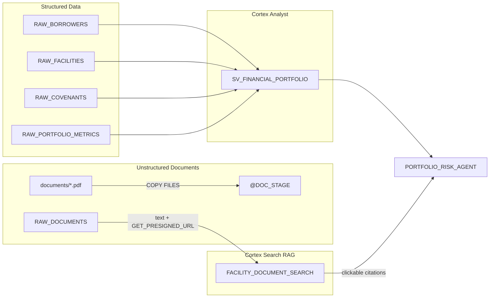

# Cortex Financial Agents

Inspired by a real customer question: *"Our credit analysts spend half their day cross-referencing covenant data in spreadsheets with credit memos in shared drives -- can an agent do that in one conversation?"*

This demo answers that question with a dual-tool Cortex Agent that combines structured facility and covenant data (Cortex Analyst) with unstructured credit memos, legal documents, and compliance certificates (Cortex Search) into a single conversational interface. Ask a question, get an answer that spans both data silos.

**Pair-programmed by:** SE Community + Cortex Code
**Created:** 2026-03-10 | **Expires:** 2026-04-09 | **Status:** ACTIVE

> **No support provided.** This code is for reference only. Review, test, and modify before any production use.
> This demo expires on 2026-04-09. After expiration, validate against current Snowflake docs before use.

---

## The Problem

A specialty finance lender manages a portfolio of 25 middle-market borrowers across five facility types (asset-based, term, equipment, bridge, revolver). Every quarter, the credit team must:

- Check covenant compliance across all facilities (leverage ratio, debt service coverage, EBITDA minimums)
- Cross-reference covenant test results with the narrative in credit committee memos
- Review collateral appraisals and amendment letters for context
- Flag watchlist facilities and summarize risk exposure

Today this means switching between a structured database (facilities, covenants, metrics) and a document repository (40+ PDFs -- credit memos, compliance certificates, appraisals). The analyst copies numbers from one system and searches for context in another.

---

## The Approach

### 1. Structured data via Cortex Analyst

A semantic view over four tables -- borrowers, facilities, covenants, and portfolio metrics -- lets the agent answer questions like *"What is our total exposure to watchlist facilities?"* with SQL-backed precision.

```sql
CREATE SEMANTIC VIEW SV_FINANCIAL_PORTFOLIO ...
```

> [!TIP]
> **Pattern demonstrated:** Semantic view unifying multiple related tables for Cortex Analyst -- the production pattern for structured data in agent conversations.

### 2. Unstructured documents via Cortex Search

40 PDF financial documents (credit memos, compliance certificates, collateral appraisals, amendment letters) are staged in `@DOC_STAGE` and indexed by Cortex Search. `GET_PRESIGNED_URL` generates clickable citation links so answers point directly to the source PDF.

> [!TIP]
> **Pattern demonstrated:** Cortex Search with `title_column = source_url` for clickable PDF citation links -- the RAG pattern that lets users verify agent answers.

### 3. Dual-tool agent

A single `CREATE AGENT` combines both tools. The agent decides whether a question needs structured data, document search, or both -- and cites its sources.

```yaml
tools:
  - tool_type: cortex_analyst_text_to_sql
    tool_spec:
      semantic_view: SV_FINANCIAL_PORTFOLIO
  - tool_type: cortex_search
    tool_spec:
      service: FACILITY_DOCUMENT_SEARCH
```

> [!TIP]
> **Pattern demonstrated:** `CREATE AGENT` with dual tools (Cortex Analyst + Cortex Search) -- the pattern for agents that span structured and unstructured data.

---

## Architecture



---

## Explore the Results

After deployment, open the `PORTFOLIO_RISK_AGENT` in **AI & ML > Snowflake Intelligence** and try these questions:

- *"What is our total exposure to watchlist facilities?"*
- *"Which borrowers have leverage ratio covenant breaches?"*
- *"What did the credit committee memo say about the Apex Manufacturing deal?"*
- *"Summarize the annual review findings for our real estate bridge portfolio"*

---

<details>
<summary><strong>Deploy (1 step, ~5 minutes)</strong></summary>

> [!IMPORTANT]
> Requires **Enterprise** edition (for Cortex Search + Intelligence Agents), `SYSADMIN` + `ACCOUNTADMIN` role access, and Cortex AI enabled in your region.

Copy [`deploy_all.sql`](deploy_all.sql) into a Snowsight worksheet and click **Run All**.

### What Gets Created

| Object | Type | Purpose |
|--------|------|---------|
| `SNOWFLAKE_EXAMPLE.FINANCIAL_AGENTS` | Schema | Project schema |
| `SFE_FINANCIAL_AGENTS_WH` | Warehouse | XS compute |
| `RAW_BORROWERS` | Table | 25 synthetic borrower profiles |
| `RAW_FACILITIES` | Table | Credit facilities (5 types) |
| `RAW_COVENANTS` | Table | Quarterly covenant test results |
| `RAW_PORTFOLIO_METRICS` | Table | Time-series facility health |
| `RAW_DOCUMENTS` | Table | Document metadata with presigned URLs |
| `DOC_STAGE` | Stage | 40 PDF financial documents (SSE encrypted) |
| `FACILITY_DOCUMENT_SEARCH` | Cortex Search | RAG over documents with citation links |
| `SV_FINANCIAL_PORTFOLIO` | Semantic View | Structured portfolio analytics |
| `PORTFOLIO_RISK_AGENT` | Agent | Dual-tool conversational agent |

### Estimated Costs

| Component | Size | Est. Credits/Run | Notes |
|-----------|------|-----------------|-------|
| Warehouse | X-SMALL | ~0.3 | Sample data load + queries |
| Cortex Search | -- | ~0.5 | Index ~40 documents |
| Cortex Agent | -- | ~0.2 | Per conversation turn |
| Storage | -- | Minimal | <1 MB synthetic data + 160 KB PDFs |
| **Total** | | **~1.0 credits** | Single deployment run |

</details>

<details>
<summary><strong>Troubleshooting</strong></summary>

| Symptom | Fix |
|---------|-----|
| Cortex Search unavailable | Verify your region supports Cortex Search. See [availability docs](https://docs.snowflake.com/en/user-guide/snowflake-cortex/cortex-search/cortex-search-overview). |
| Agent not visible | Ensure the semantic view `SV_FINANCIAL_PORTFOLIO` exists in `SEMANTIC_MODELS` schema. |
| Agent can't answer structured questions | Verify `SV_FINANCIAL_PORTFOLIO` has correct table references and the warehouse is running. |
| Agent can't find documents | Check that `FACILITY_DOCUMENT_SEARCH` service is active: `SHOW CORTEX SEARCH SERVICES`. |
| Citations open chat instead of PDF | Verify `@DOC_STAGE` contains PDFs (`LIST @DOC_STAGE`) and `title_column` is `source_url` in agent spec. |
| Citation links expired | Presigned URLs expire after 7 days. The search service refreshes hourly so URLs stay fresh automatically. |

</details>

## Cleanup

Run [`teardown_all.sql`](teardown_all.sql) in Snowsight to remove all demo objects.

<details>
<summary><strong>Development Tools</strong></summary>

This project is designed for AI-pair development.

- **AGENTS.md** -- Project instructions for Cortex Code and compatible AI tools
- **.claude/skills/** -- Project-specific AI skills (Cursor + Claude Code)
- **Cortex Code in Snowsight** -- Open this project in a Workspace for AI-assisted development
- **Cursor** -- Open locally with Cursor for AI-pair coding

> New to AI-pair development? See [Cortex Code docs](https://docs.snowflake.com/en/user-guide/cortex-code/cortex-code)

</details>
