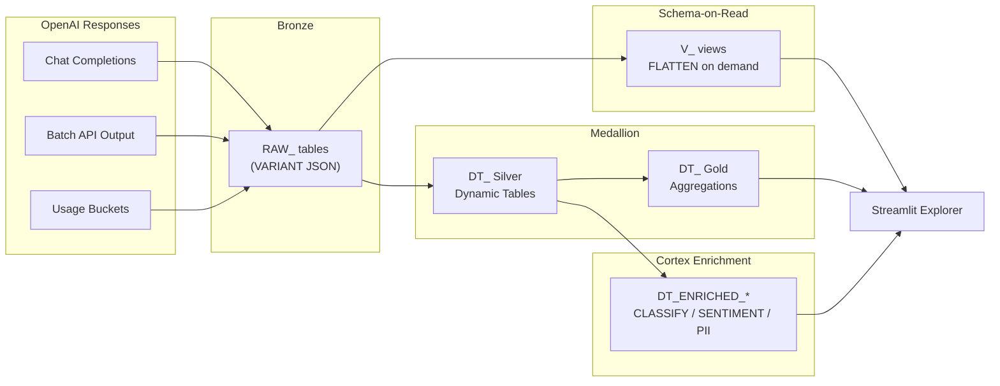

# AI-First Data Engineering: OpenAI + Snowflake Cortex

Inspired by a real customer question: *"We have thousands of OpenAI API responses stored as raw JSON -- how do we make that data queryable and enrich it with Snowflake's own AI?"*

This demo answers that question three ways -- schema-on-read views, a declarative Dynamic Table pipeline, and Cortex AI enrichment that classifies, scores, and scans OpenAI outputs -- and compares the trade-offs side by side.

**Author:** SE Community
**Last Updated:** 2026-03-02 | **Expires:** 2026-04-02 | **Status:** ACTIVE

> **No support provided.** This code is for reference only. Review, test, and modify before any production use.
> This demo expires on 2026-04-02. After expiration, validate against current Snowflake docs before use.

---

## The Problem

OpenAI API responses are deeply nested JSON with variable schemas. A single Chat Completions response contains optional arrays (`tool_calls`), nested sub-objects (`prompt_tokens_details`), polymorphic fields (`content` can be a string, null, or absent), and JSON-strings-inside-JSON-strings (`function.arguments`).

The team stores these responses in VARIANT columns, but querying them requires `LATERAL FLATTEN`, `TRY_PARSE_JSON`, and careful null handling. They also want to QA the AI's output with another AI -- classifying responses, scoring sentiment, detecting PII -- all without leaving Snowflake.

---

## The Progression

### 1. Schema-on-Read -- FLATTEN + Views

Keep raw VARIANT intact. Create views that flatten on demand. Zero storage overhead, always current, but query cost on every read.

```sql
SELECT
    raw:id::STRING AS completion_id,
    f.value:message:content::STRING AS content,
    f.value:finish_reason::STRING AS finish_reason
FROM RAW_COMPLETIONS,
    LATERAL FLATTEN(input => raw:choices, OUTER => TRUE) f;
```

> [!TIP]
> **Pattern demonstrated:** `LATERAL FLATTEN` with `OUTER => TRUE` for optional arrays -- the zero-copy pattern for variable-schema JSON.

### 2. Medallion Pipeline -- Dynamic Tables

Declarative Bronze-Silver-Gold pipeline with automatic incremental refresh via `TARGET_LAG`. Pre-computed, fast reads, clear dependency chain.

> [!TIP]
> **Pattern demonstrated:** Dynamic Tables with `TARGET_LAG` for declarative pipelines -- the Snowflake alternative to manually orchestrated ETL.

### 3. Cortex AI Enrichment -- analyzing AI with AI

Use Snowflake Cortex to classify, score, summarize, and scan OpenAI outputs entirely within Snowflake. `CLASSIFY_TEXT` for categorization, `SENTIMENT` for scoring, `COMPLETE` for PII detection.

```sql
CREATE DYNAMIC TABLE DT_ENRICHED_COMPLETIONS
    TARGET_LAG = '1 hour'
    WAREHOUSE = SFE_OPENAI_DATA_ENG_WH
AS
SELECT
    completion_id,
    content,
    SNOWFLAKE.CORTEX.CLASSIFY_TEXT(content, ['question', 'answer', 'code', 'error']) AS category,
    SNOWFLAKE.CORTEX.SENTIMENT(content) AS sentiment_score
FROM DT_COMPLETIONS;
```

> [!TIP]
> **Pattern demonstrated:** Cortex AI functions inside Dynamic Tables for automated enrichment -- QA one AI's output with another AI, entirely within Snowflake.

---

## Architecture



---

## Explore the Results

After deployment, explore each approach:

- **Schema-on-Read** -- Query `V_COMPLETIONS`, `V_TOOL_CALLS`, `V_STRUCTURED_OUTPUTS` for zero-copy access
- **Medallion** -- Query `DT_DAILY_TOKEN_SUMMARY`, `DT_TOOL_CALL_ANALYTICS` for pre-computed analytics
- **Cortex Enrichment** -- Query `DT_ENRICHED_COMPLETIONS`, `DT_PII_SCAN` for AI-on-AI analysis
- **Streamlit** -- Upload `streamlit/app.py` as a Streamlit in Snowflake app for interactive exploration

---

<details>
<summary><strong>Deploy (1 step, ~5 minutes)</strong></summary>

> [!IMPORTANT]
> Requires **Enterprise** edition, `SYSADMIN` + `ACCOUNTADMIN` role access, and Cortex AI enabled in your region.

Copy [`deploy_all.sql`](deploy_all.sql) into a Snowsight worksheet and click **Run All**.

### What Gets Created

| Object Type | Name | Purpose |
|---|---|---|
| Schema | `SNOWFLAKE_EXAMPLE.OPENAI_ENRICHMENT` | Demo schema |
| Warehouse | `SFE_OPENAI_ENRICHMENT_WH` | Demo compute |
| Bronze Tables | `RAW_COMPLETIONS`, `RAW_BATCH_OUTPUT`, `RAW_USAGE_BUCKETS` | Raw OpenAI JSON |
| Dynamic Tables | `DT_COMPLETIONS`, `DT_TOOL_CALLS`, `DT_ENRICHED_*` | Silver/Gold pipeline |
| Views | `V_COMPLETIONS`, `V_TOOL_CALLS`, `V_TOKEN_USAGE` | Schema-on-read |
| Streamlit App | Interactive explorer | Dashboard UI |

### Estimated Costs

| Component | Size | Est. Credits/Hour |
|---|---|---|
| Warehouse | X-SMALL | 1 |
| Dynamic Table refresh | X-SMALL | <0.1 |
| Cortex enrichment (CLASSIFY, SENTIMENT, SUMMARIZE) | Per-row | ~0.01/row |
| Cortex COMPLETE (PII scan) | Per-row | ~0.02/row |
| **Total** | | **<3 credits** for full deployment + 1 hour of exploration |

**Model note:** This demo uses `claude-opus-4-6` per customer request. For lower cost, substitute `llama3.1-70b` or `mistral-large2`.

</details>

<details>
<summary><strong>Troubleshooting</strong></summary>

| Symptom | Fix |
|---------|-----|
| Cortex functions unavailable | Verify your region supports Cortex AI. See [Cortex availability](https://docs.snowflake.com/en/user-guide/snowflake-cortex/llm-functions#availability). |
| Dynamic tables stuck in FAILED | Check `SELECT * FROM TABLE(INFORMATION_SCHEMA.DYNAMIC_TABLE_REFRESH_HISTORY())` for errors. |
| Enrichment tables empty | Ensure Bronze tables have data. Run `sql/02_tables/02_load_sample_data.sql` if needed. |

</details>

## Cleanup

Run [`teardown_all.sql`](teardown_all.sql) in Snowsight to remove all demo objects.

<details>
<summary><strong>Development Tools</strong></summary>

This project is designed for AI-pair development.

- **AGENTS.md** -- Project instructions for Cortex Code and compatible AI tools
- **.claude/skills/** -- Project-specific AI skills (Cursor + Claude Code)
- **Cortex Code in Snowsight** -- Open this project in a Workspace for AI-assisted development
- **Cursor** -- Open locally with Cursor for AI-pair coding

> New to AI-pair development? See [Cortex Code docs](https://docs.snowflake.com/en/user-guide/cortex-code/cortex-code)

</details>
