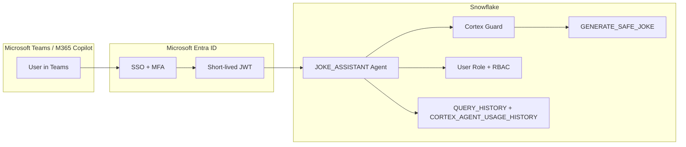

# Snowflake Cortex Agents for Microsoft Teams & M365 Copilot

Inspired by a real customer question: *"Our sales team lives in Teams -- can they ask Snowflake questions without leaving the chat?"*

This demo answers that question with a Cortex Agent deployed to Microsoft Teams and M365 Copilot -- zero custom bot code, zero hosting infrastructure. A joke-generator proves the architecture; the same pattern powers enterprise analytics, customer support, and financial reporting.

**Pair-programmed by:** SE Community + Cortex Code
**Last Updated:** 2026-03-10 | **Expires:** 2026-05-01 | **Status:** ACTIVE

> **No support provided.** This code is for reference only. Review, test, and modify before any production use.
> This demo expires on 2026-05-01. After expiration, validate against current Snowflake docs before use.

---

## The Problem

Knowledge workers live in Microsoft Teams. When they need data from Snowflake, they switch to Snowsight, write a query (or ask someone who can), copy the result, and paste it back into Teams. Context-switching kills productivity and creates stale snapshots of live data.

The team wants their Snowflake data accessible directly in Teams conversations -- with enterprise security (SSO, MFA, RBAC), content safety guardrails, and a complete audit trail.

---

## The Approach

### 1. CREATE AGENT -- one DDL statement

A single `CREATE AGENT` statement with a YAML specification defines the agent, its tools, and its personality. No custom bot framework, no hosting infrastructure.

```sql
CREATE AGENT JOKE_ASSISTANT
  FROM SPECIFICATION $$
    models:
      orchestration: auto
    tools:
      - tool_type: custom_tool
        tool_spec:
          function: GENERATE_SAFE_JOKE
  $$;
```

> [!TIP]
> **Pattern demonstrated:** `CREATE AGENT` with YAML spec -- the simplest path from SQL to a conversational agent.

### 2. Microsoft Entra ID integration -- enterprise auth

OAuth with Microsoft Entra ID provides SSO, MFA, and Conditional Access. The user authenticates through their normal Microsoft login; Snowflake validates the token and executes queries under the user's Snowflake role.

> [!TIP]
> **Pattern demonstrated:** Security integration with Entra ID for enterprise auth -- SSO, MFA, and RBAC enforcement on every agent interaction.

### 3. Cortex Guard -- content safety

The `GENERATE_SAFE_JOKE` function wraps `AI_COMPLETE` with `guardrails: true`, filtering harmful content before it reaches users. The agent YAML also sets orchestration budgets to prevent runaway token consumption.

> [!TIP]
> **Pattern demonstrated:** `AI_COMPLETE` with `guardrails: true` + orchestration budget in agent YAML -- the production pattern for content safety.

---

## Architecture



---

## Explore the Results

After deployment and Entra ID setup:

- **Teams** -- Search "Snowflake Cortex Agents" in the Teams app store, install, and start chatting
- **M365 Copilot** -- The same agent surfaces in Copilot conversations (requires Copilot license)
- **Snowsight** -- Test the agent in **AI & ML > Snowflake Intelligence** before deploying to Teams

**Try it:** *"Tell me a joke about data engineers"*

### Beyond Jokes: Real Use Cases

This demo proves the architecture. The same pattern powers enterprise analytics:

| Use Case | Agent Tool | Example Question |
|---|---|---|
| Sales Analytics | Cortex Analyst + Semantic View | "What were Q4 revenues by region?" |
| Customer Support | Cortex Search + Knowledge Base | "How do I reset a customer password?" |
| Financial Reporting | Cortex Analyst + Semantic View | "Show budget vs actual for January" |
| Data Quality | Custom Tool (UDF) | "Any data quality issues today?" |

See [docs/04-CUSTOMIZATION.md](docs/04-CUSTOMIZATION.md) for production agent patterns.

---

<details>
<summary><strong>Deploy (5 steps, ~15 minutes)</strong></summary>

> [!IMPORTANT]
> Requires **Enterprise** edition, `SYSADMIN` + `ACCOUNTADMIN` role access, Cortex AI enabled, and Microsoft Teams admin access for Entra ID setup.

**Step 1 -- Deploy Snowflake objects:**

Copy [`deploy_all.sql`](deploy_all.sql) into a Snowsight worksheet and click **Run All**.

**Step 2 -- Configure Entra ID:**

Grant consent for both apps. See [docs/02-ENTRA-ID-SETUP.md](docs/02-ENTRA-ID-SETUP.md).

**Step 3 -- Set Tenant ID:**

Update `YOUR_TENANT_ID` in the security integration section.

**Step 4 -- Install Teams App:**

Search "Snowflake Cortex Agents" in the Teams app store.

**Step 5 -- Test:**

Ask for a joke.

### What Gets Created

| Object Type | Name | Purpose |
|---|---|---|
| Schema | `SNOWFLAKE_EXAMPLE.TEAMS_AGENT_UNI` | Demo schema |
| Warehouse | `SFE_TEAMS_AGENT_UNI_WH` | Demo compute |
| Agent | `JOKE_ASSISTANT` | Cortex Agent for Teams/M365 |
| Function | `GENERATE_SAFE_JOKE` | AI_COMPLETE joke generator |
| Security Integration | OAuth with Microsoft Entra ID | Teams authentication |

### Estimated Costs

**Snowflake:**

| Component | Estimate |
|---|---|
| Warehouse (XSMALL, 60s auto-suspend) | ~0.0001-0.0003 credits per joke |
| AI_COMPLETE tokens (~300 in + 100 out) | ~$0.0005 per joke |
| **1,000 jokes total** | **< $1.00** |

**Microsoft:** Teams included with M365 license. AppSource app is free. Entra ID OAuth has no additional charges.

</details>

<details>
<summary><strong>Troubleshooting</strong></summary>

| Symptom | Fix |
|---------|-----|
| Bot not responding in Teams | Verify Entra ID consent for both apps. Check security integration status. |
| Authentication loop | Ensure user's default role is not an admin role (ACCOUNTADMIN, SECURITYADMIN). |
| Agent visible in Snowsight but not Teams | Install the Teams app from AppSource. Verify Tenant ID in security integration. |
| Content filtered | Cortex Guard is working as intended. Rephrase the request. |

</details>

## Cleanup

Run [`teardown_all.sql`](teardown_all.sql) in Snowsight. Then uninstall the Teams app and optionally revoke Entra ID consent in Azure Portal.

<details>
<summary><strong>Development Tools</strong></summary>

This project is designed for AI-pair development.

- **AGENTS.md** -- Project instructions for Cortex Code and compatible AI tools
- **.cortex/skills/** -- Project-specific skills for Cortex Code CLI
- **Cortex Code in Snowsight** -- Open this project in a Workspace for AI-assisted development
- **Cursor** -- Open locally with Cursor for AI-pair coding

> New to AI-pair development? See [Cortex Code docs](https://docs.snowflake.com/en/user-guide/cortex-code/cortex-code)

</details>

## References

- [Cortex Agents for Teams and M365 Copilot](https://docs.snowflake.com/en/user-guide/snowflake-cortex/cortex-agents-teams-integration)
- [CREATE AGENT](https://docs.snowflake.com/en/sql-reference/sql/create-agent)
- [AI_COMPLETE](https://docs.snowflake.com/en/sql-reference/functions/ai_complete)
- [Monitoring Cortex Agents](https://docs.snowflake.com/en/user-guide/snowflake-cortex/cortex-agents-monitor)
- [Getting Started Quickstart](https://quickstarts.snowflake.com/guide/getting_started_with_the_microsoft_teams_and_365_copilot_cortex_app)

## Documentation

- [Prerequisites](docs/01-PREREQUISITES.md)
- [Entra ID Setup](docs/02-ENTRA-ID-SETUP.md)
- [Install Teams App](docs/03-INSTALL-TEAMS-APP.md)
- [Customization](docs/04-CUSTOMIZATION.md)
