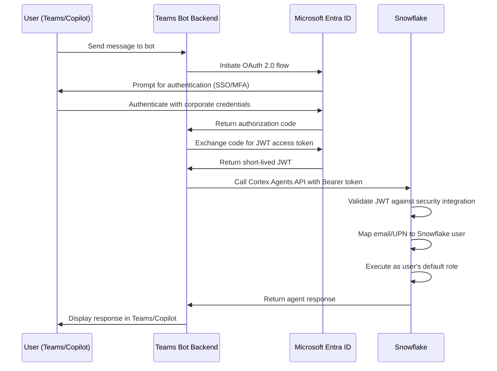

# Authentication Flow

```mermaid
sequenceDiagram
    participant U as User (Teams/Copilot)
    participant T as Teams Bot Backend
    participant E as Microsoft Entra ID
    participant S as Snowflake

    U->>T: Send message to bot
    T->>E: Initiate OAuth 2.0 flow
    E->>U: Prompt for authentication (SSO/MFA)
    U->>E: Authenticate with corporate credentials
    E->>T: Return authorization code
    T->>E: Exchange code for JWT access token
    E->>T: Return short-lived JWT
    T->>S: Call Cortex Agents API with Bearer token
    S->>S: Validate JWT against security integration
    S->>S: Map email/UPN to Snowflake user
    S->>S: Execute as user's default role
    S->>T: Return agent response
    T->>U: Display response in Teams/Copilot
```
