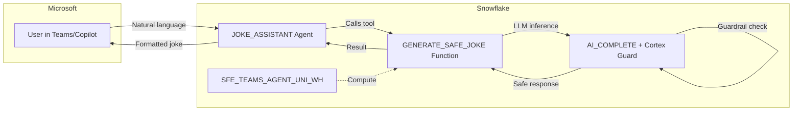

# Data Flow

```mermaid
flowchart LR
    subgraph Microsoft
        U[User in Teams/Copilot]
    end

    subgraph Snowflake
        A[JOKE_ASSISTANT Agent]
        F[GENERATE_SAFE_JOKE Function]
        AI[AI_COMPLETE + Cortex Guard]
        WH[SFE_TEAMS_AGENT_UNI_WH]
    end

    U -->|Natural language| A
    A -->|Calls tool| F
    F -->|LLM inference| AI
    AI -->|Guardrail check| AI
    AI -->|Safe response| F
    F -->|Result| A
    A -->|Formatted joke| U
    WH -.->|Compute| F
```
