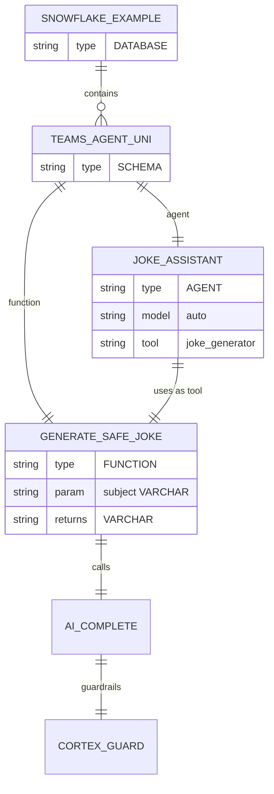

# Object Model

```mermaid
erDiagram
    SNOWFLAKE_EXAMPLE ||--o{ TEAMS_AGENT_UNI : contains
    TEAMS_AGENT_UNI ||--|| JOKE_ASSISTANT : "agent"
    TEAMS_AGENT_UNI ||--|| GENERATE_SAFE_JOKE : "function"
    JOKE_ASSISTANT ||--|| GENERATE_SAFE_JOKE : "uses as tool"
    GENERATE_SAFE_JOKE ||--|| AI_COMPLETE : "calls"
    AI_COMPLETE ||--|| CORTEX_GUARD : "guardrails"

    SNOWFLAKE_EXAMPLE {
        string type "DATABASE"
    }
    TEAMS_AGENT_UNI {
        string type "SCHEMA"
    }
    JOKE_ASSISTANT {
        string type "AGENT"
        string model "auto"
        string tool "joke_generator"
    }
    GENERATE_SAFE_JOKE {
        string type "FUNCTION"
        string param "subject VARCHAR"
        string returns "VARCHAR"
    }
```
