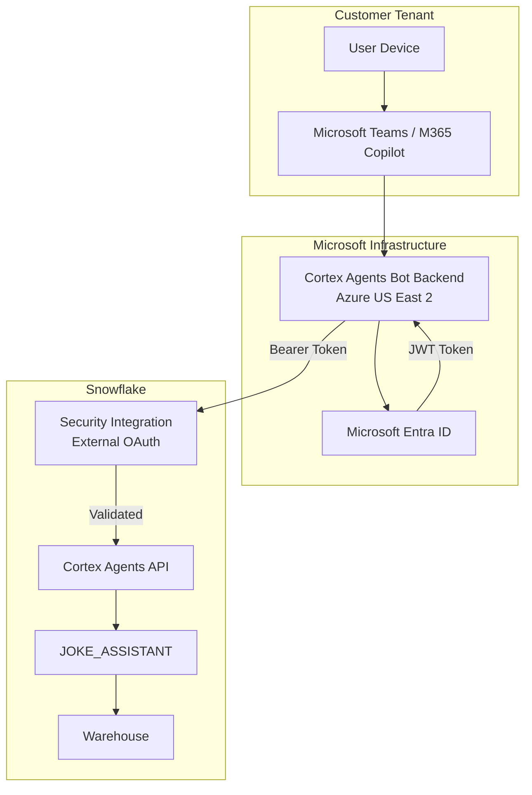

# Network Architecture

```mermaid
flowchart TB
    subgraph Customer Tenant
        U[User Device]
        Teams[Microsoft Teams / M365 Copilot]
    end

    subgraph Microsoft Infrastructure
        Entra[Microsoft Entra ID]
        Bot[Cortex Agents Bot Backend<br/>Azure US East 2]
    end

    subgraph Snowflake
        SI[Security Integration<br/>External OAuth]
        CA[Cortex Agents API]
        Agent[JOKE_ASSISTANT]
        WH[Warehouse]
    end

    U --> Teams
    Teams --> Bot
    Bot --> Entra
    Entra -->|JWT Token| Bot
    Bot -->|Bearer Token| SI
    SI -->|Validated| CA
    CA --> Agent
    Agent --> WH
```
