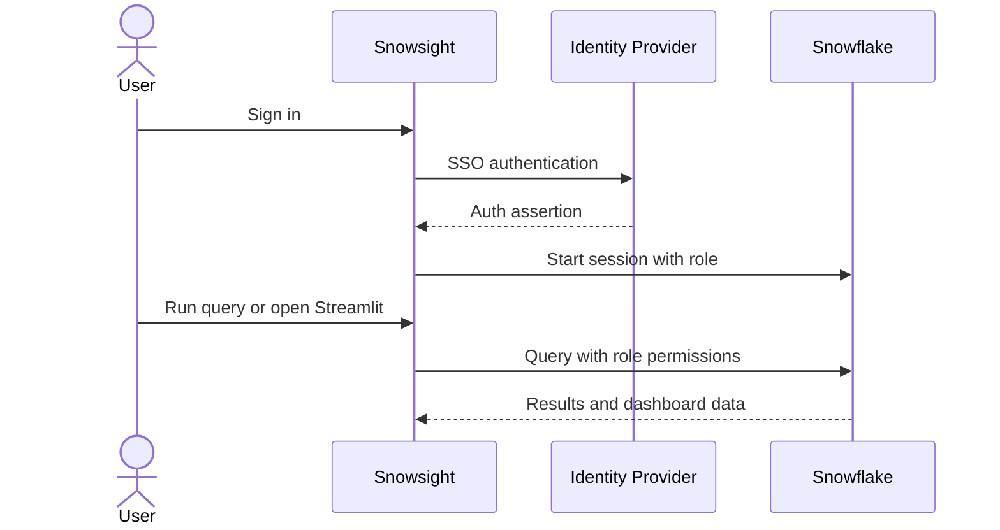

# Auth Flow - Data Quality Metrics & Reporting Demo

Author: SE Community
Last Updated: 2026-03-02
Status: Reference Implementation

**Reference Implementation:** This code demonstrates production-grade architectural patterns and best practices. Review and customize security, networking, and logic for your organization's specific requirements before deployment.

## Overview

This diagram shows user authentication into Snowflake and role-based authorization for querying data and accessing the Streamlit app.

## Diagram

## Component Descriptions

- Identity Provider: SSO authentication provider used for account access.
- Snowflake Session: Role-based session enforcing grants on schemas and objects.
- Streamlit Access: Streamlit app access controlled by Snowflake roles.

## Change History

See `.cursor/DIAGRAM_CHANGELOG.md` for version history.
