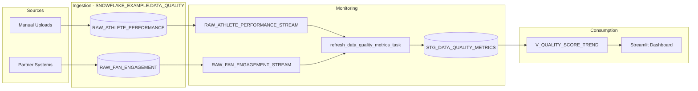

# Data Flow - Data Quality Metrics & Reporting Demo

Author: SE Community
Last Updated: 2026-03-02
Status: Reference Implementation

**Reference Implementation:** This code demonstrates production-grade architectural patterns and best practices. Review and customize security, networking, and logic for your organization's specific requirements before deployment.

## Overview

This diagram shows how source data is ingested into Snowflake, monitored via Streams and Tasks, and visualized in a Streamlit dashboard.

## Diagram

## Component Descriptions

- Sources: Incoming data from uploads and partner systems.
- Monitoring: Streams capture incremental changes and Tasks compute quality metrics.
- Consumption: Views support dashboards and analyst queries.

## Change History

See `.cursor/DIAGRAM_CHANGELOG.md` for version history.
