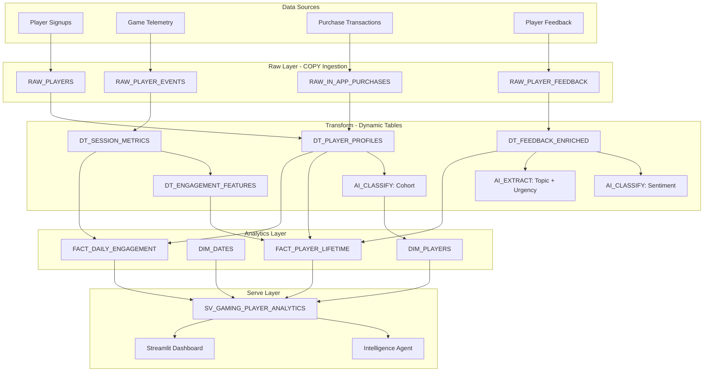

# Data Flow -- Gaming Player Analytics

Pair-programmed by SE Community + Cortex Code | Expires: 2026-04-24

```mermaid
flowchart TD
    subgraph sources [Data Sources]
        PLAYERS["Player Signups"]
        EVENTS["Game Telemetry"]
        IAP["Purchase Transactions"]
        REVIEWS["Player Feedback"]
    end

    subgraph raw [Raw Layer - COPY Ingestion]
        RAW_P["RAW_PLAYERS"]
        RAW_E["RAW_PLAYER_EVENTS"]
        RAW_IAP["RAW_IN_APP_PURCHASES"]
        RAW_F["RAW_PLAYER_FEEDBACK"]
    end

    subgraph transform [Transform - Dynamic Tables]
        direction TB
        DT_PROF["DT_PLAYER_PROFILES"]
        DT_SESS["DT_SESSION_METRICS"]
        DT_ENG["DT_ENGAGEMENT_FEATURES"]
        DT_FB["DT_FEEDBACK_ENRICHED"]
        AI1["AI_CLASSIFY: Cohort"]
        AI2["AI_CLASSIFY: Sentiment"]
        AI3["AI_EXTRACT: Topic + Urgency"]
    end

    subgraph analytics [Analytics Layer]
        DIM_P["DIM_PLAYERS"]
        DIM_D["DIM_DATES"]
        FACT_LTV["FACT_PLAYER_LIFETIME"]
        FACT_DAU["FACT_DAILY_ENGAGEMENT"]
    end

    subgraph serve [Serve Layer]
        SV["SV_GAMING_PLAYER_ANALYTICS"]
        AGENT["Intelligence Agent"]
        DASH["Streamlit Dashboard"]
    end

    PLAYERS --> RAW_P
    EVENTS --> RAW_E
    IAP --> RAW_IAP
    REVIEWS --> RAW_F

    RAW_P --> DT_PROF
    RAW_E --> DT_SESS
    RAW_F --> DT_FB
    RAW_IAP --> DT_PROF

    DT_PROF --> AI1
    DT_FB --> AI2
    DT_FB --> AI3
    DT_SESS --> DT_ENG

    AI1 --> DIM_P
    DT_PROF --> FACT_LTV
    DT_ENG --> FACT_LTV
    DT_FB --> FACT_LTV
    DT_SESS --> FACT_DAU
    DT_PROF --> FACT_DAU

    DIM_P & DIM_D & FACT_LTV & FACT_DAU --> SV
    SV --> AGENT
    SV --> DASH
```
