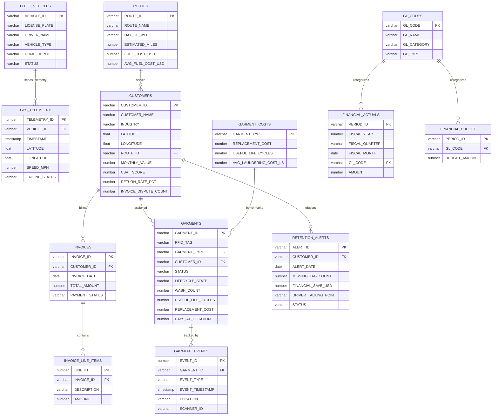

# Data Model - IoT Lifecycle Demo

Author: SE Community
Last Updated: 2026-05-13
Expires: 2026-06-11
Status: Reference Implementation

Reference Implementation: Review and customize for your requirements.

## Overview
Schema for Metro Textile Services -- 13 TRANSIENT tables in `SNOWFLAKE_EXAMPLE.IOT_LIFECYCLE` covering fleet GPS telemetry, RFID-tagged garment lifecycle, customer risk attributes, retention alerts, route efficiency, and monthly P&L. Two semantic views layer on top: `SV_IOT_FINANCIAL` for the CFO Agent and `SV_IOT_OPERATIONS` for the Operations Agent.

## Diagram

## Component Descriptions

| Table | Purpose |
|-------|---------|
| `FLEET_VEHICLES` | 5 delivery trucks with driver and depot assignments |
| `GPS_TELEMETRY` | Streamed lat/lng/speed updates from each vehicle |
| `ROUTES` | Named delivery runs with fuel cost vs benchmark for anomaly detection |
| `CUSTOMERS` | 20 Atlanta-area sites with risk attributes (CSAT, return rate, disputes) |
| `GARMENTS` | RFID-tagged inventory with `LIFECYCLE_STATE` (IN_PLANT, AT_CUSTOMER, ZOMBIE, etc.) |
| `GARMENT_EVENTS` | Append-only event log for the 9-stage lifecycle loop |
| `GARMENT_COSTS` | Industry benchmark replacement cost and useful life by garment type |
| `RETENTION_ALERTS` | Pre-drafted driver talking points with $ save value |
| `INVOICES` / `INVOICE_LINE_ITEMS` | Customer billing with PAID/PENDING/OVERDUE status |
| `GL_CODES` / `FINANCIAL_ACTUALS` / `FINANCIAL_BUDGET` | Monthly P&L, fiscal year starts Feb 1 |

## Change History
See `.claude/DIAGRAM_CHANGELOG.md` or project-specific changelog.
