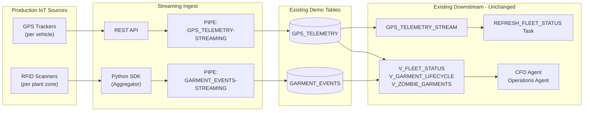

# Streaming IoT Data Ingest

The demo simulator uses `INSERT INTO` via the Snowflake Python Connector for simplicity. In a production deployment of this kind of IoT lifecycle workload, you would use **Snowpipe Streaming** (high-performance architecture, GA Sep 2025).

For the full guide -- decision tree, REST API walk-through, Python/Node.js/Java SDK examples, Kafka connector path, Iceberg streaming, costs, and migration from the classic SDK -- see the standalone guide project:

> [`guide-snowpipe-streaming-iot`](../../guide-snowpipe-streaming-iot/)

## How streaming would connect to this demo

The downstream pipeline -- Streams, Tasks, analytics views, semantic views, Cortex Agents -- is unchanged. Whether rows arrive via INSERT or Snowpipe Streaming, everything downstream continues to work. The streaming guide explains how to swap the ingestion layer without touching the rest of the demo.

## What changes for production

| Layer | Demo (today) | Production (with Snowpipe Streaming) |
|-------|--------------|---------------------------------------|
| Source | Python simulator thread in the FastAPI backend | Real GPS trackers and RFID scanners |
| Transport | `INSERT INTO` via Snowflake Connector | REST API (edge) or Python SDK (aggregator) |
| Latency | Per-tick (3 seconds) | ~5 seconds end-to-end |
| Exactly-once | Not enforced | Built-in via offset tokens |
| Cost model | Warehouse compute | Flat per-GB ingested |
| Stream + Task + Views + Agents | Unchanged | Unchanged |

See [`guide-snowpipe-streaming-iot`](../../guide-snowpipe-streaming-iot/) for full implementation details.
