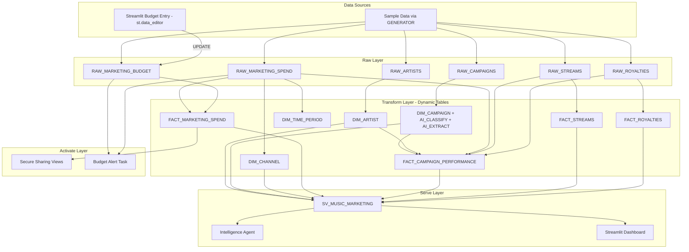

# Data Flow

```mermaid
flowchart TD
    subgraph sources [Data Sources]
        GEN["Sample Data via GENERATOR"]
        SIS_EDIT["Streamlit Budget Entry - st.data_editor"]
    end

    subgraph raw [Raw Layer]
        RAW_A["RAW_ARTISTS"]
        RAW_B["RAW_MARKETING_BUDGET"]
        RAW_S["RAW_MARKETING_SPEND"]
        RAW_C["RAW_CAMPAIGNS"]
        RAW_ST["RAW_STREAMS"]
        RAW_R["RAW_ROYALTIES"]
    end

    subgraph transform [Transform Layer - Dynamic Tables]
        DIM_A["DIM_ARTIST"]
        DIM_CAM["DIM_CAMPAIGN + AI_CLASSIFY + AI_EXTRACT"]
        DIM_CH["DIM_CHANNEL"]
        DIM_T["DIM_TIME_PERIOD"]
        F_SPEND["FACT_MARKETING_SPEND"]
        F_PERF["FACT_CAMPAIGN_PERFORMANCE"]
        F_STREAM["FACT_STREAMS"]
        F_ROY["FACT_ROYALTIES"]
    end

    subgraph serve [Serve Layer]
        SV["SV_MUSIC_MARKETING"]
        AGENT["Intelligence Agent"]
        APP["Streamlit Dashboard"]
    end

    subgraph activate [Activate Layer]
        SHARE["Secure Sharing Views"]
        ALERTS["Budget Alert Task"]
    end

    GEN --> RAW_A & RAW_B & RAW_S & RAW_C & RAW_ST & RAW_R
    SIS_EDIT -->|"UPDATE"| RAW_B

    RAW_A --> DIM_A
    RAW_C --> DIM_CAM
    RAW_S --> DIM_CH
    RAW_S --> DIM_T
    RAW_S & RAW_B --> F_SPEND
    DIM_CAM & DIM_A & RAW_S & RAW_ST & RAW_R --> F_PERF
    RAW_ST --> F_STREAM
    RAW_R --> F_ROY

    DIM_A & DIM_CAM & DIM_CH & F_SPEND & F_PERF & F_STREAM & F_ROY --> SV
    SV --> AGENT
    SV --> APP
    F_SPEND --> SHARE
    RAW_B & RAW_S --> ALERTS
```
