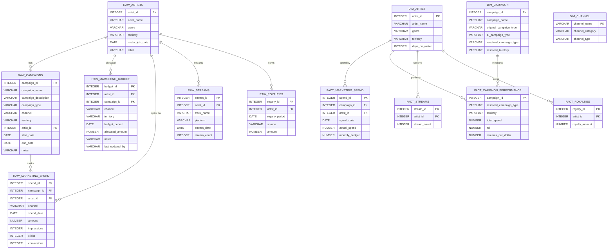

# Data Model

```mermaid
erDiagram
    RAW_ARTISTS {
        INTEGER artist_id PK
        VARCHAR artist_name
        VARCHAR genre
        VARCHAR territory
        DATE roster_join_date
        VARCHAR label
    }
    RAW_CAMPAIGNS {
        INTEGER campaign_id PK
        VARCHAR campaign_name
        VARCHAR campaign_description
        VARCHAR campaign_type
        VARCHAR channel
        VARCHAR territory
        INTEGER artist_id FK
        DATE start_date
        DATE end_date
        VARCHAR notes
    }
    RAW_MARKETING_BUDGET {
        INTEGER budget_id PK
        INTEGER artist_id FK
        INTEGER campaign_id FK
        VARCHAR channel
        VARCHAR territory
        DATE budget_period
        NUMBER allocated_amount
        VARCHAR notes
        VARCHAR last_updated_by
    }
    RAW_MARKETING_SPEND {
        INTEGER spend_id PK
        INTEGER campaign_id FK
        INTEGER artist_id FK
        VARCHAR channel
        DATE spend_date
        NUMBER amount
        INTEGER impressions
        INTEGER clicks
        INTEGER conversions
    }
    RAW_STREAMS {
        INTEGER stream_id PK
        INTEGER artist_id FK
        VARCHAR track_name
        VARCHAR platform
        DATE stream_date
        INTEGER stream_count
    }
    RAW_ROYALTIES {
        INTEGER royalty_id PK
        INTEGER artist_id FK
        DATE royalty_period
        VARCHAR source
        NUMBER amount
    }
    DIM_ARTIST {
        INTEGER artist_id PK
        VARCHAR artist_name
        VARCHAR genre
        VARCHAR territory
        INTEGER days_on_roster
    }
    DIM_CAMPAIGN {
        INTEGER campaign_id PK
        VARCHAR campaign_name
        VARCHAR original_campaign_type
        VARCHAR ai_campaign_type
        VARCHAR resolved_campaign_type
        VARCHAR resolved_territory
    }
    DIM_CHANNEL {
        VARCHAR channel_name PK
        VARCHAR channel_category
        VARCHAR channel_type
    }
    FACT_MARKETING_SPEND {
        INTEGER spend_id PK
        INTEGER campaign_id FK
        INTEGER artist_id FK
        DATE spend_date
        NUMBER actual_spend
        NUMBER monthly_budget
    }
    FACT_CAMPAIGN_PERFORMANCE {
        INTEGER campaign_id PK
        VARCHAR resolved_campaign_type
        VARCHAR territory
        NUMBER total_spend
        NUMBER roi
        NUMBER streams_per_dollar
    }
    FACT_STREAMS {
        INTEGER stream_id PK
        INTEGER artist_id FK
        INTEGER stream_count
    }
    FACT_ROYALTIES {
        INTEGER royalty_id PK
        INTEGER artist_id FK
        NUMBER royalty_amount
    }

    RAW_ARTISTS ||--o{ RAW_CAMPAIGNS : "has"
    RAW_ARTISTS ||--o{ RAW_MARKETING_BUDGET : "allocated"
    RAW_ARTISTS ||--o{ RAW_MARKETING_SPEND : "spent on"
    RAW_ARTISTS ||--o{ RAW_STREAMS : "streams"
    RAW_ARTISTS ||--o{ RAW_ROYALTIES : "earns"
    RAW_CAMPAIGNS ||--o{ RAW_MARKETING_SPEND : "tracks"
    DIM_ARTIST ||--o{ FACT_MARKETING_SPEND : "spend by"
    DIM_ARTIST ||--o{ FACT_CAMPAIGN_PERFORMANCE : "performs"
    DIM_ARTIST ||--o{ FACT_STREAMS : "streams"
    DIM_ARTIST ||--o{ FACT_ROYALTIES : "earns"
    DIM_CAMPAIGN ||--o{ FACT_CAMPAIGN_PERFORMANCE : "measures"
```
