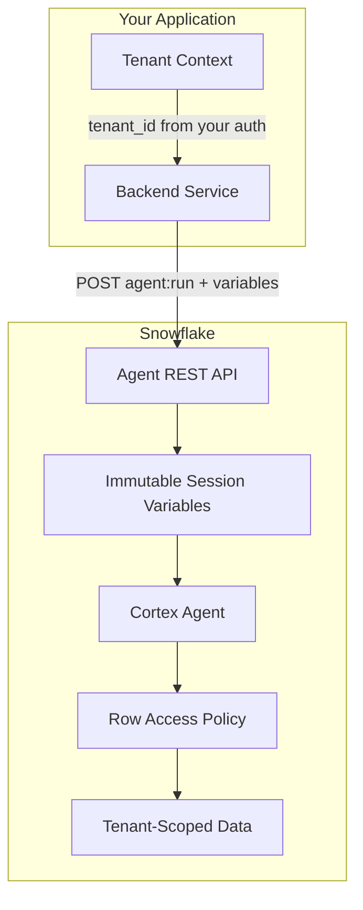
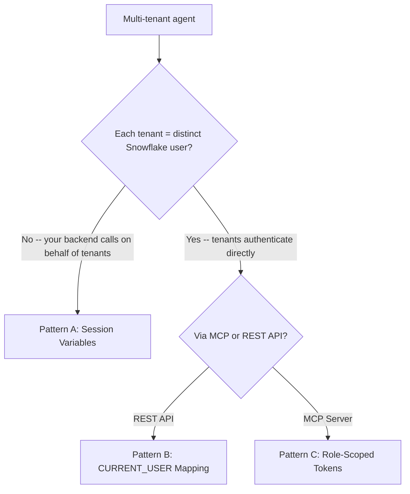

# Multi-Tenant Cortex Agent: Need-to-Knows for API-Driven Solutions

Everything you need to know (and the things that will bite you) when building multi-tenant agent applications on Snowflake. Focused on API-driven use cases where your backend calls the Cortex Agent REST API on behalf of multiple tenants.

**Audience:** Engineers building multi-tenant agent applications; SEs advising on architecture
**Created:** 2026-05-06 | **Expires:** 2026-07-05 | **Status:** ACTIVE

> **No support provided.** This content is for reference only. Review, test, and modify before any production use.

---

### Quick Navigation

| | |
|---|---|
| **[Part 1: Need-to-Knows and Gotchas](#part-1-need-to-knows-and-gotchas)** | **Start here** -- the things that bite every team |
| **[Part 2: Isolation Patterns](#part-2-isolation-patterns)** | Session variables, CURRENT_USER mapping, role-scoped tokens -- decision matrix |
| **[Part 3: API-Driven Agent Calls](#part-3-api-driven-agent-calls)** | REST endpoints, DATA_AGENT_RUN, streaming, thread management |
| **[Part 4: Authentication Decision Matrix](#part-4-authentication-decision-matrix)** | PAT vs Key-pair JWT vs External OAuth for multi-tenant |
| **[Part 5: Cost Controls and Monitoring](#part-5-cost-controls-and-monitoring)** | Per-tenant credit tracking, budgets, alerting |

---

## Architecture



**The core pattern:** Your application authenticates tenants (however you want), then passes a `tenant_id` as an immutable session variable in the `agent:run` API call. A Row Access Policy filters data based on that variable. The agent never sees other tenants' data -- isolation is enforced at the SQL layer.

---

## Part 1: Need-to-Knows and Gotchas

These are the things that catch every team building multi-tenant agents. Read this first.

### Identity and Role Behavior

| # | Gotcha | Impact | Mitigation |
|---|--------|--------|------------|
| 1 | **REST API always uses DEFAULT_ROLE** | You cannot specify a role in the API call header | Set `DEFAULT_ROLE` explicitly per service user: `ALTER USER SET DEFAULT_ROLE = agent_service_role` |
| 2 | **CORTEX_USER database role required** | Agent API calls fail with opaque errors without it | `GRANT DATABASE ROLE SNOWFLAKE.CORTEX_USER TO ROLE agent_service_role` |
| 3 | **Code execution tool uses OWNER's privileges** | Tenant isolation breaks for code_execution tool -- it runs with the agent creator's role, not the caller's | Do NOT use `code_execution` tool in multi-tenant agents unless you accept this security model |
| 4 | **External OAuth uses user's DEFAULT_ROLE** | Same as #1 -- token-bound role doesn't override | Set DEFAULT_ROLE or use `EXTERNAL_OAUTH_ANY_ROLE_MODE = 'ENABLE'` + `USE ROLE` before calling |
| 5 | **Variables not validated by Snowflake** | Any string can be passed as tenant_id -- Snowflake doesn't check it | Your backend MUST validate tenant_id before passing to agent:run |

### Row Access Policies

| # | Gotcha | Impact | Mitigation |
|---|--------|--------|------------|
| 6 | **SYS_CONTEXT returns NULL if variable not set** | RAP evaluates `column = NULL` which is always FALSE -- zero rows returned, no error | Validate variables are present; consider `COALESCE(SYS_CONTEXT(...), '__NO_TENANT__')` for clearer debugging |
| 7 | **Mapping table must be in same database** | Cross-database references in RAP bodies fail silently | Co-locate mapping tables with protected data |
| 8 | **RAPs on base tables propagate through semantic views** | Expected behavior, but if you forget a table, that data is unprotected | Apply RAPs to ALL tables referenced by the semantic view |
| 9 | **Memoizable functions improve RAP performance** | Subquery in every RAP evaluation is expensive at scale | Use `ARRAY_CONTAINS(tenant_id, get_allowed_tenants())` pattern with cached scalar UDFs |
| 10 | **RAP + QUALIFY interaction** | `QUALIFY` runs after RAP filtering -- row numbers change per tenant | Expected, but be aware when agents generate ranked queries |

### Semantic Views and Data

| # | Gotcha | Impact | Mitigation |
|---|--------|--------|------------|
| 11 | **Sample values in semantic view are NOT masked** | PII or tenant-specific data in `sample_values` is visible via `GET_DDL` to anyone with USAGE | Never put real customer data in sample_values -- use synthetic examples |
| 12 | **Tag-based masking NOT supported on semantic views** | Must apply masking policies at base table level | Set tags on base table columns, not semantic view attributes |
| 13 | **SELECT required on semantic view AND underlying tables** | Double-grant needed for Cortex Analyst tool to work | Grant both: `SELECT ON SEMANTIC VIEW` + `SELECT ON TABLE` for each base table |

### Billing and Budget

| # | Gotcha | Impact | Mitigation |
|---|--------|--------|------------|
| 14 | **No per-request credit cap** | A single complex query can consume significant credits | Set `orchestration.budget.seconds` and `orchestration.budget.tokens` in agent spec |
| 15 | **Budget enforcement latency: up to 8 hours** | Tenant can overspend significantly before budget triggers | Use low-latency budget option (2hr); implement application-side request counting |
| 16 | **Code execution tool costs are separate** | Token costs for orchestration don't include code_execution compute | Monitor `TOKENS_GRANULAR` breakdown in `CORTEX_AGENT_USAGE_HISTORY` |
| 17 | **No agent-specific rate limits documented** | Unlike raw Cortex LLM endpoints (which have TPM/RPM caps), agent API has no published limits | Implement application-side per-tenant rate limiting |

### API Behavior

| # | Gotcha | Impact | Mitigation |
|---|--------|--------|------------|
| 18 | **15-minute timeout per request** | Long orchestration chains time out silently | Set `budget.seconds` well below 900 (recommended: 30-120) |
| 19 | **Streaming is default** | Forgetting `"stream": false` returns SSE instead of JSON | Set explicitly based on your use case |
| 20 | **Thread state persists** | Previous messages affect subsequent responses; wrong thread = data context leak | Create new thread per tenant session; never share threads across tenants |
| 21 | **Rate limit headers NOT returned** | Can't implement client-side backoff from response headers | Track request counts application-side |
| 22 | **`tool_choice` doesn't restrict -- it hints** | Setting `tool_choice` to a specific tool still allows the agent to use others | For hard tool restriction, create the agent with only the tools you want |

---

## Part 2: Isolation Patterns

Three approaches to tenant data isolation. The right choice depends on whether your tenants map to distinct Snowflake users.



### Pattern A: Immutable Session Variables (Recommended for API-Driven)

Your backend sets a tenant identifier that the agent cannot modify. Row Access Policies reference it for filtering.

**When to use:** Your application has its own auth (Auth0, Entra ID, Cognito, etc.) and calls Snowflake's agent API on behalf of tenants. Most SaaS/ISV use cases.

**Step 1: Pass variables in agent:run**

```bash
curl -X POST \
  "https://${ACCOUNT}.snowflakecomputing.com/api/v2/databases/${DB}/schemas/${SCHEMA}/agents/${AGENT}:run" \
  -H "Authorization: Bearer ${TOKEN}" \
  -H "Content-Type: application/json" \
  -d '{
    "messages": [{"role": "user", "content": [{"type": "text", "text": "Show my revenue last quarter"}]}],
    "variables": {
      "tenant_id": {
        "value": "CUST001",
        "type": "string",
        "is_immutable_session_attribute": true
      }
    },
    "stream": true
  }'
```

> [!IMPORTANT]
> `is_immutable_session_attribute: true` is the critical field. Without it, generated SQL or code execution could overwrite the variable mid-session. With it, the variable is locked before any tool invocation.

**Step 2: Create a Row Access Policy referencing the session variable**

```sql
CREATE OR REPLACE ROW ACCESS POLICY tenant_isolation
  AS (row_tenant_id VARCHAR) RETURNS BOOLEAN ->
    row_tenant_id = SYS_CONTEXT('SNOWFLAKE$SESSION_ATTRIBUTES', 'tenant_id')
    OR CURRENT_ROLE() IN ('ACCOUNTADMIN', 'SYSADMIN');

ALTER TABLE revenue ADD ROW ACCESS POLICY tenant_isolation ON (tenant_id);
ALTER TABLE customers ADD ROW ACCESS POLICY tenant_isolation ON (tenant_id);
```

**Step 3: Grant the calling user access**

```sql
GRANT USAGE ON DATABASE my_db TO ROLE agent_service_role;
GRANT USAGE ON SCHEMA my_db.my_schema TO ROLE agent_service_role;
GRANT USAGE ON AGENT my_db.my_schema.my_agent TO ROLE agent_service_role;
GRANT SELECT ON SEMANTIC VIEW my_db.my_schema.my_semantic_view TO ROLE agent_service_role;
GRANT SELECT ON TABLE my_db.my_schema.revenue TO ROLE agent_service_role;
GRANT SELECT ON TABLE my_db.my_schema.customers TO ROLE agent_service_role;
GRANT DATABASE ROLE SNOWFLAKE.CORTEX_USER TO ROLE agent_service_role;
```

> [!WARNING]
> **Gotcha:** If `SYS_CONTEXT` returns NULL (e.g., caller forgot to pass variables), the RAP evaluates `row_tenant_id = NULL` which is always FALSE -- returning zero rows. This is safe (no data leaks) but confusing for debugging. Consider adding an explicit NULL check with an informative error.

---

### Pattern B: CURRENT_USER Mapping Table

Each tenant has a distinct Snowflake user. A mapping table + UDF resolves the tenant context.

**When to use:** Each tenant authenticates directly to Snowflake (e.g., via External OAuth mapping to per-tenant Snowflake users).

```sql
CREATE TABLE tenant_mapping (
  snowflake_user VARCHAR,
  tenant_id VARCHAR,
  tenant_name VARCHAR
);

CREATE OR REPLACE FUNCTION get_tenant_id()
  RETURNS VARCHAR LANGUAGE SQL AS
$$
  SELECT tenant_id FROM tenant_mapping
  WHERE snowflake_user = CURRENT_USER() LIMIT 1
$$;

CREATE OR REPLACE ROW ACCESS POLICY tenant_isolation
  AS (row_tenant_id VARCHAR) RETURNS BOOLEAN ->
    row_tenant_id = get_tenant_id()
    OR CURRENT_ROLE() IN ('ACCOUNTADMIN', 'SYSADMIN');
```

> [!WARNING]
> **Gotcha:** The mapping table MUST be in the same database as the protected tables. Cross-database joins inside Row Access Policies fail silently.

---

### Pattern C: Role-Scoped OAuth Tokens (MCP Server Path)

The OAuth token itself carries the role scope. Different roles see different tools and data.

**When to use:** Tenants connect via MCP clients (Cursor, Claude Desktop, etc.) rather than your API.

See [guide-mcp-auth Part 4](../guide-mcp-auth/) for the complete pattern with `scope=session:role:ANALYST_NA`.

---

### Decision Matrix

| Criteria | Pattern A (Session Variables) | Pattern B (CURRENT_USER) | Pattern C (Role-Scoped) |
|---|---|---|---|
| **Best for** | API-driven SaaS backends | Direct user auth to Snowflake | MCP server connections |
| **Requires per-tenant Snowflake users?** | No | Yes | Yes (per-role) |
| **Isolation mechanism** | RAP + SYS_CONTEXT | RAP + CURRENT_USER() | RBAC per role |
| **Auth flexibility** | Any (your app handles auth) | External OAuth or PAT per user | OAuth with role scope |
| **Backend required?** | Yes | Optional | No |
| **Scales to 1000+ tenants** | Yes (one service user) | Harder (1000+ Snowflake users) | Hard (roles don't scale) |
| **Agent owns execution context** | Partially (variables locked) | Yes (full user context) | Yes (full role context) |

---

## Part 3: API-Driven Agent Calls

### Endpoints

| Endpoint | Use Case | Notes |
|---|---|---|
| `POST /api/v2/databases/{db}/schemas/{schema}/agents/{name}:run` | Run a pre-created agent | Most common for production |
| `POST /api/v2/cortex/agent:run` | Run with inline config (no agent object) | Full control per-request |
| `POST /api/v2/cortex/threads` | Create a conversation thread | For multi-turn conversations |
| `SNOWFLAKE.CORTEX.DATA_AGENT_RUN(name, body)` | SQL function (non-streaming) | For use inside stored procedures |

### Request Format (with agent object)

```json
{
  "messages": [
    {"role": "user", "content": [{"type": "text", "text": "What were our top products?"}]}
  ],
  "variables": {
    "tenant_id": {
      "value": "CUST001",
      "type": "string",
      "is_immutable_session_attribute": true
    }
  },
  "thread_id": 12345,
  "parent_message_id": 0,
  "stream": true,
  "tool_choice": {"type": "auto"}
}
```

### Streaming Response (SSE Events)

The default response is Server-Sent Events. Key event types:

| Event | Contains | When |
|---|---|---|
| `response.text.delta` | `{"text": "partial text"}` | Agent streaming text |
| `response.tool_use` | Tool name + arguments | Agent calling a tool |
| `response.tool_result` | Tool execution result | Tool returned data |
| `response` | Final message with metadata | Request complete |

### Non-Streaming Response

Set `"stream": false` to get a single JSON response:

```bash
curl -X POST \
  "https://${ACCOUNT}.snowflakecomputing.com/api/v2/databases/${DB}/schemas/${SCHEMA}/agents/${AGENT}:run" \
  -H "Authorization: Bearer ${TOKEN}" \
  -H "Content-Type: application/json" \
  -d '{
    "messages": [{"role": "user", "content": [{"type": "text", "text": "Total revenue by region"}]}],
    "variables": {"tenant_id": {"value": "CUST001", "type": "string", "is_immutable_session_attribute": true}},
    "stream": false
  }'
```

### Python Streaming Example

```python
import httpx

ACCOUNT = "myorg-myaccount"
DB, SCHEMA, AGENT = "MY_DB", "MY_SCHEMA", "MY_AGENT"
TOKEN = "..."  # PAT, OAuth token, or key-pair JWT

url = f"https://{ACCOUNT}.snowflakecomputing.com/api/v2/databases/{DB}/schemas/{SCHEMA}/agents/{AGENT}:run"

payload = {
    "messages": [{"role": "user", "content": [{"type": "text", "text": "Show my top 5 customers"}]}],
    "variables": {
        "tenant_id": {"value": "CUST001", "type": "string", "is_immutable_session_attribute": True}
    },
    "stream": True,
}

with httpx.Client(timeout=900.0) as client:
    with client.stream("POST", url, json=payload, headers={
        "Authorization": f"Bearer {TOKEN}",
        "Content-Type": "application/json",
    }) as response:
        for line in response.iter_lines():
            if line.startswith("data:"):
                print(line[5:].strip())
```

### DATA_AGENT_RUN (SQL Function)

For calling agents from stored procedures, tasks, or worksheets:

```sql
SELECT TRY_PARSE_JSON(
  SNOWFLAKE.CORTEX.DATA_AGENT_RUN(
    'MY_DB.MY_SCHEMA.MY_AGENT',
    $${
      "messages": [{"role": "user", "content": [{"type": "text", "text": "Revenue by product"}]}],
      "variables": {"tenant_id": {"value": "CUST001", "type": "string", "is_immutable_session_attribute": true}}
    }$$
  )
) AS response;
```

> [!NOTE]
> `DATA_AGENT_RUN` always returns non-streaming JSON regardless of the `stream` parameter. The `stream` field is ignored.

### Thread Management

Threads persist conversation history for multi-turn interactions:

```bash
# Create a thread
curl -X POST "https://${ACCOUNT}.snowflakecomputing.com/api/v2/cortex/threads" \
  -H "Authorization: Bearer ${TOKEN}" \
  -H "Content-Type: application/json" \
  -d '{"origin_application": "my_saas_app"}'
```

Pass `thread_id` in subsequent `agent:run` calls to maintain context. Use `parent_message_id` to reference specific messages in the thread.

> [!WARNING]
> **Gotcha:** Thread state persists between messages. If tenant A's message is in a thread and you accidentally reuse that thread for tenant B, the agent has context about tenant A's data. Always create a new thread per tenant session.

---

## Part 4: Authentication Decision Matrix

All three methods produce a Bearer token for the `Authorization` header. The choice affects multi-tenant architecture.

| Criteria | PAT | Key-pair JWT | External OAuth (Entra/Okta) |
|---|---|---|---|
| **Setup time** | 5 minutes | 15 minutes | 45 minutes |
| **Identity type** | Service account | Service account | End-user or service |
| **Multi-tenant pattern** | One PAT for service user; pass tenant_id in variables | Same as PAT | Each tenant = Snowflake user; use CURRENT_USER pattern |
| **Rotation** | Manual or vault-driven | Key rotation via ALTER USER | Token refresh (automatic) |
| **Scales to 1000+ tenants** | Yes (single service user) | Yes (single service user) | Harder (1000+ Snowflake users needed) |
| **Best for** | Dev/testing, simple backends, Pattern A | Automated pipelines, CI/CD, Pattern A | Direct tenant auth, Pattern B |
| **Risk** | Token leakage in logs/config | Key file exposure | Complex IdP configuration |
| **Role behavior** | Uses DEFAULT_ROLE of PAT user | Uses DEFAULT_ROLE of key-pair user | Uses DEFAULT_ROLE of mapped user |

### The DEFAULT_ROLE Rule

> [!CAUTION]
> **You cannot specify a role in the Agent API call.** It ALWAYS uses the authenticated user's `DEFAULT_ROLE`. This is the single most important auth gotcha for multi-tenant apps.

**Implication for Pattern A (session variables):** Use a single service user with a dedicated role that has access to all tenant data. The Row Access Policy (via session variables) handles per-tenant filtering.

**Implication for Pattern B (per-user auth):** Each tenant user must have `DEFAULT_ROLE` set to the correct role. If tenants share a role, they share tool access.

```sql
ALTER USER agent_service SET DEFAULT_ROLE = agent_service_role;
```

---

## Part 5: Cost Controls and Monitoring

### Agent-Level Budget (First Line of Defense)

Set in the agent specification:

```sql
CREATE OR REPLACE AGENT my_db.my_schema.my_agent
  FROM SPECIFICATION $$
  models:
    orchestration: auto

  orchestration:
    budget:
      seconds: 60
      tokens: 16000

  instructions:
    system: "You are a data assistant. Only answer questions about the tenant's data."

  tools:
    - tool_spec:
        type: "cortex_analyst_text_to_sql"
        name: "analyst"
        description: "Query structured data"

  tool_resources:
    analyst:
      semantic_view: "my_db.my_schema.my_semantic_view"
  $$;
```

`budget.seconds` and `budget.tokens` are enforced per-request. Whichever limit is hit first ends the orchestration.

### Per-Tenant Credit Monitoring

```sql
SELECT
  user_name,
  DATE_TRUNC('day', start_time) AS day,
  COUNT(*) AS requests,
  SUM(token_credits) AS total_credits,
  SUM(tokens) AS total_tokens,
  AVG(token_credits) AS avg_credits_per_request
FROM SNOWFLAKE.ACCOUNT_USAGE.CORTEX_AGENT_USAGE_HISTORY
WHERE start_time > DATEADD('day', -7, CURRENT_TIMESTAMP())
GROUP BY user_name, day
ORDER BY total_credits DESC;
```

### Granular Cost Breakdown

```sql
SELECT
  user_name,
  t.value:service_type::STRING AS service_type,
  t.value:model::STRING AS model,
  SUM(t.value:credits::FLOAT) AS credits,
  SUM(t.value:tokens::INT) AS tokens
FROM SNOWFLAKE.ACCOUNT_USAGE.CORTEX_AGENT_USAGE_HISTORY,
  LATERAL FLATTEN(input => credits_granular) t
WHERE start_time > DATEADD('day', -7, CURRENT_TIMESTAMP())
GROUP BY user_name, service_type, model
ORDER BY credits DESC;
```

### Resource Budget Objects (Account-Level)

For hard budget enforcement across tenants:

```sql
CREATE SNOWFLAKE.CORE.BUDGET agent_budget;

CALL agent_budget!SET_SPENDING_LIMIT(1000);

CALL agent_budget!ADD_RESOURCE(
  SYSTEM$REFERENCE('AGENT', 'my_db.my_schema.my_agent', 'SESSION', 'USAGE')
);

CALL agent_budget!SET_NOTIFICATION_THRESHOLD(50);
CALL agent_budget!SET_NOTIFICATION_THRESHOLD(80);
```

> [!WARNING]
> **Gotcha:** Budget enforcement has up to 8-hour latency (2 hours with low-latency option). For real-time per-tenant caps, implement counting in your application layer.

### Application-Side Rate Limiting (Recommended)

Since agent API rate limits are not documented and budget enforcement is delayed, implement per-tenant limits in your backend:

```python
from collections import defaultdict
from time import time

TENANT_LIMITS = {"requests_per_minute": 10, "requests_per_hour": 100}
tenant_counters = defaultdict(list)

def check_rate_limit(tenant_id: str) -> bool:
    now = time()
    window = [t for t in tenant_counters[tenant_id] if now - t < 3600]
    tenant_counters[tenant_id] = window

    per_minute = sum(1 for t in window if now - t < 60)
    if per_minute >= TENANT_LIMITS["requests_per_minute"]:
        return False
    if len(window) >= TENANT_LIMITS["requests_per_hour"]:
        return False

    tenant_counters[tenant_id].append(now)
    return True
```

---

## Production Readiness Checklist

| Category | Check | Reference |
|---|---|---|
| **Isolation** | Row Access Policy applied to ALL tables in semantic view | Part 2 |
| **Isolation** | `is_immutable_session_attribute: true` in all variable declarations | Part 2 |
| **Isolation** | Variables validated in your backend before passing to agent:run | Part 1 #5 |
| **Isolation** | New thread created per tenant session (never shared) | Part 1 #20 |
| **Identity** | `DEFAULT_ROLE` explicitly set on service user | Part 4 |
| **Identity** | `SNOWFLAKE.CORTEX_USER` database role granted | Part 1 #2 |
| **Identity** | `code_execution` tool NOT used in multi-tenant agent | Part 1 #3 |
| **Data** | No real customer data in semantic view `sample_values` | Part 1 #11 |
| **Data** | Masking policies applied at base table level (not semantic view) | Part 1 #12 |
| **Cost** | Agent `budget.seconds` and `budget.tokens` set | Part 5 |
| **Cost** | Application-side rate limiting per tenant | Part 5 |
| **Cost** | `CORTEX_AGENT_USAGE_HISTORY` monitoring in place | Part 5 |
| **Auth** | Bearer token never logged or stored in plaintext | Part 4 |
| **Auth** | Token rotation/refresh automated | Part 4 |

---

## Related Projects

- [`guide-agent-hardening`](../guide-agent-hardening/) -- Full governance playbook: content safety, RBAC, network, monitoring, cost controls
- [`guide-mcp-auth`](../guide-mcp-auth/) -- MCP server auth for all AI clients + multi-tenant RBAC in Part 4
- [`guide-connecting-claude-snowflake`](../guide-connecting-claude-snowflake/) -- Claude Desktop OAuth + Cortex Code plugin paths
- [`guide-external-access-playbook`](../guide-external-access-playbook/) -- Network rules, secrets, external OAuth integrations
- [`tool-secrets-rotation-aws`](../tool-secrets-rotation-aws/) -- Automated PAT and key-pair rotation

## External References

- [Cortex Agents REST API](https://docs.snowflake.com/en/user-guide/snowflake-cortex/cortex-agents-rest-api)
- [BUILD AGENTS (Snowflake Intelligence)](https://docs.snowflake.com/en/user-guide/snowflake-cortex/snowflake-intelligence/build-agents)
- [CREATE AGENT Reference](https://docs.snowflake.com/en/sql-reference/sql/create-agent)
- [Row Access Policies](https://docs.snowflake.com/en/user-guide/security-row-intro)
- [External OAuth with Entra ID](https://docs.snowflake.com/en/user-guide/oauth-azure)
- [CORTEX_AGENT_USAGE_HISTORY View](https://docs.snowflake.com/en/sql-reference/account-usage/cortex_agent_usage_history)
- [SYS_CONTEXT Function](https://docs.snowflake.com/en/sql-reference/functions/sys_context)
