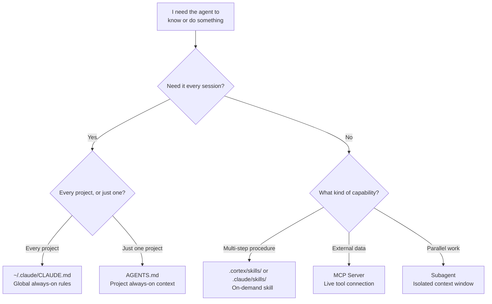
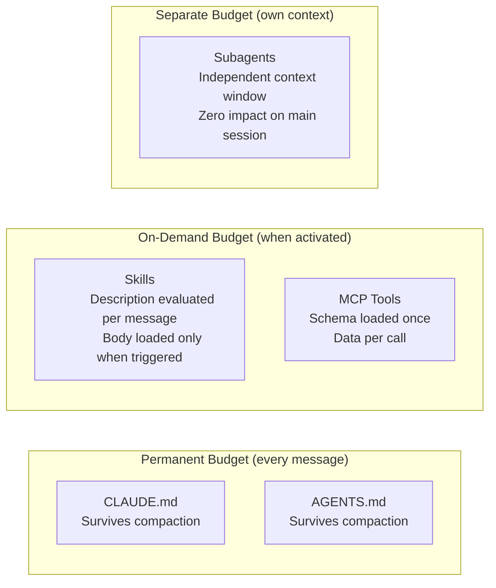

# Right Tool for the Job: Decision Framework

Choose the extensibility mechanism that matches the scope and cost model you need. Each terminal node shows when to use it and how it affects your context budget.

## Cost Model

Each mechanism has a different impact on your context budget:

## When You've Picked the Wrong Tool

| Signal | Likely Misplacement | Better Fit |
|--------|--------------------:|:-----------|
| CLAUDE.md over 300 lines | Procedures in always-on rules | Extract to skills |
| Agent forgets conventions mid-session | Conventions in conversation only | Move to AGENTS.md |
| Skill fires but steps get skipped | Skill body too large (300+ lines) | Split skill + references/ |
| Skill fires when irrelevant | Description too vague | Narrow YAML description |
| Need data from GitHub/Jira/DB | Pasting data into conversation | Use MCP server |
| Two tasks block each other | Sequential in one session | Delegate to subagent |
