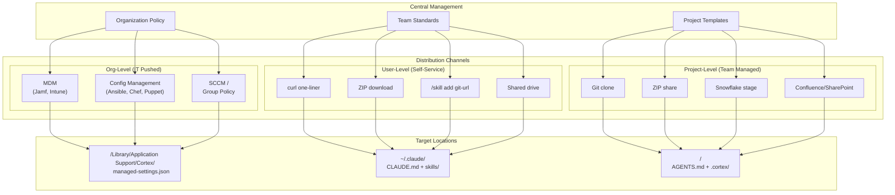
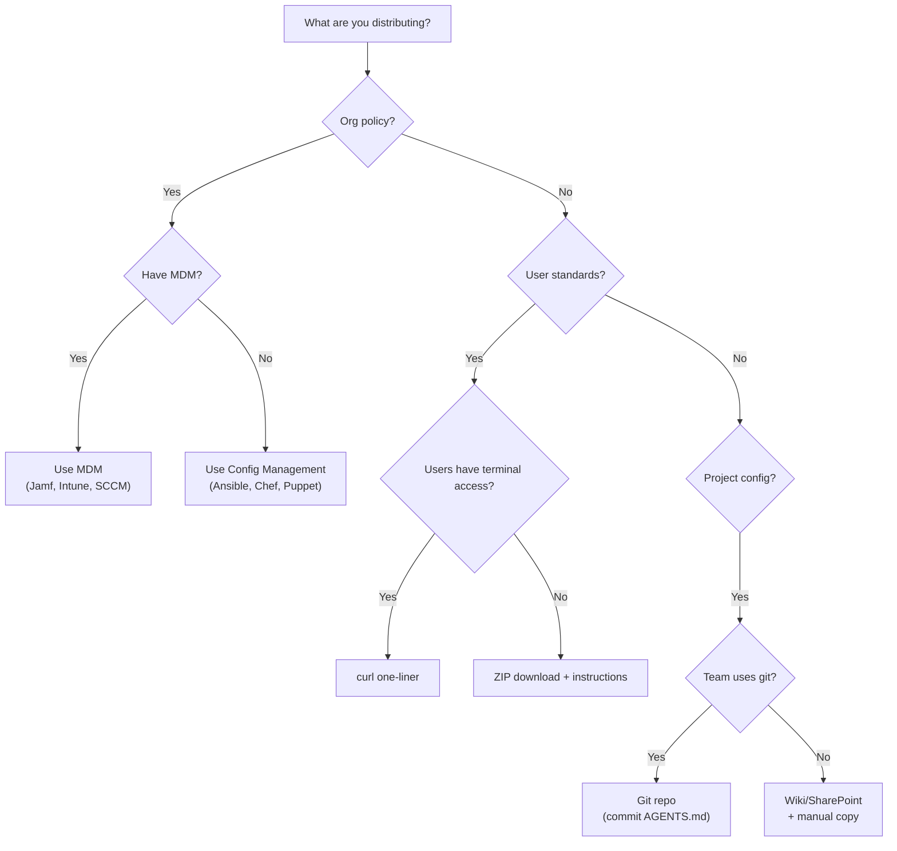
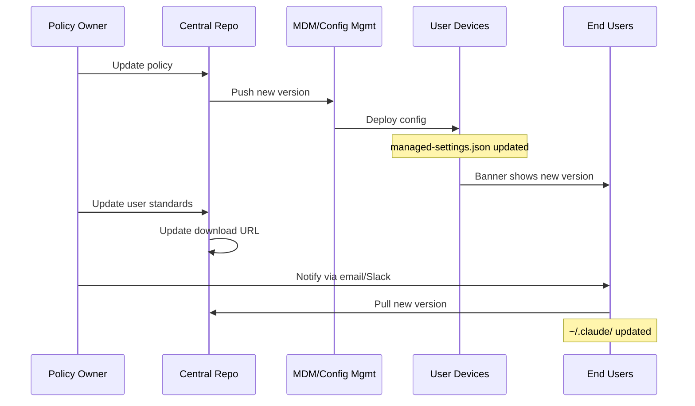
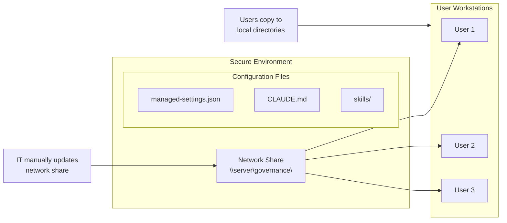
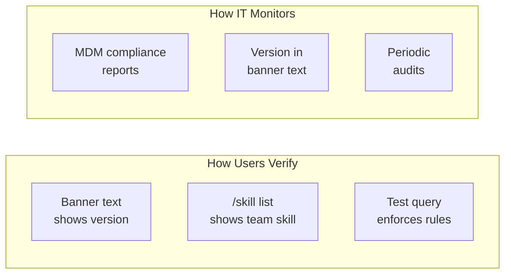

# Distribution Channels

How governance configuration flows from central management to end users.

## Three-Tier Distribution Model

## Channel Selection Guide

## Update Flow

## Air-Gapped / High-Security Environments

## Verification Points

