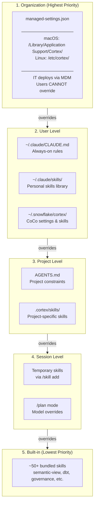
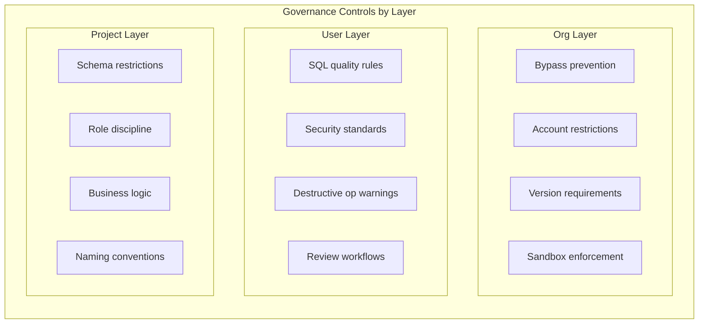
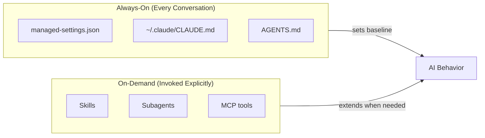

# Governance Hierarchy

Visual representation of how Cortex Code finds and applies governance rules.

## Priority Order (Highest to Lowest)

## What Each Layer Controls

## Always-On vs On-Demand

## Key Insight

**Higher layers can't be overridden by lower layers.**

- A user can't bypass org policy (managed-settings.json)
- A project can't override user standards (~/.claude/CLAUDE.md)
- Session settings don't persist beyond the session

This is intentional: IT can enforce policy without trusting individual users or projects.
