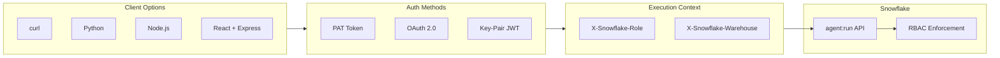

# Agent:Run API with Context

Inspired by the question behind every agent integration: *"How do I call the Cortex Agent API with the right role, warehouse, and auth method for my use case?"*

Working examples of calling `agent:run` with execution context using three authentication methods -- PAT, OAuth, and Key-Pair JWT -- in curl, Python, Node.js, and React. Copy-paste the pattern that matches your stack.

**Author:** SE Community
**Last Updated:** 2026-03-02 | **Expires:** 2026-04-02 | **Status:** ACTIVE

> **No support provided.** This code is for reference only. Review, test, and modify before any production use.

> **Switching from PAT to Key-Pair JWT?** See [`migrate_pat_to_keypair_jwt.md`](migrate_pat_to_keypair_jwt.md) for step-by-step recipes.

---

## The Approach

### Setting Role and Warehouse

Use dedicated HTTP headers on every request:

```python
headers = {
    "Authorization": f"Bearer {token}",
    "Content-Type": "application/json",
    "X-Snowflake-Role": "ANALYST_ROLE",
    "X-Snowflake-Warehouse": "COMPUTE_WH",
}
```

> [!TIP]
> **Pattern demonstrated:** `X-Snowflake-Role` + `X-Snowflake-Warehouse` headers for per-request execution context -- the production pattern for multi-tenant agent calls.

### Authentication Method Comparison

| Method | Best For | Token Lifetime | Extra Header |
|--------|----------|---------------|--------------|
| PAT | Quick testing, dev | Configurable | _(none)_ |
| OAuth | Production apps, SSO | Short-lived + refresh | _(none)_ |
| Key-Pair JWT | Service accounts, CI/CD | 1 hour (auto-refreshed) | `X-Snowflake-Authorization-Token-Type: KEYPAIR_JWT` |

### Files

| File | Description |
|------|-------------|
| `agent_run_with_context.py` | Python example with PAT, OAuth, and Key-Pair JWT |
| `agent_run_keypair_jwt.py` | Standalone Python key-pair JWT example |
| `agent_run_keypair_jwt.js` | Standalone Node.js key-pair JWT example (zero deps) |
| `agent_run_react.md` | React integration guide with three backend proxy patterns |
| `migrate_pat_to_keypair_jwt.md` | Migration recipes for existing projects |

---

## Architecture



---

## Quick Test (curl)

```bash
export SNOWFLAKE_ACCOUNT="myorg-myaccount"
export SNOWFLAKE_PAT="your-personal-access-token"

THREAD_ID=$(curl -s -X POST \
  "https://${SNOWFLAKE_ACCOUNT}.snowflakecomputing.com/api/v2/cortex/threads" \
  -H "Authorization: Bearer ${SNOWFLAKE_PAT}" \
  -H "Content-Type: application/json" \
  -d '{"origin_application": "quick_test"}' | jq -r '.id')

curl -X POST \
  "https://${SNOWFLAKE_ACCOUNT}.snowflakecomputing.com/api/v2/databases/MYDB/schemas/MYSCHEMA/agents/my_agent:run" \
  -H "Authorization: Bearer ${SNOWFLAKE_PAT}" \
  -H "X-Snowflake-Role: ANALYST_ROLE" \
  -H "X-Snowflake-Warehouse: COMPUTE_WH" \
  -H "Content-Type: application/json" \
  -d '{
    "thread_id": "'"$THREAD_ID"'",
    "parent_message_id": 0,
    "messages": [{"role": "user", "content": [{"type": "text", "text": "Top 5 products by revenue?"}]}]
  }' --no-buffer
```

---

<details>
<summary><strong>Troubleshooting</strong></summary>

| Status | Meaning | Fix |
|--------|---------|-----|
| 401 Unauthorized | Invalid or expired token | PAT: verify token. JWT: verify public key assigned, check `X-Snowflake-Authorization-Token-Type` header. |
| 403 Forbidden | Role lacks privileges | Verify USAGE grants on agent, database, schema, warehouse, and semantic views. |
| 404 Not Found | Agent path wrong | Verify `databases/{DB}/schemas/{SCHEMA}/agents/{NAME}`. Check spelling and case. |
| 429 Too Many Requests | Rate limited | Implement exponential backoff. |

</details>

## Related Projects

Three projects in this repo cover Cortex Agent context and multi-tenancy. This guide focuses on the API mechanics.

| | This project | [demo-agent-multicontext](../demo-agent-multicontext/) | [guide-agent-multi-tenant](../guide-agent-multi-tenant/) |
|---|---|---|---|
| **Type** | Code snippet guide | Runnable demo | Architecture guide |
| **API Approach** | Both (with + without agent object) | Without agent object | With agent object |
| **Auth Pattern** | PAT / OAuth / Key-Pair JWT snippets | Simulated user picker | Azure AD + External OAuth |
| **Start here if...** | "I need the API syntax" | "I want to see context injection" | "I'm designing a production app" |

## References

- [Cortex Agents Run API](https://docs.snowflake.com/en/user-guide/snowflake-cortex/cortex-agents-run)
- [Cortex Agents REST API](https://docs.snowflake.com/en/user-guide/snowflake-cortex/cortex-agents-rest-api)
- [Key-Pair Authentication](https://docs.snowflake.com/en/user-guide/key-pair-auth)
- [REST API Authentication](https://docs.snowflake.com/en/developer-guide/sql-api/authenticating)
