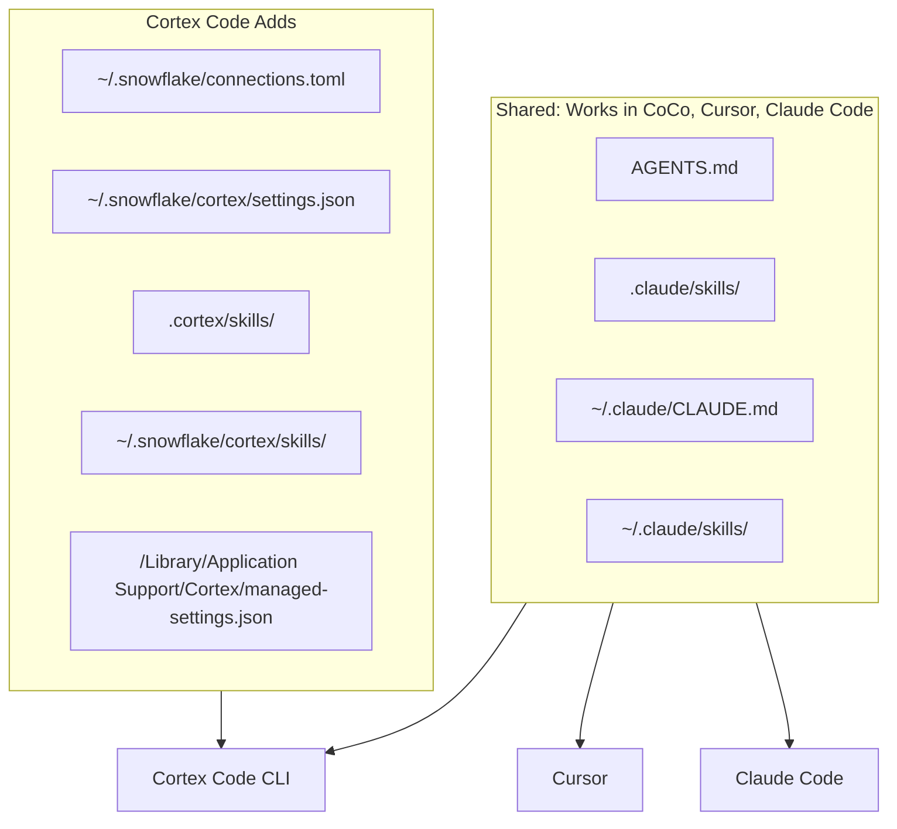

# What Cortex Code Adds to the Claude Code Configuration Model

Cortex Code reads all the same configuration files as Claude Code. For the base model (scopes, CLAUDE.md, skills, managed settings), see [Claude Code Settings](https://docs.anthropic.com/en/docs/claude-code/settings) and [Claude Code Memory](https://docs.anthropic.com/en/docs/claude-code/memory).

This diagram shows the Cortex Code-specific paths that extend the shared model.

Write project guidance in `AGENTS.md` and skills in `.claude/skills/` for cross-tool compatibility. Use `.cortex/` paths only for CoCo-only functionality (Snowflake connections, CoCo settings).
