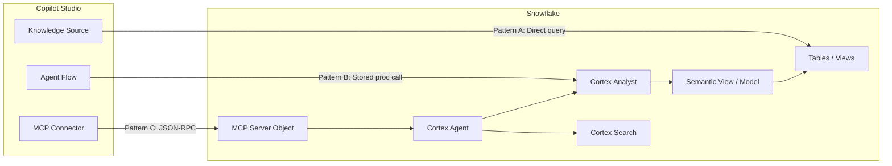
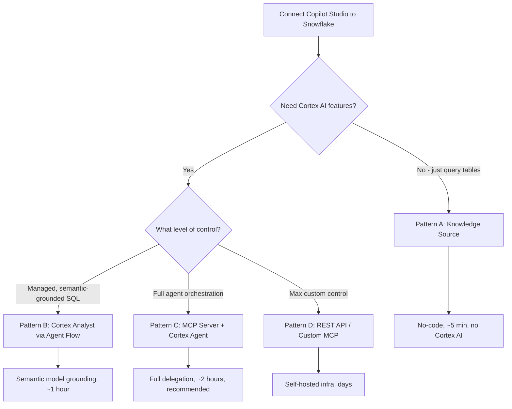

# Connecting Microsoft Copilot Studio to Snowflake: Knowledge, Analyst, and MCP

Four paths from quick-start to full agent delegation — matching your integration pattern to your team's capabilities, governance needs, and Cortex AI requirements.

**Audience:** SEs walking customers through setup + customer IT admins + Power Platform makers
**Created:** 2026-05-12 | **Expires:** 2026-06-11 | **Status:** ACTIVE

> **No support provided.** This content is for reference only. Review and validate before applying to any production workflow.

---

## Architecture Overview

---

## Decision Framework

### Two Questions, Four Patterns

| # | Pattern | Delegation | Setup Time | Cortex AI | Auth |
|---|---------|-----------|------------|-----------|------|
| A | [Knowledge Source](knowledge-source.md) | None (Copilot generates SQL) | ~5 min | No | Entra ID Service Principal |
| B | [Cortex Analyst via Agent Flow](cortex-analyst-connector.md) | Partial (Snowflake generates SQL) | ~1 hour | Analyst only | Entra ID External OAuth |
| C | [MCP Server + Cortex Agent](mcp-server.md) | Full (Snowflake Agent orchestrates) | ~2 hours | Full (Analyst + Search + custom) | Snowflake OAuth via MCP |
| D | REST API / Custom MCP | Full (max control) | Days | Full | Custom (PAT or OAuth) |

**Recommendation:** Start with Pattern A to prove connectivity, then graduate to Pattern C for production. Pattern B is the stepping stone if MCP isn't available yet.

---

## Why Delegation Matters: Real Evaluation Data

From a [30-question evaluation](https://blog.mwccomms.com/2026/04/connecting-copilot-studio-to-snowflake.html) across all three primary patterns on a football ticketing dataset:

| Pattern | Success Rate | 422 Errors | Failure Mode |
|---------|-------------|------------|--------------|
| A: Copilot generates SQL | 54% (16/30) | 14 | Schema hallucination — wrong tables, columns, joins |
| B: Cortex Analyst | 64% (19/30) | 1 | Accuracy — query runs but answer doesn't match intent |
| C: Cortex Agent | 67% (20/30) | 0 | Accuracy — same class as B, better on ambiguous prompts |

The semantic model eliminated 93% of structural errors (14 down to 1). The Cortex Agent eliminated them entirely. Both B and C share the same semantic model — invest once, graduate up.

---

## Governance Comparison

| Layer | Pattern A | Pattern B | Pattern C |
|-------|-----------|-----------|-----------|
| **Authentication** | Entra Service Principal (External OAuth) | Same | Snowflake OAuth (via MCP connector) |
| **Identity** | Mapped to Snowflake user via `sub` claim | Same | OAuth token-bound per session |
| **Data visibility** | Full table access (role-gated) | Semantic model boundary | Semantic View + Agent Tool List |
| **SQL generation** | Copilot (ungrounded) | Cortex Analyst (grounded in semantic model) | Cortex Agent (orchestrated) |
| **Operation control** | Read-only (SELECT via connector) | Read-only (Analyst generates SELECT only) | Agent Tool List (omit execute_sql = structurally read-only) |
| **Multi-tool reasoning** | No | No (single-shot) | Yes (Analyst + Search + custom tools) |
| **Audit** | Power Platform audit logs | Same + Snowflake query history | Same + Agent execution traces |

---

## Detailed Guides

| | |
|---|---|
| **[Pattern A: Knowledge Source](knowledge-source.md)** | No-code quick start. Copilot queries Snowflake tables directly. Best for demos and simple analytics. |
| **[Pattern B: Cortex Analyst via Agent Flow](cortex-analyst-connector.md)** | Semantic-model grounded SQL. Power Automate Agent Flow calls Cortex Analyst via stored procedure. |
| **[Pattern C: MCP Server + Cortex Agent](mcp-server.md)** | Full delegation. Copilot calls Snowflake MCP Server which routes to a Cortex Agent. Recommended for production. |

---

## Shared Prerequisites

All patterns require:
- Snowflake account with ACCOUNTADMIN (for security integrations) and SYSADMIN (for objects)
- Microsoft Entra ID tenant with App Registration permissions
- Microsoft Copilot Studio environment (Sandbox or Production)
- Power Platform Admin Center access (to verify connector policies)

---

## Related Projects

- [`guide-connecting-claude-snowflake`](../guide-connecting-claude-snowflake/) — Same concept for Claude Desktop / Claude Code
- [`guide-mcp-auth`](../guide-mcp-auth/) — Comprehensive MCP auth for all AI clients (Cursor, VS Code, Windsurf)
- [`guide-agent-hardening`](../guide-agent-hardening/) — Agent governance: RBAC, monitoring, cost controls

## External References

- [Snowflake MCP Server Documentation](https://docs.snowflake.com/en/user-guide/snowflake-cortex/cortex-agents-mcp)
- [Getting Started with Copilot Studio and Cortex Agents (Quickstart)](https://www.snowflake.com/en/developers/guides/getting-started-with-microsoft-copilot-studio-and-cortex-agents/)
- [4 Ways to Connect Snowflake to Copilot Studio (Matt Massey)](https://medium.com/snowflake/the-ultimate-guide-for-connecting-snowflake-to-copilot-studio-which-pattern-fits-53157e790f43)
- [Copilot Studio to Snowflake: Architecture Comparison (Jeff Baart)](https://blog.mwccomms.com/2026/04/connecting-copilot-studio-to-snowflake.html)
- [Integrating Copilot Studio with Cortex via MCP (Shankar Narayanan)](https://medium.com/snowflake/integrating-microsoft-copilot-studio-agents-with-snowflake-cortex-using-mcp-17c9998a4acf)
- [Connecting Snowflake to Copilot Studio (Microsoft CAT Blog)](https://microsoft.github.io/mcscatblog/posts/connecting-snfl-to-mcs/)
- [Add Snowflake as Knowledge Source (MS Learn)](https://learn.microsoft.com/en-us/power-platform/release-plan/2025wave1/microsoft-copilot-studio/add-snowflake-as-knowledge-source)
- [Snowflake Connector for Power Platform](https://docs.snowflake.com/en/connectors/microsoft/powerapps/about)
- [Custom Headers in MCP Connectors (Microsoft CAT Blog)](https://microsoft.github.io/mcscatblog/posts/mcp-custom-headers/)
- [Copilot Studio MCP Documentation (MS Learn)](https://learn.microsoft.com/en-us/microsoft-copilot-studio/agent-extend-action-mcp)
