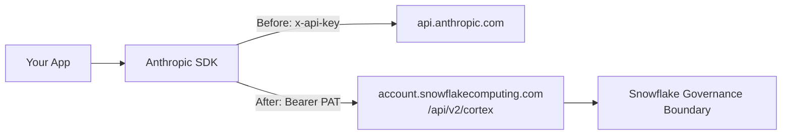
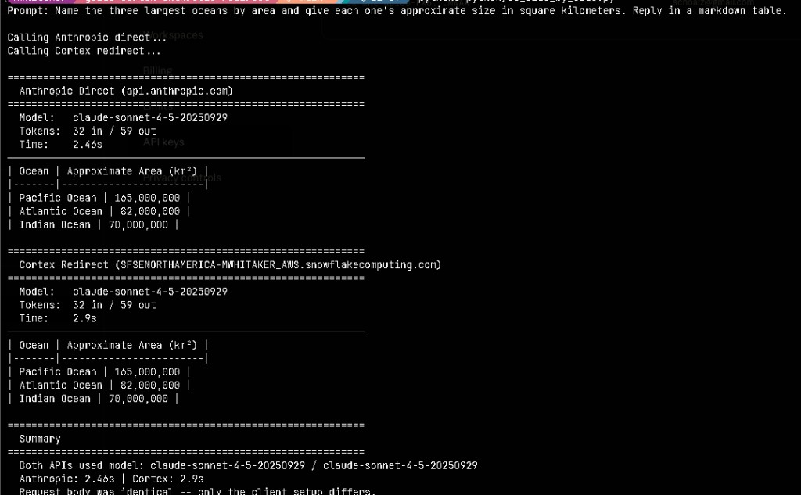
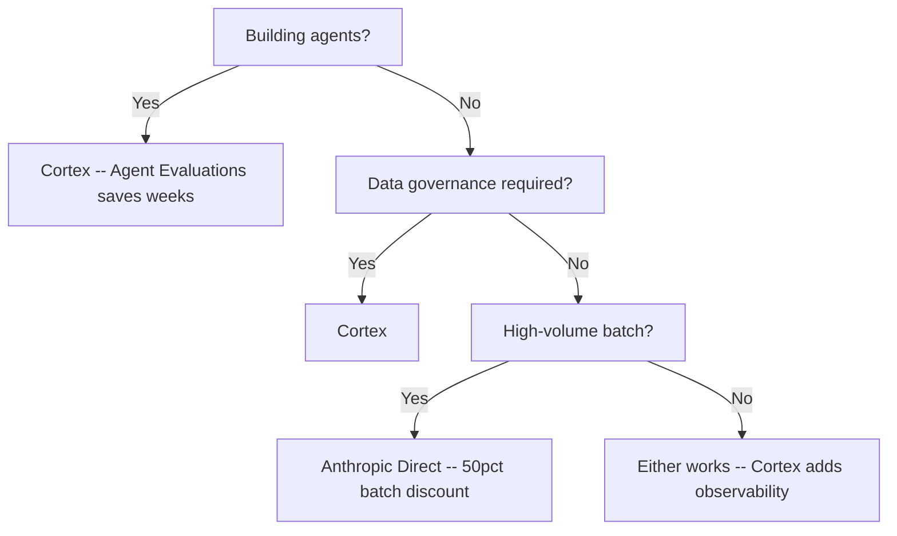

# Cortex Anthropic API Redirect Guide

Inspired by a real customer question: *"Can I route my existing Anthropic SDK calls through Snowflake so the data never leaves our governance boundary -- without rewriting my code?"*

Change **3 lines** of SDK configuration and your existing `client.messages.create(...)` calls, streaming, and tool calling all route through Cortex instead -- same request body, same response format, same model names.

**Pair-programmed by:** SE Community + Cortex Code
**Created:** 2026-03-17 | **Expires:** 2026-04-16 | **Status:** ACTIVE

**Time:** ~15 minutes | **Result:** Existing Anthropic code running through Snowflake Cortex

> [!CAUTION]
> **No support provided.** This code is for reference only. Review, test, and modify before any production use.

> **FinOps Journey (1 of 4):** This guide is the starting point. After redirecting your Anthropic calls through Cortex, monitor AI function spend with [tool-ai-spend-controls](../tool-ai-spend-controls/), control Cortex Code costs with [tool-code-spend-controls](../tool-code-spend-controls/), and optimize query-level costs with [guide-query-tuning](../guide-query-tuning/).

## Who This Is For

Anyone with existing Anthropic API code who wants to route it through Snowflake Cortex for data governance, unified billing, or multi-model access. You need a Snowflake account and an Anthropic API key.

**Already decided to migrate?** Jump to [Quick Start](#quick-start).
**Evaluating whether to migrate?** Start with [When to Use Which](#when-to-use-which).

---

## In This Guide

| | Section | What You'll Find |
|---|---------|-----------------|
| 1 | [The 3-Line Change](#the-3-line-change) | The code diff -- what changes and what stays the same |
| 2 | [Quick Start](#quick-start) | Install and run in 5 minutes |
| 3 | [When to Use Which](#when-to-use-which) | Decision tree: Cortex vs Anthropic Direct |
| 4 | [Total Cost of Ownership](#total-cost-of-ownership) | Hidden costs on both sides |
| 5 | [Agent Workloads](#agent-workloads) | Why Cortex wins for agents ($20-50K eval gap) |
| 6 | [Feature Compatibility](#feature-compatibility) | What works through Cortex |
| 7 | [Prerequisites](#prerequisites) | Credentials and access setup |
| 8 | [Production Auth](#production-auth-key-pair-jwt) | Key-pair JWT for service accounts and CI/CD |
| 9 | [Claude Code](#claude-code) | Redirect Claude Code's API traffic through Cortex |
| 10 | [Scripts](#scripts----learning-path) | All runnable examples, organized as a progression |

---

## The 3-Line Change

**Before** (Anthropic direct):
```python
import anthropic

client = anthropic.Anthropic()  # uses ANTHROPIC_API_KEY
```

**After** (Cortex redirect):
```python
import anthropic, httpx, os

PAT = os.environ["SNOWFLAKE_PAT"]
ACCOUNT = os.environ["SNOWFLAKE_ACCOUNT"]

client = anthropic.Anthropic(
    api_key="not-used",  # pragma: allowlist secret
    base_url=f"https://{ACCOUNT}.snowflakecomputing.com/api/v2/cortex",
    http_client=httpx.Client(headers={"Authorization": f"Bearer {PAT}"}),
    default_headers={"Authorization": f"Bearer {PAT}"},
)
```

Everything after client creation is identical -- `client.messages.create(...)`, streaming, tool calling, all of it.

### What Changes (and What Doesn't)

| | Anthropic Direct | Cortex Redirect |
|---|---|---|
| **Endpoint** | `api.anthropic.com` | `<account>.snowflakecomputing.com/api/v2/cortex` |
| **Auth** | `x-api-key` header (API key) | `Authorization: Bearer` (Snowflake PAT) |
| **SDK `api_key`** | Your Anthropic key | `"not-used"` (required but ignored) |
| **Request body** | _unchanged_ | _unchanged_ |
| **Model names** | _unchanged_ (e.g., `claude-sonnet-4-5`) | _unchanged_ |
| **Response format** | _unchanged_ | _unchanged_ |
| **Streaming** | _unchanged_ | _unchanged_ |
| **Tool calling** | _unchanged_ | _unchanged_ |



---

## Quick Start

**Get just this guide:**
```bash
bash <(curl -sL https://raw.githubusercontent.com/sfc-gh-miwhitaker/sfe-public/main/shared/get-project.sh) guide-cortex-anthropic-redirect
cd sfe-public/guide-cortex-anthropic-redirect
```

**Install and run:**
```bash
python3 -m venv .venv
source .venv/bin/activate
pip3 install -r requirements.txt
cp .env.example .env   # fill in your credentials
source .env

# 1. Verify Anthropic direct access
python3 python/01_anthropic_direct.py

# 2. Verify Cortex redirect
python3 python/02_cortex_redirect.py

# 3. Run side-by-side comparison (the key demo)
python3 python/03_side_by_side.py
```

> [!TIP]
> Script `03_side_by_side.py` is the best one for live demos -- it runs the same prompt through both APIs and shows timing side by side.



> [!IMPORTANT]
> Need help with credentials? See [Prerequisites](#prerequisites) for step-by-step setup of your Anthropic key, Snowflake account, and PAT.

---

## When to Use Which

This guide shows _how_ to redirect -- but _should_ you? Here's a fair comparison.

### Anthropic Direct Wins

| Scenario | Why |
|----------|-----|
| **High-volume batch processing** | 50% discount via [Batch API](https://docs.anthropic.com/en/docs/build-with-claude/batch-processing) (async, 24h turnaround) |
| **Aggressive caching** | 90% discount on prompt cache hits (vs 5-min or 1-hour TTL on Cortex) |
| **Cost-only optimization** | Lower per-token rates when governance isn't a constraint |

### Cortex Wins

| Scenario | Why |
|----------|-----|
| **Data governance required** | Inference runs within Snowflake -- data never leaves your perimeter |
| **Agent workloads** | Built-in [Agent Evaluations](https://docs.snowflake.com/en/user-guide/snowflake-cortex/cortex-agents-evaluations) for systematic testing |
| **Unified billing** | LLM costs appear on your Snowflake bill (REST API billed in USD/token; SQL functions in credits) |
| **Multi-model access** | Claude via Messages API (this guide); GPT, Llama, Mistral, DeepSeek via [Chat Completions API](https://docs.snowflake.com/en/user-guide/snowflake-cortex/cortex-rest-api) with OpenAI SDK |
| **No model API keys** | Just Snowflake auth (PAT or key-pair JWT) in production |
| **Cost controls** | Native per-user spend limits and budget alerts via [ACCOUNT_USAGE](https://docs.snowflake.com/en/user-guide/snowflake-cortex/ai-func-cost-management) |

### Quick Decision Tree



---

## Total Cost of Ownership

Token pricing tells only part of the story. Consider these secondary costs:

### What Cortex Includes (No Extra Build)

| Capability | Anthropic Direct | Cortex |
|------------|------------------|--------|
| Data residency compliance | Build yourself | Built-in |
| Audit trail | Build yourself | [ACCOUNT_USAGE views](https://docs.snowflake.com/en/sql-reference/account-usage/cortex_functions_usage_history) |
| Per-user spend tracking | Build yourself | Native |
| Budget alerts | Build yourself | Native (alerts + tasks) |
| Cost attribution by query | Build yourself | Query-level tracking |

<details>
<summary><strong>Anthropic Direct -- Hidden Costs</strong></summary>

| Cost Category | What You Build/Pay For |
|---------------|------------------------|
| API key management | Rotation, secrets vaults, access control |
| Data egress | Cloud provider fees when data leaves your VPC |
| Compliance overhead | Auditing data that crosses security boundaries |
| Billing reconciliation | Separate vendor invoice vs unified Snowflake bill |
| Rate limit engineering | Backoff logic, queue management, retry handling |
| Cost attribution | Custom tagging to track spend by team/project |

</details>

<details>
<summary><strong>Cortex -- Hidden Costs</strong></summary>

| Cost Category | What You Pay For |
|---------------|------------------|
| Fixed token pricing | REST API rates are USD-per-token (not credit-based), so no contract discount applies |
| No batch discount | Full price for async workloads |
| Provisioned throughput | Optional reserved capacity (PTUs) for guaranteed throughput; billed monthly whether used or not ([docs](https://docs.snowflake.com/en/user-guide/snowflake-cortex/provisioned-throughput)) |
| Migration effort | One-time: adapting existing Anthropic code |

</details>

---

## Agent Workloads

If you're building agents (not just simple completions), Cortex has a significant advantage: **[Cortex Agent Evaluations](https://docs.snowflake.com/en/user-guide/snowflake-cortex/cortex-agents-evaluations)**.

### What Agent Evaluations Provides

- **Tool selection accuracy** -- Did the agent pick the right tools?
- **Tool execution accuracy** -- Did inputs/outputs match expectations?
- **Answer correctness** -- Does the response match the expected answer?
- **Logical consistency** -- Is reasoning coherent across the trace?
- **Custom LLM judges** -- Define domain-specific scoring criteria
- **Deep observability** -- Thread and trace-level debugging

Snowflake's research shows these built-in metrics capture **95% of human-annotated errors** and localize them to specific trace spans with **86% accuracy**.

The evaluation framework doesn't just measure quality -- it improves it by surfacing exactly where reasoning breaks down.

<details>
<summary><strong>The Evaluation Gap -- What It Costs to Build This Yourself</strong></summary>

| Component | Estimated Effort |
|-----------|------------------|
| Evaluation framework | 2-4 weeks engineering |
| LLM judge infrastructure | $500-2K/month (judge model calls) |
| Trace storage & debugging UI | 1-2 weeks + hosting |
| Custom metric framework | 1 week |
| **Total** | **$20K-50K+ to replicate** |

</details>

---

## Feature Compatibility

All features below work identically through Cortex (Claude models only):

| Feature | Supported | Notes |
|---------|-----------|-------|
| Text completion | Yes | Same request/response format |
| Streaming | Yes | SSE with `client.messages.stream()` |
| Tool calling | Yes | Identical tool definitions and responses |
| Structured output | Yes | Via `tool_use` pattern |
| Prompt caching | Yes | `cache_control` with 5-minute or 1-hour TTL (ephemeral type only) |
| Image input | Yes | Base64 source blocks |
| Extended thinking | Yes | `thinking` parameter with `type: "adaptive"` |
| Beta features | Yes | Via `anthropic-beta` header |
| Multi-turn conversations | Yes | Same message array format |

For non-Claude models (OpenAI, Llama, Mistral, DeepSeek), use the Cortex Chat Completions API with the OpenAI SDK instead.

---

## Prerequisites

All credentials go in your `.env` file (copied from `.env.example` during Quick Start).

### 1. Anthropic API Key

You already have this. Add it to `.env`:
```
ANTHROPIC_API_KEY=sk-ant-api03-...
```

### 2. Snowflake Account Identifier

Your Snowflake account identifier (e.g., `myorg-myaccount`). Add it to `.env`:
```
SNOWFLAKE_ACCOUNT=myorg-myaccount
```

### 3. Snowflake Programmatic Access Token (PAT)

Create a PAT in Snowsight or SQL:

**Option A -- Snowsight UI:**
1. Click your name (bottom-left) -> My Profile
2. Under "Programmatic access tokens", click **Generate**
3. Name it, set an expiration, select your default role
4. Copy the token value (shown only once)

**Option B -- SQL:**
```sql
ALTER USER my_user ADD PROGRAMMATIC ACCESS TOKEN cortex_api_demo
  ROLE_RESTRICTION = 'PUBLIC'
  DAYS_TO_EXPIRY = 30
  COMMENT = 'Cortex Anthropic redirect guide';
```

> [!NOTE]
> `ROLE_RESTRICTION` is required when targeting a service user (`TYPE = SERVICE`). For person users it is optional but recommended to enforce least-privilege.
Copy the `token_secret` value from the result (shown only once -- no way to retrieve it later).

Add it to `.env`:
```
SNOWFLAKE_PAT=ver:1:...
```

> [!IMPORTANT]
> After updating `.env`, re-source it: `source .env`

### 4. Verify Cortex Access

Your default role must have the `SNOWFLAKE.CORTEX_USER` database role (granted to PUBLIC by default). As of April 2026, the more granular `SNOWFLAKE.AI_FUNCTIONS_USER` role is also available for restricting access to AI functions specifically:
```sql
SELECT CURRENT_ROLE();
-- If needed: GRANT DATABASE ROLE SNOWFLAKE.CORTEX_USER TO ROLE my_role;
-- For granular AI function access only: GRANT DATABASE ROLE SNOWFLAKE.AI_FUNCTIONS_USER TO ROLE my_role;
```

---

<details>
<summary><h2>Production Auth: Key-Pair JWT</h2></summary>

PAT is great for testing. For production, service accounts, and CI/CD, use key-pair JWT:

| Scenario | PAT | Key-Pair JWT |
|----------|-----|-------------|
| Quick testing and dev | Recommended | Works |
| Service accounts (no human login) | Not ideal | Recommended |
| CI/CD pipelines | Requires token rotation | Recommended |
| No-password security policies | May not comply | Compliant |
| Long-running backend services | Token may expire | Auto-refreshed (1h, cached) |

### One-Time Setup

```bash
# 1. Generate RSA key pair
openssl genrsa -out rsa_key.pem 2048
openssl rsa -in rsa_key.pem -pubout -out rsa_key.pub

# 2. Get public key content (strip header/footer)
grep -v "BEGIN\|END" rsa_key.pub | tr -d '\n'

# 3. Assign to Snowflake user (run as ACCOUNTADMIN in Snowsight)
# ALTER USER MY_SERVICE_USER SET RSA_PUBLIC_KEY='MIIBIjANBgkqhki...';
```

### Set Environment Variables

Uncomment and fill in the key-pair variables in your `.env`:
```
SNOWFLAKE_USER=MY_SERVICE_USER
SNOWFLAKE_PRIVATE_KEY_PATH=./rsa_key.pem
```

Then re-source: `source .env`

### Run It

```bash
python3 python/06_keypair_auth.py
```

### The Code

The helper module `python/snowflake_auth.py` builds either client type:

```python
from snowflake_auth import build_cortex_client_keypair

client = build_cortex_client_keypair()

# Same API from here on -- identical to PAT
response = client.messages.create(
    model="claude-sonnet-4-5",
    max_tokens=1024,
    messages=[{"role": "user", "content": "Hello from key-pair JWT!"}],
)
```

The only difference from PAT auth: the `Authorization` header carries a signed JWT, and `X-Snowflake-Authorization-Token-Type: KEYPAIR_JWT` is added. The helper handles JWT generation, caching, and auto-refresh.

</details>

---

## Claude Code

[Claude Code](https://docs.anthropic.com/en/docs/claude-code/overview) uses the same Anthropic Messages API under the hood, so it redirects to Cortex the same way -- through environment variables instead of SDK constructor args.

### The 2-Variable Change

**Before** (Anthropic direct -- default):
```bash
# Claude Code talks to api.anthropic.com using your Anthropic subscription
claude
```

**After** (Cortex redirect):
```bash
export ANTHROPIC_BASE_URL="https://<account>.snowflakecomputing.com/api/v2/cortex"
export ANTHROPIC_AUTH_TOKEN="<your-snowflake-PAT>"
claude
```

That's it. Claude Code appends `/v1/messages` to the base URL automatically, which maps to Cortex's Messages API endpoint. The `ANTHROPIC_AUTH_TOKEN` value is sent as the `Authorization: Bearer` header -- exactly what Snowflake expects.

### PAT Auth (Quick Start)

Set two environment variables and launch:

```bash
export ANTHROPIC_BASE_URL="https://${SNOWFLAKE_ACCOUNT}.snowflakecomputing.com/api/v2/cortex"
export ANTHROPIC_AUTH_TOKEN="${SNOWFLAKE_PAT}"
claude
```

Or persist them in Claude Code's settings file (`~/.claude/settings.json`), substituting your actual values:

```json
{
  "env": {
    "ANTHROPIC_BASE_URL": "https://<account>.snowflakecomputing.com/api/v2/cortex",
    "ANTHROPIC_AUTH_TOKEN": "<your-snowflake-PAT>"
  }
}
```

> [!TIP]
> Don't have a PAT yet? See [Prerequisites](#prerequisites) above for step-by-step creation.

### Key-Pair JWT Auth (Production)

PATs expire and require manual rotation. For long-running or team-wide setups, use Claude Code's `apiKeyHelper` to generate key-pair JWTs on demand.

**1. Set environment variables** (or add to `settings.json` under `"env"`):

```bash
export ANTHROPIC_BASE_URL="https://${SNOWFLAKE_ACCOUNT}.snowflakecomputing.com/api/v2/cortex"
export ANTHROPIC_CUSTOM_HEADERS="X-Snowflake-Authorization-Token-Type: KEYPAIR_JWT"
export SNOWFLAKE_ACCOUNT=<account>
export SNOWFLAKE_USER=MY_SERVICE_USER
export SNOWFLAKE_PRIVATE_KEY_PATH=./rsa_key.pem
export CLAUDE_CODE_API_KEY_HELPER_TTL_MS=3300000
```

**2. Configure the API key helper** in `~/.claude/settings.json`:

```json
{
  "apiKeyHelper": "/path/to/guide-cortex-anthropic-redirect/claude-code-jwt-helper.sh"
}
```

**3. Launch Claude Code** -- the helper script generates a fresh JWT automatically, and Claude Code refreshes it every ~55 minutes (before the 1-hour expiry):

```bash
claude
```

The helper script ([`claude-code-jwt-helper.sh`](claude-code-jwt-helper.sh)) calls the same `snowflake_auth.py` module used by the Python examples. See [Production Auth](#production-auth-key-pair-jwt) above for one-time key-pair setup.

### Known Limitations

| Consideration | Detail |
|---------------|--------|
| **MCP tool search** | Disabled by default when `ANTHROPIC_BASE_URL` points to a non-Anthropic host. Re-enable with `ENABLE_TOOL_SEARCH=true` if needed ([docs](https://docs.anthropic.com/en/docs/claude-code/mcp)) |
| **Token counting** | Cortex does not expose `/v1/messages/count_tokens`, so Claude Code's token-counting features may be unavailable |
| **Claude models only** | The Cortex Messages API serves Claude models; other models require the Chat Completions API |
| **Beta headers** | If Cortex rejects unknown `anthropic-beta` header values, set `CLAUDE_CODE_DISABLE_EXPERIMENTAL_BETAS=1` |

### Claude Code Documentation

These Anthropic docs cover the full environment variable and gateway configuration:

- [Environment variables reference](https://docs.anthropic.com/en/docs/claude-code/settings) -- all env vars Claude Code supports
- [LLM gateway configuration](https://docs.anthropic.com/en/docs/claude-code/llm-gateway) -- gateway requirements, `apiKeyHelper`, and model selection
- [Enterprise network configuration](https://docs.anthropic.com/en/docs/claude-code/corporate-proxy) -- proxy, custom CA, and mTLS setup

---

## Scripts -- Learning Path

Start with verification, then explore features:

### Verify

| Script | What You'll See |
|--------|-----------------|
| [`01_anthropic_direct.py`](python/01_anthropic_direct.py) | Baseline: confirm your Anthropic key works |
| [`02_cortex_redirect.py`](python/02_cortex_redirect.py) | Same call via Cortex (3 changes highlighted) |

### Compare

| Script | What You'll See |
|--------|-----------------|
| [`03_side_by_side.py`](python/03_side_by_side.py) | Both APIs, same prompt, side-by-side with timing |

### Explore

| Script | What You'll See |
|--------|-----------------|
| [`04_streaming.py`](python/04_streaming.py) | Streaming token-by-token from both APIs |
| [`05_tool_calling.py`](python/05_tool_calling.py) | Tool calling with identical tool definitions |

### Production

| Script | What You'll See |
|--------|-----------------|
| [`06_keypair_auth.py`](python/06_keypair_auth.py) | Key-pair JWT auth for service accounts |
| [`snowflake_auth.py`](python/snowflake_auth.py) | Shared helper: builds Cortex client (PAT or key-pair) |
| [`claude-code-jwt-helper.sh`](claude-code-jwt-helper.sh) | JWT helper for Claude Code's `apiKeyHelper` |
| [`curl_examples.sh`](curl_examples.sh) | Raw curl for both APIs |

---

## Development Tools

This project is designed for AI-pair development.

- **AGENTS.md** -- Project instructions for Cortex Code and compatible AI tools
- **.claude/skills/** -- Project-specific AI skill teaching the AI this project's patterns
- **Cortex Code in Snowsight** -- Open in a Workspace for AI-assisted development
- **Cursor** -- Open locally for AI-pair coding

> [!TIP]
> New to AI-pair development? See [Cortex Code docs](https://docs.snowflake.com/en/user-guide/cortex-code/cortex-code)

## Learn More

- [Cortex REST API docs](https://docs.snowflake.com/en/user-guide/snowflake-cortex/cortex-rest-api)
- [Programmatic Access Tokens](https://docs.snowflake.com/en/user-guide/programmatic-access-tokens)
- [Key-Pair Authentication](https://docs.snowflake.com/en/user-guide/key-pair-auth)
- [Anthropic Messages API reference](https://docs.anthropic.com/en/api/messages)
- [PAT to Key-Pair JWT Migration](../_archive/guide-api-agent-context/migrate_pat_to_keypair_jwt.md) -- detailed recipes for Node.js, Python, and curl
