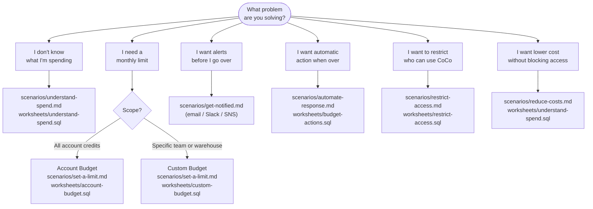

# Cortex Code — Budget & Cost Control Guide

**Pair-programmed by SE Community + Cortex Code**
**Created:** 2026-04-06 | **Expires:** 2026-07-06 | **Status:** ACTIVE

Scenario runbooks and Snowsight SQL worksheets for every Snowflake-native lever
for controlling Cortex Code spend — from understanding your bill to automating
responses when you approach a limit.

> **No support provided.** Reference only. Review and validate before applying to any production workflow.

---

## Which scenario describes you?



---

## Who This Is For

- **FinOps / account admins** setting up spend guardrails before rolling out Cortex Code broadly
- **SE teams** demonstrating cost governance to customers evaluating Cortex Code
- **Team leads** who want per-team budgets, threshold alerts, and automated responses

---

## Prerequisites

- `ACCOUNTADMIN` role (or a role with `SNOWFLAKE.BUDGET_ADMIN`) for budget setup
- `IMPORTED PRIVILEGES ON DATABASE SNOWFLAKE` to query `ACCOUNT_USAGE` views
- At least some Cortex Code usage to monitor (CLI or Snowsight)

---

## Scenario Runbooks

Each runbook is a self-contained playbook for one goal. Start with the one that matches your situation.

| Scenario | Goal | Runbook | Worksheet |
|----------|------|---------|-----------|
| Understand spend | See totals, users, models, and projections | [understand-spend.md](scenarios/understand-spend.md) | [understand-spend.sql](worksheets/understand-spend.sql) |
| Set a limit | Monthly credit cap with alert-on-threshold | [set-a-limit.md](scenarios/set-a-limit.md) | [account-budget.sql](worksheets/account-budget.sql) · [custom-budget.sql](worksheets/custom-budget.sql) |
| Get notified | Email, Slack, Teams, or SNS before you go over | [get-notified.md](scenarios/get-notified.md) | [monitoring.sql](worksheets/monitoring.sql) |
| Automate a response | Resize or suspend a warehouse automatically | [automate-response.md](scenarios/automate-response.md) | [budget-actions.sql](worksheets/budget-actions.sql) |
| Restrict access | Control who can use Cortex Code via RBAC | [restrict-access.md](scenarios/restrict-access.md) | [restrict-access.sql](worksheets/restrict-access.sql) |
| Reduce costs | Lower spend without blocking users | [reduce-costs.md](scenarios/reduce-costs.md) | [understand-spend.sql](worksheets/understand-spend.sql) |

---

## SQL Worksheets

Snowsight-ready worksheets with inline decision guidance. Paste the full file into a worksheet and run sections individually.

| Worksheet | What it covers |
|-----------|---------------|
| [`worksheets/understand-spend.sql`](worksheets/understand-spend.sql) | Daily trend, top users, model breakdown, cache efficiency, EOM projection |
| [`worksheets/account-budget.sql`](worksheets/account-budget.sql) | Activate, set limit, email/Slack notification, AI_SERVICES spend history |
| [`worksheets/custom-budget.sql`](worksheets/custom-budget.sql) | Create, ADD_RESOURCE vs ADD_RESOURCE_TAG, notifications, inspect, drop |
| [`worksheets/budget-actions.sql`](worksheets/budget-actions.sql) | Action procedures (PROJECTED / ACTUAL / CYCLE_START), register, telemetry |
| [`worksheets/restrict-access.sql`](worksheets/restrict-access.sql) | CORTEX_USER grants, network policy, unused-access audit |
| [`worksheets/monitoring.sql`](worksheets/monitoring.sql) | Budget health, at-risk detection, WoW trend, telemetry events, debug checklist |

---

## Cost Control Levers at a Glance

| Lever | Enforcement | Setup Time | Best For |
|-------|-------------|------------|----------|
| Model selection | Guidance / settings.json | 2 min | Lowest effort, highest leverage |
| Account budget | Alert-only | 5 min | Simple account-wide cap + AI credit visibility |
| Custom budget | Alert + automated actions | 15 min | Per-team or per-project tracking |
| Automated actions | Configured stored proc | 15 min | Hands-off enforcement |
| RBAC (CORTEX_USER) | Hard enforcement | 5 min | Block specific users or roles |
| Network policy | Hard enforcement | 5 min | Restrict by IP range |

---

## How to Use This Guide

**With CoCo (recommended):**

```
Walk me through the "set a limit" scenario in the Cortex Code budget guide.
```

CoCo will read the runbook, guide you step by step, and verify each piece of SQL as you go.

**Self-guided:**

1. Use the decision tree above to identify your scenario.
2. Open the scenario runbook in `scenarios/` for step-by-step instructions.
3. Paste the matching worksheet from `worksheets/` into Snowsight for ad-hoc analysis and setup.

---

## Related

- **[tool-cortex-code-costs](../tool-cortex-code-costs/)** — Interactive Streamlit dashboard and notebook for live usage analysis (includes a Governance tab with the same SQL snippets)
- **[Snowflake Budgets docs](https://docs.snowflake.com/en/user-guide/budgets)** — Official reference
- **[Service Consumption Table, Table 6(e)](https://www.snowflake.com/legal-files/CreditConsumptionTable.pdf)** — Official Cortex Code pricing (effective April 1, 2026)
