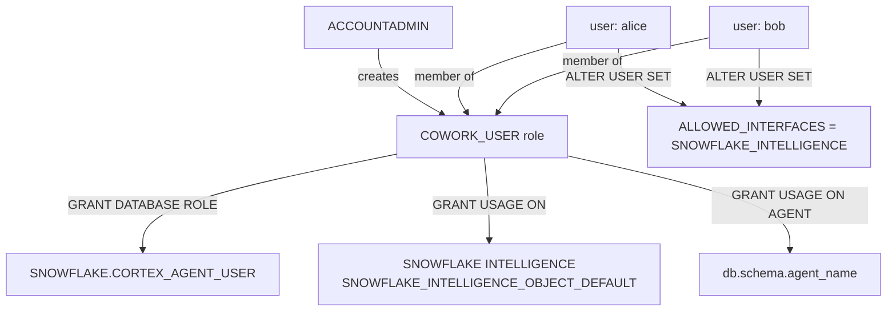

# Snowflake CoWork — Admin Provisioning Guide

Admin runbook for giving a group of new users access to **only** Snowflake CoWork — the AI assistant interface — without broader Snowflake or Snowsight access.

**Audience:** Snowflake account admins provisioning CoWork-only user cohorts
Pair-programmed by SE Community + Cortex Code
**Created:** 2026-06-22 | **Expires:** 2026-07-22 | **Status:** ACTIVE

> **No support provided.** Reference only; validate before production.

> **`SNOWFLAKE_INTELLIGENCE` in SQL is correct, not outdated.** The product was renamed from "Snowflake Intelligence" to "Snowflake CoWork" but the SQL DDL identifiers have not been updated to match. Every occurrence of `SNOWFLAKE_INTELLIGENCE` in this guide — in `ALLOWED_INTERFACES`, `CREATE SNOWFLAKE INTELLIGENCE`, `GRANT USAGE ON SNOWFLAKE INTELLIGENCE`, etc. — is the current required syntax as of the documentation date.

---

## Quick Start

Three things every CoWork-only user needs:

| Requirement | Why |
|---|---|
| `COWORK_USER` role with `SNOWFLAKE.CORTEX_AGENT_USER` database role | Access to the Cortex Agents API (CoWork) and nothing else |
| USAGE on the CoWork object + each agent they'll use | Controls which agents appear in their CoWork session |
| `ALLOWED_INTERFACES = (SNOWFLAKE_INTELLIGENCE)` on each user | Blocks Snowsight — CoWork interface only |

One-liner to check if your account already has a CoWork object:

```sql
SHOW SNOWFLAKE INTELLIGENCES;
```

If that returns a row — proceed to [Step 2](#step-2-create-the-role). If empty — start at [Step 1](#step-1-create-the-cowork-object-one-time-per-account).

Jump to:
- [Single user provisioning](#step-3-single-user-provisioning)
- [Bulk provisioning](#step-4-bulk-provisioning)
- [Verification checklist](#step-5-verification-checklist)
- [Removing access](#removing-cowork-access)

---

## How CoWork Access Works

> **There is no native "CoWork-only" user type.** This is a three-part workaround: a restricted database role, a per-user interface lock, and a curated agent list. Each part is independently revocable and must be maintained separately. If any one of them is missing or reverted, users get more access than intended — silently.

Grant `SNOWFLAKE.CORTEX_AGENT_USER` (Cortex Agents API only). Do **not** grant `SNOWFLAKE.CORTEX_USER` — that opens the full Cortex feature set. See [Cortex privilege breakdown](https://docs.snowflake.com/en/user-guide/snowflake-cortex/llm-functions#required-privileges) for the full role comparison.

### Optional: revoke broad Cortex access from all users

By default, `CORTEX_USER` is granted to the `PUBLIC` role, which means every user in the account has access to all Cortex features. If you want strict control over who can use Cortex at all, three statements are required — revoking only one leaves the others in place:

```sql
-- Revoke all-users Cortex access (optional — test in non-prod first)
USE ROLE ACCOUNTADMIN;

-- 1. Revoke the database role that gates Cortex features
REVOKE DATABASE ROLE SNOWFLAKE.CORTEX_USER FROM ROLE PUBLIC;

-- 2. Revoke imported privileges on the SNOWFLAKE database
--    (required alongside the database role revocation)
REVOKE IMPORTED PRIVILEGES ON DATABASE SNOWFLAKE FROM ROLE PUBLIC;

-- 3. Revoke the account-level AI function privilege
--    (controls access to SNOWFLAKE.CORTEX.COMPLETE, AI_CLASSIFY, etc.)
REVOKE USE AI FUNCTIONS ON ACCOUNT FROM ROLE PUBLIC;
```

> **Before revoking from PUBLIC:** Check whether any existing notebooks, worksheets, or stored procedures call Cortex functions (`SNOWFLAKE.CORTEX.COMPLETE`, `AI_CLASSIFY`, etc.). All three revocations together lock down Cortex access completely for non-explicitly-granted roles.

---

## Architecture — Role Hierarchy



---

## Step 1: Create the CoWork Object (One-Time Per Account)

Only one CoWork object can exist per account. ACCOUNTADMIN creates it.

```sql
USE ROLE ACCOUNTADMIN;

-- Safe to run even if it already exists
CREATE SNOWFLAKE INTELLIGENCE IF NOT EXISTS SNOWFLAKE_INTELLIGENCE_OBJECT_DEFAULT;
```

Add the agents your users will see:

```sql
-- Add each agent to the CoWork object
-- Users only see agents that are listed here
ALTER SNOWFLAKE INTELLIGENCE SNOWFLAKE_INTELLIGENCE_OBJECT_DEFAULT
  ADD AGENT <db>.<schema>.<agent_name>;
```

Verify the object and its agents:

```sql
SHOW SNOWFLAKE INTELLIGENCES;
DESCRIBE SNOWFLAKE INTELLIGENCE SNOWFLAKE_INTELLIGENCE_OBJECT_DEFAULT;
```

> If no CoWork object exists, users see all agents they have USAGE on — there is no curated list. Creating the object switches the account to curated mode: only agents explicitly added to the object appear.

---

## Step 2: Create the Role

Run once. This role is assigned to every CoWork-only user.

```sql
USE ROLE ACCOUNTADMIN;

CREATE ROLE IF NOT EXISTS COWORK_USER
  COMMENT = 'CoWork-only users: Cortex Agents API via Snowflake CoWork (Expires: 2026-07-22)';

-- Core: Cortex Agents API only (not full Cortex feature set)
GRANT DATABASE ROLE SNOWFLAKE.CORTEX_AGENT_USER TO ROLE COWORK_USER;

-- CoWork object: lets users see the curated agent list
GRANT USAGE ON SNOWFLAKE INTELLIGENCE SNOWFLAKE_INTELLIGENCE_OBJECT_DEFAULT TO ROLE COWORK_USER;

-- Agent access: all three grants are required for each agent
-- (Snowflake resolves agent permissions from the user's default role,
-- which must have USAGE on the database and schema, not just the agent)
GRANT USAGE ON DATABASE <db> TO ROLE COWORK_USER;
GRANT USAGE ON SCHEMA <db>.<schema> TO ROLE COWORK_USER;
GRANT USAGE ON AGENT <db>.<schema>.<agent_name> TO ROLE COWORK_USER;
```

---

## Step 3: Single User Provisioning

```sql
USE ROLE USERADMIN;  -- or ACCOUNTADMIN

-- 1. Create the user
--    SSO/SAML: omit PASSWORD, set MUST_CHANGE_PASSWORD = FALSE
--    Password auth: set a temp PASSWORD and MUST_CHANGE_PASSWORD = TRUE
CREATE USER IF NOT EXISTS alice
  LOGIN_NAME            = 'alice@yourcompany.com'
  DISPLAY_NAME          = 'Alice Smith'
  EMAIL                 = 'alice@yourcompany.com'
  DEFAULT_ROLE          = COWORK_USER
  DEFAULT_WAREHOUSE     = '<your_warehouse>'   -- required; any warehouse they have USAGE on
  MUST_CHANGE_PASSWORD  = FALSE;

-- 2. Grant the role
GRANT ROLE COWORK_USER TO USER alice;

-- 3. Restrict to CoWork only (blocks Snowsight)
ALTER USER alice SET ALLOWED_INTERFACES = (SNOWFLAKE_INTELLIGENCE);
```

> **Default warehouse is required.** Without one, CoWork errors when agent tools try to run queries. The user never sees or picks the warehouse — it runs in the background.

Send users to: **https://ai.snowflake.com**

---

## Step 4: Bulk Provisioning

Edit the `INSERT INTO` block with your user list, then run the whole script in Snowsight (Worksheets → Run All).

```sql
-- ============================================================
-- BULK COWORK USER PROVISIONING
-- Run as ACCOUNTADMIN. Edit the INSERT block before running.
-- ============================================================
USE ROLE ACCOUNTADMIN;

-- 1. Define your user list
CREATE OR REPLACE TEMPORARY TABLE users_to_provision (
    login_name    VARCHAR,   -- IdP login identifier (usually email)
    display_name  VARCHAR,
    email         VARCHAR
);

INSERT INTO users_to_provision (login_name, display_name, email) VALUES
    ('alice@yourcompany.com',   'Alice Smith',   'alice@yourcompany.com'),
    ('bob@yourcompany.com',     'Bob Jones',     'bob@yourcompany.com'),
    ('carol@yourcompany.com',   'Carol White',   'carol@yourcompany.com');
    -- Add one row per user

-- 2. Set the default warehouse (fill in your warehouse name)
SET warehouse_name = '<your_warehouse>';

-- 3. Provisioning loop
DECLARE
    v_login     VARCHAR;
    v_display   VARCHAR;
    v_email     VARCHAR;
    v_warehouse VARCHAR DEFAULT $warehouse_name;
    v_count     INTEGER DEFAULT 0;
BEGIN
    FOR row IN (SELECT login_name, display_name, email FROM users_to_provision) DO
        v_login   := row.login_name;
        v_display := row.display_name;
        v_email   := row.email;

        EXECUTE IMMEDIATE
            'CREATE USER IF NOT EXISTS IDENTIFIER(' || QUOTE_STRING(:v_login) || ')
             LOGIN_NAME        = ' || QUOTE_STRING(:v_login)   || '
             DISPLAY_NAME      = ' || QUOTE_STRING(:v_display) || '
             EMAIL             = ' || QUOTE_STRING(:v_email)   || '
             DEFAULT_ROLE      = COWORK_USER
             DEFAULT_WAREHOUSE = IDENTIFIER(' || :v_warehouse || ')
             MUST_CHANGE_PASSWORD = FALSE';

        EXECUTE IMMEDIATE
            'GRANT ROLE COWORK_USER TO USER IDENTIFIER(' || QUOTE_STRING(:v_login) || ')';

        EXECUTE IMMEDIATE
            'ALTER USER IDENTIFIER(' || QUOTE_STRING(:v_login) || ')
             SET ALLOWED_INTERFACES = (SNOWFLAKE_INTELLIGENCE)';

        v_count := v_count + 1;
    END FOR;
    RETURN 'Provisioned ' || :v_count || ' users.';
END;
```

---

## Step 5: Verification Checklist

```sql
-- Role has the correct grants
SHOW GRANTS TO ROLE COWORK_USER;
-- Expected: CORTEX_AGENT_USER database role, USAGE on SNOWFLAKE INTELLIGENCE,
--           USAGE on database, schema, and agent(s)

-- User settings
DESCRIBE USER alice;
-- Expected: DEFAULT_ROLE = COWORK_USER, ALLOWED_INTERFACES = SNOWFLAKE_INTELLIGENCE

-- User role membership
SHOW GRANTS TO USER alice;
-- Expected: COWORK_USER appears in the list

-- CoWork object grants
SHOW GRANTS ON SNOWFLAKE INTELLIGENCE SNOWFLAKE_INTELLIGENCE_OBJECT_DEFAULT;
-- Expected: USAGE granted to COWORK_USER
```

**End-to-end test:** Log in as a provisioned user at `https://ai.snowflake.com`. They should see the CoWork interface with the agents you granted. Navigating directly to Snowsight (`https://<account>.snowflakecomputing.com`) should be blocked.

---

## Removing CoWork Access

Single user:

```sql
USE ROLE ACCOUNTADMIN;

-- Restore full interface access (if the user should keep other Snowflake access)
ALTER USER alice SET ALLOWED_INTERFACES = (ALL);

-- Remove CoWork role
REVOKE ROLE COWORK_USER FROM USER alice;

-- To disable the account entirely
ALTER USER alice SET DISABLED = TRUE;
```

Remove all CoWork-only users (drops the role):

```sql
USE ROLE ACCOUNTADMIN;
DROP ROLE COWORK_USER;  -- revokes from all members automatically
```

---

## Gotchas

| Situation | What happens | Fix |
|---|---|---|
| User has no `DEFAULT_WAREHOUSE` | Login succeeds but CoWork errors when agent tools run queries | Set `DEFAULT_WAREHOUSE` on the user |
| CoWork object doesn't exist | Users see no agents (or all agents, depending on timing) | `CREATE SNOWFLAKE INTELLIGENCE IF NOT EXISTS SNOWFLAKE_INTELLIGENCE_OBJECT_DEFAULT` |
| Agent not added to CoWork object | Users with correct role still see no agents in the list | `ALTER SNOWFLAKE INTELLIGENCE ... ADD AGENT <db.schema.agent>` |
| `ALLOWED_INTERFACES` not set | Users can reach Snowsight and run SQL — not actually CoWork-only | `ALTER USER <name> SET ALLOWED_INTERFACES = (SNOWFLAKE_INTELLIGENCE)` |
| `CORTEX_USER` still on PUBLIC | Other users retain full Cortex access outside CoWork | Three revocations required — see [Optional: revoke section](#optional-revoke-broad-cortex-access-from-all-users) |
| Partial PUBLIC revocation | `CORTEX_USER` revoked but `IMPORTED PRIVILEGES` or `USE AI FUNCTIONS` still granted — Cortex access remains | All three revocations must be applied together |
| Bulk script run twice | Idempotent: `CREATE USER IF NOT EXISTS` and `GRANT ROLE` skip duplicates | Safe to re-run |
| SSO account + PASSWORD set | May conflict with IdP auth flow | For SSO accounts, omit `PASSWORD` entirely in `CREATE USER` |

---

## Reference

- [User access and settings for agents](https://docs.snowflake.com/en/user-guide/snowflake-cortex/snowflake-cowork/deploy-agents) — Snowflake CoWork privileges docs
- [Cortex LLM function privileges](https://docs.snowflake.com/en/user-guide/snowflake-cortex/llm-functions#required-privileges) — CORTEX_USER vs CORTEX_AGENT_USER breakdown
- [ALTER USER — ALLOWED_INTERFACES](https://docs.snowflake.com/en/sql-reference/sql/alter-user) — Parameter reference
- [SCIM provisioning](https://docs.snowflake.com/en/user-guide/scim-intro) — For IdP-managed bulk provisioning at scale

---

Pair-programmed by SE Community + Cortex Code
