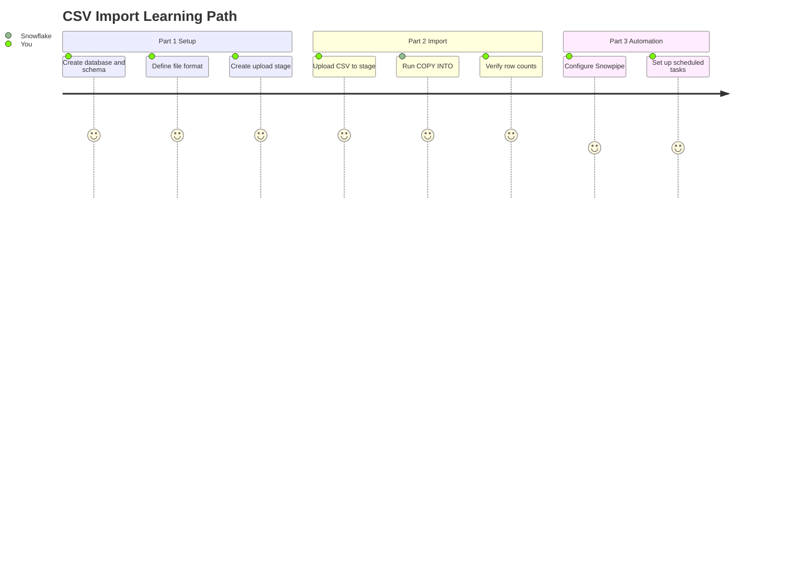

# Load CSV Files into Snowflake

Inspired by the question every new Snowflake user asks: *"I have a CSV file -- how do I get it into Snowflake and start querying it?"*

A step-by-step guide to loading CSV files using Snowsight. Covers one-time setup (database, schema, stage, file format), a repeatable import process (upload, COPY INTO, verify), and optional automation (Snowpipe, scheduled tasks). No prior Snowflake experience required.

**Pair-programmed by:** SE Community + Cortex Code
**Created:** 2026-03-06 | **Expires:** 2026-05-05 | **Status:** ACTIVE

> **No support provided.** This content is for reference only. Review and validate before applying to any production workflow.

**Time:** ~15 minutes for first import | **Result:** CSV data queryable in Snowflake

---

## Who This Is For

Anyone who needs to load CSV files into Snowflake -- weekly exports from a POS system, monthly reports from a vendor, ad-hoc data drops from a partner. No prior Snowflake experience required.

**Already comfortable with Snowflake?** Skip to [Part 2](#part-2-upload-and-load-repeatable) for the COPY INTO pattern, or [Part 3](#part-3-automation-optional) for Snowpipe and scheduled tasks.

---

## The Approach



> [!TIP]
> **Core insight:** Load all columns as VARCHAR first to avoid type-conversion errors. Cast to proper types in views or queries after the data is safely in Snowflake.

---

## Part 1: One-Time Setup

All SQL runs in a Snowsight worksheet: **Projects > Worksheets > + Worksheet**.

```sql
CREATE DATABASE MY_DATABASE;
CREATE SCHEMA MY_DATABASE.MY_SCHEMA;
USE SCHEMA MY_DATABASE.MY_SCHEMA;

CREATE FILE FORMAT CSV_FORMAT
    TYPE = 'CSV'
    SKIP_HEADER = 1
    FIELD_OPTIONALLY_ENCLOSED_BY = '"';

CREATE STAGE CSV_UPLOADS
    DIRECTORY = (ENABLE = TRUE);

CREATE TABLE SALES_TRANSACTIONS (
    transaction_id      VARCHAR,
    transaction_date    VARCHAR,
    store_location      VARCHAR,
    item_name           VARCHAR,
    quantity            VARCHAR,
    unit_price          VARCHAR,
    total_amount        VARCHAR,
    payment_method      VARCHAR
);
```

Not sure what columns your CSV has? Upload it first, then inspect with a header-aware format:

```sql
CREATE FILE FORMAT CSV_WITH_HEADERS
    TYPE = 'CSV'
    PARSE_HEADER = TRUE
    FIELD_OPTIONALLY_ENCLOSED_BY = '"';

SELECT * FROM TABLE(INFER_SCHEMA(LOCATION => '@CSV_UPLOADS', FILE_FORMAT => 'CSV_WITH_HEADERS'));
```

> [!NOTE]
> `PARSE_HEADER = TRUE` reads column names from the first row but is mutually exclusive with `SKIP_HEADER`. Use `CSV_WITH_HEADERS` for schema discovery, then `CSV_FORMAT` (with `SKIP_HEADER = 1`) for loading. You can also create the table directly from inferred schema:
> ```sql
> CREATE TABLE MY_TABLE USING TEMPLATE (
>     SELECT ARRAY_AGG(OBJECT_CONSTRUCT(*))
>     FROM TABLE(INFER_SCHEMA(LOCATION => '@CSV_UPLOADS', FILE_FORMAT => 'CSV_WITH_HEADERS'))
> );
> ```

---

## Part 2: Upload and Load (Repeatable)

1. **Upload** -- Navigate to **Data > Databases > MY_DATABASE > MY_SCHEMA > Stages > CSV_UPLOADS**, click **+ Files**, drag and drop your CSV
2. **Load** -- `COPY INTO SALES_TRANSACTIONS FROM @CSV_UPLOADS FILE_FORMAT = CSV_FORMAT ON_ERROR = 'CONTINUE';`
3. **Verify** -- `SELECT COUNT(*) FROM SALES_TRANSACTIONS;`
4. **Check errors** -- If `ON_ERROR = 'CONTINUE'` skipped rows, inspect them: `SELECT * FROM TABLE(VALIDATE(SALES_TRANSACTIONS, LAST_QUERY_ID()));`
5. **Clean stage** -- `REMOVE @CSV_UPLOADS;`

---

## Part 3: Automation (Optional)

| Method | How It Works | Best For |
|---|---|---|
| [Snowpipe](https://docs.snowflake.com/en/user-guide/data-load-snowpipe-intro) | Auto-loads files dropped in cloud storage | Hands-off, near-real-time |
| [Scheduled Task](https://docs.snowflake.com/en/sql-reference/sql/create-task) | Runs COPY INTO on a cron schedule | Regular batch loads |

---

<details>
<summary><strong>Troubleshooting</strong></summary>

| Error | Solution |
|---|---|
| Column count mismatch | Preview with `SELECT $1, $2, ... FROM @CSV_UPLOADS LIMIT 5`. Adjust table definition. |
| Date/number format error | Load as VARCHAR, cast in queries: `transaction_date::DATE`. |
| Permission denied | Need CREATE privileges. Contact your Snowflake admin. |
| Duplicate data after re-run | COPY INTO skips previously loaded files by default. Use `FORCE = TRUE` or rename the file. |

</details>

## References

| Resource | URL |
|---|---|
| COPY INTO (table) | https://docs.snowflake.com/en/sql-reference/sql/copy-into-table |
| CREATE FILE FORMAT | https://docs.snowflake.com/en/sql-reference/sql/create-file-format |
| CREATE STAGE | https://docs.snowflake.com/en/sql-reference/sql/create-stage |
| INFER_SCHEMA | https://docs.snowflake.com/en/sql-reference/functions/infer_schema |
| VALIDATE | https://docs.snowflake.com/en/sql-reference/functions/validate |
| Snowpipe | https://docs.snowflake.com/en/user-guide/data-load-snowpipe-intro |
