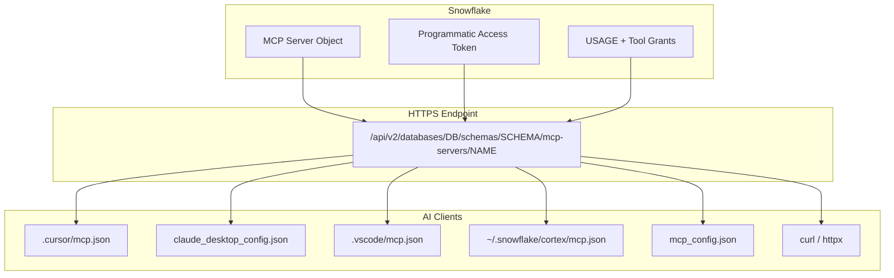

# Client Connection Reference

Every major AI client connects to Snowflake's managed MCP server over HTTPS using the same endpoint URL and Bearer token pattern. The differences are config file location and JSON structure.

## Config File Quick Reference

| Client | Config Path (macOS) | Key Field | Auth Field |
|---|---|---|---|
| Cursor | `.cursor/mcp.json` (project) | `mcpServers.NAME.url` | `mcpServers.NAME.headers.Authorization` |
| Claude Desktop | `~/Library/Application Support/Claude/claude_desktop_config.json` | `mcpServers.NAME.url` | `mcpServers.NAME.headers.Authorization` |
| VS Code + Copilot | `.vscode/mcp.json` (workspace) | `servers.NAME.url` | `servers.NAME.headers.Authorization` |
| Cortex Code | `~/.snowflake/cortex/mcp.json` | `mcpServers.NAME.url` | `mcpServers.NAME.headers.Authorization` |
| Windsurf | `~/.codeium/windsurf/mcp_config.json` | `mcpServers.NAME.serverUrl` | `mcpServers.NAME.headers.Authorization` |
| curl | N/A | `-X POST <url>` | `-H "Authorization: Bearer ..."` |

All clients send `Authorization: Bearer <PAT>` over HTTPS. The Snowflake MCP server is a standard HTTP MCP server -- no stdio bridge or local process needed.
