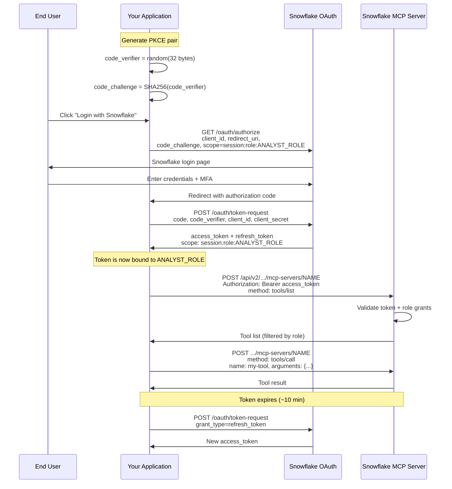

# OAuth 2.0 Authorization Code Flow with PKCE

Full sequence for authenticating an end user to a Snowflake MCP server. The role is specified in the OAuth scope at step 2 and remains bound to the token throughout the flow.

## Key Points

- **PKCE** prevents authorization code interception -- critical for web apps
- **Role in scope** means the token can only access what that role is granted
- **Refresh tokens** avoid forcing re-login on every token expiry
- **MFA** is enforced at the Snowflake login step, not at the MCP layer
