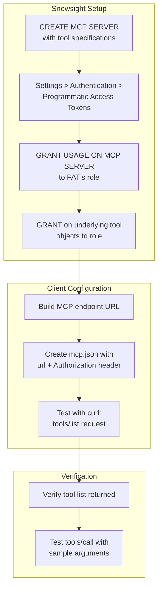

# PAT Quick-Start Flow

Setup flow for connecting Cursor or Claude Desktop to a Snowflake MCP server using a Programmatic Access Token.



## URL Format

```
https://<ORG-ACCOUNT>.snowflakecomputing.com/api/v2/databases/<DB>/schemas/<SCHEMA>/mcp-servers/<NAME>
```

Use hyphens in the hostname, never underscores. Replace any `_` with `-` in your account identifier.

## mcp.json Structure

```json
{
    "mcpServers": {
        "Snowflake MCP Server": {
            "url": "https://<YOUR-ORG-YOUR-ACCOUNT>.snowflakecomputing.com/api/v2/databases/<DB>/schemas/<SCHEMA>/mcp-servers/<NAME>",
            "headers": {
                "Authorization": "Bearer <YOUR-PAT-TOKEN>"
            }
        }
    }
}
```

Never commit this file to version control. Add `mcp.json` to `.gitignore`.
