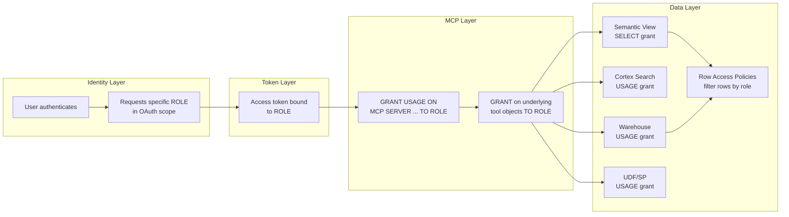

# RBAC Identity Chain for MCP

The complete chain from user identity to tool invocation. Every link must be explicitly granted -- there is no inheritance from MCP server access to tool access.

## The Two-Grant Rule

Access to the MCP server alone does **not** grant access to any tools. You must grant both:

1. `GRANT USAGE ON MCP SERVER ... TO ROLE <role>` -- allows connection and tool discovery
2. `GRANT USAGE/SELECT ON <underlying object> TO ROLE <role>` -- allows tool invocation

This means a role can see a tool in `tools/list` but get a permission error on `tools/call` if the underlying object grant is missing.

## Role Comparison

| Role | MCP Server | Semantic View | Search Service | SQL Exec | Sees |
|---|---|---|---|---|---|
| ANALYST_ROLE | USAGE | SELECT on revenue SV | USAGE on tickets | -- | Revenue analytics + ticket search |
| ENGINEER_ROLE | USAGE | SELECT on all SVs | USAGE on all search | warehouse USAGE | Full data access + SQL |
| VIEWER_ROLE | USAGE | -- | USAGE on tickets | -- | Ticket search only |
