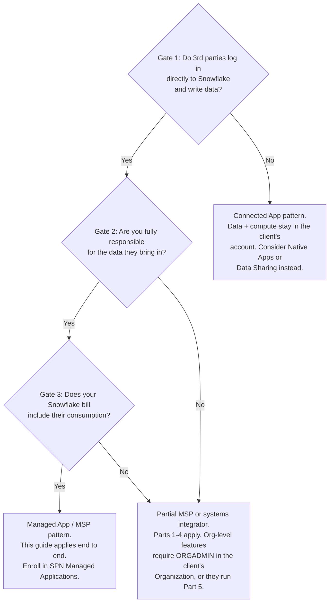
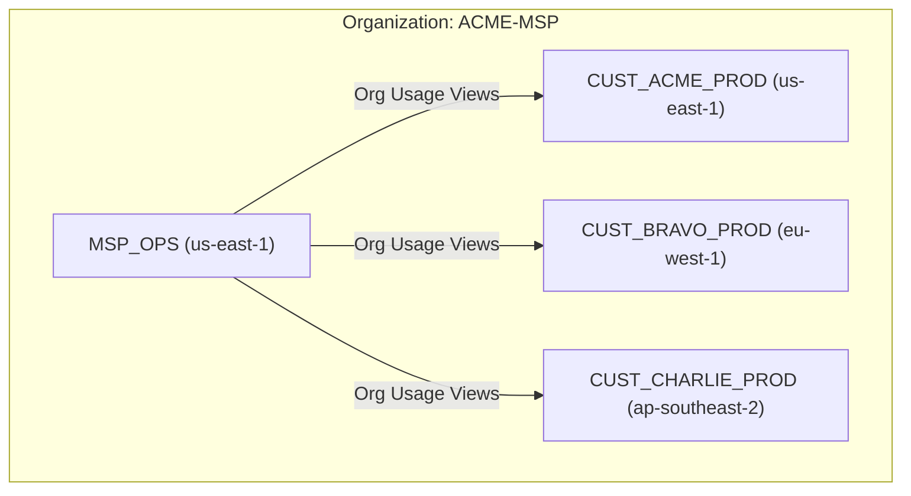
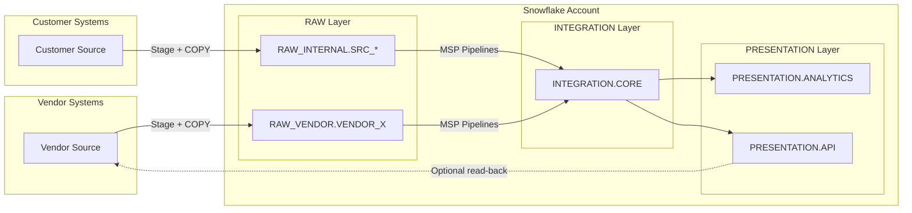
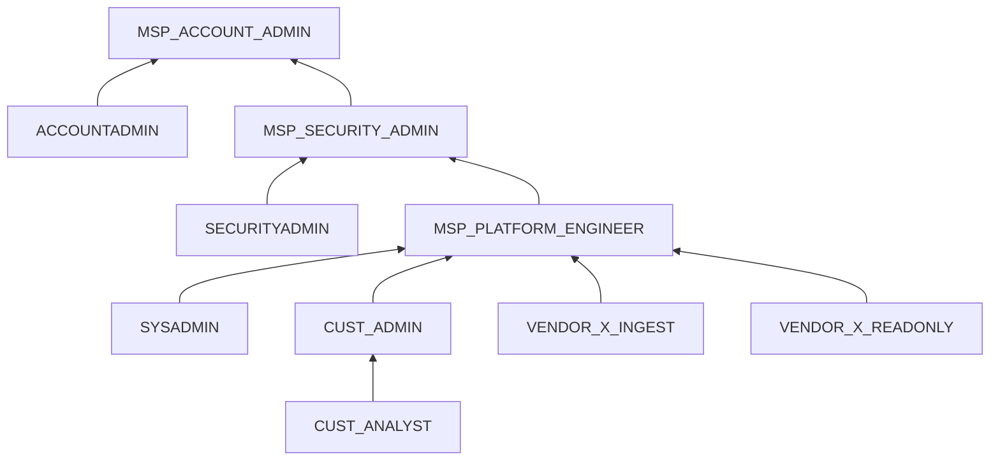

# Snowflake MSP Provider Guide

Inspired by a real customer question: *"We're an MSP. We manage Snowflake accounts for our customers. Now a 3rd-party vendor needs Snowsight access to bring in their own data. How do we do that securely without losing control?"*

---

## How to Read This Guide

This guide contains four types of content:

- **Snowflake behavior** — Verified against Snowflake documentation (April 2026). If Snowflake changes the feature, this may become stale.
- **Architecture recommendation** — The authors' opinion on how to structure an MSP environment. Other valid approaches exist.
- **ToS context** — Paraphrases of Snowflake ToS clauses with author interpretation. Quotes are verified against ToS dated January 28, 2026. Interpretations are not legal advice.
- **SPN program details** — Confirmed against SPN Program Guide v03/2026 (internal partner documentation). Program categories and requirements may change.

---

## Is This Guide For You?

Before diving in, answer three questions. Your answers determine whether this guide is a direct fit or whether a different Snowflake pattern applies.

Snowflake's official terminology for these two patterns: a **Connected App** runs its UI and infrastructure outside Snowflake while data and compute stay in the *customer's* account; a **Managed App** hosts customer data and workloads inside the *provider's* Snowflake org. Most MSPs are Managed App providers.



| | Connected App | Managed App (MSP) |
|-|--------------|-------------------|
| Where data lives | Customer's own Snowflake account | Your Snowflake org and accounts |
| Client Snowflake access | Through your app or API | Direct Snowsight or connector login |
| Who writes data | Your pipelines | Client or their vendors |
| Billing entity (ToS §1.4a) | Client pays Snowflake directly | You pay Snowflake; clients pay you |
| Account structure | One or few accounts you own | One dedicated account per client |
| ORGADMIN needed | No | Yes |
| Organization Usage Views | Not available | Available in MSP_OPS account |
| Vendor isolation mechanism | App-layer or row access policies | Schema + network policy + auth policy |
| Data responsibility (ToS §2.2a) | You own the pipelines | You own everything, including what vendors bring in |
| SPN enrollment | AI Data Cloud Products → Connected | AI Data Cloud Products → Managed Applications (Source: SPN Program Guide v03/2026) |

### Where the Lines Blur

**The SaaS company that crossed the line.** *"We give every enterprise client a dedicated Snowflake account."* Once you provision per-client accounts under your Organization, you are a Managed App provider for billing and operations purposes — even if you think of yourself as a software company. Gate 3 applies: your Snowflake invoice covers all accounts, and Snowflake's SPN expects you to enroll under Managed Applications, not Connected.

**The systems integrator.** *"We manage Snowflake for our clients, but each client has their own Snowflake contract."* You answer Yes to Gates 1 and 2, but No to Gate 3. You are a Partial MSP. Parts 1–4 of this guide apply. You do not have access to `SNOWFLAKE.ORGANIZATION_USAGE` — that belongs to the account owner. Ask your client to run the Part 5 monitoring scripts, or request ORGADMIN access under their Organization.

**The data agency with a surprise vendor.** *"Our client just told us their logistics data vendor wants to push feeds directly into the Snowflake account we manage."* If you manage the account (Gates 1 and 2 apply), this is exactly the scenario this guide was built for. Start at Part 2.

---

One concrete architecture for per-customer Snowflake accounts where MSP staff, customer users, and 3rd-party vendors all coexist safely. Every section includes copy-paste SQL.

**Pair-programmed by:** SE Community + Cortex Code
**Created:** 2026-04-10 | **Expires:** 2026-05-10 | **Status:** ACTIVE

> **No support provided.** This content is for reference only. Review and validate before applying to any production workflow.

**Time:** ~30 minutes to read, ~2 hours to implement per customer | **Result:** A secure, repeatable multi-tenant pattern

---

## Who This Is For

MSP platform engineers who answer **Yes to all three gates above**:

- **Gate 1:** Your clients or their vendors log directly into a Snowflake account you provision and operate — via Snowsight, a connector, or an API key
- **Gate 2:** You are accountable for data quality, security, and compliance of everything that lands in those accounts, including what 3rd-party vendors bring in
- **Gate 3:** Your Snowflake contract covers the accounts you manage; you handle chargeback to clients

Comfortable with Snowflake RBAC and SQL DDL. No prior multi-tenant MSP experience required.

> **Not your pattern?** If you answer No to Gate 1, you are building a **Connected App** — your clients interact through your application, not directly through Snowflake, and their data stays in their own account. Look at [Snowflake Native Apps](https://docs.snowflake.com/en/developer-guide/native-apps/native-apps-about) (for deploying logic into client accounts) or [Data Sharing](https://docs.snowflake.com/en/user-guide/data-sharing-intro) (for exposing curated data to clients) instead. For SPN enrollment, Connected App providers register under AI Data Cloud Products → Connected, not Managed Applications.

---

## Legal Context — Why the Three Gates Exist

> **Not legal advice.** This section describes the contractual landscape that motivated this guide's architecture. Review the [Snowflake Terms of Service](https://www.snowflake.com/en/legal/terms-of-service/) and your specific agreement with your legal team before applying any pattern here.

The three gates are not arbitrary — each maps to a specific clause in the Snowflake ToS (last updated January 28, 2026) that creates a compliance obligation for anyone managing Snowflake on behalf of others.

### Gate 1 ↔ ToS §1.1 and §1.4(a)

**ToS text:** §1.1 allows Contractors and Affiliates to be Users, but only "solely for the benefit of Customer or such Affiliate." §1.4(a) prohibits "provide access to... the Service... to a third party" except for "Service features expressly intended to enable Customer to provide its third parties with access to Customer Data" or "as set forth in an SOW, as applicable."

**Author interpretation:** A vendor who logs in with Snowsight credentials to load their own data into your account is acting as a Contractor in service of your managed delivery — that is permissible under §1.1. A vendor using your Snowflake environment as a general-purpose data platform for their own business is not. The first §1.4(a) carveout covers Data Sharing (read-only). The second allows additional access patterns explicitly authorized in a Statement of Work. Neither carveout covers write-capable Snowsight access for data ingestion by default. The legitimising mechanism for MSPs is the SPN Managed Applications program (Source: SPN Program Guide v03/2026): under a capacity agreement, vendor users are Contractors of the MSP (the Customer), not standalone third parties receiving a sublicense to Snowflake.

**Architectural conclusion (opinion):** This is why the architecture in this guide constrains vendor access to a single managed-access schema with the minimum necessary privileges. Any broader access would look less like "Contractor acting for Customer" and more like "third party receiving Snowflake access" — which §1.4(a) prohibits. Review this interpretation with your legal team.

### Gate 2 ↔ ToS §2.2(a)

**ToS text:** §2.2(a): "Customer is solely responsible for the accuracy, content and legality of all Customer Data."

**Author interpretation:** Once a vendor loads data into your account, it is Customer Data and you are contractually responsible to Snowflake for it — its accuracy, legality, and compliance. Gate 2 is not a policy choice; it is a contractual fact that exists the moment Gate 1 is triggered.

**Architectural conclusion (opinion):** Managed Access schemas, future grants, and the ownership-transfer step in vendor offboarding (Part 3) are direct architectural responses to this clause. Skipping them does not make the liability go away; it just removes your ability to exercise control.

### Gate 3 ↔ ToS §1.4(a) service bureau / outsourcing offering prohibition

**ToS text:** §1.4(a) also prohibits using the Service "in a service bureau or outsourcing offering."

**Author interpretation:** A company that manages Snowflake accounts on behalf of clients, bills those clients for Snowflake consumption, and does so without an active capacity agreement with Snowflake is operating as an unlicensed service bureau under this clause.

**SPN program resolution (Source: SPN Program Guide v03/2026):** The resolution is the SPN Managed Applications enrollment: an active capacity agreement for your managed workload is what distinguishes a legitimate Managed App provider from an unlicensed service bureau. If you answer Yes to Gate 3, a standard Customer contract is not sufficient — you need to be enrolled in SPN Managed Applications, with your customer accounts registered under "Accounts Powered by Snowflake."

### The Connected App tension

**ToS text:** §1.4(b) prohibits "use the Service to provide, or incorporate the Service into, any substantially similar cloud-based service for the benefit of a third party."

**Author interpretation:** A Connected App / service provider who runs Snowflake compute to produce outputs they sell to clients sits close to this line. Snowflake's distinction is architectural: in a Connected App, the data and compute stay in the *client's* Snowflake account — the provider does not host or operate Snowflake on the client's behalf. If you start hosting your clients' data in your own Snowflake org and billing them for it, §1.4(b) and Gate 3 both apply.

---

## Architecture Overview

### Organization Level



- A single Snowflake **Organization** spans all regions and cloud platforms. You do not need one Organization per region -- one Organization holds every account regardless of where it runs (AWS us-east-1, Azure westeurope, etc.). Multiple Organizations only arise from separate legal entities or acquisitions.
- Under the Organization: **one account per customer** (optionally Dev/Test/Prod per customer), placed in the region closest to the customer's data.
- One **MSP_OPS account** for central monitoring and cost analysis.
- MSP_OPS uses **Organization Usage views** (`SNOWFLAKE.ORGANIZATION_USAGE`) for cross-account telemetry -- no data shares required for basic monitoring. These views cover all accounts across all regions in the Organization. **Prerequisite:** Organization Usage views are available in the organization account and any regular account with ORGADMIN role enabled. Certain premium views (e.g., `DATA_TRANSFER_HISTORY`) are restricted to the organization account only. The MSP_OPS account must be the organization account, or an account with the ORGADMIN role.
- All 3rd-party users log into the **customer account**, never into MSP_OPS.

### Per-Account Data Flow



- **Vendors** own their data path up to `RAW_VENDOR.VENDOR_X`.
- **MSP pipelines** validate, join, transform, and expose curated outputs.
- Optionally expose specific views in `PRESENTATION.API` back to vendors.

---

## Part 1: Account Baseline

> **Problem:** You need a repeatable foundation for every customer account -- roles, databases, schemas, warehouses -- before any vendor touches it.

Full script: [`sql/01_account_baseline.sql`](sql/01_account_baseline.sql)

### Role Hierarchy



**MSP roles:**

| Role | Inherits | Purpose |
|------|----------|---------|
| `MSP_ACCOUNT_ADMIN` | ACCOUNTADMIN | Top-level MSP admin. Only MSP staff. |
| `MSP_SECURITY_ADMIN` | SECURITYADMIN | Users, roles, network policies. |
| `MSP_PLATFORM_ENGINEER` | SYSADMIN | Warehouses, databases, pipelines. |

`MSP_ACCOUNT_ADMIN` is **granted the ACCOUNTADMIN role** -- it inherits all ACCOUNTADMIN privileges. It does not sit "above" ACCOUNTADMIN. This distinction matters because ACCOUNTADMIN is the ceiling of the system role hierarchy.

**Customer roles:**

| Role | Purpose |
|------|---------|
| `CUST_ADMIN` | Limited admin. Cannot modify MSP roles or network policies. |
| `CUST_ANALYST` | Read-only on PRESENTATION layer. |

**Key constraint on CUST_ADMIN:** Granting `CREATE USER` or `CREATE ROLE` directly to a custom role is risky -- it could create users with any default role. Instead, delegate user management through a **stored procedure with EXECUTE AS OWNER**:

```sql
CREATE OR REPLACE PROCEDURE WORKSPACE.MSP.CREATE_CUSTOMER_USER(
    p_username     VARCHAR,
    p_default_role VARCHAR,
    p_email        VARCHAR
)
RETURNS VARCHAR
LANGUAGE SQL
EXECUTE AS OWNER
AS
$$
BEGIN
    IF (:p_default_role NOT IN ('CUST_ADMIN', 'CUST_ANALYST')) THEN
        RETURN 'ERROR: default_role must be CUST_ADMIN or CUST_ANALYST';
    END IF;
    IF (:p_username RLIKE '.*[^A-Za-z0-9_].*') THEN
        RETURN 'ERROR: username must be alphanumeric/underscores only';
    END IF;
    IF (:p_email LIKE '%''%' OR :p_email LIKE '%;%') THEN
        RETURN 'ERROR: email contains invalid characters';
    END IF;
    EXECUTE IMMEDIATE
        'CREATE USER IF NOT EXISTS IDENTIFIER(''' || :p_username || ''')'  ||
        ' DEFAULT_ROLE = ' || :p_default_role ||
        ' EMAIL = ''' || :p_email || '''' ||
        ' MUST_CHANGE_PASSWORD = TRUE';
    EXECUTE IMMEDIATE
        'GRANT ROLE ' || :p_default_role ||
        ' TO USER IDENTIFIER(''' || :p_username || ''')';
    RETURN 'User ' || :p_username || ' created with role ' || :p_default_role;
END;
$$;
```

This runs with the owner's privileges (ACCOUNTADMIN) but validates inputs: only `CUST_ADMIN` or `CUST_ANALYST` as the default role, alphanumeric usernames only, and no SQL-injectable characters in email.

### Databases and Schemas

| Database | Schema | Purpose | Managed Access? |
|----------|--------|---------|-----------------|
| RAW_INTERNAL | SRC_\<system\> | Customer raw sources | No |
| RAW_VENDOR | VENDOR_\<name\> | One schema per vendor | **Yes** |
| INTEGRATION | CORE | Business logic, joins | Yes |
| PRESENTATION | ANALYTICS | BI-facing tables/views | Yes |
| PRESENTATION | API | App/vendor read-back views | Yes |
| WORKSPACE | MSP | MSP experiments | No |
| WORKSPACE | CUST | Customer sandbox | No |

**Why Managed Access?** In a standard schema, the object owner can grant privileges to other roles. In a `WITH MANAGED ACCESS` schema, only the schema owner or a role with the `MANAGE GRANTS` privilege controls grants. This prevents vendors from granting access to objects they create in `RAW_VENDOR.VENDOR_X` to anyone other than the MSP.

```sql
CREATE SCHEMA IF NOT EXISTS RAW_VENDOR.VENDOR_X
    WITH MANAGED ACCESS
    COMMENT = 'Raw landing zone for vendor VENDOR_X';
```

### Warehouses

| Warehouse | Used By | Size |
|-----------|---------|------|
| MSP_ELT_WH | MSP pipelines | SMALL+ |
| CUST_ANALYTICS_WH | Customer analysts, BI | XSMALL |
| VENDOR_X_INGEST_WH | Vendor X only | XSMALL |

Each warehouse gets a resource monitor and a cost attribution tag.

### Cost Attribution Tags

```sql
CREATE TAG IF NOT EXISTS RAW_INTERNAL.PUBLIC.COST_CENTER
    ALLOWED_VALUES 'msp', 'customer', 'vendor';

ALTER WAREHOUSE MSP_ELT_WH SET TAG RAW_INTERNAL.PUBLIC.COST_CENTER = 'msp';
ALTER WAREHOUSE CUST_ANALYTICS_WH SET TAG RAW_INTERNAL.PUBLIC.COST_CENTER = 'customer';
```

---

## Part 2: Vendor Onboarding

> **Gates 1 + 2 in practice.** This is the moment a 3rd party receives Snowsight credentials and CREATE privileges — Gate 1 is triggered. The instant they load data, Gate 2 follows: you are responsible for what lands in this account, its quality, its compliance, and its security.

> **Problem:** A new 3rd-party vendor needs Snowsight access to configure stages, file formats, and landing tables -- without seeing other vendors or touching your core models.

Full script: [`sql/02_vendor_onboard.sql`](sql/02_vendor_onboard.sql)

### Steps

Set the vendor name once, then run the script top to bottom:

```sql
SET vendor_name     = 'VENDOR_X';
SET vendor_wh_size  = 'XSMALL';
SET vendor_ip_range = '203.0.113.0/24';
```

| Step | What | Why |
|------|------|-----|
| 1 | Create `VENDOR_X_INGEST` and `VENDOR_X_READONLY` roles | Isolation per vendor |
| 2 | Create `RAW_VENDOR.VENDOR_X` schema with MANAGED ACCESS | Vendor creates objects; only MSP controls grants |
| 3 | Create `VENDOR_X_INGEST_WH` with resource monitor + cost tag | Cost isolation and control |
| 4 | Grant CREATE TABLE, CREATE STAGE, CREATE FILE FORMAT, CREATE PIPE, CREATE TASK on the vendor schema | The specific set of privileges vendors need |
| 5 | Set up future grants so MSP pipelines can read vendor-created objects | Without this, MSP has no access to tables the vendor creates |
| 6 | Create a network rule + policy for the vendor's IP range | Network-level isolation |
| 7 | Create an authentication policy requiring MFA | Security enforcement per vendor |
| 8 | Create vendor users, assign roles + policies | User provisioning |

### Future Grants

When vendors create new tables, your MSP pipelines need automatic read access:

```sql
GRANT SELECT ON FUTURE TABLES IN SCHEMA RAW_VENDOR.VENDOR_X
    TO ROLE MSP_PLATFORM_ENGINEER;
GRANT USAGE  ON FUTURE STAGES IN SCHEMA RAW_VENDOR.VENDOR_X
    TO ROLE MSP_PLATFORM_ENGINEER;
```

### Network Rules (Modern Syntax)

Use network rules instead of the legacy `ALLOWED_IP_LIST` parameter:

```sql
CREATE NETWORK RULE IF NOT EXISTS RAW_VENDOR.VENDOR_X.VENDOR_INGRESS_RULE
    MODE       = INGRESS
    TYPE       = IPV4
    VALUE_LIST = ('203.0.113.0/24');

CREATE NETWORK POLICY IF NOT EXISTS VENDOR_X_NETWORK_POLICY
    ALLOWED_NETWORK_RULE_LIST = (RAW_VENDOR.VENDOR_X.VENDOR_INGRESS_RULE);
```

Apply the policy at the **user level** (takes precedence over account-level policy):

```sql
ALTER USER VENDOR_X_ENGINEER_1 SET NETWORK_POLICY = VENDOR_X_NETWORK_POLICY;
```

### Authentication Policies

Enforce MFA for vendor users (`MFA_ENROLLMENT` accepts `REQUIRED`, `REQUIRED_PASSWORD_ONLY`, or `OPTIONAL`; `OPTIONAL` is retained for backward compatibility only):

```sql
CREATE AUTHENTICATION POLICY IF NOT EXISTS RAW_VENDOR.VENDOR_X.VENDOR_AUTH_POLICY
    MFA_ENROLLMENT = 'REQUIRED';

ALTER USER VENDOR_X_ENGINEER_1 SET AUTHENTICATION POLICY
    RAW_VENDOR.VENDOR_X.VENDOR_AUTH_POLICY;
```

### What Vendors Can Do

- Create stages and file formats in `RAW_VENDOR.VENDOR_X`
- Create and load tables in `RAW_VENDOR.VENDOR_X`
- Create pipes and tasks in `RAW_VENDOR.VENDOR_X`
- Use `VENDOR_X_INGEST_WH`

### What Vendors Cannot Do

- See other vendors' schemas
- Read or write to RAW_INTERNAL, INTEGRATION, PRESENTATION, or WORKSPACE
- Create databases, schemas outside their own, or warehouses
- Manage shares (CREATE SHARE, IMPORT SHARE)
- Grant access to their objects (Managed Access prevents this)

---

## Part 3: Vendor Offboarding

> **Gate 2 consequence.** Because you accepted full data responsibility at onboarding, you cannot simply drop a vendor's roles and walk away. Ownership of every object they created must transfer to MSP before their roles are revoked — or those objects become inaccessible in a managed-access schema. Step 4 (ownership transfer) is non-negotiable.

> **Problem:** A vendor engagement ends. You need to revoke access immediately, preserve data for MSP pipelines, and clean up resources.

Full script: [`sql/03_vendor_offboard.sql`](sql/03_vendor_offboard.sql)

### Steps

| Step | What | Why |
|------|------|-----|
| 1 | Disable vendor users | Immediate access revocation |
| 2 | Revoke role grants from users | Belt and suspenders |
| 3 | Suspend vendor warehouse | Stop credit burn |
| 4 | Transfer ownership of vendor objects to MSP | Preserve data for pipelines |
| 5 | Revoke all grants from vendor roles | Clean slate |
| 6 | (Optional) Drop vendor schema and warehouse | Only after data is migrated/archived |
| 7 | Unset policies from users, then drop users | Policies cannot be dropped while assigned to a user |
| 8 | Drop network and auth policies | Now safe to drop (unassigned) |
| 9 | Drop vendor roles | Final role cleanup |
| 10 | Drop resource monitor | Final resource cleanup |
| 11 | Verify nothing remains | Audit check |

Two ordering constraints: **step 4** -- transfer ownership before dropping roles (or objects become orphaned), and **step 7** -- unset and drop users before dropping policies (Snowflake blocks dropping active policies).

```sql
GRANT OWNERSHIP ON ALL TABLES IN SCHEMA RAW_VENDOR.VENDOR_X
    COPY CURRENT GRANTS TO ROLE MSP_PLATFORM_ENGINEER REVOKE CURRENT GRANTS;
```

---

## Part 4: Guardrails

> **Problem:** You need security controls that actually prevent drift, not just documentation that says "please don't."

Full script: [`sql/05_guardrails.sql`](sql/05_guardrails.sql)

### Network Controls

**Account-level policy** restricts access to MSP and customer IP ranges:

```sql
CREATE NETWORK RULE IF NOT EXISTS MSP_INGRESS_RULE
    MODE = INGRESS TYPE = IPV4 VALUE_LIST = ('198.51.100.0/24');
CREATE NETWORK RULE IF NOT EXISTS CUST_INGRESS_RULE
    MODE = INGRESS TYPE = IPV4 VALUE_LIST = ('192.0.2.0/24');

CREATE NETWORK POLICY IF NOT EXISTS ACCOUNT_NETWORK_POLICY
    ALLOWED_NETWORK_RULE_LIST = (MSP_INGRESS_RULE, CUST_INGRESS_RULE);
ALTER ACCOUNT SET NETWORK_POLICY = ACCOUNT_NETWORK_POLICY;
```

**Vendor-specific policies** are applied per-user. Network policy precedence is: Security Integration > User > Account. A user-level policy overrides the account-level policy, and a security integration policy (e.g., OAuth) overrides both. This means a vendor user's IP must match their user-level policy (if set), not the account policy.

### Masking Policies

Protect sensitive columns before exposing to customer analysts or vendor read-only roles:

```sql
CREATE MASKING POLICY PRESENTATION.ANALYTICS.EMAIL_MASK AS
    (val STRING) RETURNS STRING ->
    CASE
        WHEN IS_ROLE_IN_SESSION('MSP_ACCOUNT_ADMIN')
          OR IS_ROLE_IN_SESSION('MSP_SECURITY_ADMIN')
          OR IS_ROLE_IN_SESSION('MSP_PLATFORM_ENGINEER')
        THEN val
        ELSE REGEXP_REPLACE(val, '.+@', '***@')
    END;
```

Use `IS_ROLE_IN_SESSION()` instead of `CURRENT_ROLE()` -- it respects the role hierarchy and secondary roles. `CURRENT_ROLE()` only matches the exact active primary role.

### Row Access Policies

Restrict vendor READONLY roles to see only their own data in shared views:

```sql
CREATE ROW ACCESS POLICY PRESENTATION.API.VENDOR_ROW_FILTER AS
    (vendor_col STRING) RETURNS BOOLEAN ->
    CASE
        WHEN IS_ROLE_IN_SESSION('MSP_ACCOUNT_ADMIN')
          OR IS_ROLE_IN_SESSION('MSP_PLATFORM_ENGINEER')
          OR IS_ROLE_IN_SESSION('CUST_ADMIN')
          OR IS_ROLE_IN_SESSION('CUST_ANALYST')
        THEN TRUE
        WHEN CURRENT_ROLE() LIKE 'VENDOR_%_READONLY'
        THEN vendor_col = REPLACE(CURRENT_ROLE(), '_READONLY', '')
        ELSE FALSE
    END;
```

### Periodic Audit Checks

Run these weekly (or automate with a task):

| Check | What to Look For |
|-------|-----------------|
| Vendor roles with dangerous grants | OWNERSHIP, CREATE SHARE, MANAGE GRANTS on vendor roles |
| Vendor objects outside RAW_VENDOR | Objects owned by vendor roles in wrong databases |
| Users without MFA | `HAS_MFA = FALSE` in ACCOUNT_USAGE.USERS |

---

## Part 5: Monitoring

> **Gate 3 in practice.** Because your Snowflake bill covers every customer account, cross-account visibility is an operational requirement, not a nice-to-have. `SNOWFLAKE.ORGANIZATION_USAGE` is your primary tool. A Partial MSP or systems integrator who answered No to Gate 3 does not have access to these views — work with your client to expose cost data via a data share or exported report, or request ORGADMIN access under their Organization. Separately: as a Managed App provider under SPN, keeping your "Accounts Powered by Snowflake" list current is how your managed workload consumption gets attributed to your program tier (Source: SPN Program Guide v03/2026).

> **Problem:** You manage dozens of customer accounts and need to see credit burn, vendor activity, and pipeline health across all of them from one place.

Full script: [`sql/04_monitoring.sql`](sql/04_monitoring.sql)

### Cross-Account Monitoring (MSP_OPS Account)

Use **Organization Usage views** -- no data shares required:

```sql
-- Credit consumption per account, last 30 days
SELECT account_name, service_type, SUM(credits_used) AS total_credits
FROM SNOWFLAKE.ORGANIZATION_USAGE.METERING_HISTORY
WHERE start_time >= DATEADD('day', -30, CURRENT_TIMESTAMP())
GROUP BY account_name, service_type
ORDER BY total_credits DESC;
```

| View | What It Shows |
|------|--------------|
| `METERING_HISTORY` | Credit consumption per account and service type |
| `WAREHOUSE_METERING_HISTORY` | Per-warehouse credit burn across accounts |
| `LOGIN_HISTORY` | Login events across all accounts |
| `STORAGE_USAGE` | Storage consumption per account |

### Per-Account Monitoring

Key queries to run in each customer account:

| Query | Purpose |
|-------|---------|
| Vendor login activity | Track who is logging in and from where |
| DDL/DML by vendor roles | Catch unexpected schema changes or large data operations |
| Credit use per warehouse with cost_center tag | Attribution for chargebacks |
| Failed tasks | Pipeline health |
| Privilege audit | Detect vendor roles with grants they should not have |

### Cost Attribution

Tag-based attribution lets you answer "how much did this vendor cost us this month?":

```sql
SELECT
    wh.warehouse_name,
    tv.tag_value AS cost_center,
    SUM(wh.credits_used) AS total_credits
FROM SNOWFLAKE.ACCOUNT_USAGE.WAREHOUSE_METERING_HISTORY wh
LEFT JOIN SNOWFLAKE.ACCOUNT_USAGE.TAG_REFERENCES tv
    ON  tv.object_name = wh.warehouse_name
    AND tv.tag_name    = 'COST_CENTER'
    AND tv.domain      = 'WAREHOUSE'
WHERE wh.start_time >= DATEADD('day', -30, CURRENT_TIMESTAMP())
GROUP BY wh.warehouse_name, tv.tag_value
ORDER BY total_credits DESC;
```

---

## Part 6: Change Management

> **Problem:** You need vendor onboarding and RBAC changes to be auditable, repeatable, and not dependent on one person remembering the right SQL.

### Config-as-Code

Maintain a per-customer YAML file describing the account state:

```yaml
# cust_acme_prod.yaml
customer:
  name: ACME
  account: CUST_ACME_PROD

vendors:
  - name: VENDOR_X
    ip_range: "203.0.113.0/24"
    warehouse_size: XSMALL
    users:
      - username: VENDOR_X_ENGINEER_1
        email: engineer@vendorx.com
        role: VENDOR_X_INGEST
  - name: VENDOR_Y
    ip_range: "198.51.100.128/25"
    warehouse_size: XSMALL
    users:
      - username: VENDOR_Y_DBA_1
        email: dba@vendory.com
        role: VENDOR_Y_INGEST
```

Your automation reads this file and generates the SQL from `02_vendor_onboard.sql` or `03_vendor_offboard.sql`.

### Recommended Automation Path

1. **Start here:** Parameterised SQL scripts (this guide)
2. **Next step:** Wrap scripts in a CI/CD pipeline (GitHub Actions, GitLab CI) that reads the YAML config
3. **Production:** Terraform with the [Snowflake provider](https://registry.terraform.io/providers/Snowflake-Labs/snowflake/latest) for full state management

### Change Control Process

Treat RBAC changes and vendor lifecycle as change-controlled actions:

1. Ticket raised (Jira, ServiceNow, etc.)
2. Config YAML updated in a pull request
3. Peer review and approval
4. CI/CD pipeline applies changes
5. Audit queries from `04_monitoring.sql` confirm state

---

## Part 7: Customer Analytics Access Patterns

> **Problem:** Your customer is happy with your managed service but wants to plug in their own PowerBI or use Snowflake Intelligence directly. How do you enable this without handing them the keys to your entire managed environment?

Full script: [`sql/06_analytics_access.sql`](sql/06_analytics_access.sql) — Diagrams: [Customer BI Tool Access](diagrams/architecture.md#customer-bi-tool-access-powerbi-example) | [Snowflake Intelligence / Cortex Analyst Access](diagrams/architecture.md#snowflake-intelligence--cortex-analyst-access) | [AI Client Access (MCP)](diagrams/architecture.md#ai-client-access-patterns-mcp--cortex-code)

### Five Things That Sound the Same but Aren't

Before choosing an option, understand what your customer is actually asking for:

| | Snowsight | Snowflake Intelligence | Cortex Analyst API | Snowflake-Managed MCP Server | Client-Side MCP / Cortex Code CLI |
|-|-----------|----------------------|-------------------|------------------------------|----------------------------------|
| What it is | The web interface (`app.snowflake.com`) | AI analytics product inside Snowsight — agents, NL queries, charts | REST API (`/api/v2/cortex/analyst/message`) that powers SI under the hood | `CREATE MCP SERVER` object in Snowflake — exposes Cortex tools via MCP protocol | Local process (Snowflake-Labs/mcp or CoCo CLI) that connects to Snowflake on behalf of an AI client |
| How it's accessed | Browser login | Snowsight navigation (AI & ML → Agents) | Any HTTP client with auth token | AI client (Claude.ai, etc.) connects via OAuth to MCP server URL | AI client (Claude Desktop, CoCo, Cursor) launches local MCP server or CoCo process |
| Requires Snowsight | — | Yes | No | No — OAuth flow only | No |
| `SNOWFLAKE.CORTEX_USER` needed | No | Yes | Yes | No — uses `USAGE ON MCP SERVER` + per-tool grants | Yes (CoCo CLI); varies (Snowflake-Labs/mcp) |
| Can `CLIENT_TYPES` block it | Yes | Yes — blocked if Snowsight is blocked | **No** — does not restrict REST APIs | Depends on client type used by OAuth flow | No — uses driver/connector auth |
| Who authenticates | Human via browser | Human via browser | App server or service account | Human via OAuth redirect | Human (browser/PAT) or service account (key-pair) |

> **`CLIENT_TYPES` limitation (from Snowflake docs):** *"CLIENT_TYPES is a best-effort method to block user logins based on specific clients. It should not be used as the sole control to establish a security boundary. Notably, it does not restrict access to the Snowflake REST APIs."*

This means a user with `CORTEX_USER` + `SELECT` on the presentation layer can call the Cortex Analyst REST API even if you block Snowsight entirely. The API is the same one your own embedded app (Option C) would use — the difference is who mediates access.

> **MFA enrollment catch-22:** If you set `MFA_ENROLLMENT = 'REQUIRED'` on an authentication policy, `CLIENT_TYPES` **must** include `SNOWFLAKE_UI` because Snowsight is the only place users can enroll in MFA. You cannot simultaneously require MFA and permanently block Snowsight — users need UI access at least once to enroll.

### Options Overview

| | Option A: Data Sharing | Option B1: Snowsight User (SI product) | Option B2: API-Only User (Cortex Analyst) | Option C: Embedded |
|-|----------------------|--------------------------------------|----------------------------------------|-------------------|
| Gate 1 triggered | No — §1.4(a) carveout | Yes — human Snowsight login | Yes — credentials issued, no UI | No — app mediates |
| Customer has SF credentials | In their own account | Yes, human Snowsight login | Yes, service or PAT-based | No |
| Snowsight access | In their own account | Yes — required for SI product | Blocked via `CLIENT_TYPES` (best-effort) | No |
| Write access possible | Never — shares are read-only | No — role is SELECT only | No — role is SELECT only | No |
| MSP controls schema exposure | Via share definition | Via role GRANTs | Via role GRANTs | Via app/API layer |
| Requires customer SF account | Yes (or reader account) | No | No | No |
| MSP dev effort | Low | Low | Medium | High |

The same framework extends to AI client access (Options D1–D3 below). The table above covers BI tools and Snowflake Intelligence; the AI client options cover MCP-based integrations with Claude, Cortex Code CLI, Cursor, and similar tools.

The trap to avoid: granting customer users CREATE or INSERT privileges under the guise of "analytics access." A customer user who can create a stage, run COPY INTO, or modify a schema has crossed from read-only analytics into full Gate 1 territory — with Gate 2 implications if they corrupt data.

### Option A: Data Sharing (ToS §1.4(a) explicit carveout)

Snowflake Data Sharing is explicitly permitted under §1.4(a) as a "Service feature expressly intended to enable Customer to provide its third parties with access to Customer Data." No third party is logging into your MSP account — they receive a share in their own.

**BI tools (PowerBI):** Customer's PowerBI connector points at their own account (or an MSP-provisioned reader account). No credentials to your account.

**Snowflake Intelligence:** Customer uses SI in their own account against the shared data. Semantic views can be included in the share, so the MSP's query definitions travel with the data. The customer needs a full Snowflake account (not a reader account) for SI access.

```sql
-- Full script: sql/06_analytics_access.sql  Option A block

CREATE SHARE IF NOT EXISTS CUST_ACME_ANALYTICS_SHARE;
GRANT USAGE ON DATABASE PRESENTATION TO SHARE CUST_ACME_ANALYTICS_SHARE;
GRANT USAGE ON SCHEMA PRESENTATION.ANALYTICS TO SHARE CUST_ACME_ANALYTICS_SHARE;
GRANT SELECT ON ALL VIEWS IN SCHEMA PRESENTATION.ANALYTICS TO SHARE CUST_ACME_ANALYTICS_SHARE;

-- If customer has their own Snowflake account:
ALTER SHARE CUST_ACME_ANALYTICS_SHARE ADD ACCOUNTS = <CUST_SNOWFLAKE_ACCOUNT_IDENTIFIER>;

-- If customer does not have a Snowflake account, provision a reader account:
CREATE MANAGED ACCOUNT CUST_ACME_READER_ACCOUNT
    ADMIN_NAME     = cust_acme_reader_admin
    ADMIN_PASSWORD = '<YOUR_READER_ADMIN_PASSWORD>'
    TYPE           = READER;
-- Then grant the share to the reader account locator returned above.
```

**Limitation:** Reader accounts cannot run Snowflake Intelligence — the customer can query the share with BI tooling but not use natural language AI features. For SI access via Data Sharing, the customer needs a full Snowflake account with SI enabled.

### Option B1: Snowsight User in MSP Account — Snowflake Intelligence Product (Gate 1, read-only)

Gate 1 is triggered — the customer receives a human Snowsight login in your account. This is the only way to give them the full Snowflake Intelligence experience (agents, charts, multi-turn conversation) inside your MSP account.

Keep this defensible under §1.1 by:
1. Never granting any privilege except SELECT on `PRESENTATION` layer objects
2. Granting `SNOWFLAKE.CORTEX_USER` for AI features (or `SNOWFLAKE.CORTEX_ANALYST_USER` to limit to Analyst only)
3. Locking the credential to the customer's office/VPN IP range
4. Requiring MFA — non-negotiable for human Snowsight logins
5. Setting `CLIENT_TYPES = ('SNOWFLAKE_UI')` to restrict to Snowsight only (blocks driver/CLI access — but note this does not block REST APIs)

```sql
-- Full script: sql/06_analytics_access.sql  Option B1-SI block

CREATE ROLE IF NOT EXISTS CUST_ACME_SI_READONLY;
GRANT USAGE ON DATABASE PRESENTATION TO ROLE CUST_ACME_SI_READONLY;
GRANT USAGE ON SCHEMA PRESENTATION.ANALYTICS TO ROLE CUST_ACME_SI_READONLY;
GRANT SELECT ON ALL VIEWS IN SCHEMA PRESENTATION.ANALYTICS TO ROLE CUST_ACME_SI_READONLY;
GRANT SELECT ON FUTURE VIEWS IN SCHEMA PRESENTATION.ANALYTICS TO ROLE CUST_ACME_SI_READONLY;
GRANT USAGE ON WAREHOUSE CUST_ANALYTICS_WH TO ROLE CUST_ACME_SI_READONLY;
GRANT DATABASE ROLE SNOWFLAKE.CORTEX_USER TO ROLE CUST_ACME_SI_READONLY;
GRANT ROLE CUST_ACME_SI_READONLY TO ROLE MSP_PLATFORM_ENGINEER;

CREATE NETWORK RULE IF NOT EXISTS CUST_ACME_SI_INGRESS_RULE
    MODE = INGRESS  TYPE = IPV4
    VALUE_LIST = ('<CUSTOMER_OFFICE_CIDR>');

CREATE NETWORK POLICY IF NOT EXISTS CUST_ACME_SI_NETWORK_POLICY
    ALLOWED_NETWORK_RULE_LIST = (CUST_ACME_SI_INGRESS_RULE);

-- Auth policy: MFA required, Snowsight only
-- CLIENT_TYPES must include SNOWFLAKE_UI when MFA_ENROLLMENT = REQUIRED
-- because Snowsight is the only place users can enroll in MFA.
CREATE AUTHENTICATION POLICY IF NOT EXISTS CUST_ACME_SI_AUTH_POLICY
    MFA_ENROLLMENT = 'REQUIRED'
    CLIENT_TYPES = ('SNOWFLAKE_UI');

CREATE USER IF NOT EXISTS CUST_ACME_SI_USER_1
    DEFAULT_ROLE         = CUST_ACME_SI_READONLY
    EMAIL                = '<USER_EMAIL>'
    MUST_CHANGE_PASSWORD = TRUE;

ALTER USER CUST_ACME_SI_USER_1 SET NETWORK_POLICY       = CUST_ACME_SI_NETWORK_POLICY;
ALTER USER CUST_ACME_SI_USER_1 SET AUTHENTICATION POLICY = CUST_ACME_SI_AUTH_POLICY;
GRANT ROLE CUST_ACME_SI_READONLY TO USER CUST_ACME_SI_USER_1;
```

> **Residual risk:** `CLIENT_TYPES` is best-effort. A determined user with the credential could potentially call the Cortex Analyst REST API directly, bypassing Snowsight. The network policy is your primary security boundary — not `CLIENT_TYPES`.

### Option B2: API-Only User — Cortex Analyst Without Snowsight (Gate 1, read-only)

The customer wants natural language analytics but you don't want to expose the Snowsight UI. Issue credentials for Cortex Analyst REST API access only — the customer builds or uses their own lightweight frontend.

This is a middle ground between B1 (full Snowsight) and C (MSP builds everything). The customer owns the UI; the MSP owns the data, semantic models, and account.

```sql
-- Full script: sql/06_analytics_access.sql  Option B2-API block

CREATE ROLE IF NOT EXISTS CUST_ACME_API_READONLY;
GRANT USAGE ON DATABASE PRESENTATION TO ROLE CUST_ACME_API_READONLY;
GRANT USAGE ON SCHEMA PRESENTATION.ANALYTICS TO ROLE CUST_ACME_API_READONLY;
GRANT SELECT ON ALL VIEWS IN SCHEMA PRESENTATION.ANALYTICS TO ROLE CUST_ACME_API_READONLY;
GRANT SELECT ON FUTURE VIEWS IN SCHEMA PRESENTATION.ANALYTICS TO ROLE CUST_ACME_API_READONLY;
GRANT USAGE ON WAREHOUSE CUST_ANALYTICS_WH TO ROLE CUST_ACME_API_READONLY;
GRANT DATABASE ROLE SNOWFLAKE.CORTEX_ANALYST_USER TO ROLE CUST_ACME_API_READONLY;
GRANT ROLE CUST_ACME_API_READONLY TO ROLE MSP_PLATFORM_ENGINEER;

CREATE NETWORK RULE IF NOT EXISTS CUST_ACME_API_INGRESS_RULE
    MODE = INGRESS  TYPE = IPV4
    VALUE_LIST = ('<CUSTOMER_APP_SERVER_IP>/32');

CREATE NETWORK POLICY IF NOT EXISTS CUST_ACME_API_NETWORK_POLICY
    ALLOWED_NETWORK_RULE_LIST = (CUST_ACME_API_INGRESS_RULE);

-- Auth policy: block Snowsight, allow drivers only (for API access)
-- No MFA_ENROLLMENT since we are blocking the UI enrollment path.
CREATE AUTHENTICATION POLICY IF NOT EXISTS CUST_ACME_API_AUTH_POLICY
    CLIENT_TYPES = ('DRIVERS');

CREATE USER IF NOT EXISTS CUST_ACME_API_SVC
    DEFAULT_ROLE = CUST_ACME_API_READONLY
    TYPE         = SERVICE;

ALTER USER CUST_ACME_API_SVC SET NETWORK_POLICY       = CUST_ACME_API_NETWORK_POLICY;
ALTER USER CUST_ACME_API_SVC SET AUTHENTICATION POLICY = CUST_ACME_API_AUTH_POLICY;
GRANT ROLE CUST_ACME_API_READONLY TO USER CUST_ACME_API_SVC;
-- ALTER USER CUST_ACME_API_SVC SET RSA_PUBLIC_KEY = '<PUBLIC_KEY>';
```

**How this differs from B1:**
- `CORTEX_ANALYST_USER` instead of `CORTEX_USER` — limits to Analyst only, no other Cortex features
- `CLIENT_TYPES = ('DRIVERS')` — best-effort Snowsight block (REST APIs still reachable, but the user has no password to log into Snowsight anyway since `TYPE = SERVICE`)
- `TYPE = SERVICE` — no password auth, no MFA enrollment needed, key-pair only
- The customer calls the REST API from their own application server, not from a browser

**How this differs from C:** The customer holds the credentials, not the MSP backend. Gate 1 is triggered. The MSP still controls the semantic model, the role grants, and the network boundary — but the customer's application makes the API calls directly.

**The line between B2 and C:** In B2, the customer holds credentials and calls the API from their own server — Gate 1 is triggered. In C, the MSP holds credentials and the customer never touches Snowflake — Gate 1 is not triggered. The API call is identical; the difference is who authenticates.

### Option B — BI Tool (PowerBI)

PowerBI uses a machine-to-machine service account with key-pair auth. `TYPE = SERVICE` disables password auth entirely.

```sql
-- Full script: sql/06_analytics_access.sql  Option B-BI block

-- Role: SELECT only on PRESENTATION layer
CREATE ROLE IF NOT EXISTS CUST_ACME_BI_READONLY;
GRANT USAGE ON DATABASE PRESENTATION TO ROLE CUST_ACME_BI_READONLY;
GRANT USAGE ON SCHEMA PRESENTATION.ANALYTICS TO ROLE CUST_ACME_BI_READONLY;
GRANT SELECT ON ALL VIEWS IN SCHEMA PRESENTATION.ANALYTICS TO ROLE CUST_ACME_BI_READONLY;
GRANT SELECT ON FUTURE VIEWS IN SCHEMA PRESENTATION.ANALYTICS TO ROLE CUST_ACME_BI_READONLY;
GRANT USAGE ON WAREHOUSE CUST_ANALYTICS_WH TO ROLE CUST_ACME_BI_READONLY;
GRANT ROLE CUST_ACME_BI_READONLY TO ROLE MSP_PLATFORM_ENGINEER;

-- Network rule: restrict to PowerBI gateway IP
CREATE NETWORK RULE IF NOT EXISTS CUST_ACME_BI_INGRESS_RULE
    MODE = INGRESS
    TYPE = IPV4
    VALUE_LIST = ('<POWERBI_GATEWAY_IP>/32');

CREATE NETWORK POLICY IF NOT EXISTS CUST_ACME_BI_NETWORK_POLICY
    ALLOWED_NETWORK_RULE_LIST = (CUST_ACME_BI_INGRESS_RULE);

-- Service account: key-pair only, no MFA, no password
CREATE USER IF NOT EXISTS CUST_ACME_BI_SVC
    DEFAULT_ROLE = CUST_ACME_BI_READONLY
    TYPE = SERVICE;

ALTER USER CUST_ACME_BI_SVC SET NETWORK_POLICY = CUST_ACME_BI_NETWORK_POLICY;
GRANT ROLE CUST_ACME_BI_READONLY TO USER CUST_ACME_BI_SVC;
-- Key-pair setup: generate RSA key pair, set public key on user
-- ALTER USER CUST_ACME_BI_SVC SET RSA_PUBLIC_KEY = '<PUBLIC_KEY>';
```

> **Important:** `CUST_ACME_BI_READONLY`, `CUST_ACME_SI_READONLY`, and `CUST_ACME_API_READONLY` are flat grant roles — they are NOT granted to `CUST_ADMIN` and do not appear in the customer's management hierarchy. Only `MSP_PLATFORM_ENGINEER` creates, modifies, or drops them.

### Option C: Embedded Analytics (no Gate 1)

The MSP builds analytics into their own web application. Customers never receive Snowflake credentials or see a Snowsight URL.

**BI tools:** Embed a BI library (Tableau Embedded, Sigma, Metabase, etc.) inside the MSP web app. The web app's backend makes queries using a service account.

**Cortex Analyst:** Call the Cortex Analyst REST API from the MSP backend — the same API that B2 uses, but the MSP's service account makes the call, not the customer's. The MSP defines the semantic model and the web app exposes a chat interface. The customer interacts with a natural language query box in your product, not Snowsight and not the raw API.

```
POST /api/v2/cortex/analyst/message
Authorization: Bearer <MSP backend OAuth token>
{
  "messages": [...],
  "semantic_model_file": "@PRESENTATION.ANALYTICS.SEMANTIC_MODELS/cust_acme.yaml"
}
```

This is the pure Connected App / service provider pattern. Gate 1 is not triggered. The MSP's application mediates all access. The tradeoff: more development investment, but the MSP retains full control over the analytics experience and the customer's interaction surface.

### Option D1: Snowflake-Managed MCP Server + OAuth (Gate 1, human login)

The customer wants to use an AI client (Claude.ai, ChatGPT, etc.) that supports Snowflake's managed MCP server. The MSP creates a `CREATE MCP SERVER` object that exposes Cortex Analyst semantic views as MCP tools. The customer authenticates via OAuth — their AI client redirects to Snowsight for login, gets a token, and calls MCP tools.

This is architecturally similar to B1 (human Snowsight login) but the customer never stays in Snowsight — they interact through their AI client.

> **OAuth secondary roles trap:** When the OAuth security integration uses `OAUTH_USE_SECONDARY_ROLES = IMPLICIT`, Snowflake activates the user's default secondary roles (controlled by the `DEFAULT_SECONDARY_ROLES` user property). Because `DEFAULT_SECONDARY_ROLES` defaults to `('ALL')` for new users, all granted roles will activate unless the MSP explicitly restricts it. If any activated role has write access — even inherited through PUBLIC — the AI client has write access. The MSP **must** either set `DEFAULT_SECONDARY_ROLES = ()` on the MCP user or ensure the user has **only** the read-only analytics role and no other role grants.

```sql
-- Full script: sql/06_analytics_access.sql  Option D1 block

-- MCP server object exposing Cortex Analyst as a tool
CREATE MCP SERVER IF NOT EXISTS CUST_ACME_MCP_SERVER
  FROM SPECIFICATION $$
    tools:
      - name: "acme-analytics"
        type: "CORTEX_ANALYST_MESSAGE"
        identifier: "PRESENTATION.ANALYTICS.CUST_ACME_SEMANTIC_VIEW"
        description: "Natural language analytics for ACME customer data"
        title: "ACME Analytics"
  $$;

-- Dedicated role: USAGE on MCP server + SELECT on semantic view + warehouse
CREATE ROLE IF NOT EXISTS CUST_ACME_MCP_READONLY;
GRANT USAGE ON DATABASE PRESENTATION TO ROLE CUST_ACME_MCP_READONLY;
GRANT USAGE ON SCHEMA PRESENTATION.ANALYTICS TO ROLE CUST_ACME_MCP_READONLY;
GRANT SELECT ON ALL VIEWS IN SCHEMA PRESENTATION.ANALYTICS TO ROLE CUST_ACME_MCP_READONLY;
GRANT SELECT ON FUTURE VIEWS IN SCHEMA PRESENTATION.ANALYTICS TO ROLE CUST_ACME_MCP_READONLY;
GRANT USAGE ON WAREHOUSE CUST_ANALYTICS_WH TO ROLE CUST_ACME_MCP_READONLY;
GRANT USAGE ON MCP SERVER CUST_ACME_MCP_SERVER TO ROLE CUST_ACME_MCP_READONLY;
GRANT SELECT ON SEMANTIC VIEW PRESENTATION.ANALYTICS.CUST_ACME_SEMANTIC_VIEW
    TO ROLE CUST_ACME_MCP_READONLY;
GRANT ROLE CUST_ACME_MCP_READONLY TO ROLE MSP_PLATFORM_ENGINEER;

-- OAuth security integration — redirect URI is AI-client-specific
CREATE SECURITY INTEGRATION IF NOT EXISTS CUST_ACME_MCP_OAUTH
    TYPE = OAUTH
    OAUTH_CLIENT = CUSTOM
    ENABLED = TRUE
    OAUTH_CLIENT_TYPE = 'CONFIDENTIAL'
    OAUTH_REDIRECT_URI = '<AI_CLIENT_REDIRECT_URI>'
    OAUTH_USE_SECONDARY_ROLES = IMPLICIT;

-- Retrieve client_id and client_secret for AI client configuration:
-- SELECT SYSTEM$SHOW_OAUTH_CLIENT_SECRETS('CUST_ACME_MCP_OAUTH');

-- CRITICAL: grant ONLY the MCP readonly role. No other roles.
-- OAuth secondary roles activate DEFAULT_SECONDARY_ROLES (defaults to ALL for new users).
-- Set DEFAULT_SECONDARY_ROLES = () to prevent role escalation.
CREATE USER IF NOT EXISTS CUST_ACME_MCP_USER
    DEFAULT_ROLE = CUST_ACME_MCP_READONLY
    EMAIL = '<USER_EMAIL>'
    MUST_CHANGE_PASSWORD = TRUE;

GRANT ROLE CUST_ACME_MCP_READONLY TO USER CUST_ACME_MCP_USER;
-- Do NOT grant any other roles to this user.
-- Restrict secondary roles to prevent OAuth role escalation:
ALTER USER CUST_ACME_MCP_USER SET DEFAULT_SECONDARY_ROLES = ();
```

**MCP server URL format:** `https://<org>-<account>.snowflakecomputing.com/api/v2/databases/PRESENTATION/schemas/ANALYTICS/mcp-servers/CUST_ACME_MCP_SERVER`

> **Hostname gotcha:** If your Snowflake account name contains underscores, replace them with hyphens in the URL. `ACME_PROD` → `acme-prod` in the hostname. The MCP protocol has connection issues with underscores in hostnames.

**How this differs from B1:** The customer never logs into Snowsight directly. They authenticate via OAuth redirect, and the AI client makes MCP `tools/call` requests. The MCP server object controls which tools are exposed. But OAuth secondary roles make role isolation **more critical** than B1 — in B1, the network policy and `CLIENT_TYPES` provide layers of defense. In D1, all roles activate through the OAuth token.

### Option D2: Client-Side MCP / Cortex Code CLI (Gate 1, credentials issued)

The customer runs a local MCP server ([Snowflake-Labs/mcp](https://github.com/Snowflake-Labs/mcp)) or Cortex Code CLI on their own machine. They connect to the MSP's Snowflake account using a service account with key-pair auth (same as B2) and use their AI client (Claude Desktop, Cursor, CoCo CLI) to query data via MCP tools.

This reuses the B2 service account pattern — `TYPE = SERVICE`, key-pair auth, network policy — with an MCP configuration layer on top. The MSP provides a locked-down MCP configuration YAML that restricts SQL statement types.

```sql
-- D2 reuses the B2 service account (CUST_ACME_API_SVC).
-- See Option B2 block in sql/06_analytics_access.sql.
-- The customer runs the local MCP server with this connection config.
```

**MCP configuration YAML** (provided by MSP to customer):

```yaml
analyst_services:
  - service_name: acme_analytics
    semantic_model: PRESENTATION.ANALYTICS.CUST_ACME_SEMANTIC_VIEW
    description: >
      Natural language analytics for ACME customer data.
      Covers revenue, operations, and customer metrics.

other_services:
  object_manager: False
  query_manager: True
  semantic_manager: True

sql_statement_permissions:
  - Select: True
  - Describe: True
  - Alter: False
  - Create: False
  - Delete: False
  - Drop: False
  - Insert: False
  - Merge: False
  - Update: False
  - TruncateTable: False
  - Unknown: False
```

**Cortex Code CLI connection** (`~/.snowflake/connections.toml` on customer machine):

```toml
[acme_analytics]
account = "<ORG>-<ACCOUNT>"
user = "CUST_ACME_API_SVC"
role = "CUST_ACME_API_READONLY"
warehouse = "CUST_ANALYTICS_WH"
authenticator = "SNOWFLAKE_JWT"
private_key_file = "/path/to/rsa_key.p8"
```

> **PATs vs key-pair for MCP:** Programmatic Access Tokens (PATs) do not evaluate secondary roles — a PAT is scoped to one role. This is actually **safer** for MSP use than OAuth, because the customer cannot accidentally escalate to another role. Use PATs or key-pair auth for D2; avoid password auth entirely.

**How this differs from B2:** Same auth and role setup. The difference is the tooling layer — B2 is raw Cortex Analyst REST API calls; D2 wraps it in MCP, giving the customer a richer AI client experience with tool discovery, semantic view querying, and (optionally) object management. The `sql_statement_permissions` in the MCP config add a second enforcement layer beyond Snowflake RBAC.

**How this differs from D1:** D1 uses Snowflake's managed MCP server + OAuth (human login, secondary roles risk). D2 uses a client-side MCP server + service account (key-pair, no secondary roles, more explicit role scoping). D2 is harder for the customer to set up but gives the MSP tighter control.

### Option D3: MSP-Mediated MCP Server (no Gate 1)

The MSP runs the MCP server in their own infrastructure (container, SPCS, or VM) and exposes it as an HTTP endpoint. The customer's AI client connects to the MSP's endpoint — not to Snowflake. The MSP's service account authenticates to Snowflake; the customer never receives Snowflake credentials.

This is Option C with an MCP interface instead of a custom web app. Gate 1 is not triggered.

```
Customer's AI client
    → HTTP to MSP MCP endpoint (https://mcp.acme-msp.com/snowflake-mcp)
    → MSP MCP server (Docker / SPCS) authenticates to Snowflake with MSP service account
    → Cortex Analyst / Cortex Search / SQL execution (SELECT only)
    → Results returned to customer AI client
```

The MSP deploys the [Snowflake-Labs/mcp](https://github.com/Snowflake-Labs/mcp) server in a container with `streamable-http` transport, `sql_statement_permissions` locked to `Select: True`, and the MSP's own service account credentials. The customer configures their AI client to point at the MSP's MCP endpoint URL.

**How this differs from D2:** In D2, the customer holds credentials and runs the MCP server locally — Gate 1 is triggered. In D3, the MSP holds credentials and runs the MCP server — Gate 1 is not triggered. The MCP tools are identical; the difference is who authenticates to Snowflake.

### Choosing an Option

| Scenario | Recommended | Why |
|----------|-------------|-----|
| Customer has their own SF account, just wants PowerBI | Option A | §1.4(a) carveout, cleanest ToS position |
| Customer has no SF account, needs PowerBI | Option B-BI | Service account, key-pair, locked to gateway IP |
| Customer wants full SI experience and has their own SF account | Option A | SI in their own account against shared data |
| Customer wants full SI experience but has no SF account | Option B1 | Human Snowsight login, MFA + network policy, `CLIENT_TYPES = ('SNOWFLAKE_UI')` |
| Customer wants to build their own NL analytics app against your data | Option B2 | API-only service account, no Snowsight, `CORTEX_ANALYST_USER` |
| MSP wants to own the entire analytics experience | Option C | Cortex Analyst API from MSP backend, no customer credentials |
| Customer wants to use Claude.ai or similar AI client with OAuth | Option D1 | Managed MCP server + OAuth — watch for secondary roles risk |
| Customer wants to use Claude Desktop, CoCo CLI, or Cursor locally | Option D2 | Reuses B2 service account with local MCP server — safest AI client option |
| MSP wants to offer an MCP endpoint to customers without issuing SF credentials | Option D3 | MSP runs MCP server in own infra — same as C but with MCP interface |
| Customer is asking for more than SELECT access | Stop | This is a Gate 1 vendor onboarding question, not analytics access |

> **Small team guidance:** If you're a 3-person MSP platform team and your customer asks for "AI access to our data," start with Option D2 (client-side MCP with B2 service account). It reuses existing infrastructure, PATs don't activate secondary roles, and the `sql_statement_permissions` config provides a second enforcement layer. Option D1 (managed MCP + OAuth) is simpler for the customer but the secondary roles risk requires careful role isolation. Option D3 is the most controlled but requires hosting infrastructure.

---

## Troubleshooting

| Symptom | Likely Cause | Fix |
| Vendor user cannot log in | Network policy blocking their IP | Check user-level and account-level network policies. `SHOW PARAMETERS LIKE 'NETWORK_POLICY' IN USER <user>` |
| Vendor can log in but sees no objects | Missing `USAGE` on database or schema | Grant `USAGE ON DATABASE RAW_VENDOR` and `USAGE ON SCHEMA RAW_VENDOR.VENDOR_X` to the vendor role |
| Vendor creates a table but MSP pipeline cannot read it | Missing future grants | Run `GRANT SELECT ON FUTURE TABLES IN SCHEMA RAW_VENDOR.VENDOR_X TO ROLE MSP_PLATFORM_ENGINEER` and then `GRANT SELECT ON ALL TABLES ...` for existing tables |
| Vendor granted access to objects they should not see | Schema not using Managed Access | `ALTER SCHEMA RAW_VENDOR.VENDOR_X SET MANAGED ACCESS;` then revoke inappropriate grants |
| Credit runaway from vendor warehouse | Resource monitor not set or threshold too high | Check `SHOW RESOURCE MONITORS` and adjust quota |
| CUST_ADMIN created a user with ACCOUNTADMIN default role | Direct `CREATE USER` privilege instead of stored procedure | Revoke `CREATE USER` from CUST_ADMIN, use the stored procedure pattern from Part 1 |
| Vendor user sees other vendors' query history | ACCOUNT_USAGE access granted too broadly | Vendor roles should never have access to SNOWFLAKE.ACCOUNT_USAGE. Only MSP roles. |
| SI user can call Cortex Analyst REST API despite `CLIENT_TYPES = ('SNOWFLAKE_UI')` | `CLIENT_TYPES` does not restrict REST API access (documented limitation) | Network policy is the real boundary. Ensure IP range is tight. Accept that `CLIENT_TYPES` is defense-in-depth, not primary control. |
| Cannot create auth policy with `MFA_ENROLLMENT = 'REQUIRED'` and `CLIENT_TYPES = ('DRIVERS')` | MFA enrollment can only happen in Snowsight | `MFA_ENROLLMENT = 'REQUIRED'` forces `CLIENT_TYPES` to include `SNOWFLAKE_UI`. For API-only users (B2), skip MFA and use `TYPE = SERVICE` + key-pair instead. |
| B2 API service account can still reach Snowsight | `CLIENT_TYPES = ('DRIVERS')` is best-effort | `TYPE = SERVICE` users have no password and cannot log into Snowsight regardless. The auth policy is defense-in-depth. |
| D1 MCP user can write data despite read-only role being set as default | `OAUTH_USE_SECONDARY_ROLES = IMPLICIT` activates the user's `DEFAULT_SECONDARY_ROLES` (defaults to `('ALL')` for new users), enabling all granted roles | `SHOW GRANTS TO USER <mcp_user>` — revoke every role except the MCP readonly role, **and** set `ALTER USER <mcp_user> SET DEFAULT_SECONDARY_ROLES = ()`. |
| D1 AI client shows "Invalid Consent Request" when connecting | User's default role may be blocked (e.g., ACCOUNTADMIN), or `PRE_AUTHORIZED_ROLES_LIST` is misconfigured | Leave `PRE_AUTHORIZED_ROLES_LIST` empty. Ensure the user's default role is the MCP readonly role. |
| D1 MCP server URL returns SSL or connection error | Account name contains underscores | Replace underscores with hyphens in the hostname only: `ACME_PROD` → `acme-prod` in the URL. |
| D2 PAT cannot access objects that the role should see | PATs do not evaluate secondary roles | When creating a PAT, select the single role that has access to all required objects. A new PAT is needed to change the role. |
| D2 MCP tools show in client but SQL execution fails with permission error | `sql_statement_permissions` in MCP config blocks the statement type | Check the MCP `configuration.yaml` — ensure `Select: True` and `Describe: True` are set. |
| D1/D2 MCP server tools not appearing in AI client | Missing `USAGE` grant on MCP SERVER or tool-level grants | `GRANT USAGE ON MCP SERVER ... TO ROLE ...` and grant per-tool access (`SELECT` on semantic view, `USAGE` on search service). |

---

## SQL Reference Scripts

| Script | Purpose | Run As |
|--------|---------|--------|
| [`sql/01_account_baseline.sql`](sql/01_account_baseline.sql) | Roles, databases, schemas, warehouses, resource monitors, tags | ACCOUNTADMIN |
| [`sql/02_vendor_onboard.sql`](sql/02_vendor_onboard.sql) | Parameterised vendor onboarding (roles, schema, warehouse, grants, network, auth) | ACCOUNTADMIN |
| [`sql/03_vendor_offboard.sql`](sql/03_vendor_offboard.sql) | Vendor offboarding (disable, transfer ownership, revoke, clean up) | ACCOUNTADMIN |
| [`sql/04_monitoring.sql`](sql/04_monitoring.sql) | Organization-level and per-account monitoring queries | ACCOUNTADMIN |
| [`sql/05_guardrails.sql`](sql/05_guardrails.sql) | Network rules, auth policies, masking, row access, audit checks | ACCOUNTADMIN |
| [`sql/06_analytics_access.sql`](sql/06_analytics_access.sql) | Customer analytics access: Data Sharing, BI service account, SI human users, MCP server + OAuth | MSP_PLATFORM_ENGINEER |

---

## Sources

- [Snowflake Organizations](https://docs.snowflake.com/en/user-guide/organizations)
- [Access Control Privileges](https://docs.snowflake.com/en/user-guide/security-access-control-privileges)
- [Access Control Best Practices](https://docs.snowflake.com/en/user-guide/security-access-control-considerations)
- [Network Policies with Network Rules](https://docs.snowflake.com/en/user-guide/network-policies)
- [Authentication Policies](https://docs.snowflake.com/en/user-guide/authentication-policies)
- [Managed Access Schemas](https://docs.snowflake.com/en/user-guide/security-access-control-overview)
- [Masking Policies](https://docs.snowflake.com/en/user-guide/security-column-ddm-intro)
- [Row Access Policies](https://docs.snowflake.com/en/user-guide/security-row-intro)
- [Resource Monitors](https://docs.snowflake.com/en/user-guide/resource-monitors)
- [Organization Usage Views](https://docs.snowflake.com/en/sql-reference/organization-usage)
- [Object Tagging for Cost Attribution](https://docs.snowflake.com/en/user-guide/cost-attributing)
- [Snowflake-Managed MCP Server](https://docs.snowflake.com/en/user-guide/snowflake-cortex/cortex-agents-mcp)
- [Snowflake-Labs MCP Server (GitHub)](https://github.com/Snowflake-Labs/mcp)
- [Cortex Code CLI](https://docs.snowflake.com/en/user-guide/cortex-code/cortex-code-cli)
- [Cortex Code CLI Security](https://docs.snowflake.com/en/user-guide/cortex-code/security)
- [Snowflake OAuth Overview](https://docs.snowflake.com/en/user-guide/oauth-snowflake-overview)
- [Snowflake Terms of Service](https://www.snowflake.com/en/legal/terms-of-service/) (last updated January 28, 2026)
- Snowflake Partner Network (SPN) Program Guide v03/2026 — internal partner documentation; SPN program categories and enrollment requirements may change. Not publicly available.
