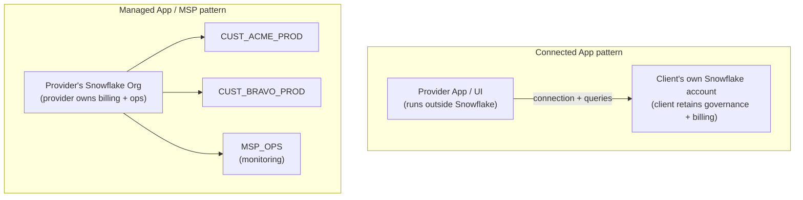
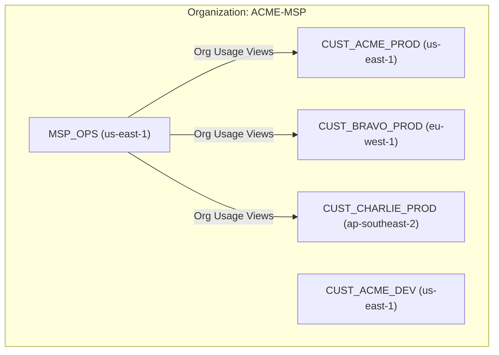
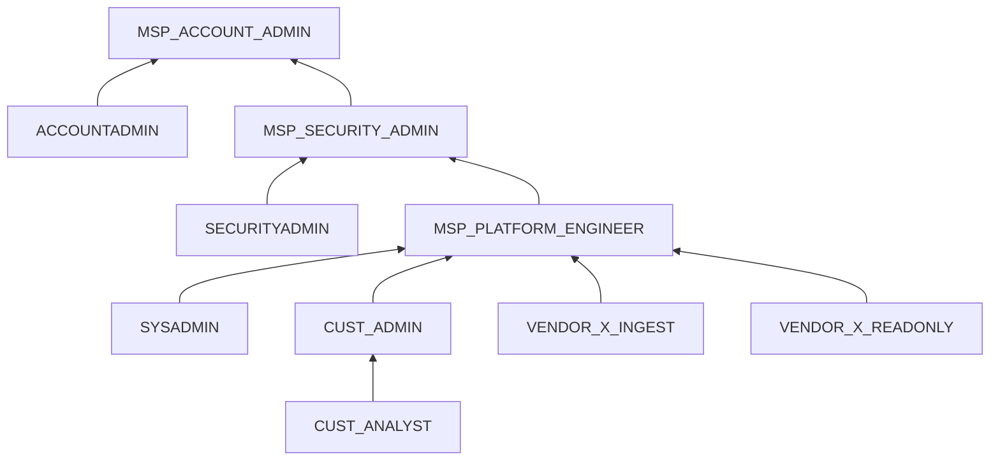
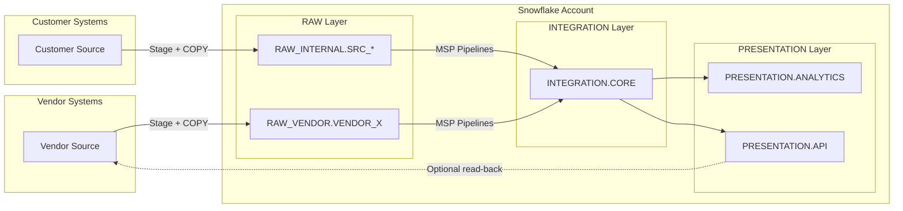
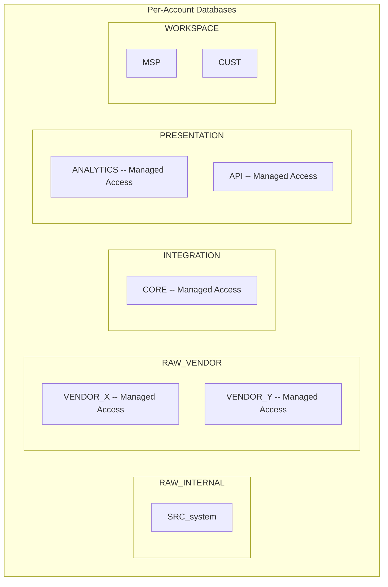
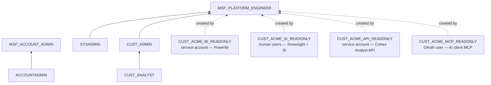

# Architecture Diagrams -- MSP Provider Guide

## Connected App vs Managed App (MSP)

Two fundamentally different patterns. Gate 1 — whether 3rd parties log directly into Snowflake and write data — is the dividing line.

| | Connected App | Managed App (MSP) |
|-|--------------|-------------------|
| Gate 1: direct login + write | No | Yes |
| Gate 2: data responsibility | No | Yes |
| Gate 3: billing entity | Client | Provider |
| Data lives in | Client's account | Provider's org |
| SPN enrollment | AI Data Cloud Products → Connected | AI Data Cloud Products → Managed Applications |

---

## Organization Layout (Managed App / MSP Pattern)

## Per-Account Role Hierarchy (Gate 1 + 2: who can write, who owns the result)

## Per-Account Data Flow (Gate 2: MSP owns everything past the RAW boundary)

## Database and Schema Layout (Gate 2: Managed Access enforces who controls grants)

---

## Customer BI Tool Access (PowerBI example)

Three options with different Gate 1 positions. All three expose only `PRESENTATION.ANALYTICS` — no RAW, INTEGRATION, or WORKSPACE data leaves the managed boundary.

```mermaid
flowchart TB
    subgraph optA ["Option A: Data Sharing (ToS §1.4a explicit carveout)"]
        direction LR
        A_PBI["PowerBI"]
        A_ACCT["Customer Snowflake Account\nor MSP-provisioned Reader Account"]
        A_SHARE["CUST_ACME_ANALYTICS_SHARE\nSecure Share"]
        A_PRES["PRESENTATION.ANALYTICS\nin MSP Account"]
        A_PBI -->|"Snowflake connector"| A_ACCT
        A_ACCT -.->|"receives share"| A_SHARE
        A_SHARE --- A_PRES
    end

    subgraph optB ["Option B: Service Account (ToS §1.1 Contractor, read-only)"]
        direction LR
        B_PBI["PowerBI + gateway"]
        B_SVC["CUST_ACME_BI_SVC\nTYPE = SERVICE\nnetwork policy = gateway IP\nno MFA"]
        B_ROLE["CUST_ACME_BI_READONLY\nSELECT only on PRESENTATION"]
        B_PRES["PRESENTATION.ANALYTICS\nin MSP Account"]
        B_PBI -->|"key-pair auth"| B_SVC
        B_SVC --- B_ROLE
        B_ROLE -->|"SELECT only"| B_PRES
    end

    subgraph optC ["Option C: Embedded BI (no Gate 1 — Connected App pattern)"]
        direction LR
        C_USER["Customer user\nno Snowflake credentials"]
        C_APP["MSP Web App\nBI embed"]
        C_BE["MSP backend\nservice account"]
        C_PRES["PRESENTATION.ANALYTICS\nin MSP Account"]
        C_USER -->|"app login only"| C_APP
        C_APP -->|"server-side"| C_BE
        C_BE -->|"SELECT only\nkey-pair auth"| C_PRES
    end
```

| | Option A: Data Sharing | Option B: Service Account | Option C: Embedded |
|-|----------------------|--------------------------|-------------------|
| Gate 1 triggered | No — §1.4(a) carveout | Yes — read-only Contractor | No — app mediates |
| Customer has Snowflake credentials | Yes, in their own account | Yes, service account only | No |
| Write access possible | No — shares are read-only | No — role is SELECT only | No |
| MSP controls schema exposure | Via share definition | Via role GRANTs | Via app layer |
| Requires customer Snowflake account | Yes (or reader account) | No | No |
| Operational complexity | Low | Low | High |

---

## Snowflake Intelligence / Cortex Analyst Access

Snowflake Intelligence (the product) requires Snowsight. Cortex Analyst (the API) does not. `CLIENT_TYPES` can block Snowsight but **does not block REST APIs** — the network policy is the real security boundary.

```mermaid
flowchart TB
    subgraph optA ["Option A: Data Sharing (customer uses SI in own account)"]
        direction LR
        A_USER["Customer analyst"]
        A_ACCT["Customer Snowflake Account\nSnowflake Intelligence enabled"]
        A_SHARE["Share: PRESENTATION views\n+ Semantic Views"]
        A_PRES["PRESENTATION + Semantic Models\nin MSP Account"]
        A_USER -->|"Snowsight in own account"| A_ACCT
        A_ACCT -.->|"shared objects"| A_SHARE
        A_SHARE --- A_PRES
    end

    subgraph optB1 ["Option B1: Snowsight User — SI Product (Gate 1, human login)"]
        direction LR
        B1_USER["Customer analyst"]
        B1_LOGIN["Snowsight login\nMSP Account\nCLIENT_TYPES = SNOWFLAKE_UI\nnetwork policy + MFA"]
        B1_ROLE["CUST_ACME_SI_READONLY\n+ SNOWFLAKE.CORTEX_USER\nSELECT only"]
        B1_PRES["PRESENTATION.ANALYTICS\n+ Semantic Models\n+ Agents"]
        B1_USER -->|"direct Snowsight login"| B1_LOGIN
        B1_LOGIN --- B1_ROLE
        B1_ROLE -->|"read + AI queries"| B1_PRES
    end

    subgraph optB2 ["Option B2: API-Only User — Cortex Analyst REST (Gate 1, no Snowsight)"]
        direction LR
        B2_APP["Customer app server"]
        B2_SVC["CUST_ACME_API_SVC\nTYPE = SERVICE\nCLIENT_TYPES = DRIVERS\nnetwork policy = app server IP"]
        B2_ROLE["CUST_ACME_API_READONLY\n+ SNOWFLAKE.CORTEX_ANALYST_USER\nSELECT only"]
        B2_PRES["PRESENTATION.ANALYTICS\n+ Semantic Models"]
        B2_APP -->|"REST API\nkey-pair auth"| B2_SVC
        B2_SVC --- B2_ROLE
        B2_ROLE -->|"API queries only"| B2_PRES
    end

    subgraph optC ["Option C: Embedded — MSP calls Cortex Analyst API (no Gate 1)"]
        direction LR
        C_USER["Customer user\nno Snowflake credentials"]
        C_APP["MSP Web App\nchat interface"]
        C_BE["MSP backend\nservice account\n+ SNOWFLAKE.CORTEX_USER"]
        C_PRES["PRESENTATION.ANALYTICS\n+ Semantic Models"]
        C_USER -->|"app login only"| C_APP
        C_APP -->|"Cortex Analyst\nREST API"| C_BE
        C_BE -->|"SELECT + AI\nkey-pair auth"| C_PRES
    end
```

| | Option A: Data Sharing | Option B1: Snowsight User | Option B2: API-Only | Option C: Embedded |
|-|----------------------|-------------------------|---------------------|-------------------|
| Gate 1 triggered | No — §1.4(a) carveout | Yes — human login | Yes — credentials issued | No — app mediates |
| Snowsight access | In their own account | Yes — required for SI | No — `CLIENT_TYPES = DRIVERS` | No |
| Cortex Analyst API callable | In their own account | Yes — `CLIENT_TYPES` does not block APIs | Yes — primary access path | Yes — MSP-mediated |
| MFA required | In customer's own account | Yes — MSP-enforced | No — `TYPE = SERVICE`, key-pair | N/A |
| Write access possible | No — shares are read-only | No — role is SELECT only | No — role is SELECT only | No |
| MSP maintains semantic models | In MSP account (shared) | In MSP account (central) | In MSP account | In MSP account |
| Customer needs own SF account | Yes | No | No | No |

> **`CLIENT_TYPES` is not a security boundary.** Per Snowflake docs: *"It should not be used as the sole control to establish a security boundary. Notably, it does not restrict access to the Snowflake REST APIs."* For B1 users, the network policy (IP range) is your real enforcement. For B2, `TYPE = SERVICE` + key-pair auth + no password means Snowsight login is impossible anyway — `CLIENT_TYPES` is defense-in-depth, not primary control.

### Analytics Role Position in the Hierarchy

`CUST_ACME_BI_READONLY`, `CUST_ACME_SI_READONLY`, `CUST_ACME_API_READONLY`, and `CUST_ACME_MCP_READONLY` are flat grant roles — they do not sit in the customer role hierarchy. `MSP_PLATFORM_ENGINEER` creates and owns them but they are not granted to `CUST_ADMIN`.

---

## AI Client Access Patterns (MCP / Cortex Code)

Three options for connecting AI clients (Claude, Cortex Code CLI, Cursor, etc.) to MSP-managed Snowflake data. These extend the BI/SI options above with MCP-based tooling.

```mermaid
flowchart TB
    subgraph optD1 ["Option D1: Managed MCP Server + OAuth (Gate 1, human login)"]
        direction LR
        D1_CLIENT["AI client\nClaude.ai / ChatGPT / etc."]
        D1_OAUTH["OAuth redirect\nSnowsight login"]
        D1_MCP["MCP SERVER object\nCORTEX_ANALYST_MESSAGE tool"]
        D1_SV["Semantic View\nPRESENTATION.ANALYTICS"]
        D1_CLIENT -->|"OAuth flow"| D1_OAUTH
        D1_OAUTH -->|"token"| D1_MCP
        D1_MCP -->|"tools/call"| D1_SV
    end

    subgraph optD2 ["Option D2: Client-Side MCP / CoCo CLI (Gate 1, credentials issued)"]
        direction LR
        D2_CLIENT["AI client\nClaude Desktop / CoCo / Cursor"]
        D2_LOCAL["Local MCP server\nor CoCo process"]
        D2_SVC["CUST_ACME_API_SVC\nTYPE = SERVICE\nkey-pair auth\nnetwork policy"]
        D2_DATA["PRESENTATION.ANALYTICS\nSemantic Views"]
        D2_CLIENT -->|"local process"| D2_LOCAL
        D2_LOCAL -->|"key-pair auth"| D2_SVC
        D2_SVC -->|"SELECT only"| D2_DATA
    end

    subgraph optD3 ["Option D3: MSP-Mediated MCP (no Gate 1)"]
        direction LR
        D3_CLIENT["Customer AI client"]
        D3_MSP["MSP MCP endpoint\nDocker / SPCS"]
        D3_BE["MSP service account\nkey-pair auth"]
        D3_DATA["PRESENTATION.ANALYTICS\nSemantic Views"]
        D3_CLIENT -->|"HTTP to MSP"| D3_MSP
        D3_MSP -->|"MSP credentials"| D3_BE
        D3_BE -->|"SELECT only"| D3_DATA
    end
```

| | Option D1: Managed MCP + OAuth | Option D2: Client-Side MCP / CoCo | Option D3: MSP-Mediated MCP |
|-|-------------------------------|----------------------------------|---------------------------|
| Gate 1 triggered | Yes — human OAuth login | Yes — credentials issued | No — MSP mediates |
| Who authenticates to Snowflake | Customer user via OAuth | Customer's service account / PAT | MSP service account |
| Customer has SF credentials | Yes, OAuth token | Yes, key-pair or PAT | No |
| MCP server runs where | In Snowflake (managed) | On customer's machine | In MSP infra |
| AI clients supported | Claude.ai web, any OAuth MCP client | Claude Desktop, CoCo CLI, Cursor, Codex | Any (customer hits MSP endpoint) |
| Write access risk | **High** — OAuth secondary roles activate ALL user roles | Low — service account has one role | None — MSP controls |
| MSP dev effort | Low–Medium | Low (provide config YAML) | Medium–High |
| Closest existing option | B1 (human login) | B2 (API service account) | C (embedded) |

> **OAuth secondary roles are the #1 MSP risk in D1.** `OAUTH_USE_SECONDARY_ROLES = IMPLICIT` activates the user's default secondary roles (per the `DEFAULT_SECONDARY_ROLES` property, which defaults to `('ALL')` for new users). If any activated role has write access — even inherited — the AI client can write data. The MSP must either set `DEFAULT_SECONDARY_ROLES = ()` on the MCP user or ensure the user has **only** the MCP readonly role. PATs (used in D2) do not evaluate secondary roles and are safer for MSP use. See README.md Option D1 for full context.
