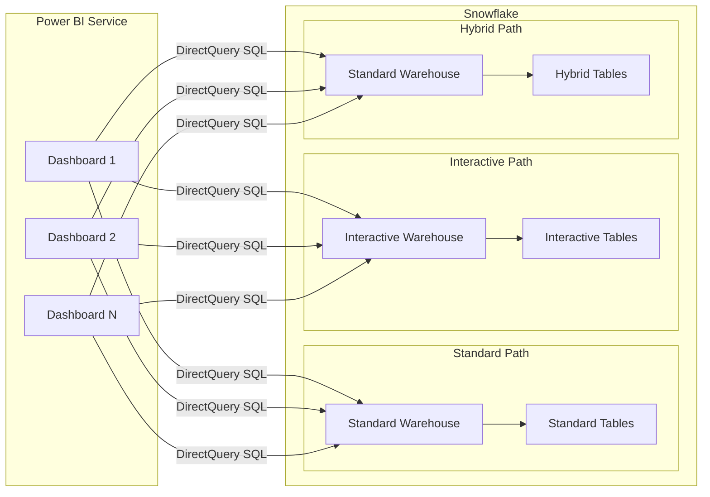
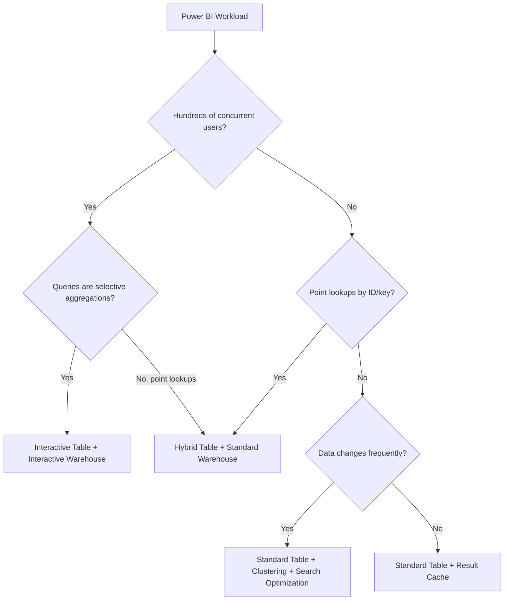
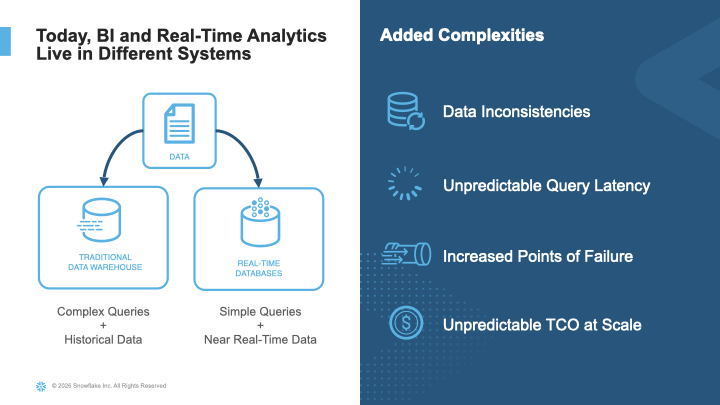
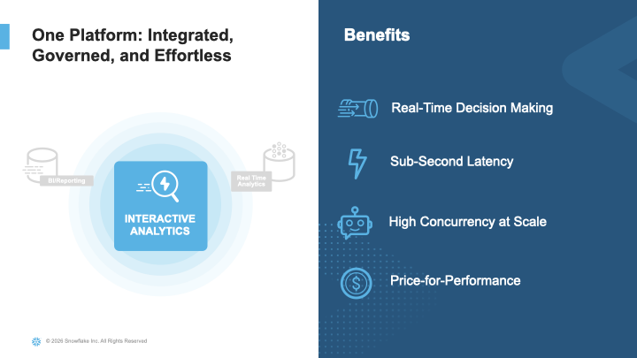
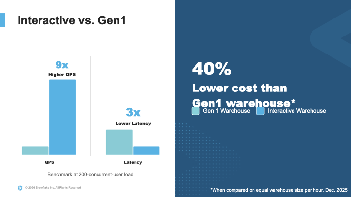
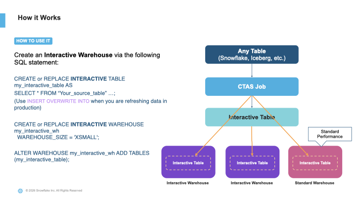
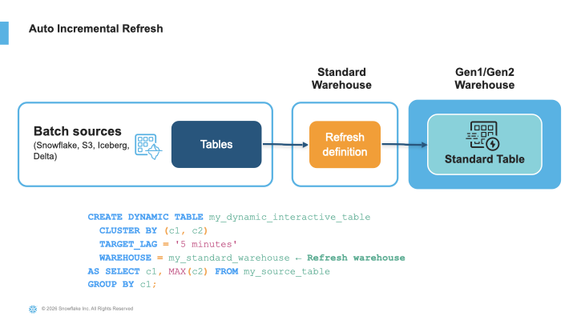
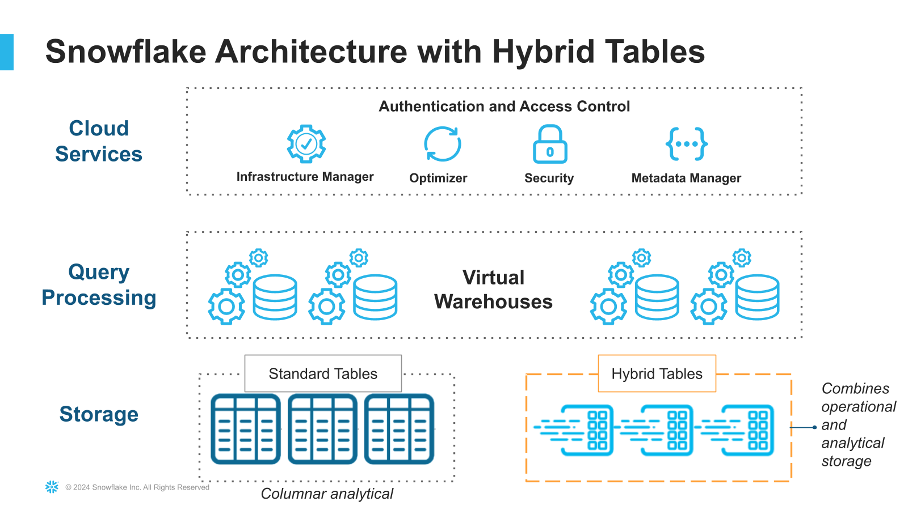
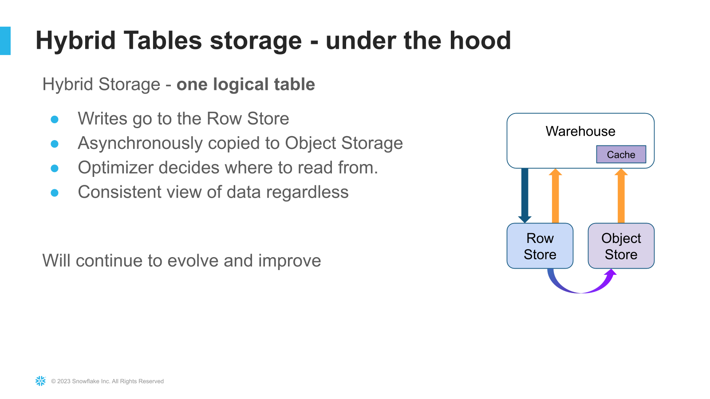

# Power BI Live Query at Scale on Snowflake

Inspired by the complaint every data team hears: *"Power BI is slow on Snowflake -- our dashboards take 10 seconds to load."*

Power BI DirectQuery sends live SQL to Snowflake on every slicer change, filter click, and page load. At low concurrency that works fine. At hundreds of concurrent users across dozens of dashboards, it becomes a high-concurrency, low-latency workload that standard warehouses were not designed for. This guide walks through the Snowflake table types, warehouse types, and optimization techniques that make live Power BI queries fast at scale.

**Author:** SE Community + Cortex Code
**Created:** 2026-03-24 | **Expires:** 2026-04-23 | **Status:** ACTIVE

> **No support provided.** This content is for reference only. Review and validate before applying to any production workflow.



**Time:** ~30 minutes to read | **Result:** Architecture decision for your Power BI + Snowflake workload

## In This Guide

| # | Section | What You Get |
|---|---------|-------------|
| 1 | [Cost Realities](#cost-realities) | Billing model for each table type |
| 2 | [Decision Framework](#decision-framework) | Flowchart to pick the right architecture |
| 3 | [What NOT to Do](#what-not-to-do) | Five anti-patterns that cause "Power BI is slow" complaints |
| 4 | [Interactive Tables Deep Dive](#interactive-tables-deep-dive) | [Why Interactive Analytics](#why-interactive-analytics), architecture visuals, create, refresh, size, and scale |
| 5 | [Hybrid Tables for Operational Dashboards](#hybrid-tables-for-operational-dashboards) | [What Are Hybrid Tables](#what-are-hybrid-tables), architecture visuals, point-lookup pattern with enforced keys and indexes |
| 6 | [Power BI Configuration](#power-bi-configuration) | SSO, DirectQuery setup, query folding patterns |
| 7 | [Monitoring and Tuning](#monitoring-and-tuning) | Query history, partition efficiency, scaling triggers |
| 8 | [Beyond Power BI: Cortex Analyst](#beyond-power-bi-cortex-analyst) | AI-assisted analytics as a complement to BI |

## Who This Is For

Data engineers and architects connecting Power BI to Snowflake at scale. You should be comfortable with SQL and Snowflake warehouse management. No prior experience with interactive tables or hybrid tables is required.

**Already know your table type?** Jump to [Interactive Tables Deep Dive](#interactive-tables-deep-dive) or [Hybrid Tables for Operational Dashboards](#hybrid-tables-for-operational-dashboards).

**Using Microsoft Fabric?** See the companion guide [Power BI + Snowflake via OneLake and Iceberg](../guide-powerbi-onelake-iceberg/) for the Direct Lake path where Power BI reads Iceberg files from OneLake without Snowflake compute.

---

## Cost Realities

Read this before choosing an architecture. The table type you pick determines your billing model.

| Approach | Compute Cost | Storage Cost | Minimum Commitment |
|----------|-------------|-------------|-------------------|
| Interactive table + interactive warehouse | Warehouse runs continuously; 24-hour minimum auto-suspend | Larger than standard tables (additional indexes and data encoding) | Always-on compute for production workloads |
| Hybrid table + standard warehouse | Standard warehouse billing (60-second auto-suspend available) | Larger than standard tables (row-store primary format) | None beyond standard warehouse |
| Standard table + standard warehouse | Standard warehouse billing | Standard columnar storage (smallest footprint) | None |
| Standard table + result cache | Zero compute when cache hits (cache valid 24 hours) | Standard columnar storage | None |

> [!IMPORTANT]
> **Interactive warehouses are the highest-performance option but also the highest fixed cost.** They are designed for workloads that justify 24/7 compute -- hundreds of concurrent dashboard users generating thousands of queries per hour. If your workload is lighter, a standard warehouse with clustering and caching may be enough.

---

## Decision Framework

Match your workload pattern to the right Snowflake architecture.



| Workload Pattern | Recommended Approach | Why |
|-----------------|---------------------|-----|
| Dashboard aggregations, many concurrent users | Interactive table + interactive warehouse | Purpose-built for high-concurrency, low-latency SELECT with SSD caching and sub-second response |
| Operational lookups by ID or key | Hybrid table + standard warehouse + indexes | Row-oriented storage with enforced primary keys and secondary indexes for point reads |
| Mixed analytics with occasional BI | Standard table + clustering + search optimization | Columnar storage optimized for scan-heavy analytics; clustering and SOS cover the BI queries |
| Infrequent or low-concurrency reports | Standard table + result cache | Result cache serves identical queries for free for 24 hours; warehouse only wakes on cache miss |

> [!TIP]
> **Most Power BI DirectQuery workloads at scale fall into the first row.** The rest of this guide spends the most time there.

---

## What NOT to Do

> [!WARNING]
> These anti-patterns cause the majority of "Power BI is slow on Snowflake" complaints.

### 1. DirectQuery on unclustered standard tables

Power BI generates `WHERE` clauses from slicer selections. Without clustering aligned to those filter columns, Snowflake scans every micro-partition. A 500M-row fact table with no clustering on the date column will full-scan on every date filter change.

**Fix:** Add `CLUSTER BY` on the columns Power BI filters most (typically date and one or two dimension keys). Or move to interactive tables where `CLUSTER BY` is required.

### 2. Import mode when DirectQuery + interactive tables would be better

Import mode copies data into Power BI's in-memory engine. It is fast for queries but introduces data staleness (refresh schedules) and capacity limits (1 GB per dataset on Power BI Pro shared capacity; higher on Premium/Fabric -- check current Microsoft documentation for your SKU). If your data changes hourly and users expect current numbers, Import mode forces a tradeoff between freshness and cost.

**Fix:** DirectQuery with interactive tables gives both freshness (via `TARGET_LAG` auto-refresh) and sub-second query speed. Evaluate whether the interactive warehouse cost is less than the Import refresh compute + the business cost of stale data.

### 3. Large scan queries through interactive warehouses

Interactive warehouses enforce a 5-second query timeout on SELECT statements. Queries that scan wide tables (`SELECT *`), join two large fact tables, or filter on high-cardinality columns without clustering will time out.

**Fix:** Design interactive tables with selective queries in mind: few columns, focused `CLUSTER BY`, and `WHERE` clauses that match the clustering. Use interactive materialized views for common aggregation patterns.

### 4. Oversized interactive warehouses

Interactive warehouse sizing is based on working-set size (the portion of data your queries actually touch), not total data volume. If your queries only hit the last 7 days of a 2-year table, size the warehouse for 7 days of data, not 2 years.

**Fix:** Start with the sizing guide in the [interactive tables section](#choosing-an-interactive-warehouse-size) and benchmark from there.

### 5. Hybrid tables for aggregation-heavy dashboards

Hybrid tables use row-oriented primary storage optimized for point reads and single-row operations. Aggregation queries (`SUM`, `AVG`, `GROUP BY` across millions of rows) perform better on columnar storage -- either standard tables or interactive tables.

**Fix:** Use hybrid tables for the operational lookup pattern (e.g., customer detail by ID). Use interactive tables for the dashboard aggregation pattern.

---

## Interactive Tables Deep Dive

Interactive tables and interactive warehouses (GA December 2025) are designed specifically for the workload pattern Power BI DirectQuery creates: many concurrent, short, selective queries.

### Why Interactive Analytics

Traditional BI architectures split real-time and analytical workloads across separate systems -- a data warehouse for complex queries and a dedicated low-latency database for dashboards. This creates data inconsistencies, unpredictable latency, increased points of failure, and unpredictable TCO at scale.



Power BI DirectQuery at scale creates exactly this split-system pressure. Interactive tables and warehouses eliminate it by serving low-latency queries from the same governed Snowflake platform where the data already lives -- no separate serving layer, no data movement, no governance gaps.



The performance difference is substantial. In internal benchmarks at 200-concurrent-user load, interactive warehouses deliver 9x higher queries per second and 3x lower latency than standard (Gen1) warehouses, at 40% lower cost on equal warehouse sizes.



### How It Works



1. You create an **interactive table** with a required `CLUSTER BY` clause, populated from a source table
2. You create an **interactive warehouse** and associate the interactive table with it
3. The interactive warehouse caches table data on local SSD for sub-second reads
4. Power BI queries the interactive table through the interactive warehouse

The interactive warehouse cannot query standard tables. If a Power BI report needs both interactive tables and standard tables, the connection must switch warehouses (typically by using separate data sources in the Power BI model).

### Creating an Interactive Table

```sql
CREATE INTERACTIVE TABLE sales_summary
    CLUSTER BY (sale_date, region)
AS
    SELECT
        sale_date,
        region,
        product_category,
        SUM(quantity) AS total_quantity,
        SUM(revenue) AS total_revenue,
        COUNT(*) AS transaction_count
    FROM raw_sales
    GROUP BY sale_date, region, product_category;
```

> [!TIP]
> The `CLUSTER BY` columns should match the columns Power BI filters on most. If your dashboards have a date slicer and a region dropdown, cluster on `(sale_date, region)`.

### Auto-Refresh with TARGET_LAG



To keep the interactive table current with its source, add `TARGET_LAG` and specify a standard warehouse for refresh operations:

```sql
CREATE INTERACTIVE TABLE sales_summary
    CLUSTER BY (sale_date, region)
    TARGET_LAG = '10 minutes'
    WAREHOUSE = sfe_etl_wh
AS
    SELECT
        sale_date,
        region,
        product_category,
        SUM(quantity) AS total_quantity,
        SUM(revenue) AS total_revenue,
        COUNT(*) AS transaction_count
    FROM raw_sales
    GROUP BY sale_date, region, product_category;
```

The refresh warehouse is a standard warehouse (not the interactive warehouse). This separates refresh compute from query-serving compute. Choose a `TARGET_LAG` that balances data freshness against refresh cost -- the same considerations as dynamic table target lag apply. Note that `TARGET_LAG` on interactive tables requires a minimum of **60 seconds**, and `WAREHOUSE` is required whenever `TARGET_LAG` is set.

### Interactive Materialized Views

For aggregation patterns that Power BI runs repeatedly (e.g., a KPI card summing total revenue by region), create an interactive materialized view:

```sql
CREATE INTERACTIVE MATERIALIZED VIEW mv_revenue_by_region
AS
    SELECT
        region,
        SUM(total_revenue) AS region_revenue,
        SUM(total_quantity) AS region_quantity
    FROM sales_summary
    GROUP BY region;
```

Add both the materialized view and its base table to the interactive warehouse:

```sql
ALTER WAREHOUSE sfe_powerbi_iw ADD TABLES (mv_revenue_by_region, sales_summary);
```

Interactive materialized views must be based on a single interactive table. Joins are not supported in the view definition.

### Creating and Configuring the Interactive Warehouse

```sql
CREATE INTERACTIVE WAREHOUSE sfe_powerbi_iw
    TABLES (sales_summary, mv_revenue_by_region)
    WAREHOUSE_SIZE = 'XSMALL'
    AUTO_SUSPEND = 86400
    AUTO_RESUME = TRUE;

ALTER WAREHOUSE sfe_powerbi_iw RESUME;
```

After resuming, the warehouse begins warming its SSD cache. Initial queries will be slower until the cache is populated -- this can take minutes to over an hour depending on data volume.

### Choosing an Interactive Warehouse Size

Size the warehouse based on your **working set** -- the data your queries actually touch, not total table size. The following ranges are approximate starting points based on field experience; benchmark with your actual workload.

| Working Set | Warehouse Size |
|------------|---------------|
| Less than ~350 GB | XSMALL |
| ~350 GB - ~600 GB | SMALL |
| ~600 GB - ~1.4 TB | MEDIUM |
| ~1.4 TB - ~2.7 TB | LARGE |
| ~2.7 TB - ~5.5 TB | XLARGE |
| ~5.5 TB - ~11 TB | 2XLARGE |
| ~11 TB - ~22 TB | 3XLARGE |
| ~22 TB - ~44 TB | 4XLARGE |
| ~44 TB - ~88 TB | 5XLARGE |
| ~88 TB - ~176 TB | 6XLARGE |

> [!NOTE]
> These ranges are from the [official Snowflake documentation](https://docs.snowflake.com/en/sql-reference/sql/create-interactive-warehouse). Actual performance depends on your data distribution and query patterns -- always benchmark.

If your queries filter on the last 7 days and your table holds 2 years, the working set is roughly `(7/730) * total_table_size`. Start with the size that covers your working set and benchmark.

### Scaling for Concurrency

For high user counts, use multi-cluster interactive warehouses:

```sql
ALTER WAREHOUSE sfe_powerbi_iw SET
    MIN_CLUSTER_COUNT = 1
    MAX_CLUSTER_COUNT = 4;
```

Each cluster serves queries independently. If queries are short and simple, increase `MAX_CONCURRENCY_LEVEL` per warehouse to allow more concurrent queries per cluster.

<details>
<summary><strong>Current Limitations (Verified March 2026)</strong></summary>

These constraints are unchanged since GA. Plan your architecture around them.

- **Max 10 interactive tables per warehouse** -- design your data model to stay within this budget. Use pre-aggregated summary tables rather than many granular tables.
- **No UPDATE or DELETE** -- only `INSERT OVERWRITE` is supported for data mutation. Use `TARGET_LAG` auto-refresh for ongoing updates from source tables.
- **No streams** -- you cannot create a stream on an interactive table.
- **No dynamic tables as consumers** -- an interactive table cannot be a base table for a dynamic table.
- **Cannot query standard tables** -- an interactive warehouse can only query interactive tables and interactive materialized views. Switch to a standard warehouse with `USE WAREHOUSE` to query standard tables.
- **No fail-safe** -- Time Travel still works, but fail-safe recovery is not available.
- **Join queries supported** -- added post-GA. You can join interactive tables within the same interactive warehouse.

</details>

---

## Hybrid Tables for Operational Dashboards

Use hybrid tables when the Power BI workload is dominated by point lookups -- retrieving one or a few rows by a key value. This is common in operational dashboards (e.g., "show me customer 12345's account details").

### What Are Hybrid Tables

Hybrid tables are a specialized table type in Snowflake that adds row-oriented primary storage with enforced primary keys, foreign keys, secondary indexes, and referential integrity -- capabilities traditionally requiring a separate operational database. They sit alongside standard columnar tables within the same Snowflake architecture, governed by the same role-based access controls and sharing the same query engine.



Under the hood, hybrid tables maintain a dual storage model. Writes land in a fast row store optimized for single-row inserts and updates, while data is asynchronously compacted into the columnar object store for analytical queries. This means point lookups on primary or secondary keys resolve in single-digit milliseconds, while broader scans still benefit from Snowflake's columnar engine.



### When to Choose Hybrid Over Interactive

| Signal | Hybrid Table | Interactive Table |
|--------|-------------|------------------|
| Primary query pattern | `WHERE customer_id = ?` | `SELECT region, SUM(revenue) ... GROUP BY region` |
| Row count per query | 1-100 rows | Thousands of rows (aggregated) |
| Write pattern | Frequent single-row updates | Batch refresh from source |
| Concurrency model | Row-level locking | Cache-based serving |

### Creating a Hybrid Table with Indexes

```sql
CREATE HYBRID TABLE customer_accounts (
    customer_id NUMBER PRIMARY KEY,
    account_name VARCHAR(200) NOT NULL,
    region VARCHAR(50),
    tier VARCHAR(20),
    balance NUMBER(18,2),
    last_activity_date DATE,
    INDEX idx_region (region),
    INDEX idx_tier (tier)
);
```

The primary key is required and enforced. Secondary indexes on `region` and `tier` accelerate Power BI filter queries that use those columns.

### Querying Hybrid Tables

Hybrid tables use standard warehouses. No special warehouse type is required:

```sql
USE WAREHOUSE sfe_powerbi_wh;

SELECT customer_id, account_name, balance, last_activity_date
FROM customer_accounts
WHERE customer_id = 12345;
```

For Power BI, this means you can mix hybrid tables and standard tables in the same data source connection (same warehouse). This is simpler than the interactive table approach, which requires a dedicated warehouse type.

### Hybrid Table Cost Considerations

As of March 2026, hybrid table billing has been simplified to two categories:

- **Hybrid storage** -- row-oriented format is larger than columnar micro-partitions; indexes add overhead but are critical for point-lookup performance.
- **Warehouse compute** -- standard billing (60-second auto-suspend, per-second billing). Hybrid table requests are no longer a separate billing category.

See [Evaluate cost for hybrid tables](https://docs.snowflake.com/en/user-guide/tables-hybrid-cost) for current pricing details.

---

## Power BI Configuration

### SSO with External OAuth

Power BI connects to Snowflake using External OAuth for SSO. Create the security integration in Snowflake:

```sql
CREATE SECURITY INTEGRATION powerbi_sso
    TYPE = EXTERNAL_OAUTH
    ENABLED = TRUE
    EXTERNAL_OAUTH_TYPE = AZURE
    EXTERNAL_OAUTH_ISSUER = '<your-entra-tenant-url>'
    EXTERNAL_OAUTH_JWS_KEYS_URL = 'https://login.windows.net/common/discovery/keys'
    EXTERNAL_OAUTH_AUDIENCE_LIST = (
        'https://analysis.windows.net/powerbi/connector/Snowflake',
        'https://analysis.windows.net/powerbi/connector/snowflake'
    )
    EXTERNAL_OAUTH_TOKEN_USER_MAPPING_CLAIM = 'upn'
    EXTERNAL_OAUTH_SNOWFLAKE_USER_MAPPING_ATTRIBUTE = 'login_name';
```

Replace `<your-entra-tenant-url>` with your Microsoft Entra tenant URL (format: `https://sts.windows.net/<tenant-id>/` -- include the trailing slash).

Both URL cases in `EXTERNAL_OAUTH_AUDIENCE_LIST` are required -- Microsoft may send either.

### Network Policy on the Integration (January 2026)

> [!NOTE]
> As of January 2026, you can associate a network policy directly with the External OAuth integration instead of relying on an account-level policy.

```sql
ALTER SECURITY INTEGRATION powerbi_sso
    SET NETWORK_POLICY = powerbi_network_policy;
```

This scopes the IP restrictions to Power BI traffic only, without affecting other connections to the Snowflake account.

### DirectQuery vs. Import vs. Dual

| Mode | How It Works | Best For |
|------|-------------|----------|
| DirectQuery | Every interaction sends live SQL to Snowflake | Current data, interactive tables, hybrid tables |
| Import | Copies data into Power BI's in-memory engine on a schedule | Small datasets with infrequent changes |
| Dual | Table available in both modes; Power BI chooses per query | Mixed workloads (rarely needed with interactive tables) |

**For this guide's use case -- live queries at scale -- use DirectQuery.** Import mode introduces staleness and capacity limits that interactive tables eliminate.

### Query Folding

Power BI's Power Query engine translates M expressions into SQL before sending them to Snowflake. When a transformation "folds," it becomes part of the SQL query and executes in Snowflake. When it does not fold, Power BI pulls raw data and processes it locally -- defeating the purpose of DirectQuery.

**Patterns that fold well:**
- Column selection, renaming, reordering
- Row filtering with comparison operators (`=`, `<>`, `>`, `<`, `>=`, `<=`)
- `GROUP BY` with standard aggregations (`SUM`, `COUNT`, `AVG`, `MIN`, `MAX`)
- `TOP N` / row limiting
- Sorting (`ORDER BY`)
- Inner and left joins on key columns

**Patterns that may not fold:**
- Custom M functions or complex transformations
- Merging queries from different data sources
- Pivot/unpivot operations (depends on complexity)
- String manipulations beyond basic LIKE patterns

> [!TIP]
> When in doubt, right-click a step in Power Query Editor and check "View Native Query." If the option is grayed out, that step did not fold.

For comprehensive query folding guidance, see [Microsoft's query folding documentation](https://learn.microsoft.com/en-us/power-bi/guidance/power-query-folding).

---

## Monitoring and Tuning

### Query History for Power BI Traffic

Identify Power BI queries by joining `QUERY_HISTORY` with the `SESSIONS` view, which contains the `CLIENT_APPLICATION_ID` column:

<details>
<summary>SQL: Query History for Power BI Traffic</summary>

```sql
SELECT
    qh.query_id,
    qh.query_text,
    qh.warehouse_name,
    qh.execution_time,
    qh.partitions_scanned,
    qh.partitions_total,
    qh.bytes_spilled_to_local_storage,
    qh.bytes_spilled_to_remote_storage
FROM SNOWFLAKE.ACCOUNT_USAGE.QUERY_HISTORY qh
JOIN SNOWFLAKE.ACCOUNT_USAGE.SESSIONS s
    ON qh.session_id = s.session_id
WHERE TRIM(s.client_application_id) IN ('Power BI Desktop', 'Power BI Service', 'Power BI Gateway')
    AND qh.start_time >= DATEADD('hour', -24, CURRENT_TIMESTAMP())
ORDER BY qh.execution_time DESC
LIMIT 50;
```

</details>

### Partition Efficiency

For standard and interactive tables, check how much data Snowflake is actually scanning versus skipping:

<details>
<summary>SQL: Partition Efficiency Check</summary>

```sql
SELECT
    qh.query_id,
    qh.query_text,
    qh.partitions_scanned,
    qh.partitions_total,
    ROUND(qh.partitions_scanned / NULLIF(qh.partitions_total, 0) * 100, 1) AS pct_scanned
FROM SNOWFLAKE.ACCOUNT_USAGE.QUERY_HISTORY qh
JOIN SNOWFLAKE.ACCOUNT_USAGE.SESSIONS s
    ON qh.session_id = s.session_id
WHERE TRIM(s.client_application_id) IN ('Power BI Desktop', 'Power BI Service', 'Power BI Gateway')
    AND qh.partitions_total > 0
    AND qh.start_time >= DATEADD('hour', -24, CURRENT_TIMESTAMP())
QUALIFY ROW_NUMBER() OVER (ORDER BY qh.partitions_scanned DESC) <= 20;
```

</details>

If `pct_scanned` is consistently above 50%, your clustering does not match your Power BI filter patterns. Revisit the `CLUSTER BY` columns.

### Interactive Warehouse Cache Monitoring

After resuming an interactive warehouse, monitor cache warm-up by running a representative query repeatedly and tracking latency. Initial queries will be slower; latency should stabilize as the cache warms. Expect warm-up to take minutes for small tables and up to an hour for large ones.

There is no direct cache-hit-rate metric exposed today. Use query latency trends as a proxy: stable low latency means the working set is cached.

### Scaling Triggers

| Symptom | Likely Cause | Action |
|---------|-------------|--------|
| Single query too slow | Insufficient compute or poor clustering | Increase warehouse size or improve `CLUSTER BY` alignment |
| Sudden tail latency spikes | Cache eviction from working set change | Increase warehouse size to fit more data in cache |
| Query queuing | Concurrency exceeds single-cluster capacity | Add clusters with `MAX_CLUSTER_COUNT` |
| 5-second timeouts on interactive warehouse | Query scans too much data | Narrow the query, improve clustering, or use materialized views |
| High `pct_scanned` on standard tables | No clustering or wrong clustering columns | Add `CLUSTER BY` aligned to Power BI filter columns |

---

## Beyond Power BI: Cortex Analyst

For organizations exploring AI-assisted analytics alongside traditional BI, Snowflake's Cortex Analyst provides a complementary approach. Rather than users building Power BI reports, they ask questions in natural language and Cortex Analyst generates SQL against semantic views.

Semantic views define the logical data model once -- dimensions, measures, relationships, and business descriptions. Cortex Analyst uses this metadata to generate SQL that naturally aligns with clustering and filter patterns, often producing more efficient queries than ad-hoc report building.

This is not a replacement for Power BI. It is a parallel path for ad-hoc exploration that reduces the number of "one-off report" requests that strain BI infrastructure. For details, see the [Cortex Analyst documentation](https://docs.snowflake.com/en/user-guide/snowflake-cortex/cortex-analyst) and the [semantic views overview](https://docs.snowflake.com/en/user-guide/views-semantic/overview).

---

<details>
<summary><strong>References</strong></summary>

| Resource | URL |
|----------|-----|
| Interactive Tables and Warehouses | https://docs.snowflake.com/en/user-guide/interactive |
| CREATE INTERACTIVE TABLE | https://docs.snowflake.com/en/sql-reference/sql/create-interactive-table |
| CREATE INTERACTIVE WAREHOUSE | https://docs.snowflake.com/en/sql-reference/sql/create-interactive-warehouse |
| Hybrid Tables | https://docs.snowflake.com/en/user-guide/tables-hybrid |
| Index Hybrid Tables | https://docs.snowflake.com/en/user-guide/tables-hybrid-index |
| Hybrid Table Best Practices | https://docs.snowflake.com/en/user-guide/tables-hybrid-best-practices |
| Power BI SSO to Snowflake | https://docs.snowflake.com/en/user-guide/oauth-powerbi |
| Clustering Keys | https://docs.snowflake.com/en/user-guide/tables-clustering-keys |
| Search Optimization Service | https://docs.snowflake.com/en/user-guide/search-optimization-service |
| Query Acceleration Service | https://docs.snowflake.com/en/user-guide/query-acceleration-service |
| Result Caching | https://docs.snowflake.com/en/user-guide/querying-persisted-results |
| Power BI Query Folding (Microsoft) | https://learn.microsoft.com/en-us/power-bi/guidance/power-query-folding |
| Cortex Analyst | https://docs.snowflake.com/en/user-guide/snowflake-cortex/cortex-analyst |
| Semantic Views | https://docs.snowflake.com/en/user-guide/views-semantic/overview |
| Companion: OneLake + Iceberg Path | ../guide-powerbi-onelake-iceberg/ |

</details>
