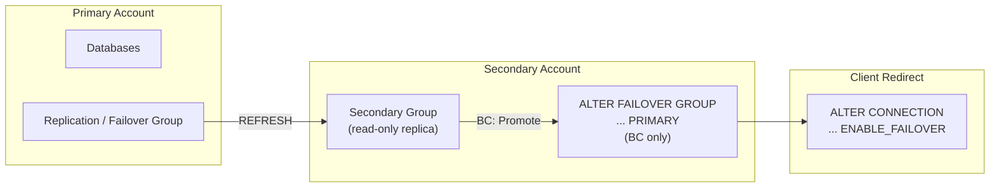

# Replication Workbook

Inspired by a real operational question: *"How do I set up cross-region replication for disaster recovery -- and what's the difference between Enterprise read-only replicas and Business Critical failover?"*

Step-by-step SQL workbooks for setting up Snowflake replication. Copy the right SQL file into a Snowsight worksheet, follow the comments, run statements one at a time. Enterprise gets you read-only replicas. Business Critical gets you promotion, client redirect, and a full failover runbook.

**Author:** SE Community
**Last Updated:** 2026-03-02 | **Expires:** 2026-04-02 | **Status:** ACTIVE

> **No support provided.** This code is for reference only. Review, test, and modify before any production use.

---

## Which Guide Do You Need?

| Goal | Guide | Edition |
|------|-------|---------|
| Read-only replicas for reporting or backup | [`enterprise_replication_guide.sql`](enterprise_replication_guide.sql) (12 steps) | Enterprise / Standard |
| Failover with promotion and client redirect | [`business_critical_failover_guide.sql`](business_critical_failover_guide.sql) (15 steps) | Business Critical |
| Account setup (run first) | [`account_setup_prerequisite_guide.sql`](account_setup_prerequisite_guide.sql) (7 steps) | Any |

> [!TIP]
> **Pattern demonstrated:** Replication groups (Enterprise) vs failover groups (Business Critical) -- the operational patterns for DR and business continuity.

---

## Architecture

---

<strong>Quick Start</strong>

1. Open the prerequisite guide in a Snowsight worksheet and run steps 1-7
2. Open the Enterprise or Business Critical guide
3. Run statements step by step, following the inline comments
4. Validate replication status at each checkpoint

<strong>Troubleshooting</strong>

| Symptom | Fix |
|---------|-----|
| Permission errors | Switch to ACCOUNTADMIN or a role with CREATE REPLICATION GROUP. |
| Cross-region replication fails | Ensure both accounts are in the same organization and replication is enabled. |
| Refresh takes too long | Check data volume and network conditions. Initial refresh is the slowest. |

## References

- [Replication and Failover Groups](https://docs.snowflake.com/en/user-guide/replication-intro)
- [CREATE REPLICATION GROUP](https://docs.snowflake.com/en/sql-reference/sql/create-replication-group)

## Related Projects

- [`tool-dr-cost-agent`](../tool-dr-cost-agent/) -- Estimate DR replication costs before setting up failover groups
