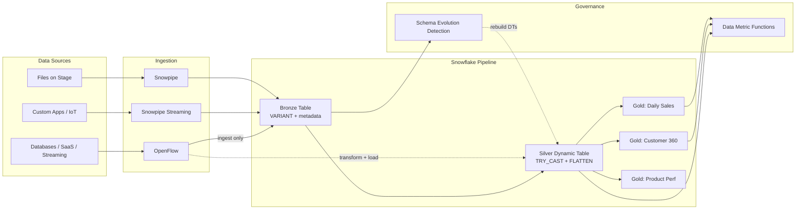

# Semi-Structured Data Pipeline Architecture


> [!CAUTION]
> **No support provided.** This content is for reference only. Review and validate before applying to any production workflow.

**Pair-programmed by:** SE Community + Cortex Code
**Created:** 2026-03-25 | **Expires:** 2026-04-24 | **Status:** ACTIVE

Inspired by a real customer question: *"Our data arrives as JSON, Parquet, and Avro from a dozen sources. How do we get it into governed, typed, analytics-ready tables -- without silent data loss?"*

This guide answers that question in four progressive steps -- from a dangerous one-liner to a production-grade pipeline -- and shows exactly what breaks at each stage.

**Time:** ~30 minutes to read | **Result:** A validated architecture pattern you can apply to any semi-structured pipeline

## Who This Is For

Data engineers building pipelines that ingest semi-structured data into Snowflake. You should be comfortable writing SQL in Snowsight. No prior experience with Dynamic Tables, TRY_CAST, or DMFs is required -- each is introduced in the progression below.

**Already have a pipeline running?** Skip to [Step 3](#3-dynamic-table-chain----automatic-refresh-zero-orchestration) for Dynamic Tables or [Step 4](#4-full-pipeline----schema-evolution-quality-and-production-ingestion) for OpenFlow and schema evolution.

---

## The Problem

You receive semi-structured data from multiple sources. The same business event arrives in different formats, with different schemas, from different systems:

| Source | Format | Payload | Challenge |
|--------|--------|---------|-----------|
| Mobile app | JSON | `{"event_ts": "2026-03-25T14:30:00Z", ...}` | Nested objects, arrays |
| Data warehouse | Parquet | Binary columnar | Schema embedded in file |
| Partner feed | Avro | Binary with schema registry | Schema tied to registry version |
| Legacy system | JSON | `{"event_ts": "03/25/2026", ...}` | Date format changed last Tuesday |
| All sources | Any | New field `loyalty_tier` appears | Schema evolution, no warning |

The last row is the hardest case: a field that didn't exist yesterday now appears in every payload. Your pipeline needs to handle it without manual intervention.

How do you get all of them into governed, typed, analytics-ready tables -- without silent data loss, with full lineage, and with automatic refresh?

---

## The Progression

### 1. Load and cast -- the "before" state

The obvious first attempt: load everything into a VARIANT column, cast with `::`, and SELECT into a report.

```sql
SELECT
    raw_data:event_id::NUMBER        AS event_id,
    raw_data:event_ts::TIMESTAMP_NTZ AS event_ts,
    raw_data:customer_id::NUMBER     AS customer_id,
    raw_data:amount::FLOAT           AS amount
FROM raw_events
```

It works -- until a date format changes upstream. When `raw_data:event_ts` contains `"03/25/2026"` instead of the expected ISO format, the VARIANT `::` extraction silently returns NULL. No error. No warning. 10,000 rows vanish from your gold report and nobody notices until the CFO asks why revenue dropped.

There's no way to tell which rows failed, which file they came from, or what the original value was. And when you need to refresh? You're writing Tasks, Streams, and MERGE statements. One dependency breaks and the whole pipeline stalls.

> [!TIP]
> **Pattern demonstrated:** VARIANT `::` extraction -- the simplest path, shown here to illustrate why silent NULLs make it dangerous for production. See [Semi-structured data considerations](https://docs.snowflake.com/en/user-guide/semistructured-considerations).

### 2. TRY_CAST with lineage -- safe but manual

Replace bare `::` casts with [`TRY_CAST`](https://docs.snowflake.com/en/sql-reference/functions/try_cast). Keep the raw value alongside the typed value so cast failures are detectable. Add [metadata columns](https://docs.snowflake.com/en/user-guide/querying-metadata) for traceability back to the source file.

```sql
CREATE TABLE bronze_events (
    raw_data         VARIANT,
    source_file      VARCHAR  DEFAULT METADATA$FILENAME,
    file_row_number  NUMBER   DEFAULT METADATA$FILE_ROW_NUMBER,
    file_content_key VARCHAR  DEFAULT METADATA$FILE_CONTENT_KEY,
    file_modified_at TIMESTAMP_NTZ DEFAULT METADATA$FILE_LAST_MODIFIED,
    load_ts          TIMESTAMP_LTZ DEFAULT CURRENT_TIMESTAMP()
);

SELECT
    raw_data:event_id::VARCHAR                    AS event_id_raw,
    TRY_CAST(raw_data:event_id AS NUMBER)         AS event_id,
    raw_data:event_ts::VARCHAR                    AS event_ts_raw,
    TRY_CAST(raw_data:event_ts AS TIMESTAMP_NTZ)  AS event_ts,
    raw_data:customer_id::VARCHAR                 AS customer_id_raw,
    TRY_CAST(raw_data:customer_id AS NUMBER)      AS customer_id,
    source_file,
    file_row_number,
    load_ts
FROM bronze_events
```

Now when `event_ts` is NULL but `event_ts_raw` is `"03/25/2026"`, you know exactly which rows have bad data and can trace them back to the source file. The `_raw` columns make every cast failure visible.

But you're still manually orchestrating the pipeline. A Task triggers a Stream, which feeds a MERGE, which populates gold. One dependency breaks and debugging is a maze of Task history, Stream offsets, and MERGE conflicts.

> [!TIP]
> **Pattern demonstrated:** [TRY_CAST](https://docs.snowflake.com/en/sql-reference/functions/try_cast) + `_raw` columns + [metadata lineage](https://docs.snowflake.com/en/user-guide/querying-metadata) -- defensive casting that makes failures visible instead of silent.
>
> **Common misconception:** VARIANT `::` and `TRY_CAST` both return NULL on type conversion failure from VARIANT data. The value of `TRY_CAST` isn't different NULL behavior -- it's the **pattern** of keeping both the raw string and the typed result so you can detect and investigate failures. `::VARCHAR` extraction (which never fails) preserves the original value; `TRY_CAST` gives you the typed result or NULL.

### 3. Dynamic Table chain -- automatic refresh, zero orchestration

Replace Tasks + Streams + MERGE with [Dynamic Tables](https://docs.snowflake.com/en/user-guide/dynamic-tables-about). Silver reads from bronze; gold reads from silver. Snowflake manages the dependency graph and refresh schedule automatically.

```sql
CREATE OR REPLACE DYNAMIC TABLE silver_events
    TARGET_LAG = '10 minutes'
    WAREHOUSE = transform_wh
AS
SELECT
    raw_data:event_id::VARCHAR                    AS event_id_raw,
    TRY_CAST(raw_data:event_id AS NUMBER)         AS event_id,
    raw_data:event_ts::VARCHAR                    AS event_ts_raw,
    TRY_CAST(raw_data:event_ts AS TIMESTAMP_NTZ)  AS event_ts,
    raw_data:customer_id::VARCHAR                 AS customer_id_raw,
    TRY_CAST(raw_data:customer_id AS NUMBER)      AS customer_id,
    raw_data:store_code::VARCHAR                  AS store_code,
    raw_data:event_type::VARCHAR                  AS event_type,
    TRY_CAST(raw_data:quantity AS NUMBER)          AS quantity,
    TRY_CAST(raw_data:unit_price AS FLOAT)         AS unit_price,
    source_file,
    file_row_number,
    load_ts
FROM bronze_events;

CREATE OR REPLACE DYNAMIC TABLE gold_daily_sales
    TARGET_LAG = '30 minutes'
    WAREHOUSE = analytics_wh
AS
SELECT
    event_ts::DATE                    AS sale_date,
    store_code,
    SUM(quantity)                     AS total_quantity,
    SUM(quantity * unit_price)        AS total_revenue,
    COUNT(DISTINCT customer_id)       AS unique_customers
FROM silver_events
WHERE event_type = 'SALE'
  AND event_id IS NOT NULL
  AND event_ts IS NOT NULL
GROUP BY sale_date, store_code;
```

When bronze data changes, silver refreshes first, then gold refreshes from updated silver. No Tasks, no Streams, no MERGE. One DT chain replaces an entire orchestration layer.

[`TARGET_LAG`](https://docs.snowflake.com/en/user-guide/dynamic-tables-target-lag) controls how fresh each layer stays. Set it to `DOWNSTREAM` on intermediate DTs that exist only to feed other DTs -- Snowflake infers the refresh schedule from downstream consumers.

> [!TIP]
> **Pattern demonstrated:** [DT chains](https://docs.snowflake.com/en/user-guide/dynamic-tables-about) with [`TARGET_LAG`](https://docs.snowflake.com/en/user-guide/dynamic-tables-target-lag) -- the declarative pipeline pattern. One silver DT can feed multiple gold DTs, each with its own lag and warehouse. Snowflake refreshes them independently.

### 4. Full pipeline -- schema evolution, quality, and production ingestion

Add automated schema detection (new fields in VARIANT trigger alerts), [Data Metric Functions](https://docs.snowflake.com/en/user-guide/data-quality-intro) for continuous quality monitoring, and choose your ingestion path:

- **[Snowpipe](https://docs.snowflake.com/en/user-guide/data-load-snowpipe-auto-s3)** for file-based batch loads from cloud storage. Full `METADATA$` lineage. The simplest path when files land on S3/GCS/Azure.

- **[Snowpipe Streaming](https://docs.snowflake.com/en/user-guide/snowpipe-streaming/data-load-snowpipe-streaming-overview)** for row-level real-time ingestion. Java SDK or REST API inserts rows directly -- no staged files. Best for custom apps, IoT, and application event streams.

- **[OpenFlow](https://docs.snowflake.com/en/user-guide/data-integration/openflow/about)** for managed connectivity to databases, SaaS platforms, streaming systems, and unstructured sources. Built on Apache NiFi with [20+ connectors](https://docs.snowflake.com/en/user-guide/data-integration/openflow/connectors/about-openflow-connectors) (Oracle, PostgreSQL, MySQL, Kafka, Kinesis, Google Drive, SharePoint, Workday, Jira, and more). Runs in your VPC or in Snowpark Container Services.

> [!TIP]
> **Architecture decision: where do transformations live?** The full bronze/silver/gold DT chain assumes ELT -- transform in Snowflake. [OpenFlow](https://docs.snowflake.com/en/user-guide/data-integration/openflow/about) can shift that boundary. NiFi processors handle type casting, filtering, routing, and schema mapping *before* data hits Snowflake, letting data land directly in typed tables and collapsing or replacing pipeline layers. Most production pipelines land on a hybrid: OpenFlow for connectivity + normalization, DTs for business logic + aggregation. See the [OpenFlow developer guide](https://www.snowflake.com/en/developers/guides/data-connectivity-with-snowflake-openflow/) for patterns.

---

## Architecture



---

## SQL Workbooks

Each file is a self-contained workbook. Open in a Snowsight worksheet and run step-by-step, following the comments.

| Workbook | What It Covers |
|----------|---------------|
| [`01_bronze_setup.sql`](01_bronze_setup.sql) | Stage, file formats, bronze table, Snowpipe |
| [`02_silver_dynamic_table.sql`](02_silver_dynamic_table.sql) | Silver DT with TRY_CAST, LATERAL FLATTEN, dedup |
| [`03_gold_dynamic_table.sql`](03_gold_dynamic_table.sql) | Gold DTs, aggregations, multi-gold pattern |
| [`04_schema_evolution.sql`](04_schema_evolution.sql) | Detection, audit log, DT chain rebuild |
| [`05_operational_queries.sql`](05_operational_queries.sql) | DT refresh history, cast failure investigation, DMF queries |

---

<details>
<summary><strong>Deep Dive: Bronze Layer</strong></summary>

### Bronze Table Structure

Bronze preserves raw data exactly as received with enough metadata to trace every row back to its source. Snowflake provides [five metadata columns](https://docs.snowflake.com/en/user-guide/querying-metadata) for staged files:

```sql
CREATE TABLE IF NOT EXISTS bronze_events (
    raw_data         VARIANT,
    source_file      VARCHAR       DEFAULT METADATA$FILENAME,
    file_row_number  NUMBER        DEFAULT METADATA$FILE_ROW_NUMBER,
    file_content_key VARCHAR       DEFAULT METADATA$FILE_CONTENT_KEY,
    file_modified_at TIMESTAMP_NTZ DEFAULT METADATA$FILE_LAST_MODIFIED,
    load_ts          TIMESTAMP_LTZ DEFAULT CURRENT_TIMESTAMP()
);
```

| Column | Source | Purpose |
|--------|--------|---------|
| `source_file` | `METADATA$FILENAME` | Which file this row came from (full path) |
| `file_row_number` | `METADATA$FILE_ROW_NUMBER` | Position within that file |
| `file_content_key` | `METADATA$FILE_CONTENT_KEY` | Checksum to detect reloads of the same file |
| `file_modified_at` | `METADATA$FILE_LAST_MODIFIED` | When the file was last modified at the source |
| `load_ts` | `CURRENT_TIMESTAMP()` | When Snowpipe loaded it |

### File Format Objects

Create one file format per source type. These are reusable across stages and COPY operations:

```sql
CREATE FILE FORMAT IF NOT EXISTS ff_parquet TYPE = PARQUET;

CREATE FILE FORMAT IF NOT EXISTS ff_json
    TYPE = JSON
    STRIP_OUTER_ARRAY = TRUE;

CREATE FILE FORMAT IF NOT EXISTS ff_avro TYPE = AVRO;
```

### Snowpipe Configuration

```sql
CREATE PIPE IF NOT EXISTS pipe_events
    AUTO_INGEST = TRUE
AS
COPY INTO bronze_events (raw_data, source_file, file_row_number, file_content_key, file_modified_at, load_ts)
FROM (
    SELECT
        $1,
        METADATA$FILENAME,
        METADATA$FILE_ROW_NUMBER,
        METADATA$FILE_CONTENT_KEY,
        METADATA$FILE_LAST_MODIFIED,
        CURRENT_TIMESTAMP()
    FROM @events_stage/
)
FILE_FORMAT = (FORMAT_NAME = 'ff_json');
```

See [Snowpipe auto-ingest](https://docs.snowflake.com/en/user-guide/data-load-snowpipe-auto-s3) for cloud-specific notification setup (S3 SQS, GCS Pub/Sub, Azure Event Grid).

### Ingestion Path Comparison

| | Snowpipe | Snowpipe Streaming | OpenFlow |
|---|---|---|---|
| **Data form** | Files on stage | Rows via SDK/REST API | Any (20+ connectors) |
| **Lineage** | Full `METADATA$` columns | Offset tokens (app-managed) | Connector-specific |
| **Latency** | Minutes (file notification) | Seconds (row-level) | Seconds to minutes |
| **Transform before load** | No | No | Yes (NiFi processors) |
| **Best for** | Batch file drops | Custom apps, IoT | Enterprise sources, CDC |
| **Docs** | [Snowpipe](https://docs.snowflake.com/en/user-guide/data-load-snowpipe-auto-s3) | [Streaming](https://docs.snowflake.com/en/user-guide/snowpipe-streaming/data-load-snowpipe-streaming-overview) | [OpenFlow](https://docs.snowflake.com/en/user-guide/data-integration/openflow/about) |

### Bronze Design Principles

- **Append-only.** Never UPDATE or DELETE rows in bronze. If source data is corrected, load the correction as a new row.
- **No transforms at ingestion.** The VARIANT column holds the raw payload exactly as it arrived. Parsing happens in silver.
- **Keep files on stage when possible.** Retained files enable [`INFER_SCHEMA`](https://docs.snowflake.com/en/sql-reference/functions/infer_schema) for future schema discovery.
- **Format-agnostic.** Whether files arrive as Parquet, JSON, or Avro, the pipeline shape from bronze onward is identical. The file format object at the stage layer absorbs format differences.

</details>

<details>
<summary><strong>Deep Dive: Silver Layer</strong></summary>

### TRY_CAST Pattern

Silver is where raw VARIANT data becomes structured and safe. Use [`TRY_CAST`](https://docs.snowflake.com/en/sql-reference/functions/try_cast) for any type conversion that could fail, and preserve the original value in a `_raw` column:

```sql
CREATE OR REPLACE DYNAMIC TABLE silver_events
    TARGET_LAG = '10 minutes'
    WAREHOUSE = transform_wh
AS
SELECT
    raw_data:event_id::VARCHAR                    AS event_id_raw,
    TRY_CAST(raw_data:event_id AS NUMBER)         AS event_id,
    raw_data:event_ts::VARCHAR                    AS event_ts_raw,
    TRY_CAST(raw_data:event_ts AS TIMESTAMP_NTZ)  AS event_ts,
    raw_data:customer_id::VARCHAR                 AS customer_id_raw,
    TRY_CAST(raw_data:customer_id AS NUMBER)      AS customer_id,
    raw_data:store_code::VARCHAR                  AS store_code,
    raw_data:event_type::VARCHAR                  AS event_type,
    TRY_CAST(raw_data:quantity AS NUMBER)          AS quantity,
    TRY_CAST(raw_data:unit_price AS FLOAT)         AS unit_price,
    raw_data:product.name::VARCHAR                AS product_name,
    raw_data:product.category::VARCHAR            AS product_category,
    source_file,
    file_row_number,
    load_ts
FROM bronze_events;
```

### Detecting Cast Failures

After silver is populated, find rows where the typed column is NULL but the raw column is not:

```sql
SELECT event_id_raw, event_ts_raw, customer_id_raw, source_file, file_row_number
FROM silver_events
WHERE (event_id IS NULL AND event_id_raw IS NOT NULL)
   OR (event_ts IS NULL AND event_ts_raw IS NOT NULL)
   OR (customer_id IS NULL AND customer_id_raw IS NOT NULL);
```

### Handling Nested Data

Use path notation for nested objects and [`LATERAL FLATTEN`](https://docs.snowflake.com/en/sql-reference/functions/flatten) for arrays:

```sql
CREATE OR REPLACE DYNAMIC TABLE silver_order_items
    TARGET_LAG = '10 minutes'
    WAREHOUSE = transform_wh
AS
SELECT
    raw_data:order_id::NUMBER              AS order_id,
    raw_data:customer.name::VARCHAR        AS customer_name,
    raw_data:customer.email::VARCHAR       AS customer_email,
    raw_data:shipping.address.city::VARCHAR AS ship_city,
    item.value:product_name::VARCHAR       AS product_name,
    TRY_CAST(item.value:quantity AS NUMBER) AS quantity,
    TRY_CAST(item.value:price AS FLOAT)    AS unit_price,
    source_file,
    load_ts
FROM bronze_events,
    LATERAL FLATTEN(input => raw_data:items) item;
```

### Deduplication with QUALIFY

If the same event can arrive in multiple files, deduplicate in silver using [`QUALIFY`](https://docs.snowflake.com/en/sql-reference/constructs/qualify):

```sql
SELECT
    ...,
    ROW_NUMBER() OVER (
        PARTITION BY event_id
        ORDER BY load_ts DESC
    ) AS rn
FROM bronze_events
QUALIFY rn = 1
```

### Silver Design Principles

- **Safe casts everywhere.** Use `TRY_CAST` for any type conversion that could fail. Bare `::` casts are acceptable only for `::VARCHAR` extraction (which never fails on VARIANT data).
- **Preserve raw values.** Keep `_raw` columns for any field where cast failure is possible.
- **Dedup here.** Deduplicate in silver, not gold.
- **Flatten arrays here.** Arrays that need to become rows should be exploded in silver, not gold.
- **Format-agnostic.** The silver DT works identically whether the source VARIANT came from Parquet, JSON, or Avro.

</details>

<details>
<summary><strong>Deep Dive: Gold Layer</strong></summary>

### The DT Chain Pattern

```
Bronze Table --> Silver DT (TARGET_LAG = '10 min') --> Gold DT (TARGET_LAG = '30 min')
```

Snowflake manages the dependency graph automatically. When bronze data changes, silver refreshes first, then gold refreshes from the updated silver. See [Understanding dynamic table refresh](https://docs.snowflake.com/en/user-guide/dynamic-tables-refresh).

### TARGET_LAG Guidance

| Scenario | Suggested TARGET_LAG | Cost Impact |
|----------|---------------------|-------------|
| Near-real-time dashboards | 1-5 minutes | Higher (frequent refreshes) |
| Operational reporting | 10-30 minutes | Moderate |
| Daily analytics / batch | 1-6 hours | Lower |
| Intermediate DT (no direct consumers) | `DOWNSTREAM` | Minimal (inferred from dependents) |

Use [`DOWNSTREAM`](https://docs.snowflake.com/en/user-guide/dynamic-tables-target-lag) when a DT exists only to feed other DTs. Snowflake optimizes the refresh schedule based on downstream needs. **Caveat:** if no downstream DT defines a concrete lag, a `DOWNSTREAM` DT will not refresh at all.

### Multiple Gold Tables from One Silver

A single silver DT can feed multiple gold DTs for different use cases:

```sql
CREATE OR REPLACE DYNAMIC TABLE gold_daily_sales
    TARGET_LAG = '30 minutes'
    WAREHOUSE = analytics_wh
AS
SELECT
    event_ts::DATE              AS sale_date,
    store_code,
    product_name,
    product_category,
    SUM(quantity)               AS total_quantity,
    SUM(quantity * unit_price)  AS total_revenue,
    COUNT(DISTINCT customer_id) AS unique_customers
FROM silver_events
WHERE event_type = 'SALE'
  AND event_id IS NOT NULL
  AND event_ts IS NOT NULL
GROUP BY sale_date, store_code, product_name, product_category;

CREATE OR REPLACE DYNAMIC TABLE gold_customer_360
    TARGET_LAG = '1 hour'
    WAREHOUSE = analytics_wh
AS
SELECT
    customer_id,
    MIN(event_ts)                 AS first_seen,
    MAX(event_ts)                 AS last_seen,
    COUNT(DISTINCT event_ts::DATE) AS active_days,
    SUM(quantity * unit_price)    AS lifetime_revenue
FROM silver_events
WHERE customer_id IS NOT NULL
GROUP BY customer_id;
```

Each gold DT has its own `TARGET_LAG`, warehouse, and column set. Snowflake refreshes them independently.

### Gold Design Principles

- **No VARIANT references.** Gold columns should be fully typed. If you see `raw_data:` in a gold DT, that logic belongs in silver.
- **Business names.** Columns named for business users: `sale_date`, `total_revenue`, not `event_ts`, `unit_price`.
- **Explicit column lists.** No `SELECT *`. Every column in gold is intentional.
- **Schema changes require rebuild.** Dynamic Tables do not auto-add columns. When silver evolves, you must `CREATE OR REPLACE` the gold DT with the updated column list.

</details>

<details>
<summary><strong>Deep Dive: Schema Evolution</strong></summary>

### The Schema Evolution Lifecycle

```
1. DETECT         2. REVIEW          3. APPLY           4. REBUILD
New keys in  -->  Alert team,   -->  ALTER TABLE    -->  CREATE OR REPLACE
bronze VARIANT    classify change    or update DDL      silver/gold DTs
```

### Step 1: Detect New Keys

Use [`INFER_SCHEMA`](https://docs.snowflake.com/en/sql-reference/functions/infer_schema) if files are still on stage:

```sql
SELECT *
FROM TABLE(
    INFER_SCHEMA(
        LOCATION => '@events_stage/',
        FILE_FORMAT => 'ff_json'
    )
);
```

Use `LATERAL FLATTEN` + [`TYPEOF`](https://docs.snowflake.com/en/sql-reference/functions/typeof) if working from existing VARIANT data in bronze:

```sql
SELECT DISTINCT
    f.key                          AS column_name,
    TYPEOF(f.value)                AS detected_type,
    COUNT(*) OVER (PARTITION BY f.key) AS row_count
FROM bronze_events,
    LATERAL FLATTEN(input => raw_data) f
ORDER BY column_name;
```

### Step 2: Classify the Change

| Change Type | Risk | Action |
|-------------|------|--------|
| New key (additive) | Low | Auto-add column, rebuild DTs |
| Key removed | Medium | Keep column, set to NULL for new rows |
| Type change (e.g., INTEGER to VARCHAR) | High | Alert team, do NOT auto-apply |
| Key renamed | High | Alert team, manual mapping required |

### Step 3: Log the Change

Track schema evolution events in an audit table:

```sql
CREATE TABLE IF NOT EXISTS schema_evolution_log (
    detected_at   TIMESTAMP_LTZ DEFAULT CURRENT_TIMESTAMP(),
    source_table  VARCHAR,
    column_name   VARCHAR,
    detected_type VARCHAR,
    change_type   VARCHAR,
    applied       BOOLEAN DEFAULT FALSE,
    applied_at    TIMESTAMP_LTZ,
    applied_by    VARCHAR
);
```

### Step 4: Rebuild the DT Chain

After adding columns to silver, rebuild with `CREATE OR REPLACE`:

```sql
CREATE OR REPLACE DYNAMIC TABLE silver_events
    TARGET_LAG = '10 minutes'
    WAREHOUSE = transform_wh
AS
SELECT
    ... existing columns ...,
    TRY_CAST(raw_data:new_field AS VARCHAR) AS new_field,
    raw_data:new_field::VARCHAR             AS new_field_raw,
    source_file,
    file_row_number,
    load_ts
FROM bronze_events;
```

Then rebuild any gold DTs that need the new column. DTs not affected do not need to be rebuilt.

See [Schema evolution](https://docs.snowflake.com/en/user-guide/data-load-schema-evolution) for Snowflake's built-in `ENABLE_SCHEMA_EVOLUTION` option on typed tables.

</details>

<details>
<summary><strong>Deep Dive: Data Quality</strong></summary>

> **Note:** Data Quality Monitoring requires Snowflake Enterprise Edition.

[Data Metric Functions](https://docs.snowflake.com/en/user-guide/data-quality-intro) continuously validate the health of your pipeline. Attach them to gold tables to catch upstream problems:

```sql
ALTER TABLE gold_daily_sales SET DATA_METRIC_SCHEDULE = 'TRIGGER_ON_CHANGES';

ALTER TABLE gold_daily_sales ADD DATA METRIC FUNCTION
    SNOWFLAKE.CORE.NULL_COUNT ON (sale_date);

ALTER TABLE gold_daily_sales ADD DATA METRIC FUNCTION
    SNOWFLAKE.CORE.NULL_COUNT ON (total_revenue);

ALTER TABLE gold_daily_sales ADD DATA METRIC FUNCTION
    SNOWFLAKE.CORE.ROW_COUNT ON ();
```

Attach [`FRESHNESS`](https://docs.snowflake.com/en/user-guide/data-quality-system-dmfs) to silver to catch stale Dynamic Tables:

```sql
ALTER DYNAMIC TABLE silver_events SET DATA_METRIC_SCHEDULE = 'TRIGGER_ON_CHANGES';

ALTER DYNAMIC TABLE silver_events ADD DATA METRIC FUNCTION
    SNOWFLAKE.CORE.FRESHNESS ON (load_ts);
```

For full DMF patterns -- custom DMFs, anomaly detection, tag-based masking, and notifications -- see [guide-data-quality-governance](../guide-data-quality-governance/).

</details>

<details>
<summary><strong>Deep Dive: Operational Runbook</strong></summary>

### DT Refresh Failure

**Symptom:** Gold data is stale; dashboards show old numbers.

```sql
SELECT name, state, state_message, refresh_trigger, refresh_action, refresh_end_time
FROM TABLE(
    INFORMATION_SCHEMA.DYNAMIC_TABLE_REFRESH_HISTORY(
        NAME => 'SILVER_EVENTS',
        ERROR_ONLY => TRUE
    )
)
ORDER BY refresh_end_time DESC
LIMIT 10;
```

**Common causes:**
- Warehouse suspended or dropped -- resume or recreate
- Query error in DT definition -- check `state_message` for SQL error details
- Permission revoked on source table -- re-grant SELECT

See [Monitor dynamic table performance](https://docs.snowflake.com/en/user-guide/dynamic-tables-performance-monitor).

### Type Coercion Failure in Silver

**Symptom:** DMF flags NULLs in a gold column that should not be NULL.

```sql
SELECT event_id_raw, event_ts_raw, source_file, file_row_number
FROM silver_events
WHERE event_ts IS NULL
  AND event_ts_raw IS NOT NULL
LIMIT 100;
```

**Fix:** Examine the raw values. If the format changed upstream, update the `TRY_CAST` in the silver DT definition to handle the new format (e.g., add [`TRY_TO_TIMESTAMP`](https://docs.snowflake.com/en/sql-reference/functions/try_to_timestamp) with a format string).

### Schema Evolution Event

**Symptom:** New keys detected in bronze VARIANT data.

1. Check the `schema_evolution_log` table
2. For additive keys: add columns to silver DT, rebuild gold DTs as needed
3. For type changes: investigate upstream, do not auto-apply
4. After rebuilding DTs, verify with a DMF check or manual query

### Snowpipe File Purge Recovery

**Symptom:** Files are gone from stage; `INFER_SCHEMA` returns nothing.

**Response:** Switch to FLATTEN-based schema discovery from the VARIANT column in bronze. Everything in the VARIANT column is still available for analysis:

```sql
SELECT DISTINCT f.key, TYPEOF(f.value), COUNT(*)
FROM bronze_events, LATERAL FLATTEN(input => raw_data) f
GROUP BY f.key, TYPEOF(f.value)
ORDER BY f.key;
```

</details>

---

## Quick Reference

### Where Are You?

```
Do you have raw files on stage?
│
├── YES --> Use INFER_SCHEMA for initial schema discovery
│
└── NO --> Do you have VARIANT data in a bronze table?
           │
           ├── YES --> Use FLATTEN + TYPEOF() for schema discovery
           │
           └── NO --> Set up bronze first (see 01_bronze_setup.sql)

Are you building for the first time or evolving an existing pipeline?
│
├── FIRST TIME --> Build silver DT, build gold DT (Steps 2-3 above)
│
└── EVOLVING --> Run schema evolution detection, rebuild DT chain (04_schema_evolution.sql)

How does data arrive?
│
├── Files on cloud storage --> Snowpipe
├── Rows from custom app / IoT --> Snowpipe Streaming
└── Databases / SaaS / streaming / unstructured --> OpenFlow
    └── Need pre-Snowflake transforms? --> OpenFlow with NiFi processors
```

### Layer Responsibilities

| Question | Answer |
|----------|--------|
| Where do raw files land? | Stage |
| Where is data preserved as-is? | Bronze |
| Where are types safely cast? | Silver |
| Where do business users query? | Gold |
| Where do DMFs run? | Gold (and silver for freshness) |
| Where does schema evolution happen? | Detection in bronze, rebuilds in silver/gold |
| Where do transforms live? | In Snowflake DTs (ELT) or in OpenFlow processors (ETL) or both (hybrid) |

### Snowflake Documentation

| Feature | Doc Link |
|---------|----------|
| Dynamic Tables | [Overview](https://docs.snowflake.com/en/user-guide/dynamic-tables-about) / [TARGET_LAG](https://docs.snowflake.com/en/user-guide/dynamic-tables-target-lag) / [Refresh](https://docs.snowflake.com/en/user-guide/dynamic-tables-refresh) |
| TRY_CAST | [Reference](https://docs.snowflake.com/en/sql-reference/functions/try_cast) |
| LATERAL FLATTEN | [Reference](https://docs.snowflake.com/en/sql-reference/functions/flatten) |
| INFER_SCHEMA | [Reference](https://docs.snowflake.com/en/sql-reference/functions/infer_schema) |
| Schema Evolution | [Guide](https://docs.snowflake.com/en/user-guide/data-load-schema-evolution) |
| Data Quality (DMFs) | [Intro](https://docs.snowflake.com/en/user-guide/data-quality-intro) / [System DMFs](https://docs.snowflake.com/en/user-guide/data-quality-system-dmfs) / [Tutorial](https://docs.snowflake.com/en/user-guide/tutorials/data-quality-tutorial-start) |
| Staged File Metadata | [Querying Metadata](https://docs.snowflake.com/en/user-guide/querying-metadata) |
| Snowpipe | [Auto-Ingest](https://docs.snowflake.com/en/user-guide/data-load-snowpipe-auto-s3) / [CREATE PIPE](https://docs.snowflake.com/en/sql-reference/sql/create-pipe) |
| Snowpipe Streaming | [Overview](https://docs.snowflake.com/en/user-guide/snowpipe-streaming/data-load-snowpipe-streaming-overview) / [Tutorial](https://docs.snowflake.com/en/user-guide/snowpipe-streaming/snowpipe-streaming-high-performance-getting-started) |
| OpenFlow | [About](https://docs.snowflake.com/en/user-guide/data-integration/openflow/about) / [Connectors](https://docs.snowflake.com/en/user-guide/data-integration/openflow/connectors/about-openflow-connectors) / [Developer Guide](https://www.snowflake.com/en/developers/guides/data-connectivity-with-snowflake-openflow/) |
| DT Refresh History | [Reference](https://docs.snowflake.com/en/sql-reference/functions/dynamic_table_refresh_history) |
| TYPEOF | [Reference](https://docs.snowflake.com/en/sql-reference/functions/typeof) |
| QUALIFY | [Reference](https://docs.snowflake.com/en/sql-reference/constructs/qualify) |

### External Resources

| Resource | Link |
|----------|------|
| Getting Started with Dynamic Tables (Quickstart) | [quickstarts.snowflake.com](https://quickstarts.snowflake.com/guide/getting_started_with_dynamic_tables/index.html) |
| Comprehensive Guide to Dynamic Tables | [snowflake.com/developers](https://www.snowflake.com/en/developers/guides/comprehensive-guide-to-dynamic-tables/) |
| Getting Started with Snowpipe (Quickstart) | [quickstarts.snowflake.com](https://quickstarts.snowflake.com/guide/getting_started_with_snowpipe/) |
| Semi-Structured Data Considerations | [docs.snowflake.com](https://docs.snowflake.com/en/user-guide/semistructured-considerations) |
| DMF Tutorial | [docs.snowflake.com](https://docs.snowflake.com/en/user-guide/tutorials/data-quality-tutorial-start) |

---

## Related Projects

- [`guide-data-quality-governance`](../guide-data-quality-governance/) -- Full DMF patterns, tagging, masking, anomaly detection, notifications
- [`guide-csv-import`](../guide-csv-import/) -- Data loading fundamentals (prerequisite for this guide)
- [`demo-api-quickbooks-medallion`](../demo-api-quickbooks-medallion/) -- Working medallion architecture demo with API ingestion, DMFs, and Cortex AI
- [`demo-dataquality-metrics`](../demo-dataquality-metrics/) -- Deployable DMF demo with Streamlit dashboard
