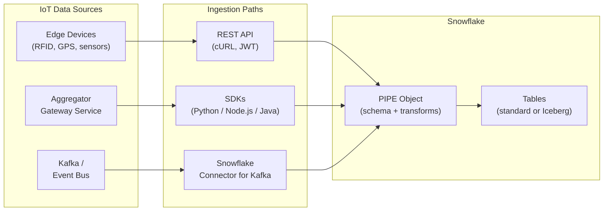
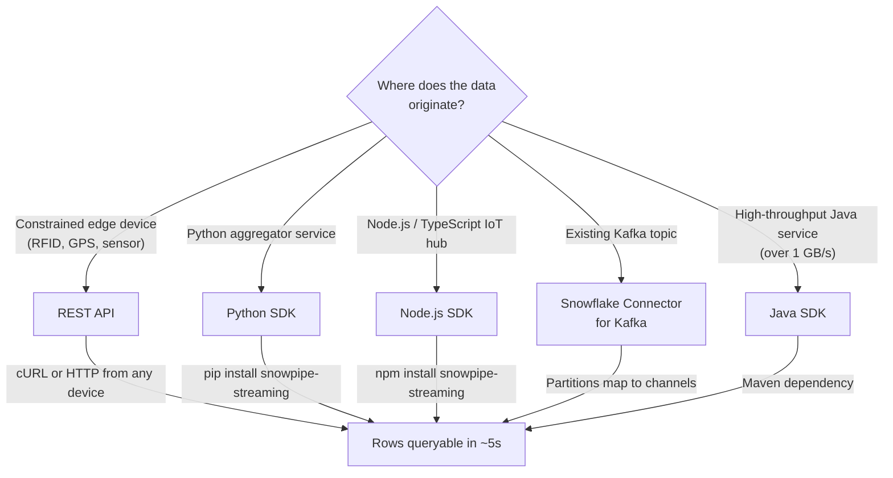
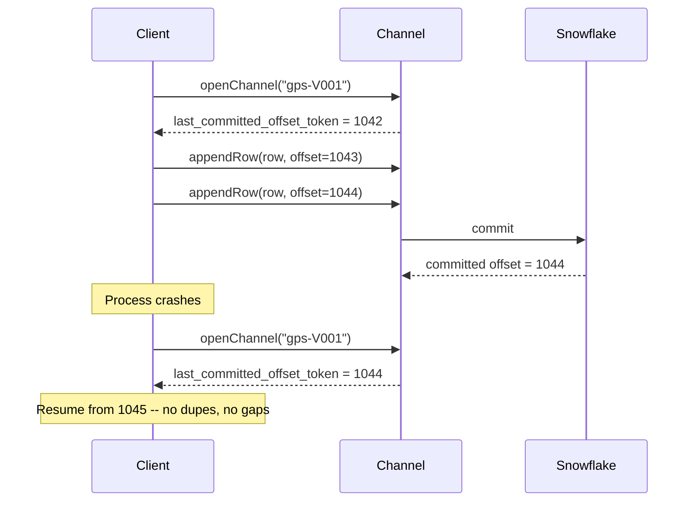
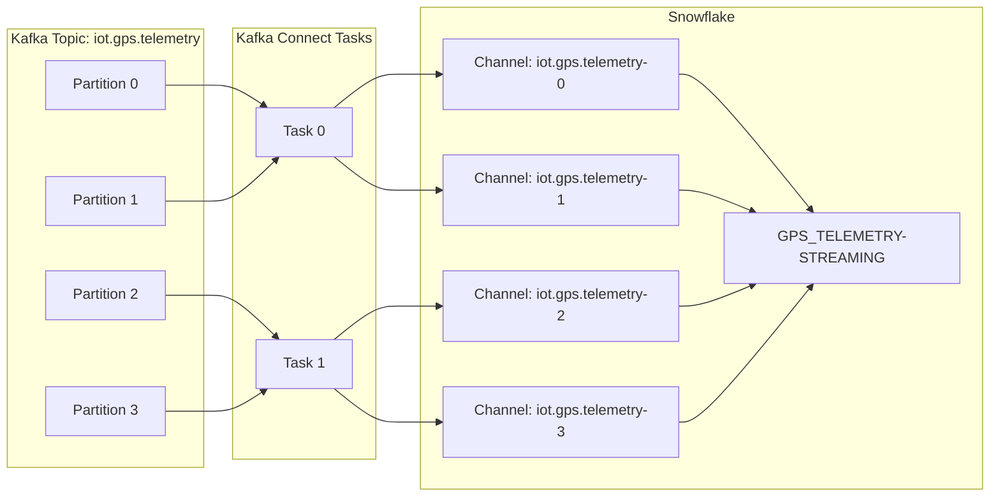

# Snowpipe Streaming for IoT

Inspired by the question every IoT architect asks: *"How does streaming IoT data actually flow into Snowflake in production?"*

This guide answers it. Decision tree for choosing your ingestion path (REST API vs. SDK vs. Kafka), copy-pasteable walk-throughs in cURL, Python, Node.js, and Java, table design and PIPE patterns, production best practices, Iceberg streaming, costs and monitoring, and a migration path from the classic SDK.

**Pair-programmed by:** SE Community + Cortex Code
**Created:** 2026-05-15 | **Expires:** 2026-07-14 | **Status:** ACTIVE

> **No support provided.** This content is for reference only. Review and validate before applying to any production workflow.



**Time:** ~25 minutes to read | **Result:** Working understanding of which path to choose for your IoT workload, plus copy-pasteable starter code.

---

### Quick Navigation

| | |
|---|---|
| **[Part 1: Why Streaming for IoT](#part-1-why-streaming-for-iot)** | Comparison vs. polling, files, and direct INSERT |
| **[Part 2: Choosing Your Ingestion Path](#part-2-choosing-your-ingestion-path)** | **Start here** -- decision tree: REST API vs. SDK vs. Kafka |
| **[Part 3: Key Concepts](#part-3-key-concepts)** | PIPE, channels, offset tokens, schema evolution -- in plain English |
| **[Part 4: REST API Walk-Through](#part-4-rest-api-walk-through-edge-devices)** | cURL + JWT for edge devices and IoT trackers |
| **[Part 5: Python SDK Walk-Through](#part-5-python-sdk-walk-through-aggregator-services)** | `pip install snowpipe-streaming` for gateway services |
| **[Part 6: Node.js and Java SDK Quick Reference](#part-6-nodejs-and-java-sdk-quick-reference)** | Same Rust core, different language bindings |
| **[Part 7: Kafka Connector Path](#part-7-kafka-connector-path)** | When you already have a Kafka event bus |
| **[Part 8: Table Design for Streaming](#part-8-table-design-for-streaming)** | Metadata columns, gap detection, custom PIPEs |
| **[Part 9: Production Best Practices](#part-9-production-best-practices)** | Channels, resiliency, performance, monitoring |
| **[Part 10: Iceberg Streaming](#part-10-iceberg-streaming)** | Stream into Snowflake-managed Iceberg tables |
| **[Part 11: Costs and Monitoring](#part-11-costs-and-monitoring)** | Per-GB billing, METERING_HISTORY, Prometheus |
| **[Part 12: Migrating from the Classic SDK](#part-12-migrating-from-the-classic-sdk)** | API changes, channel reopening, behavioral diffs |
| **[Production Readiness Checklist](#production-readiness-checklist)** | Pre-launch verification table |

---

## Who This Is For

**IoT architects** designing the data path from edge to warehouse. **Data engineers** wiring up real-time pipelines. **Edge developers** picking the lightest-weight ingestion option. **Platform leads** deciding between Kafka, REST, and SDK approaches.

New to Snowpipe Streaming? Start with the [Snowpipe Streaming overview](https://docs.snowflake.com/en/user-guide/snowpipe-streaming/data-load-snowpipe-streaming-overview) for the product introduction, then come back here for the IoT-specific decisions.

---

## Part 1: Why Streaming for IoT

In production IoT workloads, thousands of devices generate rows continuously: GPS pings every 5 seconds, RFID scans every time a tag passes a reader, sensor readings every minute. The `INSERT INTO` pattern with the Snowflake Python Connector (fine for demos and small batch loads) breaks down at this scale.

Snowpipe Streaming is the purpose-built service for row-level real-time ingestion. Data is queryable in roughly 5 seconds, with exactly-once delivery built in.

| Concern | INSERT via Connector | File-based (Snowpipe) | Snowpipe Streaming |
|---------|---------------------|------------------------|--------------------|
| Latency | Depends on client polling | Minutes (file landing + auto-ingest) | ~5 seconds end-to-end |
| Throughput per table | Single connection | Many parallel files | Up to 10 GB/s |
| Exactly-once delivery | Application-level dedup | Application-level dedup | Built-in via offset tokens |
| Ordering | Not guaranteed | Not guaranteed across files | Ordered within each channel |
| Staging files | None (direct INSERT) | Required (S3/GCS/Azure) | None -- rows stream directly |
| Infrastructure | Your INSERT loop + retries | File-drop pipeline + monitoring | Serverless, auto-scaling |
| Error recovery | Manual rollback logic | Failed file replay | Reopen channel at last committed offset |
| Cost model | Warehouse compute | Compute per file | Flat per-GB ingested |

**Bottom line**: For row-arrival workloads (devices, events, CDC), Snowpipe Streaming replaces both file-based and direct-INSERT patterns. You send rows, Snowflake handles the rest.

> [!NOTE]
> **What about Dynamic Tables and Streams + Tasks?** Those are downstream processing primitives. They consume data from base tables but don't ingest it. Snowpipe Streaming gets the rows in; Streams + Tasks (or Dynamic Tables) transform them on a schedule. The patterns compose.

---

## Part 2: Choosing Your Ingestion Path



### Decision Matrix

| Scenario | Recommended | Rate of Thumb | Why |
|----------|-------------|---------------|-----|
| Constrained edge device (no Python/Node runtime) | **REST API** | Up to ~1 MB/s per device | No SDK install. cURL works. JWT-based auth. |
| Python service collecting from multiple sensors | **Python SDK** | 10s of MB/s per process | Native dict support, exactly-once via offset tokens, `pip install snowpipe-streaming`. |
| Node.js / TypeScript IoT hub or Lambda | **Node.js SDK** | 10s of MB/s per process | Same Rust core as Python. `npm install snowpipe-streaming`. |
| Existing Apache Kafka event bus | **Snowflake Connector for Kafka** | Hundreds of MB/s aggregate | Kafka partitions map naturally to channels. No custom ingestion code. |
| High-throughput Java aggregator (over 1 GB/s) | **Java SDK** | Up to 10 GB/s per table | Most mature SDK. Highest throughput. Requires Java 11+. |
| Lightweight serverless function (one-shot) | **REST API** | Bursty, low rate | No process state to maintain. JWT + scoped token + single POST. |

> [!TIP]
> **Snowflake recommendation**: Start with the SDK over the REST API for the improved performance and getting-started experience. Use the REST API only when you cannot run an SDK on the source device.

### What All Paths Share

Regardless of which path you choose:

- Data lands in the **same Snowflake table** through a **PIPE object**
- Each writer opens one or more **channels** to the pipe
- Each row commit advances an **offset token** for exactly-once recovery
- Throughput billing is **per uncompressed GB ingested** (data values only, not JSON keys)
- Server-side schema validation enforces table column types
- Schema evolution can auto-add new columns when a device sends a new field

---

## Part 3: Key Concepts

### PIPE Object

The PIPE is the server-side "receiving dock" for streaming data. It validates schema, applies in-flight transformations (column reordering, type casting, filtering), and can pre-cluster data at ingest time.

A **default pipe** is auto-created the first time you stream into a table, with a name of the form `<TABLE_NAME>-STREAMING`. For advanced use cases, create a custom pipe:

```sql
CREATE PIPE gps_telemetry_pipe
AS COPY INTO GPS_TELEMETRY
  FROM TABLE (DATA_SOURCE(TYPE => 'STREAMING'))
  MATCH_BY_COLUMN_NAME = CASE_SENSITIVE;
```

A single client is bound to one pipe. Multiple channels per client are fine and encouraged.

### Channel

A channel is your dedicated lane into a pipe. One channel per data source partition -- one per GPS device, one per RFID scanner zone, one per Kafka partition. Rows within a channel arrive **in order**.

**Naming convention**: deterministic and informative.

```
gps-prod-southeast-V001
rfid-prod-plant1-zoneA
kafka-orders-partition-7
```

### Offset Token

Your bookmark. After a crash, reopen the channel and resume from the last committed offset token. This is how exactly-once delivery works:



### Schema Evolution

If a device starts sending a new field (e.g., `BATTERY_PCT`), Snowflake can auto-add the column to the target table. No DDL required. Configure on the table:

```sql
CREATE TABLE GPS_TELEMETRY (...)
  ENABLE_SCHEMA_EVOLUTION = TRUE;
```

---

## Part 4: REST API Walk-Through (Edge Devices)

For edge devices that cannot run an SDK -- RFID readers, GPS trackers, embedded sensors -- the REST API is the right choice. All you need is HTTPS and the ability to make POST requests.

### Prerequisites

- Snowflake user with key-pair authentication configured
- JWT generated via SnowSQL or your code:

```bash
snowsql --private-key-path rsa_key.p8 --generate-jwt \
  -a <ACCOUNT_IDENTIFIER> \
  -u MY_USER
```

### Step 1: Set environment variables

```bash
export JWT_TOKEN="<your_jwt>"
export ACCOUNT="<account_identifier>"
export DB="MY_DB"
export SCHEMA="MY_SCHEMA"
export PIPE="GPS_TELEMETRY-STREAMING"
export CHANNEL="gps-prod-southeast-V001"
export CONTROL_HOST="${ACCOUNT}.snowflakecomputing.com"
```

> [!CAUTION]
> **Underscores in account names**: If your account contains underscores, replace them with hyphens in `INGEST_HOST` for all subsequent calls. Underscores cause silent TLS failures.

### Step 2: Discover ingest host and exchange for scoped token

```bash
export INGEST_HOST=$(curl -sS -X GET \
  -H "Authorization: Bearer $JWT_TOKEN" \
  -H "X-Snowflake-Authorization-Token-Type: KEYPAIR_JWT" \
  "https://${CONTROL_HOST}/v2/streaming/hostname")

export SCOPED_TOKEN=$(curl -sS -X POST "https://$CONTROL_HOST/oauth/token" \
  -H 'Content-Type: application/x-www-form-urlencoded' \
  -H "Authorization: Bearer $JWT_TOKEN" \
  -d "grant_type=urn:ietf:params:oauth:grant-type:jwt-bearer&scope=${INGEST_HOST}")
```

### Step 3: Open a channel

```bash
curl -sS -X PUT \
  -H "Authorization: Bearer $SCOPED_TOKEN" \
  -H "Content-Type: application/json" \
  "https://${INGEST_HOST}/v2/streaming/databases/$DB/schemas/$SCHEMA/pipes/$PIPE/channels/$CHANNEL" \
  -d '{}' | tee open_resp.json | jq .
```

The response includes the `next_continuation_token` and `last_committed_offset_token` -- save both.

### Step 4: Append a row (with ZSTD compression)

```bash
export CONT_TOKEN=$(jq -r '.next_continuation_token' open_resp.json)
export OFFSET=$(jq -r '.channel_status.last_committed_offset_token' open_resp.json)
export NEW_OFFSET=$((OFFSET + 1))
NOW_TS=$(date -u +"%Y-%m-%dT%H:%M:%SZ")

cat <<EOF > gps_row.ndjson
{"VEHICLE_ID":"V-001","TIMESTAMP":"$NOW_TS","LATITUDE":33.7490,"LONGITUDE":-84.3880,"SPEED_MPH":22.0,"ENGINE_STATUS":"ON"}
EOF

curl -sS -X POST \
  -H "Authorization: Bearer $SCOPED_TOKEN" \
  -H "Content-Type: application/x-ndjson" \
  -H "Content-Encoding: zstd" \
  "https://${INGEST_HOST}/v2/streaming/data/databases/$DB/schemas/$SCHEMA/pipes/$PIPE/channels/$CHANNEL/rows?continuationToken=$CONT_TOKEN&offsetToken=$NEW_OFFSET" \
  --data-binary @gps_row.ndjson | jq .
```

> [!IMPORTANT]
> The 4 MB request limit is on the **observed transfer size**. With ZSTD compression you can pack much more uncompressed data per request. Use compression in production.

### Step 5: Verify committed offset

```bash
curl -sS -X POST \
  -H "Authorization: Bearer $SCOPED_TOKEN" \
  -H "Content-Type: application/json" \
  "https://${INGEST_HOST}/v2/streaming/databases/$DB/schemas/$SCHEMA/pipes/$PIPE:bulk-channel-status" \
  -d "{\"channel_names\": [\"$CHANNEL\"]}" | jq ".channel_statuses.\"$CHANNEL\""
```

A successful append only confirms receipt. Persistence requires `last_committed_offset_token >= NEW_OFFSET`. Wait for that condition before treating the row as durable.

### Embedded device pattern

For very constrained devices (microcontrollers, single-board computers), you can pre-generate a long-lived JWT on a more capable device, ship the scoped token to the edge device, and have the edge device just POST rows. Refresh the scoped token on a schedule from a more capable companion service.

---

## Part 5: Python SDK Walk-Through (Aggregator Services)

For Python services that aggregate from multiple sensors -- a gateway in a factory, a Lambda processing IoT Core events, a containerized edge appliance -- the SDK is more efficient than calling the REST API directly.

### Install

```bash
pip install snowpipe-streaming
```

Requires Python 3.9 or later and glibc 2.26+.

### Authentication profile

Create `profile.json`:

```json
{
    "user": "MY_USER",
    "account": "your_account_identifier",
    "url": "https://your_account_identifier.snowflakecomputing.com:443",
    "private_key_file": "rsa_key.p8",  // pragma: allowlist secret
    "role": "MY_ROLE"
}
```

### Stream RFID garment events

```python
import json
from datetime import datetime, timezone
from snowpipe_streaming import SnowpipeStreamingClient

with open("profile.json") as f:
    profile = json.load(f)

client = SnowpipeStreamingClient(
    account=profile["account"],
    user=profile["user"],
    private_key_file=profile["private_key_file"],  # pragma: allowlist secret
    role=profile["role"],
    database="MY_DB",
    schema="MY_SCHEMA",
    pipe="GARMENT_EVENTS-STREAMING",
)

# Open the channel using the last committed offset for exactly-once recovery
status = client.get_channel_statuses(["rfid-plant1-zoneA"]).get("rfid-plant1-zoneA")
last_offset = status.last_committed_offset_token if status else None
channel, _ = client.open_channel(
    channel_name="rfid-plant1-zoneA",
    offset_token=last_offset,
)

events = [
    {"GARMENT_ID": "G-0001", "EVENT_TYPE": "CHECK_IN", "LOCATION": "Receiving Dock", "SCANNER_ID": "SC-001"},
    {"GARMENT_ID": "G-0001", "EVENT_TYPE": "WASH",     "LOCATION": "Wash Line 2",    "SCANNER_ID": "SC-003"},
    {"GARMENT_ID": "G-0001", "EVENT_TYPE": "DRY",      "LOCATION": "Dryer Bay 1",    "SCANNER_ID": "SC-004"},
]

start_offset = (int(last_offset) if last_offset else 0) + 1

for i, event in enumerate(events):
    event["EVENT_TIMESTAMP"] = datetime.now(timezone.utc).isoformat()
    channel.append_row(event, offset_token=str(start_offset + i))

# Verify
final = client.get_channel_statuses(["rfid-plant1-zoneA"])["rfid-plant1-zoneA"]
print(f"Committed offset: {final.last_committed_offset_token}")
print(f"Rows inserted:    {final.rows_inserted}")
print(f"Error count:      {final.rows_error_count}")
```

> [!IMPORTANT]
> **Pass native Python objects, not JSON strings.** Sending `json.dumps(event)` results in the data being stored as `VARCHAR`, not structured `VARIANT`. The SDK serializes for you.

### Resilient ingestion with exponential backoff

```python
import time
from snowpipe_streaming import SFException

MAX_RETRIES = 5

def append_with_retry(channel, row, offset, channel_name):
    global channel
    for attempt in range(MAX_RETRIES):
        try:
            channel.append_row(row, offset_token=str(offset))
            return channel
        except SFException as e:
            if e.status_code in (429, 500, 503):
                wait = min(2 ** attempt, 60)
                print(f"Retryable {e.status_code}, backoff {wait}s")
                time.sleep(wait)
            elif e.status_code == 409:
                # Channel invalidated -- reopen at last committed offset
                last = client.get_channel_statuses([channel_name])[channel_name].last_committed_offset_token
                channel, _ = client.open_channel(channel_name, offset_token=last)
            else:
                raise
    raise RuntimeError(f"Exceeded {MAX_RETRIES} retries")
```

---

## Part 6: Node.js and Java SDK Quick Reference

All three SDKs share a Rust core and offer parity APIs. Pick the language that matches your service.

### Node.js (20+)

```bash
npm install snowpipe-streaming
```

```javascript
const { SnowpipeStreamingClient } = require("snowpipe-streaming");

const client = new SnowpipeStreamingClient({
  account: "<account>",
  user: "MY_USER",
  privateKeyFile: "rsa_key.p8",  // pragma: allowlist secret
  role: "MY_ROLE",
  database: "MY_DB",
  schema: "MY_SCHEMA",
  pipe: "GPS_TELEMETRY-STREAMING",
});

const { channel } = await client.openChannel({
  channelName: "gps-prod-southeast-V001",
  offsetToken: null,
});

const row = {
  VEHICLE_ID: "V-001",
  TIMESTAMP: new Date().toISOString(),
  LATITUDE: 33.7490,
  LONGITUDE: -84.3880,
  SPEED_MPH: 22.0,
  ENGINE_STATUS: "ON",
  TAGS: ["delivery", "atlanta"],
};

await channel.appendRow(row, "1");
```

> [!TIP]
> Use native JS arrays and objects for ARRAY and VARIANT columns. The SDK structures them correctly. Passing a serialized string makes the data un-queryable as JSON.

### Java (11+)

Maven coordinates:

```xml
<dependency>
  <groupId>com.snowflake</groupId>
  <artifactId>snowpipe-streaming</artifactId>
  <version>1.1.0</version>
</dependency>
```

```java
SnowpipeStreamingClient client = SnowpipeStreamingClient.builder("iot-client")
    .database("MY_DB")
    .schema("MY_SCHEMA")
    .pipe("GPS_TELEMETRY-STREAMING")
    .privateKeyFile("rsa_key.p8")  // pragma: allowlist secret
    .user("MY_USER")
    .role("MY_ROLE")
    .build();

OpenChannelResult result = client.openChannel("gps-prod-southeast-V001", null);
SnowpipeStreamingChannel channel = result.getChannel();

Map<String, Object> row = new HashMap<>();
row.put("VEHICLE_ID", "V-001");
row.put("TIMESTAMP", Instant.now().toString());
row.put("LATITUDE", 33.7490);
row.put("LONGITUDE", -84.3880);
row.put("SPEED_MPH", 22.0);
row.put("ENGINE_STATUS", "ON");

channel.appendRow(row, "1");
```

Java is the highest-throughput option (multi-GB/s per table). Use it for high-fanout aggregator services.

---

## Part 7: Kafka Connector Path

If your IoT data already flows through Apache Kafka (very common: MQTT broker -> Kafka -> downstream), use the Snowflake Connector for Kafka. It handles channel lifecycle, exactly-once, and schema evolution automatically. Kafka topic partitions map 1:1 to streaming channels.

### Connector configuration (Kafka Connect)

```properties
name=snowflake-iot-sink
connector.class=com.snowflake.kafka.connector.SnowflakeSinkConnector
tasks.max=8
topics=iot.gps.telemetry,iot.rfid.events

snowflake.url.name=<account>.snowflakecomputing.com:443
snowflake.user.name=KAFKA_INGEST_USER
snowflake.private.key=<base64-private-key>  # pragma: allowlist secret
snowflake.role.name=KAFKA_INGEST_ROLE
snowflake.database.name=MY_DB
snowflake.schema.name=MY_SCHEMA

snowflake.ingestion.method=SNOWPIPE_STREAMING
snowflake.streaming.enable.single.buffer=true
snowflake.streaming.client.provider=AUTO
buffer.flush.time=5

key.converter=org.apache.kafka.connect.storage.StringConverter
value.converter=org.apache.kafka.connect.json.JsonConverter
value.converter.schemas.enable=false

snowflake.enable.schematization=true
```

### How partitions become channels



The connector buffers per-partition for `buffer.flush.time` seconds, then commits a batch via the streaming SDK. Kafka offsets become the streaming offset tokens, giving you native exactly-once recovery.

---

## Part 8: Table Design for Streaming

For production streaming workloads, add metadata columns to enable error detection and recovery, and use a custom PIPE for cost optimization and ingest-time clustering.

### Table with streaming metadata

```sql
CREATE TABLE GPS_TELEMETRY (
    TELEMETRY_ID    NUMBER(10,0) IDENTITY START 1 INCREMENT 1,
    VEHICLE_ID      VARCHAR(10)   NOT NULL,
    TIMESTAMP       TIMESTAMP_NTZ NOT NULL,
    LATITUDE        FLOAT         NOT NULL,
    LONGITUDE       FLOAT         NOT NULL,
    SPEED_MPH       NUMBER(5,1)   DEFAULT 0,
    HEADING         NUMBER(5,1),
    ENGINE_STATUS   VARCHAR(10)   DEFAULT 'ON',

    -- Streaming metadata for error recovery
    CHANNEL_ID      INTEGER,
    STREAM_OFFSET   BIGINT
)
ENABLE_SCHEMA_EVOLUTION = TRUE
CLUSTER BY (VEHICLE_ID, TIMESTAMP);
```

### Custom PIPE with column matching and pre-clustering

```sql
CREATE PIPE gps_telemetry_pipe
AS COPY INTO GPS_TELEMETRY
  FROM TABLE (DATA_SOURCE(TYPE => 'STREAMING'))
  MATCH_BY_COLUMN_NAME = CASE_SENSITIVE
  CLUSTER_AT_INGEST_TIME = TRUE;
```

> [!TIP]
> **Why `MATCH_BY_COLUMN_NAME`?** You're billed for the data values ingested, not for JSON keys. Without column matching, ingesting JSON into a single VARIANT column meters the entire payload (keys + values). With column matching, only the values are metered. For verbose JSON this is a significant cost reduction.

### Gap detection query

Use the metadata columns to find missing or out-of-order records:

```sql
SELECT
  CHANNEL_ID,
  STREAM_OFFSET,
  LAG(STREAM_OFFSET) OVER (PARTITION BY CHANNEL_ID ORDER BY STREAM_OFFSET) AS prev_offset,
  STREAM_OFFSET - LAG(STREAM_OFFSET) OVER (PARTITION BY CHANNEL_ID ORDER BY STREAM_OFFSET) AS gap
FROM GPS_TELEMETRY
QUALIFY gap > 1
ORDER BY CHANNEL_ID, STREAM_OFFSET;
```

Run on a schedule and alert when rows return -- it indicates a channel was reopened past its last committed offset, or rows were silently dropped upstream.

---

## Part 9: Production Best Practices

### Channel management

- **Long-lived channels**: Open once at process start, keep active for the duration. Avoid open/close per row or per batch.
- **Deterministic names**: `{source}-{env}-{region}-{device_id}`. Predictable names simplify troubleshooting and make automated recovery scripts trivial.
- **Multiple channels per client**: Scale out by partitioning. Up to thousands of channels per client.
- **Monitor with `getChannelStatus`**: Richer than `getLatestCommittedOffsetTokens` -- includes error counts, last error message, average processing latency.

### Resiliency

- **Wrap ingestion in try/catch**: Don't assume `appendRow`/`appendRows` always succeeds.
- **Exponential backoff on 429, 500, 503**: Retryable errors. Wait `min(2^attempt, 60)` seconds.
- **On 409 (channel invalidated)**: Reopen the channel using `last_committed_offset_token` from `getChannelStatus`. Resume from there.
- **Verify offset progress**: Periodically check that `last_committed_offset_token` is advancing. If it stalls, alert.
- **Watch `row_error_count`**: An increasing count means rows are being rejected -- check `last_error_message`.

### Performance

- **ZSTD compression for REST API**: Fits more data per 4 MB request. Recommended over Gzip.
- **Batch with `appendRows`**: More efficient than calling `appendRow` in a loop. Keep batches under 16 MB compressed.
- **Native objects for VARIANT/ARRAY**: Python dict/list, JS object/array, Java Map/List. Never serialized JSON strings.
- **One client per pipe**: A client is bound to one pipe. For many tables, run many clients (or one client with many channels per pipe).

### Security

- [ ] Key-pair authentication (not passwords)
- [ ] Dedicated Snowflake user with least-privilege role
- [ ] Private key stored in a secrets manager (AWS Secrets Manager, GCP Secret Manager, Azure Key Vault, HashiCorp Vault)
- [ ] Authentication policy enforces `KEYPAIR` only: `CREATE AUTHENTICATION POLICY ...`
- [ ] Network policy restricts client IPs where possible
- [ ] Key rotation automated on a schedule (90 days max)

See [`tool-secrets-rotation-aws`](../tool-secrets-rotation-aws/) for rotation automation.

---

## Part 10: Iceberg Streaming

Snowpipe Streaming can write directly into Snowflake-managed Apache Iceberg tables (v2 and v3). This is the recommended path when you need open-format storage for downstream interoperability with Spark, Trino, Flink, etc.

### Requirements

- SDK version **3.0.0 or later** (Iceberg support)
- Iceberg table must be **Snowflake-managed** (not externally managed)
- External volume configured for the table

### Create an Iceberg target table

```sql
CREATE ICEBERG TABLE GPS_TELEMETRY_ICEBERG (
    VEHICLE_ID    VARCHAR,
    TIMESTAMP     TIMESTAMP_NTZ,
    LATITUDE      DOUBLE,
    LONGITUDE     DOUBLE,
    SPEED_MPH     DOUBLE,
    ENGINE_STATUS VARCHAR
)
EXTERNAL_VOLUME = 'iot_external_volume'
CATALOG = 'SNOWFLAKE'
BASE_LOCATION = 'gps_telemetry/';
```

### Latency considerations

| Setting | Standard table default | Iceberg table default |
|---------|------------------------|------------------------|
| `MAX_CLIENT_LAG` (classic SDK) | 1 second | 30 seconds |
| Recommended floor | 1 second | 30 seconds |

The higher Iceberg default ensures Snowflake creates well-sized Parquet files, which is critical for downstream query performance from non-Snowflake engines. Lowering it below 30 seconds is generally not recommended unless you have exceptionally high throughput per channel.

### Pipe definition

```sql
CREATE PIPE gps_iceberg_pipe
AS COPY INTO GPS_TELEMETRY_ICEBERG
  FROM TABLE (DATA_SOURCE(TYPE => 'STREAMING'))
  MATCH_BY_COLUMN_NAME = CASE_SENSITIVE;
```

The streaming client code is identical to standard tables -- only the underlying table type differs.

---

## Part 11: Costs and Monitoring

### Billing model

Snowpipe Streaming (high-performance architecture) uses **throughput-based billing**: a flat rate per uncompressed GB of data values ingested.

- Only data **values** are metered, not JSON keys
- No per-client or per-channel charges
- No separate compute costs -- serverless and included in the per-GB rate
- See the [Snowflake Consumption Table](https://docs.snowflake.com/en/user-guide/snowpipe-streaming/snowpipe-streaming-high-performance-cost) for the current rate

### Monitor usage by pipe

```sql
SELECT
  m.START_TIME,
  p.PIPE_NAME,
  m.CREDITS_USED,
  m.CREDITS_USED_COMPUTE,
  m.CREDITS_USED_CLOUD_SERVICES
FROM SNOWFLAKE.ACCOUNT_USAGE.METERING_HISTORY m
JOIN SNOWFLAKE.ACCOUNT_USAGE.PIPES p
  ON m.ENTITY_ID = p.PIPE_ID
 AND m.NAME = p.PIPE_NAME
 AND m.SERVICE_TYPE = 'SNOWPIPE_STREAMING'
WHERE m.START_TIME >= DATEADD(day, -7, CURRENT_DATE())
ORDER BY m.START_TIME DESC, m.CREDITS_USED DESC;
```

### Prometheus client metrics

Enable the SDK's built-in metrics server:

```bash
export SS_ENABLE_METRICS=true
# Default: 127.0.0.1:50000 -- override with SS_METRICS_IP / SS_METRICS_PORT
```

Verify the endpoint:

```bash
curl http://127.0.0.1:50000/metrics
```

Prometheus scrape config:

```yaml
scrape_configs:
  - job_name: snowpipe_streaming_iot
    metrics_path: /metrics
    static_configs:
      - targets: ['gateway-1.internal:50000', 'gateway-2.internal:50000']
```

Useful metrics to alert on:

- `snowpipe_streaming_rows_inserted_total` -- rate should match expected device output
- `snowpipe_streaming_rows_error_total` -- alert on any non-zero rate
- `snowpipe_streaming_request_latency_seconds` -- alert on tail latency above SLO

---

## Part 12: Migrating from the Classic SDK

The classic Java SDK (`snowflake-ingest-java`) is planned for deprecation. New work should use the high-performance SDK. Existing workloads continue to be supported but should migrate.

### Architectural changes

| Area | Classic | High-Performance |
|------|---------|-------------------|
| Entry point | Direct table ingestion | PIPE objects (server-side validation/transforms) |
| SDK / core | Java only | Java, Python, Node.js with shared Rust core |
| API names | `insertRow` / `insertRows`, `openChannel(request)` | `appendRow` / `appendRows`, `openChannel(channelName, offsetToken)` |
| Schema validation | Client-side | Server-side with richer feedback |
| Backpressure | Thread sleep (blocks) | Returns error -- caller implements backoff |
| Client-to-table mapping | Client could open channels to any table | Client is bound to one pipe |
| Billing | Compute + active client count | Flat per uncompressed GB |
| Schema / transforms | Client-side | Server-side via PIPE definition |

### Migration steps

1. **Create a PIPE for each target table**:
   ```sql
   CREATE PIPE my_pipe
   AS COPY INTO my_table
     FROM TABLE (DATA_SOURCE(TYPE => 'STREAMING'))
     MATCH_BY_COLUMN_NAME = CASE_INSENSITIVE;
   ```
2. **Stop ingestion from all classic clients.**
3. **Confirm last committed offsets** from each classic channel via `getLatestCommittedOffsetTokens()`.
4. **Update application code**:
   - Switch dependencies to `snowpipe-streaming` (Java/Python/Node.js)
   - Replace `insertRow`/`insertRows` -> `appendRow`/`appendRows`
   - Initialize one client per pipe
   - Pass the last committed offset to `openChannel(channelName, offsetToken)`
5. **Resume ingestion** with the new client.

### Behavioral gotcha: VARIANT/ARRAY string literals

Passing a serialized JSON string `"[1,2,3]"` to an ARRAY column in the high-performance SDK results in a single-element array containing that literal string. To preserve classic-style behavior, either:

**Option A (recommended)**: Update the client to deserialize JSON into native objects before `appendRow`.

**Option B**: Define the pipe with `PARSE_JSON`:

```sql
CREATE PIPE my_pipe AS
COPY INTO my_table (my_array_col)
FROM (SELECT PARSE_JSON($1:my_array_col) FROM TABLE(DATA_SOURCE(TYPE => 'STREAMING')));
```

> [!WARNING]
> Option B is incompatible with the default pipe and with automatic schema evolution. Prefer Option A.

---

## Production Readiness Checklist

| Category | Check | Reference |
|---|---|---|
| **Path** | Ingestion path chosen for each source (REST vs SDK vs Kafka) | Part 2 |
| **Path** | Classic SDK is not used for new work | Part 12 |
| **Auth** | Key-pair authentication configured (no passwords) | Part 4, Part 9 |
| **Auth** | Dedicated user with least-privilege role | Part 9 |
| **Auth** | Private keys in secrets manager, rotation automated | Part 9 |
| **Auth** | Authentication policy enforces KEYPAIR | Part 9 |
| **Channels** | Long-lived channels (open once, reuse) | Part 9 |
| **Channels** | Deterministic naming convention applied | Part 3, Part 9 |
| **Channels** | One channel per source partition | Part 3 |
| **Schema** | Tables have CHANNEL_ID and STREAM_OFFSET metadata columns | Part 8 |
| **Schema** | Custom PIPE uses `MATCH_BY_COLUMN_NAME = CASE_SENSITIVE` | Part 8 |
| **Schema** | `ENABLE_SCHEMA_EVOLUTION = TRUE` if schema changes expected | Part 3 |
| **Data** | Native objects (dict/Map/Array) used for VARIANT/ARRAY columns | Part 5, Part 6 |
| **Resiliency** | Try/catch around all `appendRow` calls | Part 9 |
| **Resiliency** | Exponential backoff on 429/500/503 | Part 9 |
| **Resiliency** | Channel reopen on 409 using `last_committed_offset_token` | Part 9 |
| **Resiliency** | Gap detection query running on a schedule | Part 8 |
| **Performance** | ZSTD compression on REST API requests | Part 4 |
| **Performance** | `appendRows` (batch) preferred over `appendRow` | Part 9 |
| **Iceberg** | If applicable: SDK 3.0.0+ and `MAX_CLIENT_LAG >= 30s` | Part 10 |
| **Costs** | `METERING_HISTORY` query monitored / alerted | Part 11 |
| **Monitoring** | Prometheus metrics scraped from clients | Part 11 |
| **Monitoring** | Alerts on `rows_error_count` and offset stagnation | Part 9, Part 11 |
| **Network** | Hostname uses hyphens, not underscores | Part 4 |

---

## Related Projects

- [`demo-iot-lifecycle`](../demo-iot-lifecycle/) -- Companion demo: RFID garment lifecycle with fleet GPS, dual Cortex Agents, and a React dashboard. Uses INSERT for the simulator; this guide shows the production streaming path.
- [`guide-external-access-playbook`](../guide-external-access-playbook/) -- Network rules, secrets, and external connectivity patterns that complement streaming auth.
- [`guide-data-quality-governance`](../guide-data-quality-governance/) -- Data quality monitoring (DMFs) for streamed data.
- [`tool-secrets-rotation-aws`](../tool-secrets-rotation-aws/) -- Automated PAT and key-pair rotation for streaming clients.

## External References

- [Snowpipe Streaming overview](https://docs.snowflake.com/en/user-guide/snowpipe-streaming/data-load-snowpipe-streaming-overview)
- [Key concepts (PIPE, channels, offset tokens)](https://docs.snowflake.com/en/user-guide/snowpipe-streaming/snowpipe-streaming-high-performance-overview)
- [Tutorial: Get started with the SDK](https://docs.snowflake.com/en/user-guide/snowpipe-streaming/snowpipe-streaming-high-performance-getting-started)
- [Tutorial: Get started with the REST API](https://docs.snowflake.com/en/user-guide/snowpipe-streaming/snowpipe-streaming-high-performance-rest-tutorial)
- [Best practices (high-performance architecture)](https://docs.snowflake.com/en/user-guide/snowpipe-streaming/snowpipe-streaming-high-performance-best-practices)
- [REST API endpoints reference](https://docs.snowflake.com/en/user-guide/snowpipe-streaming/snowpipe-streaming-high-performance-rest-api)
- [Configurations and examples](https://docs.snowflake.com/en/user-guide/snowpipe-streaming/snowpipe-streaming-high-performance-configurations)
- [Iceberg tables with Snowpipe Streaming](https://docs.snowflake.com/en/user-guide/snowpipe-streaming/data-load-snowpipe-streaming-overview)
- [Costs (high-performance architecture)](https://docs.snowflake.com/en/user-guide/snowpipe-streaming/snowpipe-streaming-high-performance-cost)
- [Migration guide (classic to high-performance)](https://docs.snowflake.com/en/user-guide/snowpipe-streaming/snowpipe-streaming-high-performance-migration)
- [Snowpipe Streaming SDK examples (GitHub)](https://github.com/snowflakedb/snowpipe-streaming-sdk-examples)
- [Snowflake Connector for Kafka](https://docs.snowflake.com/en/user-guide/kafka-connector)
