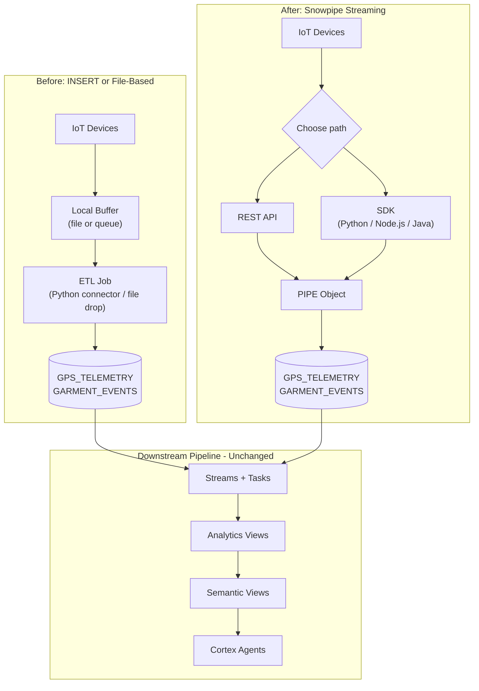

# Before/After IoT Architecture

Author: SE Community
Last Updated: 2026-05-15
Expires: 2026-07-14
Status: Reference Implementation

Reference Implementation: Review and customize for your requirements.

## Overview

How a typical IoT architecture transforms when adopting Snowpipe Streaming. The downstream pipeline -- Streams, Tasks, analytics views, semantic views, agents -- is unchanged. Only the ingestion layer changes.

## Diagram

## Component Descriptions

| Layer | Before | After |
|-------|--------|-------|
| Devices | Same | Same |
| Buffer | Local file or queue, application-managed | None -- rows go directly to Snowflake |
| Ingest | Polling INSERT or file-drop pipeline | Snowpipe Streaming (REST/SDK/Kafka) |
| Latency | Minutes (file landing) or polling cadence | ~5 seconds end-to-end |
| Exactly-once | Application-level dedup logic | Built-in via offset tokens |
| Cost model | Compute (warehouse + ETL) | Flat per-GB ingested |
| Downstream | Unchanged | Unchanged |

## Migration Pattern

The downstream pipeline does not need to change. Streams, Tasks, Dynamic Tables, analytics views, semantic views, and Cortex Agents all consume from base tables -- they don't care how rows arrived. This makes Snowpipe Streaming a **drop-in replacement for the ingestion layer** in most existing pipelines.

## Change History
See `.claude/DIAGRAM_CHANGELOG.md` or project-specific changelog.
