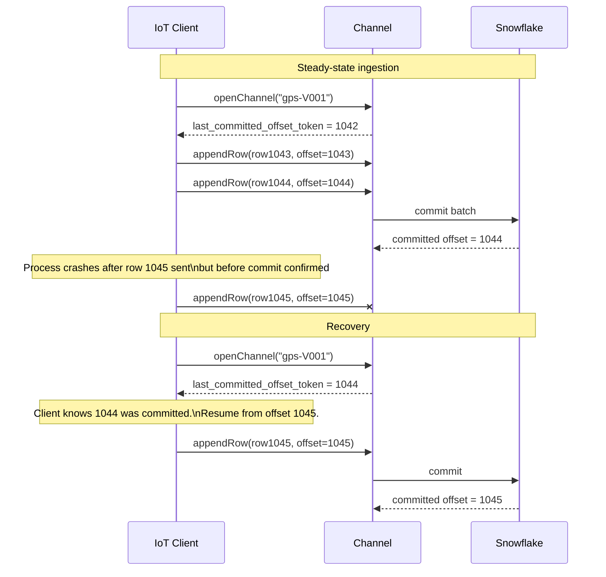

# Exactly-Once Recovery Flow

Author: SE Community
Last Updated: 2026-05-15
Expires: 2026-07-14
Status: Reference Implementation

Reference Implementation: Review and customize for your requirements.

## Overview

How offset tokens enable exactly-once delivery for IoT streaming workloads. After a process crash, network blip, or 409 channel invalidation, the client reopens the channel and resumes from the last committed offset -- no duplicates, no gaps.

## Diagram

## Component Descriptions

| Step | What Happens | Why It Matters |
|------|--------------|----------------|
| openChannel returns last committed offset | Snowflake tells client where it left off | Single source of truth for resume point |
| Client tracks offsets per row | Each appendRow has an offset_token | Lets Snowflake deduplicate replays |
| Server commits batches | Multiple rows commit atomically | Caller observes monotonic last_committed_offset_token |
| On reopen, resume from server offset | Discard any local offsets above server | Eliminates duplicate writes after crashes |

## Common Failure Patterns

| Failure | Status Code | Recovery |
|---------|-------------|----------|
| Channel invalidated (e.g., schema change, server restart) | 409 | Reopen channel; resume from `last_committed_offset_token` |
| Throttled | 429 | Exponential backoff, then retry same offset |
| Server error | 500/503 | Exponential backoff, then retry same offset |
| Stale continuation token | 4xx with code `STALE_CONTINUATION_TOKEN_SEQUENCER` | Reopen channel |

## Change History
See `.claude/DIAGRAM_CHANGELOG.md` or project-specific changelog.
